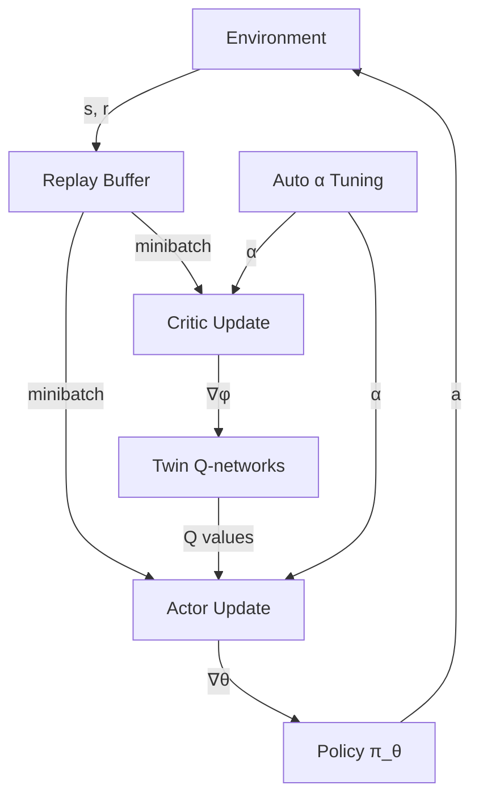

Most RL algorithms train an agent to maximize reward. But adding a second objective — stay as random as possible while doing so — turns out to produce better, more robust agents. This is the key insight behind Maximum Entropy RL and its flagship algorithm, **Soft Actor-Critic (SAC)**.

## Concept Introduction

Entropy, in information theory, measures *unpredictability*. A coin-flip has high entropy; a loaded coin that always shows heads has zero entropy. In RL, policy entropy measures how spread-out an agent's action choices are.

Standard RL pushes the agent to commit hard to whichever actions worked. Maximum Entropy RL instead commits to good actions while preserving alternatives — the agent hedges its bets. An agent that keeps a small repertoire of strong moves rather than collapsing onto a single best action is more robust against distributional shift and adversarial conditions.

The standard RL objective is to find a policy $\pi$ that maximises the expected discounted return:

$$J(\pi) = \mathbb{E}_{\pi}\left[\sum_{t=0}^{\infty} \gamma^t r(s_t, a_t)\right]$$

Maximum Entropy RL augments this with a policy entropy bonus at every timestep:

$$J_{\text{MaxEnt}}(\pi) = \mathbb{E}_{\pi}\left[\sum_{t=0}^{\infty} \gamma^t \Big( r(s_t, a_t) + \alpha \, \mathcal{H}\big(\pi(\cdot | s_t)\big) \Big)\right]$$

where $\mathcal{H}(\pi(\cdot|s)) = -\mathbb{E}_{a \sim \pi}[\log \pi(a|s)]$ is the Shannon entropy of the policy at state $s$, and $\alpha > 0$ is a temperature parameter controlling how much entropy is valued.

When $\alpha \to 0$ we recover standard RL. When $\alpha$ is large, the agent prioritises diversity over reward.

## Historical & Theoretical Context

The idea traces back to **Ziebart et al. (2008)**, who introduced Maximum Entropy Inverse RL for trajectory prediction. They noticed that among all policies consistent with observed behaviour, the one with maximum entropy was the most "natural" — it avoided spurious overconfidence.

This was formalised into a full RL objective by **Toussaint (2009)** and **Rawlik et al. (2012)** using control-as-inference framing: treat optimal control as probabilistic inference in a graphical model where the agent is more likely to take actions proportional to their exponentiated Q-values.

The breakthrough came in 2018 when Haarnoja et al. at UC Berkeley published **Soft Actor-Critic (SAC)**, which:

- Combined maximum entropy with off-policy actor-critic methods
- Introduced automatic entropy tuning (no manual $\alpha$ selection)
- Achieved state-of-the-art sample efficiency across continuous-control benchmarks (HalfCheetah, Ant, Humanoid)

SAC quickly became the practical standard for continuous-action environments, dethroning TD3 and PPO in many robotics settings.

## Algorithms & Math

### The Soft Bellman Equations

Replace the standard Bellman equation with its "soft" counterpart. The soft Q-function satisfies:

$$Q_{\text{soft}}(s, a) = r(s, a) + \gamma \, \mathbb{E}_{s'}[V_{\text{soft}}(s')]$$

where the soft value function integrates the entropy term:

$$V_{\text{soft}}(s) = \mathbb{E}_{a \sim \pi}\left[Q_{\text{soft}}(s, a) - \alpha \log \pi(a|s)\right]$$

The optimal policy under this objective is a Boltzmann (softmax) distribution over Q-values:

$$\pi^*(a|s) \propto \exp\!\left(\frac{1}{\alpha} Q^*(s, a)\right)$$

### SAC Algorithm Sketch

```
Initialize: actor π_θ, twin critics Q_φ1, Q_φ2, target critics Q_φ'1, Q_φ'2
           replay buffer D, temperature α (or log_α if auto-tuning)

Repeat:
  1. Sample action a ~ π_θ(·|s), step env, store (s, a, r, s', done) in D
  2. Sample minibatch from D

  # Critic update
  3. Compute target:
       a' ~ π_θ(·|s')
       y = r + γ(1-done) * [min(Q_φ'1(s',a'), Q_φ'2(s',a')) - α log π_θ(a'|s')]
  4. Update Q_φ1, Q_φ2 by minimising MSE(Q_φi(s,a), y)

  # Actor update
  5. Maximise:  E_{a~π_θ}[min(Q_φ1, Q_φ2)(s, a) - α log π_θ(a|s)]
     (reparameterisation trick: a = f_θ(ε, s), ε ~ N(0,I))

  # Temperature update (auto-tuning)
  6. Minimise: E[-α (log π_θ(a|s) + H_target)]
     where H_target = -|A| (target entropy heuristic)

  # Soft update targets
  7. φ' ← τφ + (1-τ)φ'
```

The twin critics (taking the minimum) prevent Q-value overestimation — a trick inherited from TD3 called **clipped double-Q learning**.

## Design Patterns & Architectures

SAC slots naturally into several agent architecture patterns:

**Off-policy experience replay**: SAC stores transitions in a replay buffer, enabling data-efficient reuse. This makes it suitable for real-world robotics where environment interactions are expensive.

**Planner-executor loop**: In hierarchical agents, SAC can act as a low-level executor trained with maximum entropy objectives while a high-level planner sets subgoals. The entropy bonus in the executor naturally produces diverse, robust motion primitives.

**Multi-task and meta-learning**: The entropy-regularised policy is closer to a uniform prior, which makes fine-tuning to new tasks faster — the agent hasn't collapsed onto brittle, task-specific behaviour.



## Practical Application

Below is a minimal SAC loop using **Stable-Baselines3**, which has a production-quality SAC implementation:

```python
import gymnasium as gym
from stable_baselines3 import SAC
from stable_baselines3.common.callbacks import EvalCallback

# Continuous-action environment
env = gym.make("HalfCheetah-v4")
eval_env = gym.make("HalfCheetah-v4")

model = SAC(
    "MlpPolicy",
    env,
    learning_rate=3e-4,
    buffer_size=1_000_000,
    batch_size=256,
    tau=0.005,                  # soft target update rate
    gamma=0.99,
    ent_coef="auto",            # automatic entropy tuning
    target_entropy="auto",      # defaults to -dim(A)
    verbose=1,
)

eval_cb = EvalCallback(eval_env, best_model_save_path="./sac_best/",
                       eval_freq=10_000, n_eval_episodes=10)

model.learn(total_timesteps=1_000_000, callback=eval_cb)
```

For a custom agent loop where you want to log entropy explicitly:

```python
import torch

# After actor forward pass, inspect entropy
with torch.no_grad():
    dist = model.actor.get_distribution(obs_tensor)
    entropy = dist.entropy().mean().item()
    print(f"Policy entropy: {entropy:.3f}  (α={model.ent_coef:.4f})")
```

Monitoring entropy over training tells you when the agent is converging (entropy drops) versus still exploring (entropy stays high).

## Latest Developments & Research

**SAC-X (Riedmiller et al., 2018)**: Extended SAC to sparse-reward robotics tasks using auxiliary reward signals. Showed that maximum entropy exploration is critical for solving tasks where reward is near-zero for most of the training.

**Discrete SAC (Christodoulou, 2019)**: Adapted SAC to discrete action spaces using a categorical policy and exact entropy computation. Outperformed DQN variants on Atari with fewer samples.

**REDQ (Chen et al., 2021)**: Randomised Ensemble Double Q-learning. Uses a large ensemble of Q-networks with random subsampling at update time to dramatically increase sample efficiency while maintaining the MaxEnt objective. Achieved >10x fewer environment steps than SAC on MuJoCo.

**DrQ-v2 (Yarats et al., 2022)**: Combines SAC with data augmentation for pixel-based observations. Standard benchmark for visual RL.

**Open problems**: How to set the target entropy in multi-task settings? How does auto-$\alpha$ interact with curriculum or reward shaping? Can MaxEnt objectives be applied cleanly to LLM fine-tuning loops (analogous to KL penalties in RLHF)?

## Cross-Disciplinary Insight

Maximum Entropy RL is deeply connected to **statistical mechanics**. The Boltzmann optimal policy $\pi^* \propto \exp(Q/\alpha)$ is exactly the **Gibbs distribution** from thermodynamics, where $\alpha$ plays the role of temperature (in Kelvin units, $k_B T$). High temperature produces random exploration; low temperature produces deterministic exploitation.

The connection runs deeper: the free energy of a thermodynamic system is the energy minus temperature times entropy. The MaxEnt RL objective *is* a free energy minimisation. Agents that solve control problems are performing the same computation, mathematically, as particles reaching thermal equilibrium.

In **economics**, the entropy bonus is analogous to quantal response equilibria — models of bounded-rational agents who choose actions stochastically proportional to expected payoffs. Real traders and game players don't always pick the single best action. They randomise in proportion to value, and this can be more robust against adversarial prediction.

## Daily Challenge

**Exercise 1 — entropy tracking**: Train SAC on `Pendulum-v1` (a simple continuous-control task) for 50k steps. Log the policy entropy and the temperature $\alpha$ every 1000 steps. Plot both. When does entropy start to fall? Does $\alpha$ converge?

**Exercise 2 — temperature ablation**: Fix $\alpha$ at three values: 0.001 (near-deterministic), 0.2 (default auto-tuned range), and 2.0 (very exploratory). Compare final performance and learning speed on `HalfCheetah-v4`. Does too-high entropy hurt?

**Thought experiment**: In a two-armed bandit where arm A gives reward 1.0 always and arm B gives reward 0.5 always, what does the MaxEnt optimal policy look like as $\alpha$ varies from 0 to $\infty$? Compute it analytically using the Boltzmann formula.

## References & Further Reading

- **Haarnoja et al. (2018)** — *Soft Actor-Critic: Off-Policy Maximum Entropy Deep Reinforcement Learning with a Stochastic Actor* — [arxiv.org/abs/1801.01290](https://arxiv.org/abs/1801.01290)
- **Haarnoja et al. (2018)** — *Soft Actor-Critic Algorithms and Applications* (auto-$\alpha$ version) — [arxiv.org/abs/1812.05905](https://arxiv.org/abs/1812.05905)
- **Ziebart et al. (2008)** — *Maximum Entropy Inverse Reinforcement Learning* — foundational MaxEnt paper
- **Chen et al. (2021)** — *Randomized Ensembled Double Q-Learning* (REDQ) — [arxiv.org/abs/2101.05982](https://arxiv.org/abs/2101.05982)
- **Stable-Baselines3 SAC docs** — [stable-baselines3.readthedocs.io/en/master/modules/sac.html](https://stable-baselines3.readthedocs.io/en/master/modules/sac.html)
- **Spinning Up in Deep RL (OpenAI)** — SAC walkthrough with clean implementation — [spinningup.openai.com](https://spinningup.openai.com)
- **Control as Inference tutorial** — Sergey Levine's lecture notes connecting MaxEnt RL to probabilistic graphical models
