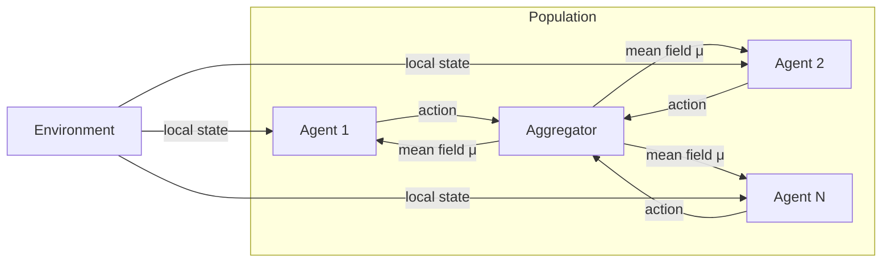

What happens when you have not two or ten agents competing, but ten thousand, or ten million? Classical game theory breaks down — computing Nash equilibria becomes intractable, and tracking every agent's interaction with every other agent is computationally impossible. Mean field games (MFGs) offer an elegant escape: instead of reasoning about every individual, you reason about the *crowd*.

## 1. Concept Introduction

### Simple Explanation

Imagine you're a commuter choosing which road to take to work. You don't care about any specific other driver — you care about *traffic*, the aggregate behavior of the crowd. Your best route depends on what everyone else does collectively, and collectively, everyone's route depends on what you (and others) do.

This is the core intuition of mean field games: when agents are numerous, rational, and roughly interchangeable, each agent's optimal behavior depends not on individual opponents but on the **distribution of the population**. That distribution summarizes the "field" every agent perceives.

### Technical Detail

A mean field game is a limiting case of $N$-player stochastic differential games as $N \to \infty$. Under symmetry and rationality assumptions, the system decouples into:

1. **A single representative agent** who optimizes against a fixed population distribution $\mu_t$ (the mean field).
2. **A consistency condition**: the distribution $\mu_t$ must be the one that results when all agents follow the representative agent's optimal policy.

This is a fixed-point problem: the agent's best response given the crowd, and the crowd's distribution given the agent's best response, must agree.

In discrete time and state spaces (relevant to RL), this translates into agents conditioning their policies on the empirical distribution of the population rather than on individual identities.

## 2. Historical & Theoretical Context

Mean field games were independently introduced in 2006 by **Jean-Michel Lasry and Pierre-Louis Lions** (Paris) and **Minyi Huang, Roland Malhamé, and Peter Caines** (Montreal). Lions later won the Abel Prize partly for this work. The field emerged from physics — "mean field" approximations date to 19th-century statistical mechanics (Weiss's mean field theory of magnetism, Landau's phase transitions), where the interaction of a particle with all others is approximated by its interaction with an average field.

The AI and RL community began engaging seriously around 2018–2020, recognizing that mean field theory could scale MARL to population sizes that broke traditional approaches.

Key connection to AI: multi-agent RL (MARL) suffers from the *curse of dimensionality* in joint action spaces. With $N$ agents each having $A$ actions, the joint space is $A^N$. Mean field RL collapses this by having each agent condition only on the **mean action** or the **empirical distribution** of its neighbors.

## 3. Algorithms & Math

### The Mean Field Game System

The classical continuous-time MFG is characterized by a coupled PDE system:

$$-\partial_t u - \nu \Delta u + H(x, \nabla u) = F(x, \mu_t)$$

$$\partial_t \mu - \nu \Delta \mu - \text{div}(\mu \nabla_p H(x, \nabla u)) = 0$$

The first equation is a **Hamilton-Jacobi-Bellman** (HJB) equation solved *backward* in time — it gives the value function $u(x,t)$ for the representative agent facing mean field $\mu_t$.

The second is a **Fokker-Planck** (FP) equation solved *forward* in time — it describes how the population density $\mu_t$ evolves when all agents follow the optimal policy derived from $u$.

The MFG solution is the pair $(u, \mu)$ satisfying both equations simultaneously.

### Mean Field Q-Learning (Discrete)

Yang et al. (2018) introduced a tractable discrete MFG approach for RL. The key approximation replaces pairwise interactions with the mean action:

$$\bar{a}^j = \frac{1}{N} \sum_{k \in \mathcal{N}(j)} a^k$$

Each agent $j$ then maximizes:

$$Q^j(s^j, a^j, \bar{a}^j) \approx Q(s, a, \bar{a})$$

The Q-update becomes:

$$Q(s, a, \bar{a}) \leftarrow Q(s, a, \bar{a}) + \alpha \left[ r + \gamma \mathbb{E}_{\bar{a}'}\left[\max_{a'} Q(s', a', \bar{a}')\right] - Q(s, a, \bar{a}) \right]$$

The mean action $\bar{a}$ summarizes the neighborhood's behavior, compressing exponential joint-action complexity into a single vector.

**Pseudocode: Mean Field Q-Learning**

```
Initialize Q(s, a, mean_action) for all states, actions
Initialize population policies π^i for all agents i

For each episode:
    Observe initial state s^i for each agent i
    For each step t:
        Compute mean_action^i = mean({a^k : k in neighbors(i)})
        Each agent chooses: a^i ~ π^i(s^i, mean_action^i)  [ε-greedy]
        Execute actions, receive rewards r^i, observe s'^i
        Compute new mean actions mean_action'^i
        Q-update for each agent:
            target = r^i + γ * max_{a'} Q(s'^i, a', mean_action'^i)
            Q(s^i, a^i, mean_action^i) += α * (target - Q(s^i, a^i, mean_action^i))
        Update policy π^i to be greedy w.r.t. Q(s^i, ·, mean_action^i)
```

## 4. Design Patterns & Architectures

### Pattern: Mean Field as Shared Context

In agent frameworks, the mean field acts as a **shared context channel** — a compact summary of the population state that every agent reads. This is analogous to the **blackboard architecture** but instead of structured symbolic data, the blackboard holds a statistical distribution.



### Pattern: Hierarchical MFG

Large systems often decompose into **mean field hierarchies**: agents form local clusters, clusters interact at a higher level, and so on. This maps naturally to multi-level planner–executor architectures where macro-level mean fields set context for micro-level decisions.

### Pattern: MFG for Decentralized Execution

At inference time, once the mean field policy is trained, **each agent executes independently** — it only needs its local state and the observed population distribution. There's no central controller at runtime, making this ideal for decentralized deployments.

## 5. Practical Application

A simple example: a ride-sharing pricing system where drivers independently set prices. Each driver's optimal price depends on the aggregate price distribution of all other drivers.

```python
import numpy as np
from collections import defaultdict

class MeanFieldAgent:
    def __init__(self, n_states, n_actions, alpha=0.1, gamma=0.95, epsilon=0.1):
        self.Q = defaultdict(lambda: np.zeros(n_actions))
        self.alpha = alpha
        self.gamma = gamma
        self.epsilon = epsilon

    def _key(self, state, mean_action_bin):
        return (state, mean_action_bin)

    def act(self, state, mean_action, n_bins=5):
        mean_bin = int(np.clip(mean_action * n_bins, 0, n_bins - 1))
        key = self._key(state, mean_bin)
        if np.random.random() < self.epsilon:
            return np.random.randint(len(self.Q[key]))
        return int(np.argmax(self.Q[key]))

    def update(self, state, action, reward, next_state,
               mean_action, next_mean_action, n_bins=5):
        ma_bin = int(np.clip(mean_action * n_bins, 0, n_bins - 1))
        nma_bin = int(np.clip(next_mean_action * n_bins, 0, n_bins - 1))
        key = self._key(state, ma_bin)
        next_key = self._key(next_state, nma_bin)
        target = reward + self.gamma * np.max(self.Q[next_key])
        self.Q[key][action] += self.alpha * (target - self.Q[key][action])


def run_mean_field_simulation(n_agents=100, n_episodes=200):
    agents = [MeanFieldAgent(n_states=10, n_actions=5) for _ in range(n_agents)]
    env_state = np.random.randint(0, 10, n_agents)

    for episode in range(n_episodes):
        # Each agent acts; mean action is normalized mean
        actions = np.array([
            agents[i].act(env_state[i], np.mean(actions_prev) if episode > 0 else 0.5)
            for i in range(n_agents)
        ]) if episode == 0 else np.array([
            agents[i].act(env_state[i], mean_action)
            for i in range(n_agents)
        ])
        mean_action = np.mean(actions) / 4.0  # normalize to [0, 1]

        # Reward: prefer actions near the inverse of crowd (anti-coordination)
        rewards = 1.0 - np.abs(actions / 4.0 - (1.0 - mean_action))
        next_state = np.random.randint(0, 10, n_agents)
        next_mean_action = mean_action  # simplified; would recompute

        for i in range(n_agents):
            agents[i].update(
                env_state[i], actions[i], rewards[i], next_state[i],
                mean_action, next_mean_action
            )
        env_state = next_state
        if episode % 50 == 0:
            print(f"Episode {episode}: mean reward = {rewards.mean():.3f}")

run_mean_field_simulation()
```

This pattern scales trivially to thousands of agents — each agent runs the same Q-table lookup, and the aggregation step is a simple mean.

## 6. Comparisons & Tradeoffs

| Approach | Scalability | Coordination Quality | Assumptions | Best For |
|---|---|---|---|---|
| Centralized MARL | Poor ($A^N$ actions) | High | Full observability | Small teams |
| Independent Q-Learning | Excellent | Low (ignores others) | None | Simple tasks |
| CTDE (QMIX/MAPPO) | Moderate | High | Shared reward | Dozens of agents |
| **Mean Field RL** | **Excellent** | **Moderate–High** | Symmetry, large N | Populations |
| Hierarchical RL | Good | High | Task decomposable | Structured tasks |

**Strengths:**
- Scales to millions of agents with constant per-agent complexity
- Provides theoretically grounded Nash equilibrium approximation
- Decentralized execution after centralized training

**Limitations:**
- Assumes **exchangeability** (agents are interchangeable) — breaks for heterogeneous populations
- Mean field approximation is exact only as $N \to \infty$; quality degrades for small populations
- Requires estimating the population distribution, which may be noisy in practice
- Poor at capturing rare but important individual interactions

## 7. Latest Developments & Research

**Mean Field Multi-Type Games (2022–2023):** Extensions handling heterogeneous populations by introducing multiple "types" of agents, each with its own mean field. This relaxes the exchangeability requirement.

**Neural MFG solvers:** Deep networks now solve the coupled HJB-FP system without discretizing the state space. Models like MFGNet (2022) use physics-informed neural networks to handle continuous, high-dimensional problems.

**MFG for LLM agent populations:** Emerging work applies MFG thinking to systems where many LLM agents share the same user base — e.g., recommendation systems where each AI assistant's behavior shapes user expectations and thus other agents' optimal behavior.

**Convergence guarantees for MF-RL (2023–2024):** Several papers (Laurière et al., Angiuli et al.) established convergence rates for discrete mean field Q-learning under regularity conditions, bringing theory in line with empirical successes.

**Open problem:** How to handle **partial observability** of the mean field — agents often see only a noisy local sample of the population distribution, and robust estimation under this setting remains active research.

## 8. Cross-Disciplinary Insight

Mean field theory originated in **statistical physics** as a way to study phase transitions — magnetism, superconductivity, ferroelectricity. The Ising model under mean field approximation replaces pairwise spin interactions with a spin interacting with the average magnetization. This is mathematically identical to a symmetric game where each agent responds to the average behavior.

**Epidemiology** uses the same structure: SIR models treat individuals as interchangeable, and each person's infection risk depends on the aggregate infection rate, not on specific individuals they encounter. Mean field RL for epidemic control (e.g., optimal vaccination strategies) is an active applied area.

**Economics** connects through the theory of competitive equilibria: in large markets, no individual actor can influence prices, so each optimizes against prices as given — which is exactly the mean field condition. This link is why MFGs have attracted significant attention from financial mathematics, where large populations of traders interact through market prices.

## 9. Daily Challenge

**Thought exercise (20 minutes):**

Consider a simple traffic routing game. There are $N = 1000$ drivers, two roads (A and B), and the travel time on each road is:

$$T_A = 1 + \mu_A, \quad T_B = 2 + \frac{1}{2}\mu_B$$

where $\mu_A$ and $\mu_B$ are the fraction of drivers using each road.

1. Find the Nash equilibrium analytically (where no driver wants to switch). Hint: at equilibrium, $T_A = T_B$ and $\mu_A + \mu_B = 1$.
2. What is the socially optimal split that minimizes total travel time $\mu_A T_A + \mu_B T_B$?
3. Is there a **price of anarchy** — does the Nash equilibrium lead to worse total time than the social optimum? By how much?
4. (Coding) Simulate 100 agents iteratively updating their road choice to minimize their current travel time. Does the population converge to the Nash equilibrium you computed?

## 10. References & Further Reading

- **Original MFG papers:** Lasry & Lions (2007), "Mean field games." *Japanese Journal of Mathematics* — the mathematical foundation.
- **Mean Field Multi-Agent RL:** Yang et al. (2018), "Mean Field Multi-Agent Reinforcement Learning." ICML 2018. [arXiv:1802.05438](https://arxiv.org/abs/1802.05438)
- **Convergence analysis:** Laurière et al. (2022), "Learning Mean Field Games: A Survey." [arXiv:2206.10072](https://arxiv.org/abs/2206.10072)
- **Neural MFG solvers:** Carmona & Laurière (2021), "Convergence Analysis of Machine Learning Algorithms for the Numerical Solution of Mean Field Control and Games." *SIAM Journal on Numerical Analysis.*
- **MFG for epidemic control:** Cho (2020), "Mean-Field Game Analysis of SIR Model." [arXiv:2005.00163](https://arxiv.org/abs/2005.00163)
- **Open-source library:** [MFGLib](https://github.com/radar-research-lab/MFGLib) — Python toolkit for mean field games and MF-RL experiments.
- **Video lectures:** Pierre-Louis Lions' lectures at Collège de France are available online and cover the mathematical foundations from first principles.
