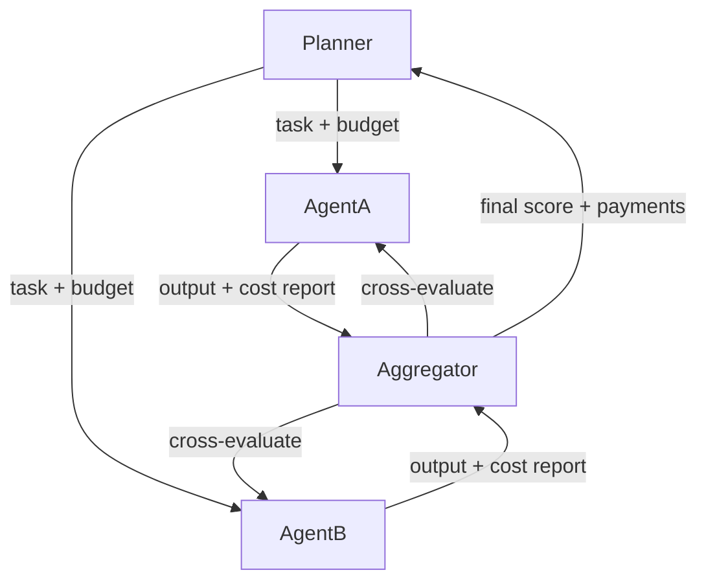

Mechanism design is game theory run backwards. Traditional game theory asks: given the rules of a game, what will rational players do? Mechanism design asks: given the outcome we want, what rules should we create so that rational players produce it? This inversion is surprisingly powerful, and it has direct consequences for how you architect multi-agent systems.

## Concept Introduction

Imagine you are building a multi-agent pipeline where three specialized agents must cooperate on a complex task. Agent A retrieves documents, Agent B synthesizes them, Agent C verifies the output. Each agent has its own internal objective, shaped by its fine-tuning or prompting. Left alone, Agent A might be lazy with retrieval because the cost of thoroughness falls on it while the benefit goes to B. Agent B might hallucinate rather than admit uncertainty, since its success metric rewards confident answers. The system as a whole fails even though each agent is locally "doing its job."

This is the **mechanism design problem** for AI systems. You cannot simply instruct agents to cooperate. You need to design the interaction protocol, the information flow, and the reward signals so that individually rational behavior leads to the collective outcome you want.

The classic result from economics is the **Revelation Principle**: for any outcome you can implement with a clever indirect mechanism (bluffing, strategic reporting), you can also implement it with a direct mechanism where agents simply report their true state and the mechanism responds optimally. This sounds almost magical but it means you can search for good mechanisms by focusing on honest, direct protocols rather than worrying about how agents might game any elaborate scheme.

## Historical and Theoretical Context

The field traces to Leonid Hurwicz, who framed the mechanism design problem in the 1960s. His central insight: economic institutions (markets, auctions, voting systems) are mechanisms, and you can evaluate and design them by asking whether they produce efficient, incentive-compatible outcomes. Roger Myerson and Eric Maskin shared the 2007 Nobel Prize with Hurwicz for formalizing these ideas.

Two properties matter most:

**Incentive compatibility** means that agents have no reason to misreport their private information or deviate from the intended behavior. A mechanism is **dominant-strategy incentive compatible (DSIC)** if truth-telling is a best response no matter what other agents do. The Vickrey-Clarke-Groves (VCG) mechanism achieves this for a wide class of resource allocation problems.

**Individual rationality** means each agent is at least as well off participating as opting out. Without this, agents simply leave the system.

In the AI context, "agents" are not necessarily economically rational humans. They are language models with objectives shaped by prompting, fine-tuning, and RLHF. But the core insight still applies: if you design a workflow that rewards an agent for behavior that is collectively harmful, it will exhibit that behavior. The mechanism designer's job is to align local incentives with global goals.

## The VCG Mechanism

The Vickrey-Clarke-Groves mechanism is the canonical result. It allocates resources efficiently and ensures that each agent's dominant strategy is to report truthfully, by making each agent's payment equal to the externality it imposes on others.

Concretely: suppose $n$ agents each want to use a shared compute resource. Agent $i$ reports its value $v_i$ for the resource. The mechanism assigns the resource to the highest bidder. The winner pays not their own bid but the **second-highest bid** (Vickrey auction). Reporting truthfully is dominant because overbidding risks winning at a loss while underbidding risks losing a valuable slot.

VCG extends this to general combinatorial settings. Each agent reports a valuation over all possible allocations, the mechanism picks the allocation maximizing total reported value, and each agent pays the difference between what others would receive without them versus with them. This "pivotal payment" makes honesty dominant.

The VCG mechanism works beautifully in theory but has weaknesses: it requires knowing all agent valuations up front, it can produce negative revenues in some settings, and it breaks down with budget-constrained agents. These limitations have spawned three decades of work on approximate mechanisms, budget-balanced variants, and prior-free auctions.

## Design Patterns for Agent Systems

In practice, mechanism design for LLM agents rarely looks like a formal auction. It looks more like careful workflow architecture.

One recurring pattern is **information revelation by design**. You structure the conversation so agents are incentivized to share what they know rather than hoard it. If Agent A will only be rewarded after Agent B successfully validates its output, A has a strong reason to provide complete, accurate information rather than a minimal answer that satisfies its own stopping criterion.

A second pattern is **peer evaluation**. You route agent outputs to sibling agents for scoring before they reach the final consumer. An agent that knows its output will be judged by a peer with overlapping domain knowledge will produce more careful work. This is related to the debate protocols explored in AI safety research, but the mechanism design framing emphasizes that you should reward the evaluators for accurate scoring (not just lenient scoring), otherwise they face no incentive to be rigorous.

A third pattern is **deferred reward aggregation**. Instead of giving each agent immediate feedback, you accumulate feedback at the end of the full pipeline and distribute credit proportionally. This prevents greedy short-term behavior at the expense of downstream agents.



## Practical Application

The following example implements a minimal mechanism-design-inspired coordinator in LangGraph. Three agents compete to produce the best answer to a query. The coordinator runs a "scoring auction": agents submit answers along with a self-reported confidence value, the coordinator cross-validates them (using a fourth LLM call), and a VCG-style payment scheme updates each agent's reputation score. Agents that truthfully report confidence near their actual accuracy accumulate higher reputation and receive more tasks.

```python
import os
from typing import TypedDict, Annotated
import operator
from langgraph.graph import StateGraph, END
from langchain_anthropic import ChatAnthropic

llm = ChatAnthropic(model="claude-haiku-4-5-20251001", temperature=0)

class MechanismState(TypedDict):
    query: str
    submissions: Annotated[list[dict], operator.add]  # {agent, answer, confidence}
    scores: dict[str, float]       # cross-validation scores
    reputations: dict[str, float]  # cumulative VCG-style payments
    final_answer: str

def make_agent_node(agent_id: str, persona: str):
    """Returns a node function for an agent with a given persona."""
    def agent_node(state: MechanismState) -> dict:
        prompt = f"""You are {persona}.
Answer this query as best you can, then report your confidence (0.0-1.0).
Query: {state['query']}

Respond in exactly this format:
ANSWER: <your answer>
CONFIDENCE: <0.0-1.0>"""
        response = llm.invoke(prompt).content
        lines = response.strip().split("\n")
        answer = next((l.replace("ANSWER:", "").strip() for l in lines if l.startswith("ANSWER:")), response)
        conf_str = next((l.replace("CONFIDENCE:", "").strip() for l in lines if l.startswith("CONFIDENCE:")), "0.5")
        try:
            confidence = float(conf_str)
        except ValueError:
            confidence = 0.5
        return {"submissions": [{"agent": agent_id, "answer": answer, "confidence": confidence}]}
    return agent_node

def cross_validator(state: MechanismState) -> dict:
    """Evaluates all submissions and returns accuracy scores 0-1."""
    submissions_text = "\n".join(
        f"Agent {s['agent']} (confidence {s['confidence']:.2f}): {s['answer']}"
        for s in state["submissions"]
    )
    prompt = f"""Query: {state['query']}

These agents submitted answers:
{submissions_text}

For each agent, output a factual accuracy score from 0.0 to 1.0.
Format: AGENT_ID: SCORE (one per line, e.g., "A: 0.8")"""
    response = llm.invoke(prompt).content
    scores = {}
    for line in response.strip().split("\n"):
        for s in state["submissions"]:
            prefix = f"{s['agent']}:"
            if line.strip().startswith(prefix):
                try:
                    scores[s["agent"]] = float(line.split(":")[1].strip())
                except (ValueError, IndexError):
                    scores[s["agent"]] = 0.5
    return {"scores": scores}

def vcg_payment_node(state: MechanismState) -> dict:
    """
    VCG-inspired reputation update.
    Each agent's payment = accuracy - |confidence - accuracy|
    Truthful reporters (confidence ≈ accuracy) earn the most.
    Overconfident or underconfident agents are penalized.
    """
    reputations = dict(state.get("reputations") or {})
    for sub in state["submissions"]:
        aid = sub["agent"]
        accuracy = state["scores"].get(aid, 0.5)
        calibration_penalty = abs(sub["confidence"] - accuracy)
        # Truthfulness bonus: reward accurate calibration
        payment = accuracy - calibration_penalty
        reputations[aid] = reputations.get(aid, 0.0) + payment
    # Pick the answer from the agent with highest accuracy
    best = max(state["submissions"], key=lambda s: state["scores"].get(s["agent"], 0))
    return {"reputations": reputations, "final_answer": best["answer"]}

# Build the graph
builder = StateGraph(MechanismState)
builder.add_node("agent_A", make_agent_node("A", "a specialist in factual retrieval"))
builder.add_node("agent_B", make_agent_node("B", "a generalist reasoner"))
builder.add_node("agent_C", make_agent_node("C", "a domain expert in science and technology"))
builder.add_node("validator", cross_validator)
builder.add_node("payments", vcg_payment_node)

# Agents run in parallel via fan-out (LangGraph parallel branches)
builder.set_entry_point("agent_A")
builder.add_edge("agent_A", "validator")
# In a real setup you'd use Send() for true parallelism; simplified here for clarity
builder.add_node("agent_B_seq", make_agent_node("B", "a generalist reasoner"))
builder.add_edge("validator", "payments")
builder.add_edge("payments", END)

graph = builder.compile()

result = graph.invoke({
    "query": "What is the time complexity of the Floyd-Warshall algorithm?",
    "submissions": [],
    "scores": {},
    "reputations": {},
    "final_answer": ""
})

print("Final answer:", result["final_answer"])
print("Agent reputations:", result["reputations"])
```

The key mechanism insight here: agents that report `CONFIDENCE: 0.9` for an answer that scores 0.4 on accuracy are penalized twice (once for low accuracy, once for poor calibration). Over many queries, this selection pressure discourages overconfidence and rewards agents whose self-assessments track their actual competence.

## Latest Developments and Research

The connection between mechanism design and AI agent systems has grown sharper since 2022. Several threads are active:

**Procurement auctions for LLM routing**. Work from Stanford and Google on mixture-of-experts routing frames model selection as an incentive problem: how do you get a pool of specialized models to honestly report their competence on a given query so you can route efficiently? Naively asking models to self-assess fails because fine-tuned models are often miscalibrated. Research is exploring scoring rules (like proper scoring rules from economics) that make honest self-reporting a Nash equilibrium. "Routing with Experts: Towards Incentive-Compatible LLM Routing," He et al., 2024, explored early versions of this.

**Mechanism design for RLHF pipelines**. The process of collecting human preference labels is itself a mechanism. If labelers are paid per label, they have an incentive to rush and produce noisy data. Several papers have proposed incentive-compatible annotation schemes that reward labelers based on consistency with a held-out validation set, reducing strategic noise. "Incentivizing High-Quality Human Feedback for Language Model Alignment," Zhu et al., NeurIPS 2024.

**Algorithmic mechanism design meets agentic AI**. As LLM agents begin acting in economic environments (negotiating contracts, bidding on resources, interacting with APIs that have usage costs), the question of whether agents trained on human text will behave strategically has become empirically pressing. Early experiments show GPT-4 class models will overbid in simple auctions unless explicitly instructed otherwise, suggesting mechanism-aware prompting or fine-tuning will be needed.

Open problems include: how to design mechanisms robust to agents that learn over time (most mechanism design assumes static preferences), how to handle mechanisms with thousands of agents where VCG payments are computationally intractable, and whether LLM agents can be trained to reason explicitly about mechanism constraints.

## Cross-Disciplinary Insight

Mechanism design has a near-perfect analogue in evolutionary biology called the evolution of cooperation. Why do biological cells cooperate inside a body rather than defect and become cancerous? Because multi-cellular organisms evolved mechanisms (apoptosis signals, immune surveillance) that make defection costly. The body is a mechanism. The rules of cell signaling are the payment scheme. Cells that defect are penalized at the level of organism survival.

This reframe is practically useful: when your multi-agent pipeline is failing, ask not just "why is this agent misbehaving?" but "what incentive does this agent's current reward structure create?" The defecting cell analogy suggests looking for agents whose local success metrics are decoupled from the pipeline's global objective. Fix the coupling, fix the behavior.

## Daily Challenge

Take any two-agent pipeline you have built (or sketch one). Identify one step where Agent A produces output consumed by Agent B. Ask:

1. What does Agent A maximize in its current form?
2. Is Agent A's success measurable before Agent B receives its output?
3. If yes, design a simple payment rule that makes A's reward depend partly on B's success with A's output. Implement it as a lightweight wrapper around A's scoring.

Consider whether your rule is incentive-compatible. Can A game it by, for example, producing verbose output that inflates B's apparent success without improving actual quality? If so, adjust the payment to penalize for verbosity or measure quality more directly.

## References and Further Reading

- Leonid Hurwicz, "On Informationally Decentralized Systems," Decision and Control, 1972. The foundational paper.
- Roger Myerson, "Optimal Auction Design," Mathematics of Operations Research, 1981.
- Noam Nisan, Tim Roughgarden, Eva Tardos, Vijay Vazirani (eds.), "Algorithmic Game Theory," Cambridge University Press, 2007. Chapter 9 covers VCG mechanisms in depth.
- Vincent Conitzer and Tuomas Sandholm, "Computational Aspects of Mechanism Design," AI Magazine, 2008.
- He et al., "Routing with Experts: Towards Incentive-Compatible LLM Routing," arXiv, 2024.
- Zhu et al., "Incentivizing High-Quality Human Feedback for Language Model Alignment," NeurIPS, 2024.
- Paul Milgrom, "Putting Auction Theory to Work," Cambridge University Press, 2004. Excellent practitioner-oriented treatment.
