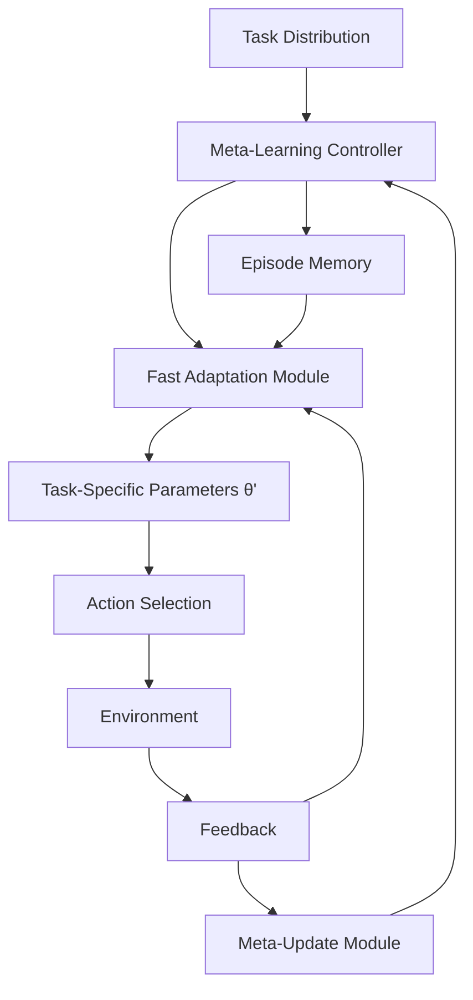

## 1. Concept Introduction

### Simple Explanation

Imagine teaching someone to fish rather than giving them fish. Meta-learning is teaching an AI agent *how to learn* rather than teaching it a specific task. Once an agent masters the art of learning, it can quickly adapt to new situations with just a few examples—sometimes just one or two.

Think of a chef who has cooked thousands of recipes. Give them a new recipe they've never seen before, and they'll nail it on the first try because they've learned the *patterns* of cooking—timing, technique, flavor combinations. That's meta-learning: learning the learning process itself.

### Technical Detail

Meta-learning, or "learning to learn," trains agents on a distribution of tasks so they develop learning strategies that generalize across task families. When presented with a new task from the same distribution, the agent can adapt its parameters or behavior using only a handful of examples (few-shot) or even a single example (one-shot).

This contrasts with traditional machine learning, where models require thousands of examples and may catastrophically forget previous knowledge. Meta-learning agents maintain a **meta-model** that encodes task-agnostic learning strategies, enabling rapid task-specific adaptation through gradient descent, recurrent state updates, or explicit memory mechanisms.

## 2. Historical & Theoretical Context

### Origins

Meta-learning has roots stretching back to the 1980s, but modern neural meta-learning emerged around 2016-2017:

- **Hochreiter et al. (2001)** showed that LSTMs could learn optimization algorithms by treating gradient descent itself as a learnable function
- **Lake et al. (2015)** introduced the Omniglot benchmark, demonstrating human-like one-shot learning
- **Vinyals et al. (2016)** proposed Matching Networks for one-shot image classification
- **Finn et al. (2017)** introduced **MAML** (Model-Agnostic Meta-Learning), the breakthrough algorithm that made meta-learning practical for deep learning

### Theoretical Foundation

Meta-learning operates on **two optimization loops**:

1. **Inner loop** (fast adaptation): Quick task-specific learning from few examples
2. **Outer loop** (meta-optimization): Slow learning that optimizes the learning process itself

This bi-level optimization mirrors the cognitive science concept of **System 1 vs System 2 thinking**: fast, intuitive responses vs. slow, deliberate reasoning.

## 3. Algorithms & Math

### MAML: Model-Agnostic Meta-Learning

The core idea: find initial parameters θ that are maximally adaptable to new tasks with minimal gradient steps.

**Algorithm:**

```
Input: Distribution of tasks p(T)
Initialize: Model parameters θ

Repeat (outer loop):
  1. Sample batch of tasks Ti ~ p(T)

  For each task Ti:
    2. Sample K examples D_train from Ti (support set)
    3. Adapt: θ'_i = θ - α∇_θ L_Ti(θ, D_train)    [Inner loop]
    4. Sample query examples D_test from Ti
    5. Compute meta-loss: L_Ti(θ'_i, D_test)

  6. Meta-update: θ = θ - β∇_θ Σ_i L_Ti(θ'_i, D_test)  [Outer loop]

Return θ (initialization optimized for fast adaptation)
```

**Key Insight:** We don't optimize for performance on training tasks directly. Instead, we optimize for the *post-adaptation* performance after a few gradient steps.

### Mathematical Formulation

For a task T with loss L_T, MAML seeks:

```
min_θ Σ_{T~p(T)} L_T(U_T(θ))

where U_T(θ) = θ - α∇_θ L_T(θ)  [one-step adaptation]
```

The meta-gradient requires computing **second-order derivatives** (gradient of a gradient), which can be computationally expensive. First-order MAML (FOMAML) approximates this by ignoring second-order terms.

## 4. Design Patterns & Architectures

### Meta-Learning Agent Architecture



### Common Patterns

1. **Metric-Based Meta-Learning** (Siamese Networks, Matching Networks, Prototypical Networks)
   - Learn an embedding space where similar examples cluster
   - Classification via nearest-neighbor in learned metric space

2. **Optimization-Based** (MAML, Reptile)
   - Learn initialization for fast gradient-based adaptation
   - Works with any differentiable model

3. **Memory-Augmented** (Neural Turing Machines, Memory Networks)
   - Explicit external memory for rapid storage/retrieval
   - Agent learns to read/write to memory strategically

4. **Contextual Meta-Learning** (CAVIA, PEARL)
   - Learn task representation in latent space
   - Condition policy on inferred task embedding

## 5. Practical Application

### Python Implementation: Simple MAML for Few-Shot Classification

```python
import torch
import torch.nn as nn
import torch.nn.functional as F

class SimpleMAML:
    def __init__(self, model, inner_lr=0.01, meta_lr=0.001):
        self.model = model
        self.inner_lr = inner_lr
        self.meta_optimizer = torch.optim.Adam(model.parameters(), lr=meta_lr)

    def inner_loop(self, support_x, support_y, num_steps=5):
        """Fast adaptation on support set"""
        # Clone parameters for task-specific adaptation
        adapted_params = {name: param.clone()
                         for name, param in self.model.named_parameters()}

        for _ in range(num_steps):
            # Forward pass with current parameters
            logits = self.model(support_x, params=adapted_params)
            loss = F.cross_entropy(logits, support_y)

            # Compute gradients and update adapted parameters
            grads = torch.autograd.grad(loss, adapted_params.values(),
                                       create_graph=True)
            adapted_params = {name: param - self.inner_lr * grad
                            for (name, param), grad
                            in zip(adapted_params.items(), grads)}

        return adapted_params

    def meta_update(self, task_batch):
        """Outer loop meta-optimization"""
        meta_loss = 0

        for support_x, support_y, query_x, query_y in task_batch:
            # Inner loop: adapt to task
            adapted_params = self.inner_loop(support_x, support_y)

            # Evaluate on query set with adapted parameters
            query_logits = self.model(query_x, params=adapted_params)
            task_loss = F.cross_entropy(query_logits, query_y)
            meta_loss += task_loss

        # Meta-gradient step
        meta_loss = meta_loss / len(task_batch)
        self.meta_optimizer.zero_grad()
        meta_loss.backward()
        self.meta_optimizer.step()

        return meta_loss.item()

# Usage example
class MAMLModel(nn.Module):
    def __init__(self, input_dim=784, hidden_dim=256, output_dim=5):
        super().__init__()
        self.fc1 = nn.Linear(input_dim, hidden_dim)
        self.fc2 = nn.Linear(hidden_dim, hidden_dim)
        self.fc3 = nn.Linear(hidden_dim, output_dim)

    def forward(self, x, params=None):
        if params is None:
            params = dict(self.named_parameters())

        x = F.relu(F.linear(x, params['fc1.weight'], params['fc1.bias']))
        x = F.relu(F.linear(x, params['fc2.weight'], params['fc2.bias']))
        x = F.linear(x, params['fc3.weight'], params['fc3.bias'])
        return x

# Meta-training
model = MAMLModel()
maml = SimpleMAML(model, inner_lr=0.01, meta_lr=0.001)

# Train on distribution of 5-way 1-shot classification tasks
for episode in range(1000):
    task_batch = sample_task_batch(num_tasks=4, n_way=5, k_shot=1)
    loss = maml.meta_update(task_batch)

    if episode % 100 == 0:
        print(f"Episode {episode}, Meta-loss: {loss:.4f}")
```

### Integration with Agent Frameworks

**LangGraph Example: Meta-Learning Agent**

```python
from langgraph.graph import StateGraph, END
from typing import TypedDict, List

class AgentState(TypedDict):
    task_context: str
    examples: List[dict]
    adapted_model: object
    current_query: str
    response: str

def extract_task_context(state: AgentState):
    """Infer task from few examples"""
    examples = state["examples"]
    # Use LLM to understand task from examples
    context = llm.invoke(f"""
    Given these examples: {examples}
    What is the underlying task? Extract the pattern.
    """)
    return {"task_context": context}

def fast_adapt(state: AgentState):
    """Quick adaptation using meta-learned initialization"""
    base_model = state.get("adapted_model") or load_meta_trained_model()

    # Fine-tune on examples (few-shot)
    adapted_model = base_model.adapt(
        examples=state["examples"],
        steps=5,
        lr=0.01
    )
    return {"adapted_model": adapted_model}

def respond_to_query(state: AgentState):
    """Use adapted model to respond"""
    model = state["adapted_model"]
    response = model.predict(state["current_query"])
    return {"response": response}

# Build the graph
workflow = StateGraph(AgentState)
workflow.add_node("extract_context", extract_task_context)
workflow.add_node("adapt", fast_adapt)
workflow.add_node("respond", respond_to_query)

workflow.set_entry_point("extract_context")
workflow.add_edge("extract_context", "adapt")
workflow.add_edge("adapt", "respond")
workflow.add_edge("respond", END)

meta_agent = workflow.compile()

# Use the agent
result = meta_agent.invoke({
    "examples": [
        {"input": "2+2", "output": "4"},
        {"input": "5+3", "output": "8"}
    ],
    "current_query": "7+6"
})
print(result["response"])  # Should adapt to arithmetic
```

## 6. Comparisons & Tradeoffs

| Approach | Adaptation Speed | Data Efficiency | Computational Cost | Generalization |
|----------|-----------------|-----------------|-------------------|----------------|
| **Standard Training** | Slow (hours/days) | Low (needs 1000s examples) | Low per update | Task-specific |
| **Transfer Learning** | Medium (minutes/hours) | Medium (100s examples) | Medium | Limited domain transfer |
| **Meta-Learning** | Fast (seconds) | High (1-10 examples) | High (meta-training) | Strong within task family |
| **In-Context Learning (LLMs)** | Instant | Highest (0-5 examples) | Variable | Depends on pretraining |

### Strengths
- **Rapid adaptation**: Learn new tasks from tiny datasets
- **Sample efficiency**: Critical when data collection is expensive
- **Systematic generalization**: Learns *how* to learn, not just specific patterns
- **Lifelong learning**: Can continuously adapt without forgetting

### Limitations
- **Meta-training cost**: Requires diverse task distribution upfront
- **Task distribution assumption**: Only works well on similar tasks
- **Computational overhead**: Second-order gradients are expensive
- **Hyperparameter sensitivity**: Inner/outer learning rates need careful tuning

## 7. Latest Developments & Research (2022-2025)

### Recent Breakthroughs

**1. Meta-Learning with Large Language Models**
- **In-Context Learning as Implicit Meta-Learning** (2023): Researchers showed that transformer pre-training implicitly performs meta-learning, explaining few-shot ICL abilities
- GPT-4 and Claude demonstrate sophisticated few-shot adaptation without explicit meta-training

**2. Task-Agnostic Meta-Reinforcement Learning**
- **MetaWorld Benchmark** (2023): 50 robotic manipulation tasks for evaluating meta-RL
- **AMAGO** (2024): Agent with Massively Adaptable Goals - handles multi-task RL with long context

**3. Online Meta-Learning**
- Algorithms that meta-learn and adapt simultaneously (no separate meta-training phase)
- **Meta-Q-Learning** and **Model-Agnostic Meta-RL** (MAML-RL) for sequential decision-making

**4. Neural Architecture Search via Meta-Learning**
- Meta-learning to find optimal agent architectures for task families
- **Once-for-All Networks**: Train once, specialize instantly

### Open Problems

- **Cross-domain meta-learning**: Transferring learning strategies across vastly different domains
- **Meta-overfitting**: Models that excel at meta-training tasks but fail on truly novel ones
- **Scalability**: Meta-learning with billions of parameters
- **Interpretability**: Understanding *what* meta-learners actually learn about learning

### Key Papers (2022-2025)

- "In-context Learning and Induction Heads" (Olsson et al., 2022)
- "What Can Transformers Learn In-Context?" (Garg et al., 2023)
- "Voyager: An Open-Ended Embodied Agent with LLMs" (Wang et al., 2023) - meta-learning in Minecraft
- "AdaptAgent: Meta-Learning for Adaptive Task-Oriented Dialogue" (2024)

## 8. Cross-Disciplinary Insight

### Connection to Neuroscience: The Prefrontal Cortex as a Meta-Learner

Recent neuroscience research suggests the prefrontal cortex (PFC) acts as a meta-learning system. The PFC doesn't store specific memories but rather *strategies* for processing information in other brain regions.

Studies by **Rougier et al. (2005)** and **Wang et al. (2018)** show that:
- PFC implements task rules via recurrent dynamics
- Dopamine signals act as meta-learning signals, adjusting PFC weights
- Working memory in PFC provides "context" analogous to task embeddings in meta-learning

This suggests biological intelligence achieves flexibility through meta-learning principles: the cortex is initialized (through evolution/development) to rapidly learn learning rules.

### Connection to Developmental Psychology

Children exhibit remarkable few-shot learning. **Susan Carey's (1978)** "fast mapping" research showed kids learn new word meanings from single exposures. This inspired:
- Compositional meta-learning approaches
- Causal reasoning in few-shot scenarios
- The "Bayesian program learning" framework by **Tenenbaum & Lake**

## 9. Daily Challenge: Build a Meta-Learning Number Guesser

**Goal**: Create a meta-learning agent that learns to guess number sequences (arithmetic, geometric, Fibonacci-like) from 3 examples.

### Setup (15 minutes)

```python
import random
import torch
import torch.nn as nn

# Task generators
def generate_arithmetic_task(start=None, step=None):
    start = start or random.randint(1, 10)
    step = step or random.randint(1, 5)
    return lambda n: start + step * n

def generate_geometric_task(start=None, ratio=None):
    start = start or random.randint(2, 5)
    ratio = ratio or random.randint(2, 3)
    return lambda n: start * (ratio ** n)

def generate_fibonacci_task(a=None, b=None):
    a, b = a or 1, b or 1
    def fib(n):
        if n == 0: return a
        if n == 1: return b
        f_prev, f_curr = a, b
        for _ in range(2, n + 1):
            f_prev, f_curr = f_curr, f_prev + f_curr
        return f_curr
    return fib

# TODO: Implement a simple MAML model
# TODO: Meta-train on arithmetic, geometric, Fibonacci tasks
# TODO: Test on new sequence: [3, 5, 8] -> predict next number
```

### Your Task (30 minutes)

1. Implement a neural network that takes 3 numbers and predicts the 4th
2. Create a meta-training loop using 50 different tasks (mix of types)
3. After meta-training, test few-shot adaptation:
   - Given [2, 4, 6] (arithmetic), predict 8
   - Given [3, 9, 27] (geometric), predict 81
   - Given [1, 1, 2] (Fibonacci), predict 3

**Success Criteria**: Your meta-learned model should adapt to each new sequence type with just those 3 examples and predict correctly.

### Bonus Challenge

Extend to handle polynomial sequences: [1, 4, 9, 16] → 25 (squares)

## 10. References & Further Reading

### Foundational Papers

- **MAML**: Finn, C., Abbeel, P., & Levine, S. (2017). "Model-Agnostic Meta-Learning for Fast Adaptation of Deep Networks." *ICML*.
- **Matching Networks**: Vinyals, O., et al. (2016). "Matching Networks for One Shot Learning." *NeurIPS*.
- **Prototypical Networks**: Snell, J., Swersky, K., & Zemel, R. (2017). "Prototypical Networks for Few-shot Learning." *NeurIPS*.

### Recent Research

- Wang, J.X., et al. (2018). "Prefrontal cortex as a meta-reinforcement learning system." *Nature Neuroscience*.
- Hospedales, T., et al. (2021). "Meta-Learning in Neural Networks: A Survey." *IEEE TPAMI*.
- Ye, H., et al. (2024). "Meta-Learning for Multi-Agent Systems: Recent Advances." *AAAI*.

### Tutorials & Code

- **Learn2Learn**: PyTorch library for meta-learning - [github.com/learnables/learn2learn](https://github.com/learnables/learn2learn)
- **Meta-World**: Benchmark for meta-RL - [meta-world.github.io](https://meta-world.github.io/)
- **MAML Tutorial**: [lilianweng.github.io/posts/2018-11-30-meta-learning/](https://lilianweng.github.io/posts/2018-11-30-meta-learning/)

### Books

- **Chapter 19** in "Deep Learning" by Goodfellow et al. (transfer learning concepts)
- "Hands-On Meta Learning with Python" by Sudharsan Ravichandiran (2019)

---

**Next Steps**: Once comfortable with meta-learning fundamentals, explore **continual learning** and **curriculum learning** to understand how agents can learn sequences of tasks without forgetting—a critical challenge for real-world deployed agents.
