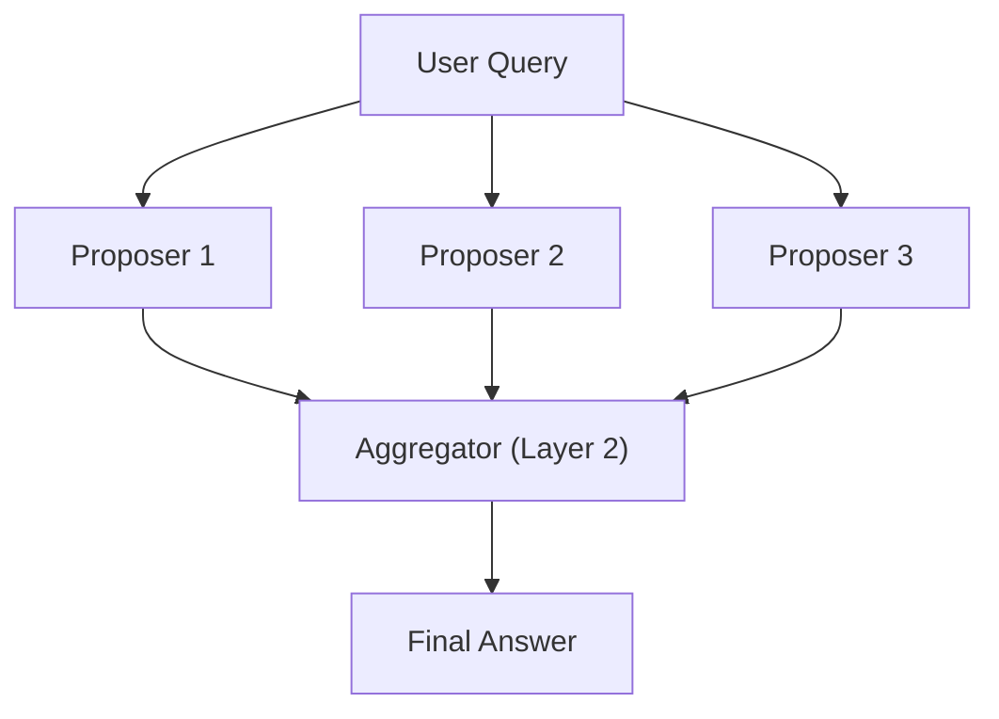

## Concept Introduction

A single LLM asked the same hard question twice will often give two noticeably different answers. Sometimes one version is sharper, better reasoned, more complete than the other. This suggests something: the model's capability space is broader than what any single forward pass reliably extracts. **Mixture-of-Agents (MoA)** exploits this directly by running multiple LLM agents in parallel, then feeding all their outputs to a second layer of agents that synthesizes them into something better than any proposer could produce alone.

The architecture has three essential ingredients. First, a set of proposer agents, each given the same query but potentially running on different models or with different system prompts. Second, an aggregator layer, which receives all proposer outputs concatenated into its context and is instructed to synthesize the best possible answer. Third, optionally, multiple rounds of this process, with each round's outputs flowing into the next layer's context.

The intuition is subtle but solid. Generating a good answer from scratch is hard. Critiquing, combining, and improving a set of draft answers is easier. The aggregator has privileged access to multiple independent attempts, each covering different angles or catching different errors. It is not averaging them, it is doing something more like expert synthesis.

## Historical and Theoretical Context

Minsky's 1986 "Society of Mind" proposed that intelligence arises from the collective interaction of many simple, individually limited agents. No single agent understands the whole problem, but the society as a whole can. That idea floated in AI theory for decades without a clean engineering realization. MoA, published in 2024 by Wang et al. at TogetherAI, is arguably the closest practical instantiation of that vision using modern LLMs.

The lineage also runs through ensemble methods in classical ML. Bagging, boosting, and random forests all exploit the principle that diverse weak learners, aggregated correctly, outperform strong individual ones. Diversity matters because correlated errors don't cancel. In MoA, using heterogeneous base models (GPT-4o, Claude, Gemini) as proposers introduces the kind of independence that makes ensemble theory work. Using the same model multiple times still helps, but less so.

There is also a connection to the "LLM-as-judge" research thread. Work on constitutional AI and RLHF established that LLMs are reliably better at ranking or critiquing outputs than at generating optimally from nothing. MoA operationalizes this observation architecturally.

## Architecture and Design Patterns



The basic single-round MoA is the most common deployment pattern. Three to five proposers feed one aggregator. The aggregator's prompt typically includes each proposer's output verbatim and instructs it to synthesize the best possible response, incorporating correct elements and correcting errors from the drafts.

A multi-round variant stacks additional aggregation layers. In practice, two rounds is usually the sweet spot. Beyond that, returns diminish quickly while latency compounds. Each round's agents are still proposers to the next layer, so the architecture generalizes cleanly.

One variant worth knowing: the proposers can be the same model. This is cheaper than running heterogeneous APIs and still helps, because LLM outputs have non-trivial variance. The aggregator often catches errors that any single run would have propagated. If you do use a single model, varying the temperature or system prompt across proposers increases diversity and therefore benefit.

Another pattern: asymmetric layers. Use fast, cheap models as proposers to generate many drafts quickly, then use one expensive, capable model as the aggregator. This concentrates compute where synthesis matters most, and the cheap proposers provide the raw material.

## Practical Application

The following example uses the Anthropic SDK to implement a two-layer MoA with a single model playing all roles (practical in cases where you only have access to one API). Three proposers run concurrently, and one aggregator synthesizes their outputs.

```python
import asyncio
import anthropic

client = anthropic.AsyncAnthropic()

PROPOSER_PROMPT = """Answer the following question as thoroughly and accurately as you can.
Focus on correctness and depth. Do not hedge unnecessarily.

Question: {question}"""

AGGREGATOR_PROMPT = """You have received {n} independent responses to the question below.
Your job is to synthesize the best possible answer by:
- Incorporating accurate and useful content from each response
- Correcting any errors you spot across the drafts
- Producing a single, well-structured, authoritative answer

Question: {question}

--- Draft responses ---
{drafts}
--- End of drafts ---

Now write the best synthesized answer:"""


async def run_proposer(question: str, proposer_id: int) -> str:
    """Run one proposer agent and return its response."""
    response = await client.messages.create(
        model="claude-haiku-4-5-20251001",  # Fast, cheap proposers
        max_tokens=512,
        messages=[{
            "role": "user",
            "content": PROPOSER_PROMPT.format(question=question)
        }]
    )
    text = response.content[0].text
    print(f"  [Proposer {proposer_id}] {len(text)} chars")
    return text


async def run_aggregator(question: str, drafts: list[str]) -> str:
    """Run the aggregator agent over all proposer drafts."""
    formatted = "\n\n".join(
        f"[Response {i+1}]\n{d}" for i, d in enumerate(drafts)
    )
    response = await client.messages.create(
        model="claude-sonnet-4-6",  # Stronger model for synthesis
        max_tokens=1024,
        messages=[{
            "role": "user",
            "content": AGGREGATOR_PROMPT.format(
                n=len(drafts),
                question=question,
                drafts=formatted
            )
        }]
    )
    return response.content[0].text


async def mixture_of_agents(question: str, n_proposers: int = 3) -> dict:
    """Run full MoA pipeline: parallel proposers -> aggregator synthesis."""
    print(f"Running {n_proposers} proposers in parallel...")
    # Proposers run concurrently — total latency is max(proposer latencies)
    drafts = await asyncio.gather(*[
        run_proposer(question, i) for i in range(n_proposers)
    ])

    print("Running aggregator...")
    final = await run_aggregator(question, list(drafts))

    return {"drafts": list(drafts), "final": final}


async def main():
    question = (
        "What are the key trade-offs between transformer-based and "
        "state-space models for long-context sequence modeling?"
    )
    result = await mixture_of_agents(question, n_proposers=3)

    print("\n=== FINAL ANSWER ===")
    print(result["final"])


if __name__ == "__main__":
    asyncio.run(main())
```

The concurrency is the key practical point. Because proposers run in parallel via `asyncio.gather`, total wall-clock time is close to a single proposer call, not three times as much. The only real latency penalty is the aggregator call on top.

## Latest Developments and Research

The MoA paper reported a 65.1% win rate on AlpacaEval 2.0 (LC), outperforming GPT-4o (57.5%) when using a heterogeneous mix of models including WizardLM, Qwen, and LLaMA variants as proposers with GPT-4o as the aggregator. That result was notable because it beat frontier models without requiring any training, only inference-time composition.

Follow-on work has explored two directions. First, learned aggregators: instead of prompting a model to synthesize, you fine-tune a small model specifically on the task of combining LLM outputs. This narrows the aggregator's job to something highly tractable and reduces cost. Second, dynamic proposer selection: rather than running all proposers every time, a lightweight router picks the subset of proposers most likely to help given the query type, combining MoA with semantic routing ideas.

The connection to speculative decoding is worth noting. In speculative decoding, a small draft model generates token candidates that a large verifier model accepts or rejects. MoA runs at the response level rather than the token level, but the underlying logic (cheap generation, expensive verification/synthesis) is the same.

Open questions include: how to measure proposer diversity formally (not just model identity), how to handle contradictory proposer outputs without the aggregator naively averaging them, and whether MoA benefits extend to agentic settings where proposers are tool-using loops rather than single-shot generators.

## Cross-Disciplinary Insight

Peer review in academic publishing is structurally identical to MoA. Several independent reviewers read the same paper and write separate evaluations. An editor (the aggregator) synthesizes those reviews into a decision and meta-review, drawing on the diverse perspectives without being bound by any single one. The process exists precisely because no single reviewer catches everything, but the union of reviewers rarely misses the major issues. MoA is peer review for language model outputs, running in seconds instead of months.

Ensemble methods in weather forecasting work the same way. Numerical weather prediction centers run dozens of slightly perturbed model initializations (an "ensemble") and report the probability distribution over outcomes, which consistently outperforms any single deterministic forecast. The proposers are the ensemble members; the aggregator is the probabilistic synthesis step.

## Daily Challenge

Take a factually dense question in a domain you know well (e.g., a technical question from your own work). Run it through three separate Claude or GPT-4 calls without MoA. Compare the outputs. Note which facts or framings differ across responses. Then write a manual aggregator prompt that explicitly lists the three drafts and asks for synthesis. Compare that result to each individual draft. Does the synthesized answer incorporate more correct detail? Does it inherit any errors? What would you instruct the aggregator differently to avoid those failures?

## References and Further Reading

- "Mixture-of-Agents Enhances Large Language Model Capabilities," Junlin Wang, Jue Wang, Ben Athiwaratkun, Ce Zhang, James Zou. arXiv preprint, 2024.
- "The Society of Mind," Marvin Minsky. Simon and Schuster, 1986.
- "Constitutional AI: Harmlessness from AI Feedback," Bai et al. Anthropic technical report, 2022.
- "FrugalGPT: How to Use Large Language Models While Reducing Cost and Improving Performance," Chen et al. arXiv, 2023.
- "Judging LLM-as-a-Judge with MT-Bench and Chatbot Arena," Zheng et al. NeurIPS, 2023.
- TogetherAI MoA implementation: `github.com/togethercomputer/MoA`
