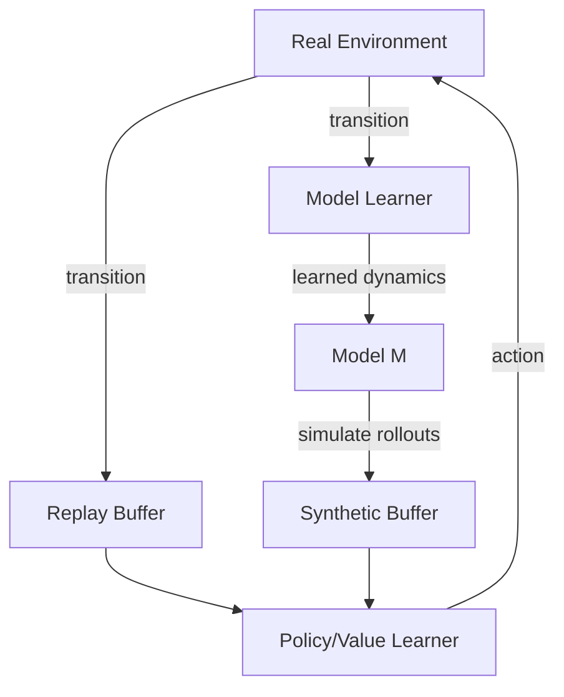

Most reinforcement learning algorithms learn the hard way: try something, observe the outcome, update — and repeat a million times. Model-based RL takes a different route. The agent first builds a compressed model of the world, then *simulates* experience inside that model. Agents that can plan ahead this way recover from sparse rewards and learn from far fewer real interactions.

## Concept Introduction

In RL, the **environment model** is a learned function that predicts: given state $s$ and action $a$, what will the next state $s'$ and reward $r$ be? A model-free learner plays thousands of games and slowly infers which board positions lead to wins. A model-based learner internalizes the rules and can mentally simulate "if I do this, then that happens."

Formally, an environment model approximates the dynamics:

$$\hat{P}(s' | s, a) \approx P(s' | s, a)$$

$$\hat{R}(s, a) \approx \mathbb{E}[r | s, a]$$

With this model in hand, the agent can do **background planning**: generate synthetic $(s, a, r, s')$ transitions without stepping in the real environment, then use those synthetic transitions to update a value function or policy. Real environment interactions remain precious; simulated ones are essentially free.

## Historical & Theoretical Context

The key ideas crystallized in Richard Sutton's landmark 1991 paper introducing **Dyna**, which unified learning and planning in a single architecture. The insight was elegant: model-free RL (e.g. Q-learning) and model-based planning (e.g. dynamic programming) are not competing philosophies — they are the two ends of a spectrum, and you can run both simultaneously.

Before Dyna, planning methods assumed you *had* the model (like in classical AI). After Dyna, the model itself became a learning target. This opened the door to **sample-efficient RL** that was previously impossible in environments where each real step is expensive.

Two major branches emerged:
- **Shallow models** (tabular or linear) — fast, interpretable, but limited to simple domains
- **Deep generative models** — neural world models (Dreamer, MuZero) that handle pixels and complex state spaces

## Algorithms & Math

### The Dyna-Q Algorithm

Dyna adds a model and planning loop to standard Q-learning:

```
Initialize Q(s, a), model M(s, a) = {}

for each episode:
    observe state s
    while not terminal:
        a ← ε-greedy policy from Q(s, ·)
        take action a, observe r, s'

        # Direct RL update (model-free)
        Q(s, a) ← Q(s, a) + α[r + γ max_a' Q(s', a') - Q(s, a)]

        # Model learning
        M(s, a) ← (r, s')   # store transition

        # Background planning: n simulated steps
        for i in 1..n:
            s_sim ← random previously-seen state
            a_sim ← random previously-taken action from s_sim
            r_sim, s'_sim ← M(s_sim, a_sim)   # query model
            Q(s_sim, a_sim) ← Q(s_sim, a_sim) + α[r_sim + γ max_a' Q(s'_sim, a') - Q(s_sim, a_sim)]

        s ← s'
```

The parameter $n$ is the **planning depth**. With $n = 0$ you recover plain Q-learning. With $n = 50$, a single real transition generates 50 synthetic updates — dramatic sample efficiency in practice.

### The Sample Efficiency Argument

Let $N_{\text{real}}$ be the number of real environment steps needed to learn a good policy. Model-free methods need $N_{\text{real}}$ to be large. Model-based methods can reduce it by a factor roughly proportional to $n$:

$$N_{\text{real}}^{\text{MBRL}} \approx \frac{N_{\text{real}}^{\text{MF}}}{1 + n \cdot \alpha_{\text{model}}}$$

where $\alpha_{\text{model}}$ reflects how accurate the model is. With a perfect model you win big; with a poor model, compound errors accumulate and can harm learning — the classic **model bias** problem.

### Model Rollout Horizon

Deep MBRL methods like **MBPO** (Dagan et al., 2019) use short model rollouts to limit error accumulation. If the model has single-step error $\epsilon$, a rollout of length $k$ accumulates error $O(k \cdot \epsilon)$. MBPO uses $k = 1$–$5$ while still achieving 5–25× sample efficiency over SAC.

$$\text{Error}_k \leq k \cdot \epsilon_{\text{model}} + \text{policy approximation error}$$

## Design Patterns & Architectures

Three canonical patterns exist in MBRL:



**Dyna-style**: interleave real and simulated data in the same update rule.

**Shooting methods (PETS, CEM-MPC)**: use the model *only* for planning at inference time, not for offline policy training. Sample candidate action sequences, roll them out in the model, pick the best.

**Latent world models (Dreamer, MuZero)**: learn a compact latent representation $z_t$ of the world state, then do all planning in latent space. Much more scalable to raw observations.

All three connect to the **planner–executor** pattern: the model serves as the planner's simulator, while a learned policy handles real-world execution.

## Practical Application

Here's a minimal Dyna-Q implementation on a simple gridworld, alongside a sketch of how you'd layer MBRL into a modern agent:

```python
import numpy as np
from collections import defaultdict

class DynaQ:
    def __init__(self, n_states, n_actions, alpha=0.1, gamma=0.95, epsilon=0.1, n_plan=10):
        self.Q = np.zeros((n_states, n_actions))
        self.model = {}           # (s, a) -> (r, s')
        self.seen_pairs = []
        self.alpha = alpha
        self.gamma = gamma
        self.epsilon = epsilon
        self.n_plan = n_plan

    def act(self, state):
        if np.random.rand() < self.epsilon:
            return np.random.randint(self.Q.shape[1])
        return int(np.argmax(self.Q[state]))

    def update(self, s, a, r, s_next):
        # Direct Q-learning update
        td_target = r + self.gamma * np.max(self.Q[s_next])
        self.Q[s, a] += self.alpha * (td_target - self.Q[s, a])

        # Model update
        self.model[(s, a)] = (r, s_next)
        if (s, a) not in self.seen_pairs:
            self.seen_pairs.append((s, a))

        # Background planning
        for _ in range(self.n_plan):
            idx = np.random.randint(len(self.seen_pairs))
            s_sim, a_sim = self.seen_pairs[idx]
            r_sim, s_next_sim = self.model[(s_sim, a_sim)]
            td_target_sim = r_sim + self.gamma * np.max(self.Q[s_next_sim])
            self.Q[s_sim, a_sim] += self.alpha * (td_target_sim - self.Q[s_sim, a_sim])


# Usage sketch
agent = DynaQ(n_states=100, n_actions=4, n_plan=20)
# With n_plan=20, each real step produces 21 total Q-updates
```

For a modern deep agent integrating MBRL with LangGraph-style orchestration, the pattern looks like:

```python
# Conceptual: MBRL node in a LangGraph agent workflow
from langgraph.graph import StateGraph

def model_rollout_node(state):
    """Generate k synthetic transitions from learned dynamics model."""
    synthetic_batch = []
    for _ in range(state["rollout_steps"]):
        s = sample_from_buffer(state["real_buffer"])
        for _ in range(state["horizon"]):
            a = state["policy"](s)
            s_next, r = state["dynamics_model"](s, a)
            synthetic_batch.append((s, a, r, s_next))
            s = s_next
    return {**state, "synthetic_batch": synthetic_batch}

def policy_update_node(state):
    """Update policy on mixed real + synthetic data."""
    mixed = state["real_buffer"].sample(256) + state["synthetic_batch"]
    state["policy"].update(mixed)
    return state

graph = StateGraph(dict)
graph.add_node("rollout", model_rollout_node)
graph.add_node("update", policy_update_node)
graph.add_edge("rollout", "update")
```

## Latest Developments & Research

**MBPO (2019)**: Showed that short model rollouts ($k \leq 5$) with SAC achieve 5–25× sample efficiency over pure model-free SAC on MuJoCo benchmarks, without sacrificing asymptotic performance.

**DreamerV3 (Hafner et al., 2023)**: A single MBRL agent trained from scratch — with fixed hyperparameters — achieves human-level performance across 150+ tasks spanning Atari, DMC, robotic manipulation, and Minecraft diamond collection. This is perhaps the strongest argument for MBRL as a general-purpose paradigm.

**TD-MPC2 (2024)**: Combines temporal difference learning with latent-space MPC, achieving state-of-the-art on continuous control benchmarks with remarkably few real steps. Scales from locomotion to manipulation with one model architecture.

**Model Predictive Path Integral (MPPI)**: A sampling-based MPC method gaining traction in robotics (used in NVIDIA's Isaac Lab) because it handles non-smooth cost functions and can be parallelized on GPU.

**Open problems**: Model exploitation (the policy learns to game model inaccuracies), multi-step model error propagation, and learning models in non-stationary environments remain active research areas.

## Cross-Disciplinary Insight

MBRL mirrors how **classical control engineering** has always worked. A control engineer designs a PID controller by first deriving a physics-based model (transfer function, state-space equations) of the plant, then synthesizing a controller analytically or numerically. Model-free RL skips the physics and tunes gains by trial and error. It works eventually, but wastes resources.

There is also a connection to **Bayesian experimental design**: a MBRL agent that knows where its model is uncertain should actively seek transitions that reduce that uncertainty — the exploration strategy known as curiosity via model uncertainty. This is how a scientist designs the most informative experiment.

In neuroscience, the hippocampus and prefrontal cortex implement something analogous: offline replay during sleep allows the brain to simulate experiences and consolidate memory. Dyna's background planning loop is structurally the same mechanism.

## Daily Challenge

**Exercise: Measure the Dyna speedup curve**

1. Implement `DynaQ` (code above) on OpenAI Gymnasium's `FrozenLake-v1` (8×8, deterministic).
2. Train agents with $n \in \{0, 1, 5, 10, 20, 50\}$ planning steps, each for the same number of real environment steps (e.g. 20,000).
3. Plot **episodes to solve** (100 consecutive successful episodes) versus $n$.

You should observe a strong speedup up to around $n = 20$, then diminishing returns (why? Think about the model quality ceiling on a finite tabular domain).

**Bonus**: Implement **prioritized sweeping** — instead of randomly sampling from the model, sample states whose Q-values changed most recently (like priority queues in Dijkstra). You should see another significant speedup.

## References & Further Reading

### Foundational Papers
- **"Dyna, an Integrated Architecture for Learning, Planning, and Reacting"** — Sutton (1991): The paper that started it all
- **"When to Trust Your Model: Model-Based Policy Optimization"** — Janner et al. (2019): MBPO, the modern MBRL baseline
- **"Mastering Atari, Go, Chess and Shogi by Planning with a Learned Model"** — Schrittwieser et al. (2020): MuZero

### Modern Work
- **"Mastering Diverse Domains through World Models"** — Hafner et al. (2023): DreamerV3 — [arXiv:2301.04104](https://arxiv.org/abs/2301.04104)
- **"TD-MPC2: Scalable, Robust World Models for Continuous Control"** — Hansen et al. (2024): [arXiv:2310.16828](https://arxiv.org/abs/2310.16828)
- **"PETS: Deep Reinforcement Learning in a Handful of Trials using Probabilistic Dynamics Models"** — Chua et al. (2018): Probabilistic ensembles for model uncertainty

### Textbook & Tutorials
- **Sutton & Barto, Chapter 8** — "Planning and Learning with Tabular Methods": The canonical treatment of Dyna
- **Spinning Up in Deep RL** (OpenAI): Model-based section with MBPO walkthrough
- **DreamerV3 codebase**: https://github.com/danijar/dreamerv3

### GitHub
- **MBPO (official)**: https://github.com/JannerMichael/mbpo
- **TD-MPC2**: https://github.com/nicklashansen/tdmpc2
- **Model-based RL benchmarks (MBBL)**: https://github.com/WilsonWangTHU/mbbl

---
