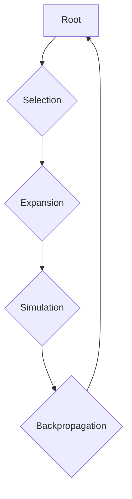

## 1. Concept Introduction

Imagine you're playing a complex board game like Go. The number of possible moves is astronomical, making it impossible to predict the outcome of every choice. How do you decide your next move? You might play out a few promising sequences in your head, see how they unfold, and then choose the move that seems to lead to the best outcomes.

In essence, this is what **Monte Carlo Tree Search (MCTS)** does.

At its core, MCTS is a powerful algorithm for finding optimal decisions in a given domain by intelligently searching through the space of possible choices. It builds a search tree, incrementally expanding it based on the results of random simulations (the "Monte Carlo" part). It masterfully balances exploring new, unknown paths with exploiting paths that have proven successful in the past.

For the practitioner, MCTS is a heuristic search algorithm ideal for problems with a large search space. It doesn't need a perfect evaluation function for game states; instead, it learns the value of states by sampling the outcome of many simulated playthroughs. This makes it incredibly versatile for everything from game AI to complex optimization problems.

## 2. Historical & Theoretical Context

The ideas behind MCTS have roots in **Monte Carlo methods**, which date back to the 1940s and the Manhattan Project. However, the MCTS algorithm as we know it today was formalized in the mid-2000s. Key contributions came from Rémi Coulom in 2006, who used it in his Go program Crazy Stone, and Levente Kocsis and Csaba Szepesvári, who developed the **UCT (Upper Confidence Bound 1 applied to Trees)** algorithm in the same year.

MCTS represented a major breakthrough in computer Go, a game that had long been a grand challenge for AI due to its immense branching factor. Before MCTS, most game-playing AI relied on algorithms like **Minimax** with **alpha-beta pruning**, which require a handcrafted evaluation function. MCTS's ability to learn from simulations was a game-changer.

## 3. Algorithms & Math

The MCTS algorithm iterates through four main steps:

1.  **Selection**: Starting from the root of the tree (the current state), we traverse down the tree by selecting the most promising child node at each step until we reach a leaf node. The "most promising" child is typically chosen using the UCT formula.
2.  **Expansion**: If the selected leaf node is not a terminal state (i.e., the game isn't over), we expand the tree by creating one or more new child nodes representing possible next moves.
3.  **Simulation**: From one of the new child nodes, we run a simulation (also called a "playout" or "rollout"). This involves choosing moves (often randomly or with a simple heuristic) until the end of the game.
4.  **Backpropagation**: The outcome of the simulation (win, loss, or draw) is then propagated back up the tree from the new node to the root. We update the statistics (number of visits and wins) of each node along the path.

This process is repeated many times. To make a move, we simply choose the child of the root node with the highest number of visits.



The magic of balancing exploration and exploitation happens in the **Selection** phase, thanks to the **UCT formula**:

`UCT = (W / N) + C * sqrt(ln(T) / N)`

Where:
- `W` is the number of wins for the node.
- `N` is the number of visits to the node.
- `T` is the total number of simulations run so far.
- `C` is an exploration parameter (a constant that can be tuned).

The first part of the formula, `(W / N)`, is the **exploitation** term. It favors nodes that have a high win rate. The second part is the **exploration** term. It favors nodes that have been visited less frequently.

## 4. Design Patterns & Architectures

MCTS fits naturally into a **planner-executor** agent architecture. The MCTS algorithm acts as the **planner**, exploring possible futures and recommending a course of action. The **executor** then carries out the recommended action, leading to a new state, from which the planner can begin its search again.

This pattern was famously used in **AlphaGo**, which combined MCTS with deep neural networks. A **policy network** was used to guide the initial selection of moves, and a **value network** was used to evaluate board positions at the end of the simulation phase, making the rollouts more accurate.

## 5. Practical Application

Here's a simplified Python-like pseudocode for MCTS in a game like Tic-Tac-Toe:

```python
class Node:
    def __init__(self, state, parent=None):
        self.state = state
        self.parent = parent
        self.children = []
        self.wins = 0
        self.visits = 0

def mcts(root_node, num_simulations):
    for _ in range(num_simulations):
        node = root_node
        
        # 1. Selection
        while node.children:
            node = select_child(node) # Using UCT
            
        # 2. Expansion
        if not is_terminal(node.state):
            expand_node(node)
            node = node.children[0]
            
        # 3. Simulation
        outcome = simulate_random_playout(node.state)
        
        # 4. Backpropagation
        while node is not None:
            node.visits += 1
            node.wins += outcome
            node = node.parent
            
    return best_move(root_node) # e.g., child with most visits
```

In modern AI agent frameworks, MCTS is being explored as a way to guide the reasoning process of LLMs. For example, in a **LangGraph** agent, each node in the graph could represent a state of reasoning, and MCTS could be used to explore different paths (chains of thought) to solve a complex problem, similar to the **Tree of Thoughts** architecture.

## 6. Comparisons & Tradeoffs

**MCTS vs. Minimax with Alpha-Beta Pruning:**

-   **Evaluation Function**: Minimax requires a domain-specific evaluation function. MCTS does not, relying on simulations instead.
-   **Branching Factor**: MCTS handles very large branching factors much better than Minimax.
-   **Asymmetry**: MCTS can focus its search on more promising areas of the tree, making it more efficient for many games.

**Strengths of MCTS:**

-   **Anytime Algorithm**: It can be stopped at any time and will provide the best move found so far.
-   **Parallelizable**: The simulations can be run in parallel, making it easy to scale with more computing power.
-   **Versatile**: Can be applied to a wide range of problems, not just games.

**Limitations:**

-   **Computational Cost**: Can be slow, especially for games with long simulations.
-   **Simulation Quality**: The effectiveness of MCTS depends heavily on the quality of the simulation policy. A purely random simulation might not be informative enough.

## 7. Latest Developments & Research

The most significant breakthrough involving MCTS was **DeepMind's AlphaGo**, which defeated world champion Lee Sedol in 2016. This work demonstrated the power of combining MCTS with deep learning. The successor, **AlphaZero**, generalized this approach to learn Chess, Shogi, and Go from scratch, achieving superhuman performance.

More recently, researchers are applying MCTS-like principles to improve the reasoning and planning capabilities of Large Language Models. The **Tree of Thoughts (ToT)** framework explicitly uses a tree-based search to explore different reasoning paths, and some implementations use MCTS for the search strategy. This is an active area of research, with the goal of making LLMs more deliberate and less prone to hallucination.

## 8. Cross-Disciplinary Insight

The core challenge that MCTS addresses—the **exploration-exploitation tradeoff**—is a fundamental problem in many fields. In **economics**, businesses must decide whether to invest in new, unproven products (exploration) or to focus on their existing, profitable ones (exploitation). In **neuroscience**, this tradeoff is thought to be managed by dopamine systems in the brain, which balance seeking new rewards with exploiting known ones.

## 9. Daily Challenge / Thought Exercise

For a simple game like Tic-Tac-Toe, the state space is small enough that you can often find the optimal move without a complex search.

**Your challenge**: How would you adapt the MCTS algorithm for a game with a very high branching factor but a very short game length? For example, a game where you have 1000 possible moves, but the game always ends after 3 turns. What parts of the MCTS algorithm would be most important in this scenario?

## 10. References & Further Reading

-   **"A Survey of Monte Carlo Tree Search Methods"** by Browne et al. (2012): A comprehensive overview of the algorithm and its variants.
-   **"Mastering the game of Go with deep neural networks and tree search"** (The AlphaGo paper) by Silver et al. (2016): A landmark paper in AI.
-   **Jeff Bradberry's MCTS tutorial**: A very accessible introduction to the topic.
-   **The Tree of Thoughts paper**: For insights into how tree-based search is being applied to LLMs.
