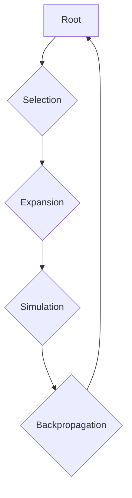

## Concept Introduction

**Monte Carlo Tree Search (MCTS)** is a heuristic search algorithm for finding optimal decisions in large search spaces. It builds a search tree incrementally, guided by the results of random simulations (the "Monte Carlo" part), balancing exploration of new paths against exploitation of paths that have proven successful.

Unlike minimax, MCTS does not require a handcrafted evaluation function for game states. Instead, it estimates state values by sampling the outcomes of many simulated playthroughs. This makes it applicable to games like Go with astronomical branching factors, and more recently to reasoning problems in LLMs.

## Algorithms & Math

The MCTS algorithm iterates through four main steps:

1.  **Selection**: Starting from the root of the tree (the current state), we traverse down the tree by selecting the most promising child node at each step until we reach a leaf node. The "most promising" child is typically chosen using the UCT formula.
2.  **Expansion**: If the selected leaf node is not a terminal state (i.e., the game isn't over), we expand the tree by creating one or more new child nodes representing possible next moves.
3.  **Simulation**: From one of the new child nodes, we run a simulation (also called a "playout" or "rollout"). This involves choosing moves (often randomly or with a simple heuristic) until the end of the game.
4.  **Backpropagation**: The outcome of the simulation (win, loss, or draw) is then propagated back up the tree from the new node to the root. We update the statistics (number of visits and wins) of each node along the path.

This process is repeated many times. To make a move, we simply choose the child of the root node with the highest number of visits.


```mermaid
graph TD
    A[Root] --> B{Selection};
    B --> C{Expansion};
    C --> D{Simulation};
    D --> E{Backpropagation};
    E --> A;
```

The magic of balancing exploration and exploitation happens in the **Selection** phase, thanks to the **UCT formula**:

`UCT = (W / N) + C * sqrt(ln(T) / N)`

Where:
- `W` is the number of wins for the node.
- `N` is the number of visits to the node.
- `T` is the total number of simulations run so far.
- `C` is an exploration parameter (a constant that can be tuned).

The first part of the formula, `(W / N)`, is the **exploitation** term. It favors nodes that have a high win rate. The second part is the **exploration** term. It favors nodes that have been visited less frequently.

## Design Patterns & Architectures

MCTS fits naturally into a **planner-executor** agent architecture. The MCTS algorithm acts as the planner, exploring possible futures and recommending a course of action. The executor carries out the recommended action, leading to a new state from which the planner begins its search again.

**AlphaGo** combined MCTS with deep neural networks in this way. A policy network guided the initial selection of moves, and a value network evaluated board positions at the end of the simulation phase, replacing pure random rollouts with learned estimates.

## Practical Application

A minimal MCTS implementation for LLM reasoning defines a `Node` class to hold a reasoning state (prompt + partial response) along with visit count and accumulated reward, then wires together four functions — `select` (UCT scoring over children), `expand` (sample candidate continuations from the LLM), `simulate` (run a lightweight rollout to a terminal state), and `backpropagate` (update win/visit counts up the tree). The raw Anthropic SDK is the best fit here: `expand` and `simulate` each call `client.messages.create`, with temperature controlling exploration width. A thin loop drives the four phases for a fixed budget of iterations, then returns the child of the root with the highest visit count as the chosen next reasoning step.

**Try it**

```
Using the Anthropic Python SDK, build a minimal Monte Carlo Tree Search (MCTS) reasoner.
Define a Node class with fields: state (str), parent, children (list), visits (int), value (float).
Implement select (UCT formula), expand (call claude-haiku-4-5-20251001 to sample 2 child states),
simulate (one greedy rollout to a short answer, scored by a simple heuristic), and backpropagate.
Run 8 MCTS iterations on the root question "What is the fastest route from A to B?" and print
the chosen next reasoning step. Add inline comments explaining each MCTS phase.
```

## Latest Developments & Research

The most significant breakthrough involving MCTS was **DeepMind's AlphaGo**, which defeated world champion Lee Sedol in 2016. This work demonstrated the power of combining MCTS with deep learning. The successor, **AlphaZero**, generalized this approach to learn Chess, Shogi, and Go from scratch, achieving superhuman performance.

More recently, researchers are applying MCTS-like principles to improve the reasoning and planning capabilities of Large Language Models. The **Tree of Thoughts (ToT)** framework explicitly uses a tree-based search to explore different reasoning paths, and some implementations use MCTS for the search strategy. This is an active area of research, with the goal of making LLMs more deliberate and less prone to hallucination.

## Cross-Disciplinary Insight

The **exploration-exploitation tradeoff** that MCTS addresses is a fundamental problem across many fields. In economics, businesses must decide whether to invest in new, unproven products or focus on existing profitable ones. In neuroscience, this tradeoff is thought to be managed by dopamine systems in the brain.