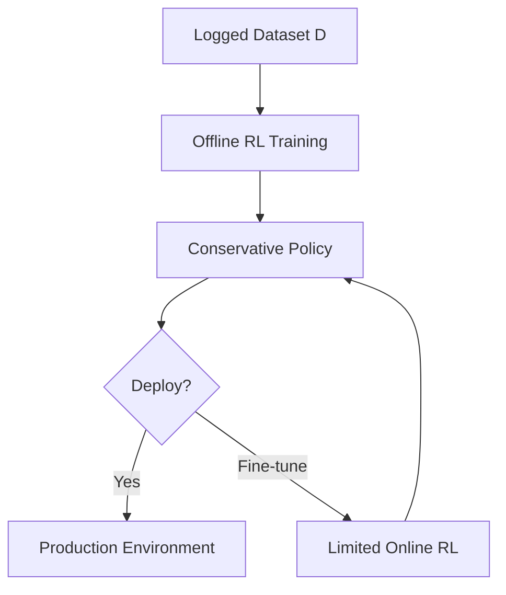

Most reinforcement learning stories follow the same arc: an agent stumbles around an environment, gathers experience, and gradually improves. But what happens when the environment is too expensive to explore, too risky to let an agent loose in, or simply not available at training time? Offline RL — also called batch RL — answers this question by flipping the paradigm: learn everything you can from a fixed dataset of past interactions, then deploy.

## 1. Concept Introduction

### Simple Explanation

Imagine you want to train an agent to drive a car. You could let it crash thousands of times in simulation, or you could hand it a hard drive full of dashcam footage and sensor logs from a million human drivers and say: "Figure out good driving from this."

That's offline RL. The agent gets a frozen dataset of `(state, action, reward, next_state)` tuples collected by some behaviour — human, scripted policy, or a previous agent — and must extract an optimal policy without any further interaction.

### Technical Detail

Standard online RL has a feedback loop: explore → observe reward → update policy → explore again. Offline RL breaks this loop. The agent can only update its parameters; it cannot collect new data.

This creates a fundamental challenge called **distributional shift**. When the learned policy $\pi_\theta$ tries to take actions that rarely appeared in the dataset, the Q-function has no reliable estimate for those state-action pairs. It tends to wildly over-estimate their value — a problem called **extrapolation error** or **out-of-distribution (OOD) overestimation**.

The entire field of offline RL is essentially a set of principled answers to this one problem.

## 2. Historical & Theoretical Context

Batch RL dates back to the early 2000s. Lange, Gabel & Riedmiller's 2012 survey formalised the setting, but the real explosion came after Levine et al.'s 2020 position paper *"Offline Reinforcement Learning: Tutorial, Review, and Perspectives on Open Problems"* unified the vocabulary and described why naive off-policy methods fail catastrophically on fixed datasets.

The key insight from Fujimoto et al.'s 2019 paper **BCQ (Batch-Constrained Q-learning)** was that an offline agent must be *conservative*: constrain learned actions to stay near the data distribution. Every major offline RL algorithm since has been a variation on this theme.

## 3. Algorithms & Math

### The Offline RL Objective

Given a fixed dataset $\mathcal{D} = \{(s, a, r, s')\}$ collected by some behaviour policy $\pi_\beta$, we want to learn $\pi^*$ that maximises the expected cumulative return.

The standard Bellman backup applied to offline data is:

$$Q(s, a) \leftarrow r + \gamma \max_{a'} Q(s', a')$$

The problem: $\max_{a'} Q(s', a')$ may evaluate actions never seen in $\mathcal{D}$. The Q-function assigns them unrealistically high values, and the greedy policy chases these phantom rewards.

### Conservative Q-Learning (CQL)

CQL (Kumar et al., 2020) adds a regularisation term that explicitly **lowers** Q-values for OOD actions and **raises** them for in-distribution actions:

$$\mathcal{L}_\text{CQL}(\theta) = \alpha \left( \mathbb{E}_{s \sim \mathcal{D},\, a \sim \mu} [Q_\theta(s,a)] - \mathbb{E}_{(s,a) \sim \mathcal{D}} [Q_\theta(s,a)] \right) + \mathcal{L}_\text{Bellman}(\theta)$$

Here $\mu$ is typically a uniform or softmax distribution over actions. The coefficient $\alpha$ controls how conservative the penalty is. The result: the learned Q-function lower-bounds the true value of $\pi_\theta$, preventing the agent from exploiting phantom high-value actions.

### Implicit Q-Learning (IQL)

IQL (Kostrikov et al., 2021) avoids evaluating OOD actions entirely by replacing the max over $Q(s', \cdot)$ with an **expectile regression**:

$$\mathcal{L}_V(\psi) = \mathbb{E}_{(s,a) \sim \mathcal{D}} \left[ L_2^\tau \left( Q_{\hat\theta}(s,a) - V_\psi(s) \right) \right]$$

where $L_2^\tau(u) = |\tau - \mathbf{1}[u < 0]| \cdot u^2$ and $\tau \in (0.5, 1)$ extracts the high-value quantile of returns without querying unseen actions. IQL is simple, stable, and competes with CQL across D4RL benchmarks.

### Decision Transformer: Offline RL as Sequence Modelling

Chen et al. (2021) reframed offline RL as a conditional sequence modelling problem. Instead of learning value functions, a GPT-like transformer predicts the next action given a return-to-go $\hat{R}$, past states, and past actions:

$$a_t = \pi_\theta(\hat{R}_t, s_t, a_{t-1}, s_{t-1}, \ldots)$$

You prompt it with a desired return target and it generates the action sequence that achieves it. The approach is simple, benefits from transformer scaling, and requires no Bellman backup at all.

```
Pseudocode: Decision Transformer Inference

Input: target_return R, initial_state s_0
tokens = [(R, s_0)]
for t = 0 to T-1:
    a_t = transformer(tokens)  # predict next action
    s_{t+1}, r_t = environment.step(a_t)
    R -= r_t                   # update remaining target return
    tokens.append((R, s_{t+1}))
```

## 4. Design Patterns & Architectures

Offline RL plugs into agent architectures at the **policy training** stage. Common integration patterns:

**Pre-train offline, fine-tune online**: Train a solid base policy from a large logged dataset (e.g. human gameplay), then run online RL to polish it. This dramatically reduces the expensive online sample budget.

**Offline RL + RAG**: The dataset itself acts as a retrieval corpus. At inference time, the agent retrieves similar past trajectories to condition its Q-function — an approach explored in IRIS and Episodic Transformer Memory work.

**Behaviour Cloning as baseline**: Always benchmark against pure imitation learning on the same dataset. If your offline RL doesn't beat BC, the dataset likely lacks enough coverage for conservative methods to shine.



## 5. Practical Application

Here is a minimal offline RL training loop using IQL-style value learning (PyTorch-flavoured pseudocode, compatible with D4RL datasets loaded via `minari` or `d4rl`):

```python
import torch
import torch.nn.functional as F

def expectile_loss(diff: torch.Tensor, tau: float = 0.7) -> torch.Tensor:
    """Asymmetric L2 loss for IQL value function."""
    weight = torch.where(diff > 0, tau, 1.0 - tau)
    return (weight * diff.pow(2)).mean()

def iql_update(batch, q_net, v_net, actor, q_opt, v_opt, actor_opt,
               gamma: float = 0.99, tau: float = 0.7, beta: float = 3.0):
    s, a, r, s_next, done = batch

    # ---- Value function update ----
    with torch.no_grad():
        q_target = q_net(s, a)
    v_pred = v_net(s)
    v_loss = expectile_loss(q_target - v_pred, tau)

    v_opt.zero_grad(); v_loss.backward(); v_opt.step()

    # ---- Q function update ----
    with torch.no_grad():
        v_next = v_net(s_next)
        td_target = r + gamma * (1 - done) * v_next
    q_pred = q_net(s, a)
    q_loss = F.mse_loss(q_pred, td_target)

    q_opt.zero_grad(); q_loss.backward(); q_opt.step()

    # ---- Actor update (advantage-weighted regression) ----
    with torch.no_grad():
        adv = q_net(s, a) - v_net(s)
        weights = torch.exp(beta * adv).clamp(max=100.0)
    log_prob = actor.log_prob(s, a)
    actor_loss = -(weights * log_prob).mean()

    actor_opt.zero_grad(); actor_loss.backward(); actor_opt.step()
```

For real experiments, the **D4RL** benchmark (Fu et al., 2020) provides standardised offline datasets for HalfCheetah, Hopper, Walker, and Kitchen tasks. Load them with:

```python
import gymnasium as gym
import minari

dataset = minari.load_dataset("d4rl_hopper-medium-v2")
```

## 6. Comparisons & Tradeoffs

| Method | Key Idea | Strengths | Weaknesses |
|---|---|---|---|
| **Behaviour Cloning** | Supervised imitation | Simple, stable | Compounding errors; no reward signal |
| **BCQ** | Constrain actions to dataset support | Safe, principled | Complex VAE architecture |
| **CQL** | Penalise OOD Q-values | Strong guarantees, flexible | Sensitive to $\alpha$ hyperparameter |
| **IQL** | Expectile regression, no OOD queries | Simple, scalable, stable | Expressiveness limited by $\tau$ |
| **Decision Transformer** | Sequence modelling | Scales with model size | Requires return-conditioning at inference |
| **TD3+BC** | Add BC regulariser to TD3 | Minimal modification to online RL | Limited by TD3 assumptions |

The choice depends on dataset quality. With **expert-level** data, BC often suffices. With **mixed** or **mediocre** data, CQL/IQL consistently outperform, because they can stitch suboptimal trajectories together into better-than-demonstrated behaviour — something pure imitation cannot do.

## 7. Latest Developments & Research

**ATARI 100k & Offline DRL** (2022–2024): Offline methods like CQL and DT have been shown to reach strong performance on Atari with only 100k frames — a small fraction of what online DQN needs.

**In-Context RL (ICRL / Algorithm Distillation, 2023)**: Laskin et al. showed that a transformer trained on sequences of entire RL learning histories can *in-context* adapt to new tasks — offline meta-RL purely through sequence modelling, no gradient update at test time.

**Offline-to-Online Transfer**: Recent work (e.g. Cal-QL, 2023) focuses on ensuring the conservative policy doesn't collapse when fine-tuned online, which naive CQL/IQL are prone to. Cal-QL calibrates conservatism to the current data distribution.

**Foundation Models as Offline Policies**: Models like RT-2 and Gato show that scaling sequence models on heterogeneous offline datasets across tasks and embodiments produces generalist agents — offline RL at civilisational scale.

**Open problems**: reward labelling for unlabelled datasets, handling non-stationary data sources, and formal guarantees for partial coverage remain active research fronts.

## 8. Cross-Disciplinary Insight

Offline RL is structurally identical to **clinical decision support** in medicine. A hospital cannot randomise patients to bad treatments to learn what works. Instead, it analyses *observational data* — existing patient records — to infer good treatment policies. The challenge of confounding in observational studies (patients who received treatment X were sicker to begin with) mirrors the distributional shift problem in offline RL perfectly.

The Neyman-Rubin **potential outcomes framework** from causal inference is a formal cousin of offline RL's counterfactual reasoning: what reward would we have received had we taken a different action? Both fields answer this question through careful modelling of the data-generating process rather than new experiments.

## 9. Daily Challenge

**Exercise: Stitch Suboptimal Trajectories**

Download the `d4rl_hopper-medium-v2` dataset via `minari` (or use any logged dataset of your choice). It contains mediocre-quality trajectories that never solve the task fully.

1. Train a simple **Behaviour Cloning** baseline (supervised learning on `(state, action)` pairs).
2. Train a minimal **IQL** using the code above.
3. Evaluate both in the HalfCheetah or Hopper gym environment (10 rollouts each).
4. Compare: does IQL "stitch" better paths from the mediocre data, or does BC win?

**Thought experiment**: Why can IQL theoretically outperform the best single trajectory in the dataset, while BC cannot? What property of the Bellman backup enables this?

## 10. References & Further Reading

### Papers
- **"Offline Reinforcement Learning: Tutorial, Review, and Perspectives"** — Levine et al., 2020. The field-defining survey.
- **"Conservative Q-Learning for Offline Reinforcement Learning"** — Kumar et al., NeurIPS 2020.
- **"Offline Reinforcement Learning with Implicit Q-Learning"** — Kostrikov et al., ICLR 2022.
- **"Decision Transformer: Reinforcement Learning via Sequence Modeling"** — Chen et al., NeurIPS 2021.
- **"D4RL: Datasets for Deep Data-Driven Reinforcement Learning"** — Fu et al., 2020.
- **"Behavior Regularized Offline Reinforcement Learning"** — Wu et al., 2019.

### Toolkits & Benchmarks
- **D4RL** (offline RL benchmark datasets): https://github.com/Farama-Foundation/d4rl
- **Minari** (Gymnasium-compatible offline datasets): https://minari.farama.org/
- **CORL** (Clean Offline RL): https://github.com/tinkoff-ai/CORL — clean PyTorch implementations of CQL, IQL, TD3+BC, DT

### Blog Posts
- **"An Optimistic Perspective on Offline Reinforcement Learning"** — Google AI Blog, 2020
- **"Offline RL: How to Learn from Existing Data"** — Sergey Levine's lecture notes (Berkeley CS285)

---

## Key Takeaways

1. **Offline RL eliminates environment access**: train entirely from logged data, deploy once.
2. **Extrapolation error is the core enemy**: OOD Q-value overestimation derails naive off-policy methods.
3. **Conservatism is the solution**: CQL penalises OOD actions; IQL avoids querying them entirely.
4. **Decision Transformer reframes the problem**: treat return-conditioned action prediction as sequence modelling — no Bellman backup required.
5. **BC is always your baseline**: if offline RL doesn't beat imitation, your dataset lacks coverage.
6. **Offline RL can outperform the dataset**: Q-value stitching lets agents compose suboptimal trajectories into superhuman paths.
7. **Offline pre-training + online fine-tuning**: the most practical deployment pattern — learn cheaply from logs, polish online.
