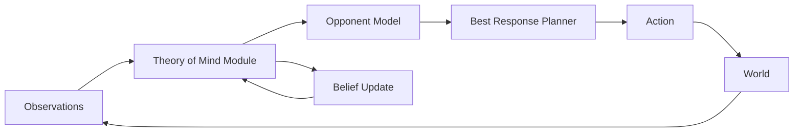

In multi-agent systems, an agent that treats the world as static will be outplayed by one that models its counterparts. Opponent modeling builds an internal representation of another agent's goals, beliefs, and likely actions. Theory of Mind extends this to recursive reasoning: rather than only predicting what an opponent will *do*, a ToM-capable agent reasons about what they *believe* to be true.

## Concept Introduction

**Opponent modeling** is the ability of an agent to build an internal representation of another agent's goals, beliefs, and likely behavior. In multi-agent settings, ignoring other agents and acting as if the world is static is almost always suboptimal. The most effective players, human or AI, exploit what they know about their counterparts.

**Theory of Mind (ToM)** goes a step further. In cognitive science, ToM is the capacity to attribute mental states (beliefs, desires, intentions) to others and use those attributed states to predict behavior. A child passes the "false belief test" around age 4: they understand that someone else can hold a belief that differs from reality. For agents, ToM means reasoning about what another agent *believes* to be true, not just what *is* true.

Formally, suppose agent $i$ interacts with agent $j$. Instead of observing $j$'s true policy $\pi_j$, agent $i$ must infer or approximate it from observations. Define:

- $\hat{\pi}_j^i$: agent $i$'s model of agent $j$'s policy
- $\tau_t = (s_0, a_0, \ldots, s_t)$: the joint trajectory up to time $t$
- The inference problem: update $\hat{\pi}_j^i$ given new observations

This inference can be Bayesian: maintain a posterior over $j$'s type $\theta_j$ (parameters of their policy), and compute:

$$P(\theta_j \mid \tau_t) \propto P(\tau_t \mid \theta_j) \cdot P(\theta_j)$$

With a learned model, agent $i$ then best-responds to the posterior-weighted policy:

$$\pi_i^*(a \mid s) = \arg\max_{\pi_i} \mathbb{E}_{\theta_j \sim P(\cdot \mid \tau_t)} \left[ V^{\pi_i, \hat{\pi}_j(\theta_j)}(s) \right]$$

## Historical & Theoretical Context

The idea of modeling other minds has ancient philosophical roots, but modern computational treatments began in the late 1980s and 1990s.

Recursive reasoning was formalized in Harsanyi's type spaces (1967–68) for Bayesian games, where agents have private types encoding their preferences and beliefs, including beliefs about others' beliefs. This led to the notion of **k-level thinking** (Nagel, 1995): a level-0 agent plays randomly, level-1 best-responds to level-0, level-2 best-responds to level-1, and so on.

In AI, early opponent modeling appeared in game-playing programs. Jonathan Schaeffer's checkers program *Chinook* (1994) used opponent statistics to adapt play. The poker community developed opponent classification systems throughout the 2000s, culminating in probabilistic modeling in programs like Polaris and eventually Libratus (2017).

The term "Theory of Mind" entered AI formally through the developmental psychology literature. Premack and Woodruff coined the phrase in 1978 studying chimpanzees. The false belief task (Wimmer & Perner, 1983) became the standard test. In AI, ToM benchmarks emerged as large language models grew sophisticated enough to warrant evaluation.

## Algorithms & Math

### K-Level Reasoning

K-level thinking provides a tractable approximation to full recursive reasoning:

```
procedure k_level_reasoning(game, k):
    if k == 0:
        return uniform_random_policy()

    opponent_model = k_level_reasoning(game, k - 1)
    return best_response(game, opponent_model)
```

In practice, empirical studies suggest most humans reason at level 1–2, and equilibrium play corresponds to $k \to \infty$.

### Bayesian Opponent Modeling

The agent maintains a type distribution over possible opponent policies:

$$\theta_j \in \{\text{aggressive}, \text{cooperative}, \text{random}, \ldots\}$$

At each step, it updates using the likelihood of observed actions:

$$P(\theta_j \mid a_j^{1:t}, s^{1:t}) \propto \prod_{\tau=1}^{t} \pi_j(a_j^\tau \mid s^\tau; \theta_j) \cdot P(\theta_j)$$

Then selects the best action given the current belief:

$$a_i^* = \arg\max_{a_i} \sum_{\theta_j} P(\theta_j \mid \tau_t) \cdot Q(s, a_i, \hat{\pi}_j(\theta_j))$$

### Neural ToM (NToM)

Tom Griffiths and colleagues proposed **Neural Theory of Mind** models where a neural network $f_\phi$ predicts another agent's next action from their observed history:

$$\hat{a}_j^{t+1} = f_\phi(\tau_j^{1:t}, s^{t+1})$$

The agent conditions its own policy on this prediction. The architecture often separates beliefs (what the opponent observes) from desires (their objective), mirroring the belief-desire-intention (BDI) architecture.

## Design Patterns & Architectures

Opponent modeling integrates into agents as a meta-reasoning layer sitting between perception and action selection:



**Model-as-Context**: the inferred opponent model becomes part of the agent's context or state. In LangGraph, this might be a dedicated memory node storing structured opponent profiles that are retrieved before each decision.

**Separate Inference and Decision**: decouple the opponent inference model (trained offline on human data or self-play) from the real-time decision policy. The inference model runs as a tool call; the policy conditions on its output.

**Hierarchical ToM**: maintain multiple levels, a fast heuristic model for within-game decisions and a slow Bayesian model updated across games for long-run adaptation.

## Practical Application

Here is a simple negotiation agent that uses opponent modeling to adapt its offers. It tracks the opponent's concession rate and infers their reservation price:

```python
from anthropic import Anthropic
from dataclasses import dataclass, field

@dataclass
class OpponentModel:
    offers: list[float] = field(default_factory=list)

    def update(self, offer: float):
        self.offers.append(offer)

    def concession_rate(self) -> float:
        if len(self.offers) < 2:
            return 0.0
        deltas = [self.offers[i] - self.offers[i-1] for i in range(1, len(self.offers))]
        return sum(deltas) / len(deltas)

    def estimated_reservation(self) -> float:
        """Extrapolate where concessions will stop."""
        if len(self.offers) < 2:
            return self.offers[-1] if self.offers else 50.0
        rate = self.concession_rate()
        if rate >= 0:  # not conceding
            return self.offers[-1]
        # geometric decay: assume rate halves each round
        remaining = self.offers[-1] + rate / (1 - 0.5)
        return max(0, remaining)


class NegotiationAgent:
    def __init__(self, my_reservation: float, my_aspiration: float):
        self.my_reservation = my_reservation
        self.my_aspiration = my_aspiration
        self.opponent_model = OpponentModel()
        self.client = Anthropic()
        self.my_offers: list[float] = []
        self.round = 0

    def observe_opponent(self, opponent_offer: float):
        self.opponent_model.update(opponent_offer)

    def make_offer(self) -> float:
        self.round += 1
        opp_reservation = self.opponent_model.estimated_reservation()
        opp_concession = self.opponent_model.concession_rate()

        # Build context for Claude
        context = f"""
You are a negotiation agent. Current state:
- My reservation price (minimum acceptable): {self.my_reservation}
- My aspiration (ideal outcome): {self.my_aspiration}
- My previous offers: {self.my_offers}
- Opponent's offers so far: {self.opponent_model.offers}
- Estimated opponent reservation price: {opp_reservation:.1f}
- Opponent concession rate per round: {opp_concession:.2f}

Round {self.round}. Based on this opponent model, propose a single numeric offer
that balances aggressiveness with closing probability.
Reply with ONLY a number.
"""
        response = self.client.messages.create(
            model="claude-sonnet-4-6",
            max_tokens=16,
            messages=[{"role": "user", "content": context}]
        )
        offer = float(response.content[0].text.strip())
        offer = max(self.my_reservation, min(self.my_aspiration, offer))
        self.my_offers.append(offer)
        return offer


# Simulate a negotiation
buyer = NegotiationAgent(my_reservation=60, my_aspiration=70)
seller_offers = [90, 85, 82, 80]  # Seller conceding slowly

for seller_offer in seller_offers:
    buyer.observe_opponent(seller_offer)
    my_offer = buyer.make_offer()
    print(f"Seller: {seller_offer:.1f} | Estimated seller floor: "
          f"{buyer.opponent_model.estimated_reservation():.1f} | My offer: {my_offer:.1f}")
```

## Latest Developments & Research

ToM in LLMs (2023–2025) has generated significant debate. Kosinski (2023) claimed GPT-4 shows "theory of mind capabilities," sparking controversy. Subsequent work (Ullman, 2023; Shapira et al., 2023) showed LLMs fail systematic variations of classic ToM tasks, suggesting pattern matching rather than genuine mental state reasoning. The field now distinguishes **behavioral ToM** (passing tests) from **mechanistic ToM** (actually representing beliefs).

**ToM-Bench** (2024) introduced a systematic benchmark covering eight ToM abilities across 6,000+ question-answer pairs, revealing that even frontier models lag behind humans on higher-order belief tasks.

Machine Social Intelligence (Zhu et al., 2024) proposed training LLM agents with explicit belief-state representations, improving performance on multi-step ToM tasks and negotiation benchmarks over pure prompting.

PASTA (Opponent Modeling via Planning and Self-Play, 2024) combined Monte Carlo Tree Search with neural opponent models, achieving superhuman performance in multi-player imperfect-information games beyond poker.

Open questions remain around non-stationary opponents (how quickly should you update your model?) and adversarial robustness (what happens when the opponent is actively deceiving you?). Scaling to many-agent settings, where modeling every opponent separately is intractable, remains a separate challenge.

## Cross-Disciplinary Insight

Opponent modeling is deeply connected to economics through the theory of **signaling games**. In signaling games (Spence, 1973), a sender with private information chooses a costly signal, and the receiver updates their belief about the sender's type. The sender models the receiver's inference process; the receiver models the sender's incentives.

In neuroscience, ToM maps to the temporoparietal junction (TPJ) and medial prefrontal cortex (mPFC), which activate when humans reason about others' mental states. Computational models of these regions suggest the brain runs fast, approximate simulations of other agents using generative models.

The connection to **Bayesian brain theory** is striking: just as the brain predicts sensory inputs to minimize surprise (active inference), it may predict other agents' actions to minimize social prediction error.

## Daily Challenge

**Build a Bluffing Detector**

Implement a simple poker-inspired scenario where one agent bluffs (bets high with a weak hand) at some rate $p$. Build an opponent model that:

1. Tracks bet sizes relative to hand strength (revealed at showdown)
2. Estimates the opponent's bluff frequency using a Beta-Binomial conjugate model:

$$p_\text{bluff} \sim \text{Beta}(\alpha + \text{bluffs}, \beta + \text{value bets})$$

3. Uses this estimate to decide whether to call or fold a large bet

**Extension**: What happens to your estimate when the opponent *knows* you're tracking them and deliberately plays mixed strategies? At what sample size does your estimate become reliable? Explore the exploration-exploitation tradeoff in opponent modeling.

## References & Further Reading

### Papers
- **"Level-k Thinking"** (Nagel, 1995): Foundational empirical paper on bounded rationality in games, *American Economic Review*
- **"Machine Theory of Mind"** (Rabinowitz et al., 2018, DeepMind): Neural network that infers agents' goals and beliefs from trajectories, *ICML 2018*
- **"Theory of Mind May Have Spontaneously Emerged in Large Language Models"** (Kosinski, 2023) and critiques by Ullman (2023): The central debate on LLM ToM
- **"ToM-Bench: Evaluating Theory of Mind in LLMs"** (Chen et al., 2024): Systematic benchmark paper
- **"Opponent Modeling in Deep Reinforcement Learning"** (He et al., 2016): Early DRL approach to opponent modeling

### Books & Surveys
- **"The Art of Strategy"** (Dixit & Nalebuff): Accessible game theory with opponent modeling examples
- **"Multi-Agent Systems"** (Shoham & Leyton-Brown): Chapter 6 covers epistemic reasoning and belief hierarchies

### Code & Repositories
- **OpenSpiel**: https://github.com/google-deepmind/open_spiel (DeepMind's framework for research in multi-agent games, includes opponent modeling baselines)
- **Neural ToM implementations**: https://github.com/markkho/pytoM (Python implementations of computational ToM models)
- **ToM-Bench evaluation**: https://github.com/zhchen18/ToM-Bench (official benchmark code)

