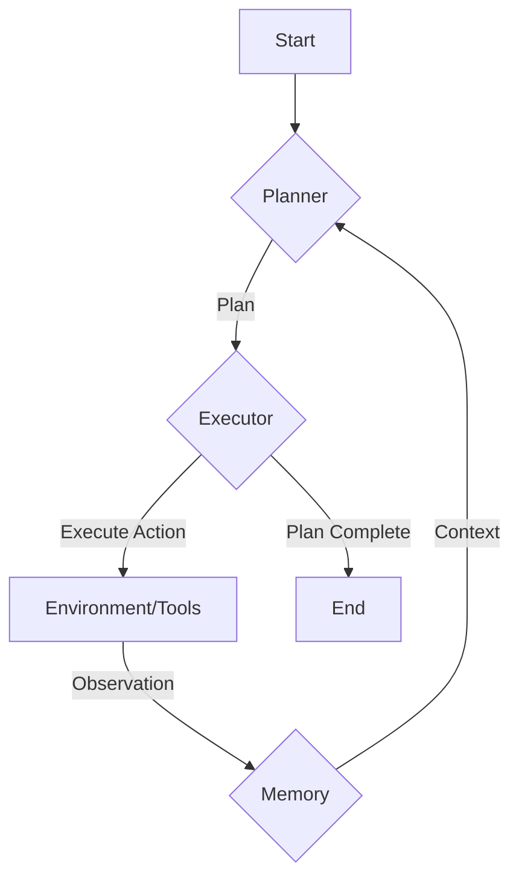

---
title: "The Cognitive Loop of AI Agents with Planner Executor and Memory"
date: 2025-10-02
draft: false
---

## 1. Concept Introduction

At its core, an AI agent needs to think, act, and remember. The **Planner-Executor-Memory** pattern is a cognitive loop that formalizes this process. It gives an agent a structured way to reason about a goal, execute a plan to achieve it, and learn from its experiences.

*   **For the Beginner:** Imagine you want to bake a cake. First, you **plan**: you find a recipe and list the steps (preheat oven, mix ingredients, etc.). Then, you **execute**: you perform each step one by one. As you go, you use your **memory**: you remember which steps you've completed, what ingredients you've used, and whether the batter looks right. If you make a mistake, you remember it for next time. This is the same loop an AI agent uses.

*   **For the Practitioner:** The Planner-Executor-Memory (PEM) model is an architectural pattern for autonomous agents that decouples high-level reasoning from low-level action. 
    *   The **Planner** is a reasoning engine (often an LLM) that takes a high-level objective and decomposes it into a sequence of concrete, executable steps.
    *   The **Executor** is the component that interacts with the environment by carrying out the steps defined by the planner. This could involve calling tools, APIs, or other functions.
    *   The **Memory** component stores the agent's state, past actions, observations from the environment, and learned knowledge. It provides context to the planner and a record for refinement.

## 2. Historical & Theoretical Context

The idea of separating planning from execution is a classic concept in AI, dating back to early robotics and automated planning systems like **STRIPS (Stanford Research Institute Problem Solver)** in the late 1960s. STRIPS represented the world in terms of states and defined actions by their preconditions and effects. A planner would search for a sequence of actions to get from an initial state to a goal state.

The modern PEM pattern adapts this for LLM-based agents. The "planner" is now often a powerful language model, and the "actions" are tool calls or API requests. The core principle remains the same: think before you act.

This pattern is deeply connected to the **symbolic reasoning** tradition in AI, which posits that intelligence arises from manipulating symbols and structures according to logical rules. The PEM loop is a modern, practical implementation of this idea.

## 3. Algorithms & Math

The core algorithm is a loop. Here is a simplified pseudocode representation:

```
pseudocode
function agent_loop(objective, memory):
  plan = planner.create_plan(objective, memory.get_context())

  while not plan.is_complete():
    step = plan.get_next_step()
    
    try:
      result = executor.execute(step.action, step.parameters)
      memory.add_observation(step, "success", result)
    except ExecutionError as e:
      memory.add_observation(step, "error", e)
      # Optional: Re-plan based on the error
      plan = planner.create_plan(objective, memory.get_context()) 

  return memory.get_final_result()
```

This loop continues until the plan is complete or a terminal condition is met. The key is the feedback mechanism: the outcome of each execution step is stored in memory, which informs the next planning cycle.

## 4. Design Patterns & Architectures

The PEM pattern is a high-level architecture that can be implemented in various ways. It naturally integrates with other design patterns:

*   **Event-Driven Architecture:** The Executor can publish events (e.g., `action_completed`, `action_failed`), and the Planner or a central orchestrator can subscribe to these events to trigger re-planning.
*   **Blackboard System:** The Memory can be implemented as a blackboard, a shared knowledge store where different components (Planner, Executor, and other specialized modules) can read and write information asynchronously.
*   **State Machine:** The agent's lifecycle (planning, executing, waiting, re-planning) can be modeled as a finite state machine, providing a robust way to manage its state.



## 5. Practical Application

Let's see a simple Python example using a hypothetical `llm` function for planning.

```python
import json

# Hypothetical LLM call for planning
def llm_planner(objective, history):
    prompt = f"Objective: {objective}. History: {history}. Create a JSON plan with the next tool to call."
    # In a real scenario, this would be a call to an LLM API.
    # For this example, we'll return a mock plan.
    if "search" not in str(history):
        return json.dumps([{"tool": "search", "query": "latest AI agent research"}])
    else:
        return json.dumps([{"tool": "summarize", "text": "..."}]) # Text from search result

# Executor knows how to call tools
class Executor:
    def search(self, query):
        print(f"EXECUTOR: Searching for '{query}'")
        return "Found a paper on self-correcting agents."

    def summarize(self, text):
        print(f"EXECUTOR: Summarizing text: '{text}'")
        return "The paper describes a new method for agents to refine their plans."

# Main loop
def run_agent(objective):
    memory = []
    executor = Executor()
    
    for _ in range(3): # Limit steps to prevent infinite loops
        plan_str = llm_planner(objective, memory)
        plan = json.loads(plan_str)

        if not plan:
            print("AGENT: Plan complete.")
            break

        step = plan[0]
        tool_name = step['tool']
        tool_params = {k: v for k, v in step.items() if k != 'tool'}
        
        if hasattr(executor, tool_name):
            result = getattr(executor, tool_name)(**tool_params)
            memory.append({'step': step, 'result': result})
        else:
            print(f"AGENT: Error - tool '{tool_name}' not found.")
            memory.append({'step': step, 'error': 'Tool not found'})
            break

run_agent("Research and summarize the latest in AI agents.")

```

In frameworks like **LangGraph**, this pattern is a first-class citizen. A graph is constructed where nodes represent the Planner and Executor, and edges represent the flow of information. The state of the graph at any point is the agent's memory.

## 6. Comparisons & Tradeoffs

**PEM vs. Simple Function Calling:**
*   **PEM:** More robust and stateful. It can handle multi-step tasks, recover from errors, and reflect on its progress.
*   **Simple Function Calling:** Stateless and best for single-shot tasks. It answers a query by calling a tool, but doesn't have a persistent plan.

**Strengths:**
*   **Modularity:** Separating planning, execution, and memory makes the system easier to build, debug, and extend.
*   **Robustness:** Can incorporate error handling and re-planning loops.
*   **Transparency:** The explicit plan provides a clear view into the agent's reasoning process.

**Limitations:**
*   **Latency:** The planning step adds overhead, which can make the agent slow for simple tasks.
*   **Brittle Plans:** A rigid plan might fail if the environment changes unexpectedly. This requires a sophisticated re-planning mechanism.
*   **Scalability:** Managing long-term memory and complex plans can be computationally expensive.

## 7. Latest Developments & Research

Recent research focuses on making each part of the PEM loop more powerful:

*   **Self-Correcting Planners:** Papers like "Self-Refine" (Madaan et al., 2023) explore how agents can critique and improve their own plans without external feedback. The planner essentially runs its own internal PEM loop to refine the plan before execution.
*   **Adaptive Executors:** Research is underway to build executors that can choose from a vast number of tools or even generate their own tools on the fly.
*   **Advanced Memory Structures:** Instead of a simple list of past actions, researchers are experimenting with vector databases for semantic memory, graph databases for relational memory, and hierarchical memory systems to manage short-term and long-term knowledge.

An open problem is **plan generalization**. How can an agent learn from a plan for one task to create better plans for a different, but related, task? This is an active area of research.

## 8. Cross-Disciplinary Insight

The PEM pattern mirrors the **OODA Loop (Observe, Orient, Decide, Act)**, a concept developed by military strategist John Boyd. 

*   **Observe:** The agent gets information from its environment (the Executor's output).
*   **Orient:** It updates its internal model of the world (Memory).
*   **Decide:** It formulates a plan (Planner).
*   **Act:** It interacts with the environment (Executor).

This shows that the core challenge of intelligent action—perceiving, thinking, and doing—is universal, appearing in fields from military strategy to cognitive science and AI.

## 9. Daily Challenge / Thought Exercise

Take the Python code from section 5. Modify it to handle a failed execution. 

1.  Add a new tool to the `Executor` called `write_to_file(filename, content)`.
2.  Modify the `llm_planner` to create a plan that first searches for information and then tries to write it to a file.
3.  Introduce a deliberate failure in the `write_to_file` function (e.g., raise an `IOError`).
4.  Update the main loop to catch the exception, record the failure in memory, and call the planner again. The planner should then see the error in the history and try a different filename, like `report-v2.txt`.

This exercise will give you a hands-on feel for building a simple re-planning loop.

## 10. References & Further Reading

*   **Paper:** [Self-Refine: Iterative Refinement with Self-Feedback](https://arxiv.org/abs/2303.17651)
*   **Blog Post:** [LLM Powered Autonomous Agents](https://lilianweng.github.io/posts/2023-06-23-agent/)
*   **Framework:** [LangGraph Documentation](https://langchain-ai.github.io/langgraph/) - See how they implement stateful, multi-step agent architectures.
*   **GitHub Repo:** [AutoGen](https://github.com/microsoft/autogen) - Explore how multiple agents with different roles (some planning, some executing) can collaborate.
