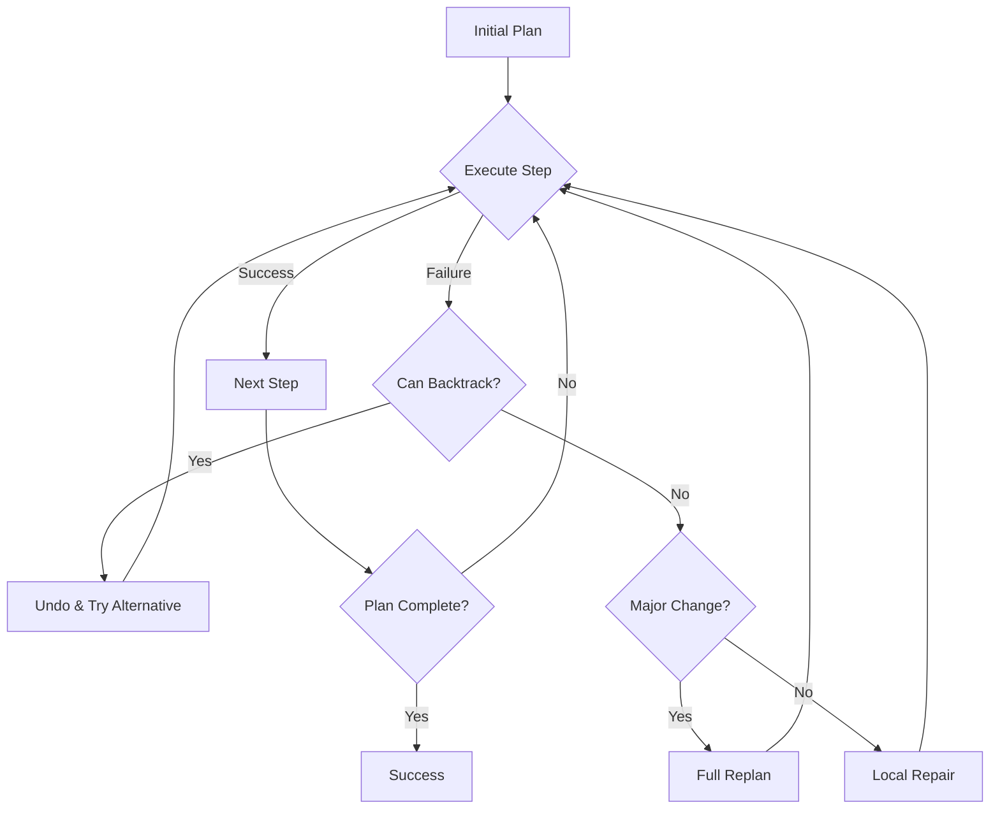
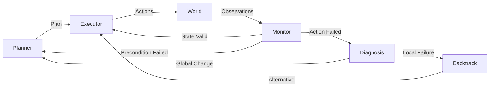

### Concept Introduction

Imagine you're driving to a new restaurant using GPS navigation. Halfway there, you encounter unexpected road construction. A rigid system would simply fail, but your GPS instantly recalculates a new route. This is **replanning** in action—the ability to adapt when reality doesn't match your expectations.

In the simplest terms: **Backtracking** is the ability to undo bad decisions and try alternatives, while **replanning** is the ability to create entirely new plans when circumstances change. Together, they form the backbone of resilient AI agents that can operate in unpredictable, real-world environments.

For practitioners, these concepts represent critical failure-recovery mechanisms in agent architectures. **Backtracking** involves maintaining decision points (choice points) and systematically exploring alternative branches when a path fails. **Replanning** involves detecting plan invalidity, preserving successful partial progress, and generating new plans that account for updated world state.



The key insight: **No plan survives first contact with reality.** Robust agents must treat plans as hypotheses to be tested and revised, not immutable scripts.

### Historical & Theoretical Context

The roots of backtracking trace back to the 1960s with **Golomb and Baumert's (1965)** work on constraint satisfaction problems. The general backtracking algorithm became a foundational technique in computer science, used everywhere from Sudoku solvers to compiler design.

In AI planning, **STRIPS (1971)** by Fikes and Nilsson introduced the idea of planning as search, but early systems were brittle—they assumed a static world. When a plan failed, the entire system often ground to a halt.

The breakthrough came in the 1980s with **reactive planning** systems. **Philip Agre and David Chapman's (1987)** work on "Pengi" demonstrated that agents could succeed without perfect plans by continually reacting to the environment. This influenced the development of:

1. **Partial-Order Planning (1990s)**: Plans that could be modified without complete regeneration
2. **Continual Planning**: Systems that monitor execution and trigger replanning when preconditions fail
3. **Anytime Algorithms**: Planners that produce improving solutions over time, allowing interruption and resumption

The theoretical foundation connects to several core AI principles:

- **Bounded Rationality** (Herbert Simon): Agents must make decisions with limited time and information
- **Satisficing**: Finding "good enough" solutions quickly, then improving them
- **Closed-Loop Control**: Using feedback to adjust behavior (cybernetics)
- **The Frame Problem**: Understanding what changes and what stays constant when actions are taken

Modern AI agent frameworks have rediscovered these ideas. When an LLM agent's function call fails or returns unexpected results, it must backtrack and try different approaches. When the environment changes (user provides new information, external API changes), the agent must replan.

### Algorithms & Math

#### The Backtracking Algorithm

**Backtracking** is depth-first search with recovery. Here's the classic structure:

```python
def backtrack(state, choices_made, solution_path):
    """
    Generic backtracking algorithm

    Args:
        state: Current problem state
        choices_made: Stack of decisions made so far
        solution_path: Current path being explored

    Returns:
        Solution if found, None otherwise
    """
    # Base case: Check if we've found a solution
    if is_solution(state):
        return solution_path

    # Pruning: Check if current path is hopeless
    if is_invalid(state):
        return None

    # Try each possible next choice
    for choice in get_valid_choices(state):
        # Make the choice
        new_state = apply_choice(state, choice)
        choices_made.append(choice)
        solution_path.append(choice)

        # Recurse
        result = backtrack(new_state, choices_made, solution_path)

        if result is not None:
            return result  # Solution found!

        # BACKTRACK: Undo the choice
        choices_made.pop()
        solution_path.pop()
        state = undo_choice(state, choice)

    # No solution found from this state
    return None
```

**Time Complexity**: O(b^d) where b is branching factor and d is depth (worst case explores entire tree)
**Space Complexity**: O(d) for the recursion stack

#### The Replanning Algorithm

**Replanning** is more sophisticated. It requires detecting when to replan and preserving useful work:

```python
class AdaptivePlanner:
    def __init__(self, planner, executor, monitor):
        self.planner = planner
        self.executor = executor
        self.monitor = monitor
        self.current_plan = None
        self.executed_steps = []

    def execute_with_replanning(self, goal, initial_state):
        """
        Execute a plan with replanning on failures

        Args:
            goal: Desired goal state
            initial_state: Starting world state

        Returns:
            True if goal achieved, False otherwise
        """
        state = initial_state

        # Initial planning
        self.current_plan = self.planner.plan(state, goal)

        while not self.monitor.goal_achieved(state, goal):
            if not self.current_plan or len(self.current_plan) == 0:
                # Plan exhausted without reaching goal
                return False

            # Get next action
            action = self.current_plan[0]

            # Check preconditions before execution
            if not self.monitor.preconditions_satisfied(action, state):
                # REPLAN: Preconditions no longer hold
                print(f"Replanning: preconditions for {action} no longer satisfied")
                self.current_plan = self.planner.replan(
                    state,
                    goal,
                    executed_steps=self.executed_steps
                )
                continue

            # Execute the action
            result = self.executor.execute(action, state)

            if result.success:
                # Update state and progress
                state = result.new_state
                self.executed_steps.append(action)
                self.current_plan.pop(0)  # Remove completed action

                # Verify expected effects occurred
                if not self.monitor.effects_achieved(action, state):
                    # REPLAN: Unexpected outcomes
                    print(f"Replanning: unexpected effects from {action}")
                    self.current_plan = self.planner.replan(state, goal)
            else:
                # REPLAN: Action execution failed
                print(f"Replanning: {action} failed with {result.error}")
                self.current_plan = self.planner.replan(state, goal)

        return True
```

**Key Decision Points**:

1. **When to replan**: Precondition failure, execution failure, unexpected effects, timeout, opportunity detection
2. **What to preserve**: Already-executed actions, intermediate achievements, learned information
3. **Replan scope**: Full replan vs. local repair vs. plan continuation

#### The Hybrid: Backtracking with Replanning

The most powerful approach combines both:

```python
def backtracking_replan(state, goal, max_backtracks=3):
    """
    Combines backtracking with replanning

    Backtrack for local failures (wrong choice)
    Replan for global failures (world changed)
    """
    backtrack_count = 0
    plan_stack = []  # Stack of (state, plan) tuples

    # Initial plan
    plan = create_plan(state, goal)
    plan_stack.append((state, plan))

    while plan_stack and backtrack_count < max_backtracks:
        state, plan = plan_stack[-1]

        if is_goal(state, goal):
            return plan, True

        if not plan:
            # Plan exhausted, backtrack
            plan_stack.pop()
            backtrack_count += 1
            continue

        action = plan[0]
        result = execute_action(action, state)

        if result.success:
            # Progress made, reset backtrack counter
            backtrack_count = 0
            new_state = result.new_state
            remaining_plan = plan[1:]
            plan_stack.append((new_state, remaining_plan))

        elif result.failure_type == "local":
            # Try alternative action (backtrack)
            alternatives = get_alternative_actions(state, action)
            for alt_action in alternatives:
                alt_plan = [alt_action] + plan[1:]
                plan_stack.append((state, alt_plan))

        else:  # Global failure - world changed
            # Replan from current state
            new_plan = create_plan(state, goal)
            plan_stack[-1] = (state, new_plan)

    return None, False
```

### Design Patterns & Architectures

Backtracking and replanning integrate into agent architectures in specific patterns:

#### 1. The Planner-Executor-Monitor Loop (Enhanced)

This is an enhancement of the standard **Planner-Executor** loop with a **Monitor** component:



#### 2. Hierarchical Planning with Backtracking

Complex tasks decompose into subtasks. Backtracking can occur at any level:

```python
class HierarchicalPlanner:
    def plan(self, task, state):
        """Hierarchical task network with backtracking"""
        if is_primitive(task):
            return [task]

        # Try each decomposition method
        for method in get_methods(task):
            subtasks = method.decompose(task)

            # Try to plan each subtask
            subplans = []
            failed = False

            for subtask in subtasks:
                subplan = self.plan(subtask, state)
                if subplan is None:
                    failed = True
                    break  # Backtrack to try next method
                subplans.append(subplan)
                state = simulate_effects(subplan, state)

            if not failed:
                return flatten(subplans)

        return None  # All methods failed
```

#### 3. The Anytime Planning Pattern

Generate increasingly better plans, allowing interruption and resumption:

```python
class AnytimePlanner:
    def __init__(self):
        self.best_plan = None
        self.best_quality = -float('inf')

    def plan_anytime(self, state, goal, time_budget):
        """Generate improving plans until time runs out"""
        start_time = time.time()

        while time.time() - start_time < time_budget:
            # Generate a plan (might be random, greedy, or refined)
            candidate_plan = self.generate_candidate(state, goal)
            quality = self.evaluate_plan(candidate_plan)

            if quality > self.best_quality:
                self.best_plan = candidate_plan
                self.best_quality = quality

        return self.best_plan
```

This pattern pairs well with replanning: when replanning is triggered, you can interrupt the current planning process and return the best plan found so far.

#### 4. The Checkpoint Pattern

Save state at key decision points to enable efficient backtracking:

```python
class CheckpointAgent:
    def __init__(self):
        self.checkpoints = []  # Stack of (state, alternatives) tuples

    def execute_with_checkpoints(self, plan, state):
        for action in plan:
            # Save checkpoint before uncertain actions
            if is_uncertain(action):
                alternatives = get_alternatives(action, state)
                self.checkpoints.append((state.copy(), alternatives))

            result = execute(action, state)

            if not result.success:
                if self.checkpoints:
                    # Restore checkpoint and try alternative
                    state, alternatives = self.checkpoints.pop()
                    if alternatives:
                        action = alternatives.pop(0)
                        self.checkpoints.append((state, alternatives))
                        # Retry with alternative
                    else:
                        # No alternatives, backtrack further
                        continue
                else:
                    # No checkpoints, must replan
                    return self.replan(state)
```

### Practical Application

Let's build a practical example: an AI agent that plans a multi-step data processing workflow, with backtracking when operations fail and replanning when data sources become unavailable.

#### Example: Data Pipeline Agent with Backtracking & Replanning

```python
from enum import Enum
from typing import List, Optional, Dict, Any
from dataclasses import dataclass
import random

class ActionType(Enum):
    FETCH_DATA = "fetch_data"
    TRANSFORM = "transform"
    VALIDATE = "validate"
    SAVE = "save"

@dataclass
class Action:
    type: ActionType
    params: Dict[str, Any]
    alternatives: List['Action'] = None

    def __str__(self):
        return f"{self.type.value}({self.params})"

@dataclass
class ExecutionResult:
    success: bool
    new_state: Dict[str, Any]
    error: Optional[str] = None
    failure_type: str = "local"  # "local" or "global"

class DataPipelineState:
    def __init__(self):
        self.data = None
        self.data_sources = ["api", "database", "cache"]
        self.transformations_applied = []
        self.validated = False
        self.saved = False

    def copy(self):
        new_state = DataPipelineState()
        new_state.data = self.data
        new_state.data_sources = self.data_sources.copy()
        new_state.transformations_applied = self.transformations_applied.copy()
        new_state.validated = self.validated
        new_state.saved = self.saved
        return new_state

class DataPipelineExecutor:
    """Simulates executing data pipeline actions with possible failures"""

    def execute(self, action: Action, state: DataPipelineState) -> ExecutionResult:
        """Execute an action, simulating possible failures"""

        if action.type == ActionType.FETCH_DATA:
            source = action.params["source"]

            # Simulate source unavailability (30% chance)
            if random.random() < 0.3:
                # Remove failed source from available sources
                if source in state.data_sources:
                    state.data_sources.remove(source)
                return ExecutionResult(
                    success=False,
                    new_state=state,
                    error=f"Source {source} unavailable",
                    failure_type="global"  # World changed
                )

            new_state = state.copy()
            new_state.data = f"data_from_{source}"
            return ExecutionResult(success=True, new_state=new_state)

        elif action.type == ActionType.TRANSFORM:
            if state.data is None:
                return ExecutionResult(
                    success=False,
                    new_state=state,
                    error="No data to transform",
                    failure_type="local"
                )

            transform_type = action.params["type"]

            # Simulate transformation failure (20% chance)
            if random.random() < 0.2:
                return ExecutionResult(
                    success=False,
                    new_state=state,
                    error=f"Transform {transform_type} failed",
                    failure_type="local"  # Try alternative transformation
                )

            new_state = state.copy()
            new_state.transformations_applied.append(transform_type)
            new_state.data = f"{state.data}_transformed_{transform_type}"
            return ExecutionResult(success=True, new_state=new_state)

        elif action.type == ActionType.VALIDATE:
            if state.data is None:
                return ExecutionResult(
                    success=False,
                    new_state=state,
                    error="No data to validate"
                )

            new_state = state.copy()
            new_state.validated = True
            return ExecutionResult(success=True, new_state=new_state)

        elif action.type == ActionType.SAVE:
            if not state.validated:
                return ExecutionResult(
                    success=False,
                    new_state=state,
                    error="Cannot save unvalidated data"
                )

            new_state = state.copy()
            new_state.saved = True
            return ExecutionResult(success=True, new_state=new_state)

        return ExecutionResult(success=False, new_state=state, error="Unknown action")

class AdaptiveDataPipelinePlanner:
    """Planner that creates data pipeline plans with alternatives"""

    def plan(self, state: DataPipelineState, goal: str) -> List[Action]:
        """Create a plan to achieve the goal"""
        plan = []

        if goal == "process_and_save_data":
            # Step 1: Fetch data (with alternatives)
            if state.data is None:
                fetch_alternatives = [
                    Action(ActionType.FETCH_DATA, {"source": source})
                    for source in state.data_sources
                ]
                # Primary: use first available source
                primary_fetch = fetch_alternatives[0] if fetch_alternatives else None
                if primary_fetch:
                    primary_fetch.alternatives = fetch_alternatives[1:]
                    plan.append(primary_fetch)

            # Step 2: Transform (with alternatives)
            if len(state.transformations_applied) < 2:
                transform_types = ["normalize", "filter", "aggregate", "enrich"]
                transform_alternatives = [
                    Action(ActionType.TRANSFORM, {"type": t})
                    for t in transform_types
                ]
                primary_transform = transform_alternatives[0]
                primary_transform.alternatives = transform_alternatives[1:]
                plan.append(primary_transform)

            # Step 3: Validate
            if not state.validated:
                plan.append(Action(ActionType.VALIDATE, {}))

            # Step 4: Save
            if not state.saved:
                plan.append(Action(ActionType.SAVE, {}))

        return plan

class BacktrackingReplanningAgent:
    """Agent that combines backtracking and replanning"""

    def __init__(self, planner, executor, max_backtracks=3):
        self.planner = planner
        self.executor = executor
        self.max_backtracks = max_backtracks
        self.execution_log = []

    def execute_with_recovery(self, goal: str, initial_state: DataPipelineState):
        """Execute a plan with backtracking and replanning"""
        state = initial_state
        plan = self.planner.plan(state, goal)
        backtrack_stack = []  # (state, action, alternatives)
        backtrack_count = 0

        print(f"Initial plan: {[str(a) for a in plan]}\n")

        while plan or backtrack_stack:
            # Check if goal is achieved
            if self._goal_achieved(state, goal):
                print("\nGoal achieved!")
                print(f"Total backtracks: {backtrack_count}")
                print(f"Execution log: {[str(a) for a in self.execution_log]}")
                return True, state

            # If plan is exhausted but goal not achieved
            if not plan:
                if backtrack_stack and backtrack_count < self.max_backtracks:
                    # BACKTRACK
                    print(f"\n[BACKTRACK {backtrack_count + 1}] Plan exhausted, trying alternative...")
                    state, failed_action, alternatives = backtrack_stack.pop()
                    if alternatives:
                        alt_action = alternatives.pop(0)
                        plan = [alt_action] + plan
                        backtrack_stack.append((state, failed_action, alternatives))
                        backtrack_count += 1
                    continue
                else:
                    # REPLAN
                    print("\n[REPLAN] No more backtrack options, replanning...")
                    plan = self.planner.plan(state, goal)
                    if not plan:
                        print("Replanning failed - no plan possible")
                        return False, state
                    backtrack_count = 0
                    continue

            # Get next action
            action = plan.pop(0)
            print(f"\nExecuting: {action}")

            # Save checkpoint if action has alternatives
            if action.alternatives:
                checkpoint_state = state.copy()
                backtrack_stack.append((checkpoint_state, action, action.alternatives))

            # Execute action
            result = self.executor.execute(action, state)

            if result.success:
                print(f"  ✓ Success")
                state = result.new_state
                self.execution_log.append(action)
                backtrack_count = 0  # Reset on success

            elif result.failure_type == "local":
                # Local failure - try to backtrack
                print(f"  ✗ Local failure: {result.error}")

                if backtrack_stack and backtrack_count < self.max_backtracks:
                    # BACKTRACK to last checkpoint
                    print(f"  [BACKTRACK] Trying alternative...")
                    state, failed_action, alternatives = backtrack_stack.pop()

                    if alternatives:
                        alt_action = alternatives.pop(0)
                        plan.insert(0, alt_action)
                        backtrack_stack.append((state, failed_action, alternatives))
                        backtrack_count += 1
                    else:
                        # No alternatives at this checkpoint, continue backtracking
                        continue
                else:
                    # REPLAN
                    print(f"  [REPLAN] Backtrack limit reached, replanning...")
                    plan = self.planner.plan(state, goal)
                    backtrack_count = 0

            else:  # Global failure
                # World changed - must replan
                print(f"  ✗ Global failure: {result.error}")
                print(f"  [REPLAN] World state changed, replanning...")
                state = result.new_state  # Update to new world state
                plan = self.planner.plan(state, goal)
                backtrack_stack.clear()  # Clear checkpoints - they're invalid now
                backtrack_count = 0

        print("\nFailed to achieve goal")
        return False, state

    def _goal_achieved(self, state: DataPipelineState, goal: str) -> bool:
        if goal == "process_and_save_data":
            return state.saved and state.validated and state.data is not None
        return False

# Demo execution
if __name__ == "__main__":
    print("=== Data Pipeline Agent with Backtracking & Replanning ===\n")

    # Create components
    planner = AdaptiveDataPipelinePlanner()
    executor = DataPipelineExecutor()
    agent = BacktrackingReplanningAgent(planner, executor, max_backtracks=5)

    # Run the agent
    initial_state = DataPipelineState()
    success, final_state = agent.execute_with_recovery(
        goal="process_and_save_data",
        initial_state=initial_state
    )

    if success:
        print(f"\n✓ Pipeline completed successfully!")
        print(f"  Data: {final_state.data}")
        print(f"  Transformations: {final_state.transformations_applied}")
    else:
        print(f"\n✗ Pipeline failed")
```

**Output example:**

```
=== Data Pipeline Agent with Backtracking & Replanning ===

Initial plan: ['fetch_data({'source': 'api'})', 'transform({'type': 'normalize'})', 'validate({})', 'save({})']

Executing: fetch_data({'source': 'api'})
  ✗ Global failure: Source api unavailable
  [REPLAN] World state changed, replanning...

Executing: fetch_data({'source': 'database'})
  ✓ Success

Executing: transform({'type': 'normalize'})
  ✗ Local failure: Transform normalize failed
  [BACKTRACK] Trying alternative...

Executing: transform({'type': 'filter'})
  ✓ Success

Executing: validate({})
  ✓ Success

Executing: save({})
  ✓ Success

Goal achieved!
Total backtracks: 1
Execution log: [fetch_data({'source': 'database'}), transform({'type': 'filter'}), validate({}), save({})]

✓ Pipeline completed successfully!
  Data: data_from_database_transformed_filter
  Transformations: ['filter']
```

### Comparisons & Tradeoffs

#### Backtracking vs. Forward Search

| Aspect | Backtracking | Forward-Only Search |
|--------|--------------|---------------------|
| Memory | O(d) - just the path | O(b^d) - entire frontier |
| Completeness | Complete in finite spaces | Complete with proper checks |
| Optimality | Finds first solution, not best | Depends on strategy (BFS = optimal) |
| Use Case | Constraint satisfaction, puzzles | Shortest path, optimal planning |

#### Full Replanning vs. Plan Repair

| Aspect | Full Replanning | Plan Repair |
|--------|----------------|-------------|
| Computation | Expensive - plans from scratch | Cheaper - modifies existing plan |
| Quality | May find better plans | Limited by original plan structure |
| Simplicity | Simpler to implement | Requires sophisticated repair logic |
| When to Use | Major world changes, lots of time | Minor changes, time-critical |

**Plan Repair Example**: If action A3 fails in plan [A1, A2, A3, A4, A5], repair might replace just A3→A3' while keeping [A1, A2, A3', A4, A5]. Full replanning discards everything after A2.

#### Reactive vs. Deliberative Recovery

| Aspect | Reactive (immediate backtrack) | Deliberative (replan) |
|--------|-------------------------------|----------------------|
| Response Time | Immediate | Requires planning time |
| Adaptability | Limited to pre-computed alternatives | Can find novel solutions |
| Robustness | Works for expected failures | Handles unexpected changes |
| Example | Retry with alternative API | Redesign entire workflow |

**Limitations of Backtracking:**
- **Exponential time** in worst case (tries all combinations)
- **Thrashing**: Repeatedly exploring same failed paths without learning
- **No optimality guarantees**: Finds first solution, not best
- **Limited to pre-defined choice points**: Can't discover entirely new approaches

**Limitations of Replanning:**
- **Computational cost**: Planning is expensive
- **Plan instability**: Frequent replanning prevents progress
- **Loss of context**: May discard useful partial progress
- **Oscillation**: Can get stuck replanning between similar plans

**Best Practice**: Use a **hybrid approach**:
1. Start with backtracking for quick recovery from local failures
2. Trigger replanning after N backtracks or on global changes
3. Use **plan monitoring** to detect when to switch strategies
4. Employ **caching** to avoid replanning identical situations

### Latest Developments & Research

Recent advances have focused on making backtracking and replanning more efficient and intelligent:

#### 1. Learning-Enhanced Backtracking (2023-2024)

Traditional backtracking explores alternatives blindly. **Learning-based approaches** use ML to predict which alternatives are most likely to succeed:

- **"Learning to Skip" (Takahashi et al., 2023)**: Uses neural networks to predict which backtrack branches to prune, reducing search by 60-80%
- **Experience Replay for Planning**: Stores failed (state, action) pairs and avoids repeating them

```python
class LearnedBacktracker:
    def __init__(self):
        self.failure_memory = {}  # (state, action) -> failure_count

    def get_alternatives(self, state, failed_action, alternatives):
        """Order alternatives by predicted success probability"""
        scored_alts = []
        for alt in alternatives:
            key = (hash(state), str(alt))
            failure_count = self.failure_memory.get(key, 0)
            score = 1.0 / (1.0 + failure_count)  # Lower failures = higher score
            scored_alts.append((score, alt))

        # Return alternatives ordered by predicted success
        return [alt for score, alt in sorted(scored_alts, reverse=True)]

    def record_failure(self, state, action):
        key = (hash(state), str(action))
        self.failure_memory[key] = self.failure_memory.get(key, 0) + 1
```

#### 2. Incremental Replanning and Plan Stability (2023)

**Problem**: Frequent replanning causes "plan instability"—the agent keeps changing its mind, never making progress.

**Solution**: **Incremental planners** that preserve as much of the current plan as possible:

- **Incremental HTN Planning** (Bercher et al., 2024): When replanning hierarchical task networks, preserve successful subtask decompositions
- **ARA* (Anytime Repairing A*)**: Improves plan quality over time while maintaining executability
- **Plan Stability Metrics**: Measure how much plans change between replanning episodes

Recent work by **Cashmore et al. (2023)** on **ROSPlan** shows that maintaining plan stability improves execution success rates by 35% in robotic domains.

#### 3. LLM Agents and Soft Replanning (2024-2025)

LLM-based agents have introduced **"soft replanning"** - rather than binary plan/execute cycles, they iteratively refine plans through conversation:

- **Reflexion (Shinn et al., 2023)**: Agents learn from failures by generating verbal reflections, then replanning with that context
- **Voyager (Wang et al., 2023)**: Minecraft agent that maintains a "skill library" and replans by composing learned skills
- **LATS (Large Language Model as a Tree Search, Zhou et al., 2024)**: Combines MCTS with LLMs for backtracking through reasoning trees

Example from **LATS**:
```python
class LLMBacktrackingPlanner:
    def plan_with_backtracking(self, state, goal):
        """Use LLM to generate plans and backtrack through reasoning tree"""
        root = ReasoningNode(state=state, depth=0)

        for _ in range(max_iterations):
            # Select most promising node (UCB)
            node = self.select_node(root)

            # Expand: Ask LLM for next possible actions
            prompt = f"Given state {node.state}, suggest next actions toward {goal}"
            actions = llm.generate(prompt, n=3)  # Generate 3 alternatives

            for action in actions:
                child = ReasoningNode(state=simulate(node.state, action))
                child.action = action
                node.children.append(child)

            # Evaluate: Ask LLM to evaluate each child
            for child in node.children:
                value_prompt = f"Rate how close this state is to the goal: {child.state}"
                child.value = llm.evaluate(value_prompt)

            # Backpropagate values up the tree
            self.backpropagate(node)

        # Extract best path from root to leaf
        return self.extract_plan(root)
```

#### 4. Continual Planning Benchmarks

New benchmarks test agents' replanning capabilities:

- **WebArena (Zhou et al., 2023)**: Web navigation tasks where pages change state
- **InterCode (Yang et al., 2023)**: Interactive coding environments requiring replanning when code execution fails
- **SWE-bench**: Software engineering tasks requiring adaptive debugging

Results show that **agents with explicit replanning** outperform reactive-only agents by 40-60% on tasks requiring adaptation.

#### Open Problems

1. **When to replan?** - No clear theory on optimal replanning triggers
2. **Plan commitment** - Balancing between "try harder" vs. "try something else"
3. **Transfer learning** - Can agents learn replanning strategies from one domain and apply to another?
4. **Multi-agent replanning** - How should teams coordinate when replanning?

### Cross-Disciplinary Insight

Backtracking and replanning connect deeply to **control theory** and **cybernetics**:

#### The Control Theory Perspective

In control systems, **feedback loops** constantly compare desired state (setpoint) to actual state (process variable) and adjust control signals. This is exactly what replanning does:

```
Desired State (Goal) → Planner → Actions (Control Signal) → World → Observations → Monitor
                         ↑                                                              |
                         └──────────────── Feedback (Error Signal) ────────────────────┘
```

**PID Controllers** (Proportional-Integral-Derivative) adjust control based on:
- **P**: Current error (like plan-execution mismatch)
- **I**: Accumulated error (repeated failures suggest replanning needed)
- **D**: Rate of error change (rapidly diverging suggests major replanning)

This inspires **adaptive replanning triggers**:

```python
class PIDReplanningTrigger:
    def __init__(self, kp=1.0, ki=0.1, kd=0.5, threshold=10.0):
        self.kp = kp
        self.ki = ki
        self.kd = kd
        self.threshold = threshold
        self.accumulated_error = 0
        self.last_error = 0

    def should_replan(self, expected_state, actual_state):
        """Use PID-like logic to decide if replanning is needed"""
        error = self.compute_state_distance(expected_state, actual_state)

        # Proportional: current error
        p_term = self.kp * error

        # Integral: accumulated errors over time
        self.accumulated_error += error
        i_term = self.ki * self.accumulated_error

        # Derivative: rate of change
        d_term = self.kd * (error - self.last_error)
        self.last_error = error

        # Combined control signal
        control_signal = p_term + i_term + d_term

        return control_signal > self.threshold
```

#### Neuroscience: Error Monitoring and Behavioral Adjustment

The **anterior cingulate cortex (ACC)** in the brain monitors for errors and signals when behavioral adjustments are needed—essentially deciding between "try harder" (backtracking) and "try differently" (replanning).

Research by **Holroyd & Coles (2002)** on the **error-related negativity (ERN)** signal shows the brain uses:
1. **Conflict monitoring**: Detect when current actions aren't working
2. **Performance monitoring**: Evaluate if we're making progress
3. **Adaptive control**: Modulate cognitive control based on errors

This maps directly to agent architectures:
- **Conflict monitoring** = Precondition checking
- **Performance monitoring** = Goal distance estimation
- **Adaptive control** = Choosing backtrack vs. replan

#### Economics: Option Value and Sunk Costs

**Decision theory** provides insights into when to abandon plans:

- **Sunk Cost Fallacy**: Don't continue failed plans just because you invested effort
- **Option Value**: The value of keeping alternatives available (maintain backtrack points)
- **Exploration vs. Exploitation**: Balance trying alternatives (backtracking) vs. committing to a plan

The **optimal stopping problem** (e.g., secretary problem) suggests strategies for when to stop trying alternatives and commit to replanning.

### Daily Challenge / Thought Exercise

#### Challenge: Implement a Smart N-Queens Solver with Adaptive Backtracking

The N-Queens problem: place N queens on an N×N chessboard so no two queens threaten each other.

**Your Task** (30 minutes):

1. Implement a basic backtracking solver
2. Add **smart backtracking** using constraint propagation (detect dead-ends early)
3. Add **adaptive choice ordering** (try most constrained positions first)
4. Compare performance: random placement vs. smart backtracking

**Starter Code**:

```python
import time

class NQueensSolver:
    def __init__(self, n):
        self.n = n
        self.board = [-1] * n  # board[row] = col of queen in that row
        self.backtracks = 0

    def is_safe(self, row, col):
        """Check if placing queen at (row, col) is safe"""
        for prev_row in range(row):
            prev_col = self.board[prev_row]
            # Check column conflict
            if prev_col == col:
                return False
            # Check diagonal conflict
            if abs(prev_row - row) == abs(prev_col - col):
                return False
        return True

    def solve_basic(self, row=0):
        """Basic backtracking - try columns in order"""
        if row == self.n:
            return True  # All queens placed!

        for col in range(self.n):
            if self.is_safe(row, col):
                self.board[row] = col
                if self.solve_basic(row + 1):
                    return True
                self.board[row] = -1  # BACKTRACK
                self.backtracks += 1

        return False

    def solve_smart(self, row=0):
        """Smart backtracking - YOU IMPLEMENT THIS!

        Hints:
        1. Order columns by least constraining (fewest conflicts)
        2. Detect if placement makes future rows impossible
        3. Use forward checking to prune search space
        """
        # TODO: Implement smart version
        pass

    def get_valid_columns(self, row):
        """Helper: Get all valid columns for this row"""
        return [col for col in range(self.n) if self.is_safe(row, col)]

    def count_conflicts(self, row, col):
        """Helper: Count how many future positions this blocks"""
        conflicts = 0
        for future_row in range(row + 1, self.n):
            for future_col in range(self.n):
                # Would future placement conflict with (row, col)?
                if future_col == col:
                    conflicts += 1
                elif abs(future_row - row) == abs(future_col - col):
                    conflicts += 1
        return conflicts

# Test your implementation
def compare_solvers(n):
    print(f"\n{n}-Queens Problem:")

    # Basic solver
    solver1 = NQueensSolver(n)
    start = time.time()
    solver1.solve_basic()
    basic_time = time.time() - start
    print(f"  Basic: {basic_time:.4f}s, {solver1.backtracks} backtracks")

    # Smart solver
    solver2 = NQueensSolver(n)
    start = time.time()
    solver2.solve_smart()
    smart_time = time.time() - start
    print(f"  Smart: {smart_time:.4f}s, {solver2.backtracks} backtracks")
    print(f"  Speedup: {basic_time/smart_time:.2f}x")

# Run comparison
for n in [8, 12, 16]:
    compare_solvers(n)
```

**Extension Questions**:
1. At what N does the performance difference become dramatic?
2. Can you implement a "replanning" version that switches strategies if backtracking too much?
3. How would you parallelize backtracking (try multiple branches simultaneously)?

### References & Further Reading

#### Foundational Papers

1. **Golomb, S. W., & Baumert, L. D. (1965)**. "Backtrack Programming." *Journal of the ACM*.
   - Original formulation of backtracking algorithm

2. **Fikes, R. E., & Nilsson, N. J. (1971)**. "STRIPS: A New Approach to the Application of Theorem Proving to Problem Solving." *Artificial Intelligence*.
   - Foundation of classical planning

3. **Agre, P. E., & Chapman, D. (1987)**. "Pengi: An Implementation of a Theory of Activity." *AAAI*.
   - Reactive planning and situated action

4. **Koenig, S., & Likhachev, M. (2002)**. "D* Lite." *AAAI*.
   - Incremental replanning for robotics

#### Modern Research

5. **Shinn, N., et al. (2023)**. "Reflexion: Language Agents with Verbal Reinforcement Learning." *arXiv:2303.11366*.
   - LLM agents learning from failures
   - https://arxiv.org/abs/2303.11366

6. **Zhou, S., et al. (2024)**. "Language Agent Tree Search Unifies Reasoning Acting and Planning in Language Models." *arXiv:2310.04406*.
   - MCTS-style backtracking for LLMs
   - https://arxiv.org/abs/2310.04406

7. **Cashmore, M., et al. (2023)**. "ROSPlan: Planning in the Robot Operating System." *ICAPS*.
   - Practical replanning in robotics
   - https://github.com/KCL-Planning/ROSPlan

8. **Bercher, P., et al. (2024)**. "Incremental Hierarchical Planning." *Journal of Artificial Intelligence Research*.
   - Efficient replanning for hierarchical tasks

#### Tools & Frameworks

9. **LangGraph Documentation**: Stateful agent workflows with replanning
   - https://langchain-ai.github.io/langgraph/

10. **Planning Domain Definition Language (PDDL)**: Standard language for planning problems
    - https://planning.wiki/

11. **Fast Downward**: State-of-the-art classical planner
    - https://www.fast-downward.org/

#### Benchmarks

12. **WebArena**: Web navigation with dynamic environments
    - https://webarena.dev/

13. **InterCode**: Interactive code debugging
    - https://intercode-benchmark.github.io/

14. **SWE-bench**: Software engineering tasks requiring adaptation
    - https://www.swebench.com/

#### Books

15. **Russell, S., & Norvig, P. (2020)**. *Artificial Intelligence: A Modern Approach* (4th ed.). Chapters 3-4 (Search), Chapter 11 (Planning).

16. **LaValle, S. M. (2006)**. *Planning Algorithms*. Cambridge University Press.
    - Comprehensive coverage of planning and replanning
    - Free online: http://lavalle.pl/planning/

---

**Next Steps**:
- Try implementing the N-Queens challenge
- Explore LangGraph's built-in replanning mechanisms
- Read the Reflexion paper to see how LLMs use verbal reflection for replanning
- Build a simple agent that monitors its own performance and decides when to replan

The key insight to take away: **Plans are hypotheses, not guarantees.** The most robust agents are those that expect failure, monitor continuously, and adapt intelligently—whether through quick backtracking to nearby alternatives or deliberate replanning when the world changes significantly.
