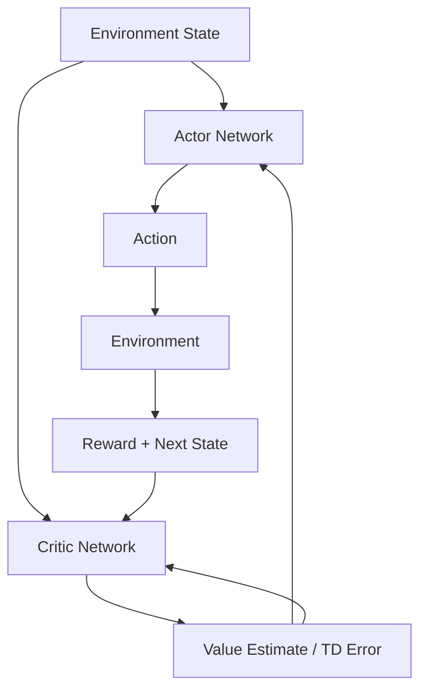

## 1. Concept Introduction

### Simple Explanation

Imagine teaching a robot to play basketball. You could tell it *exactly* what to do in each situation (a rule-based approach), or you could let it try different shots and reinforce the ones that work. **Policy gradient methods** are like being a basketball coach who watches the robot play, then adjusts its "intuition" about which shots to take based on what scored points.

An **Actor-Critic architecture** is like having two coaches: one (the Actor) decides what action to take, and another (the Critic) evaluates whether that was a good decision. They learn together, making the training faster and more stable.

### Technical Detail

In reinforcement learning, a **policy** π(a|s) is a probability distribution over actions *a* given state *s*. Traditional value-based methods (like Q-learning) learn the value of states or state-action pairs, then derive a policy from those values. **Policy gradient methods** directly optimize the policy parameters θ by following the gradient of expected reward.

**Actor-Critic** combines policy gradients (actor) with value function approximation (critic). The actor proposes actions based on the current policy π_θ, while the critic estimates the value function V(s) or advantage function A(s,a) to provide feedback. This reduces variance in policy gradient estimates while maintaining the benefits of direct policy optimization.

## 2. Historical & Theoretical Context

### Origins

- **1992**: Ronald Williams introduced **REINFORCE**, the foundational policy gradient algorithm, proving that you can compute gradients of expected reward with respect to policy parameters using the log-likelihood trick.
- **1999-2000**: Sutton et al. developed **Actor-Critic methods**, combining the best of policy gradients and value-based learning.
- **2015**: The deep learning revolution brought **Deep Deterministic Policy Gradient (DDPG)** and **Trust Region Policy Optimization (TRPO)**.
- **2017**: OpenAI's **Proximal Policy Optimization (PPO)** became the de facto standard, powering systems like ChatGPT's RLHF training.

### Why It Matters

Value-based methods (Q-learning, DQN) struggle with:
- **Continuous action spaces** (infinitely many actions to evaluate)
- **Stochastic policies** (sometimes randomness is optimal)
- **Large action spaces** (combinatorial explosion)

Policy gradients solve these by directly parameterizing the policy, making them essential for robotics, game AI, and language model fine-tuning.

## 3. Algorithms & Mathematics

### The Policy Gradient Theorem

The goal is to maximize expected cumulative reward:

```
J(θ) = E_τ~π_θ [R(τ)]
```

Where τ is a trajectory (sequence of states and actions), and R(τ) is the total reward.

The **policy gradient theorem** states:

```
∇_θ J(θ) = E_τ~π_θ [∑_t ∇_θ log π_θ(a_t|s_t) · G_t]
```

Where G_t is the return (cumulative reward) from time t onward.

**Intuition**: Increase probability of actions that led to high rewards, decrease probability of actions that led to low rewards.

### REINFORCE Algorithm (Vanilla Policy Gradient)

```python
# Pseudocode
for episode in episodes:
    τ = generate_trajectory(π_θ)  # Run policy to collect data

    for t in range(T):
        G_t = sum of rewards from t to end
        ∇J ≈ ∇_θ log π_θ(a_t|s_t) · G_t
        θ = θ + α · ∇J  # Gradient ascent
```

**Problem**: High variance because G_t includes random future rewards.

### Actor-Critic: Reducing Variance

Instead of using full return G_t, use a **baseline** (typically the value function):

```
Advantage: A(s_t, a_t) = Q(s_t, a_t) - V(s_t)
           ≈ r_t + γV(s_{t+1}) - V(s_t)  (TD error)
```

**Algorithm**:
```python
for episode in episodes:
    s = initial_state

    while not done:
        a = actor.select_action(s)  # Policy π_θ
        s', r, done = env.step(a)

        # Critic update (TD learning)
        td_error = r + γ·V_w(s') - V_w(s)
        w = w + α_critic · td_error · ∇_w V_w(s)

        # Actor update (policy gradient)
        θ = θ + α_actor · td_error · ∇_θ log π_θ(a|s)

        s = s'
```

## 4. Design Patterns & Architectures

### Integration with Agent Systems



### Common Architectural Patterns

1. **Shared Representations**: Actor and critic share early layers (common in vision tasks)
2. **Separate Networks**: Independent actor and critic (more stable, slower)
3. **Distributed Learning**: Multiple actors collect data, central critic updates (A3C, IMPALA)

### Connections to Agent Frameworks

- **LangGraph**: Could use actor-critic for learning routing policies in multi-agent workflows
- **AutoGen**: Fine-tune conversation agents using PPO (like ChatGPT)
- **Robotics Controllers**: Actor outputs motor commands, critic evaluates trajectory quality

## 5. Practical Application

### Minimal Actor-Critic in Python

```python
import torch
import torch.nn as nn
import torch.optim as optim
import numpy as np

class Actor(nn.Module):
    def __init__(self, state_dim, action_dim):
        super().__init__()
        self.net = nn.Sequential(
            nn.Linear(state_dim, 128),
            nn.ReLU(),
            nn.Linear(128, action_dim),
            nn.Softmax(dim=-1)
        )

    def forward(self, state):
        return self.net(state)

class Critic(nn.Module):
    def __init__(self, state_dim):
        super().__init__()
        self.net = nn.Sequential(
            nn.Linear(state_dim, 128),
            nn.ReLU(),
            nn.Linear(128, 1)
        )

    def forward(self, state):
        return self.net(state)

class A2CAgent:
    def __init__(self, state_dim, action_dim, lr=1e-3, gamma=0.99):
        self.actor = Actor(state_dim, action_dim)
        self.critic = Critic(state_dim)
        self.actor_optimizer = optim.Adam(self.actor.parameters(), lr=lr)
        self.critic_optimizer = optim.Adam(self.critic.parameters(), lr=lr)
        self.gamma = gamma

    def select_action(self, state):
        state = torch.FloatTensor(state)
        probs = self.actor(state)
        action = torch.multinomial(probs, 1).item()
        return action, probs[action]

    def update(self, state, action, reward, next_state, done):
        state = torch.FloatTensor(state)
        next_state = torch.FloatTensor(next_state)

        # Compute TD error
        value = self.critic(state)
        next_value = 0 if done else self.critic(next_state).detach()
        td_target = reward + self.gamma * next_value
        td_error = td_target - value

        # Update critic (minimize value loss)
        critic_loss = td_error.pow(2)
        self.critic_optimizer.zero_grad()
        critic_loss.backward()
        self.critic_optimizer.step()

        # Update actor (maximize log_prob * advantage)
        probs = self.actor(state)
        log_prob = torch.log(probs[action])
        actor_loss = -log_prob * td_error.detach()  # Detach to not backprop through critic
        self.actor_optimizer.zero_grad()
        actor_loss.backward()
        self.actor_optimizer.step()

# Usage example
# env = gym.make('CartPole-v1')
# agent = A2CAgent(state_dim=4, action_dim=2)
#
# for episode in range(1000):
#     state = env.reset()
#     done = False
#
#     while not done:
#         action, _ = agent.select_action(state)
#         next_state, reward, done, _ = env.step(action)
#         agent.update(state, action, reward, next_state, done)
#         state = next_state
```

### Using in a Tool-Using Agent

```python
# Example: Learning to select tools optimally
class ToolSelectionAgent(A2CAgent):
    def __init__(self, num_tools):
        super().__init__(
            state_dim=512,  # Embedding of current task
            action_dim=num_tools
        )

    def choose_tool(self, task_embedding):
        """Learn which tool to use for a given task"""
        tool_idx, prob = self.select_action(task_embedding)
        return TOOLS[tool_idx], prob

    def learn_from_outcome(self, task, tool_used, success):
        reward = 1.0 if success else -0.1
        next_task = get_next_task()  # Or terminal state
        self.update(task, tool_used, reward, next_task, done=success)
```

## 6. Comparisons & Tradeoffs

| Method | Pros | Cons | Best For |
|--------|------|------|----------|
| **Value-Based (DQN)** | Sample efficient, stable | Discrete actions only | Atari games, discrete choices |
| **Vanilla Policy Gradient** | Works with continuous actions | High variance, slow | Simple problems, baselines |
| **Actor-Critic (A2C)** | Lower variance than PG | More complex, two networks | Most RL problems |
| **PPO** | Very stable, industry standard | Computationally expensive | Production systems, LLM fine-tuning |
| **DDPG** | Continuous actions, deterministic | Sensitive to hyperparameters | Robotics, control |

### Limitations

- **Sample efficiency**: Still needs many environment interactions
- **Credit assignment**: Hard to know which past actions caused current reward
- **Exploration**: Can get stuck in local optima
- **Catastrophic forgetting**: Can unlearn good behaviors

### Scalability

- **A3C/IMPALA**: Distribute data collection across workers
- **PPO**: Batch updates for GPU efficiency
- **Model-based extensions**: Learn environment model to reduce samples

## 7. Latest Developments & Research

### Recent Breakthroughs (2022-2025)

1. **RLHF for LLMs** (2022-2023)
   - ChatGPT, Claude, GPT-4 use PPO to align with human preferences
   - Paper: "Training language models to follow instructions with human feedback" (OpenAI, 2022)

2. **Direct Preference Optimization (DPO)** (2023)
   - Bypasses actor-critic entirely for LLM alignment
   - Simpler than PPO, comparable results
   - Paper: Rafailov et al., "Direct Preference Optimization"

3. **Offline RL + Actor-Critic** (2023-2024)
   - Learn from static datasets (no environment interaction)
   - Conservative Q-Learning (CQL), Implicit Q-Learning (IQL)

4. **Multi-Agent PPO** (2024)
   - Coordinate multiple agents in shared environments
   - Applications: Autonomous vehicle fleets, multiplayer games

### Open Problems

- **Reward specification**: How to define "good" in complex domains?
- **Sample efficiency**: Can we learn with 10x fewer samples?
- **Generalization**: Transfer learned policies to new tasks
- **Safety**: Ensure agents don't take catastrophic actions during training

### Benchmarks

- **MuJoCo**: Continuous control (humanoid walking, manipulation)
- **Atari**: Classic game benchmark
- **OpenAI Gym**: Standardized RL environments
- **IsaacGym**: GPU-accelerated physics simulation (10,000s parallel envs)

## 8. Cross-Disciplinary Insight

### Neuroscience Parallel

The **actor-critic** architecture mirrors the brain's dopaminergic system:

- **Actor (Basal Ganglia)**: Selects actions based on learned patterns
- **Critic (Ventral Tegmental Area)**: Produces dopamine signals encoding **reward prediction error** (TD error!)

When reward exceeds expectation → dopamine spike → strengthen that action pathway. This biological plausibility makes actor-critic particularly elegant.

### Economic Theory

Policy gradients relate to **mechanism design**:
- Actor = strategic agent
- Critic = market evaluator
- Training = equilibrium seeking

The REINFORCE theorem is analogous to the **likelihood ratio method** in econometrics for estimating policy effects.

### Control Theory

Actor-Critic is a form of **adaptive control**:
- Critic learns a **Lyapunov function** (stability measure)
- Actor improves control policy to minimize Lyapunov function
- Converges to stable controllers under certain conditions

## 9. Daily Challenge

### Thought Exercise (15 minutes)

Consider a **customer service chatbot** that needs to learn when to:
1. Answer directly
2. Ask clarifying questions
3. Escalate to human

**Questions**:
1. How would you define the state space? (User message embedding? Conversation history?)
2. What should the reward signal be? (User satisfaction? Resolution time?)
3. Would you use discrete actions (3 choices) or continuous (confidence scores)?
4. What could go wrong if the critic is poorly calibrated?

### Coding Exercise (30 minutes)

Extend the `A2CAgent` above to:
1. **Add entropy regularization** to encourage exploration:
   ```python
   entropy = -torch.sum(probs * torch.log(probs))
   actor_loss = actor_loss - 0.01 * entropy  # Encourage diversity
   ```

2. **Implement a simple gridworld** where the agent learns to navigate to a goal:
   - State: (x, y) position
   - Actions: up, down, left, right
   - Reward: +1 at goal, -0.01 per step

3. **Visualize** how the value function (critic) evolves over training.

**Bonus**: Compare convergence speed with and without the critic (pure REINFORCE vs. A2C).

## 10. References & Further Reading

### Foundational Papers

1. **Williams, R. J. (1992)**. "Simple statistical gradient-following algorithms for connectionist reinforcement learning."
   - [Link](https://link.springer.com/article/10.1007/BF00992696)

2. **Sutton, R. S., et al. (2000)**. "Policy Gradient Methods for Reinforcement Learning with Function Approximation."
   - [Link](https://proceedings.neurips.cc/paper/1999/hash/464d828b85b0bed98e80ade0a5c43b0f-Abstract.html)

3. **Schulman, J., et al. (2017)**. "Proximal Policy Optimization Algorithms."
   - [arXiv:1707.06347](https://arxiv.org/abs/1707.06347)

### Modern Implementations

- **Stable-Baselines3**: Production-ready PPO, A2C implementations
  - [GitHub](https://github.com/DLR-RM/stable-baselines3)

- **CleanRL**: Single-file implementations for learning
  - [GitHub](https://github.com/vwxyzjn/cleanrl)

- **RLlib (Ray)**: Distributed RL at scale
  - [Docs](https://docs.ray.io/en/latest/rllib/)

### Tutorials & Courses

- **Spinning Up in Deep RL** (OpenAI): Best conceptual introduction
  - [Link](https://spinningup.openai.com/)

- **David Silver's RL Course**: Lecture 7 covers policy gradients
  - [YouTube](https://www.youtube.com/watch?v=KHZVXao4qXs)

- **Hugging Face Deep RL Course**: Hands-on with PPO
  - [Link](https://huggingface.co/learn/deep-rl-course/)

### Recent Research

- **DPO Paper** (2023): Alternative to PPO for LLM alignment
  - [arXiv:2305.18290](https://arxiv.org/abs/2305.18290)

- **Sample-Efficient RL Survey** (2024)
  - [arXiv:2409.14790](https://arxiv.org/abs/2409.14790)

---

**Next Steps**: Try implementing the coding challenge, then explore how PPO powers systems like ChatGPT. Once comfortable, investigate multi-agent extensions (MAPPO) or model-based alternatives (Dreamer, MuZero).

*The policy gradient is more than an algorithm—it's a philosophy: explicitly represent what you want to do, then adjust based on what works. This directness makes it the backbone of modern agent learning.*
