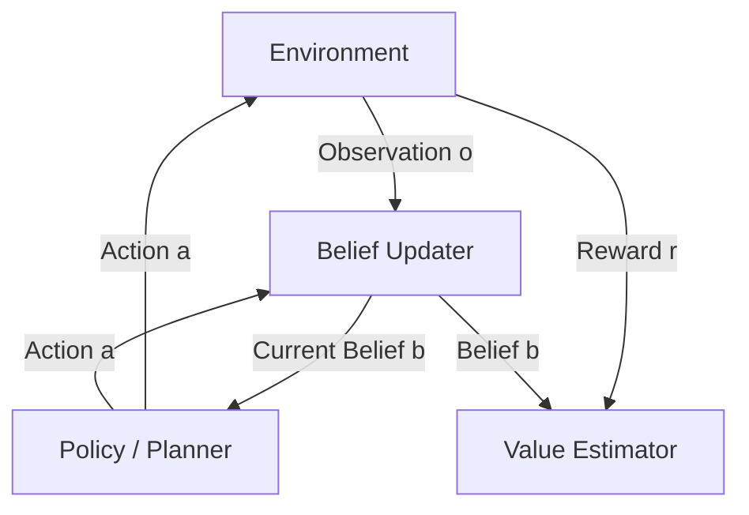

Most AI agents operate in messy, real-world environments where they can't see everything. Your autonomous vacuum doesn't know what's behind the couch. A medical diagnosis agent can't directly observe diseases—only symptoms and test results. A trading bot can't see market makers' intentions. Welcome to **Partially Observable Markov Decision Processes (POMDPs)**, the mathematical framework for making optimal decisions when you can't fully observe the world's state.

## Concept Introduction

### The Simple Version

Imagine playing chess blindfolded. You can hear pieces moving, your opponent might tell you which square they moved to, but you can't see the full board. You need to maintain a **belief** about where all the pieces probably are, update that belief as you get new information, and make moves based on uncertainty.

That's a POMDP: a decision-making framework where:
- The **true state** of the world is hidden
- You receive **noisy or partial observations**
- You maintain a **belief distribution** over possible states
- You choose **actions** to maximize expected long-term reward

### The Technical Version

A POMDP is a 7-tuple: `(S, A, T, R, Ω, O, γ)` where:

- **S**: Set of states (the true world state you can't fully see)
- **A**: Set of actions you can take
- **T**: Transition function `P(s'|s,a)` — probability of reaching state s' after action a in state s
- **R**: Reward function `R(s,a)` — immediate reward for taking action a in state s
- **Ω**: Set of observations you can receive
- **O**: Observation function `P(o|s',a)` — probability of observing o after action a leads to state s'
- **γ**: Discount factor (0 ≤ γ < 1) for future rewards

The key difference from fully-observable MDPs: you never know which state `s ∈ S` you're in. Instead, you maintain a **belief state** `b`, a probability distribution over S.

## Historical & Theoretical Context

### Origins

POMDPs emerged in the 1960s from operations research, formalized by researchers like Edward Sondik (1971) and Richard Smallwood & Edward Sondik (1973). They extended **Markov Decision Processes (MDPs)**, which Ronald Howard had systematized in 1960.

The motivation was practical: real control systems (radar tracking, inventory management) rarely have perfect information. Classical planning assumes full observability—you know exactly where you are. But in robotics, healthcare, and autonomous systems, sensors are noisy, the environment is partially hidden, and uncertainty is fundamental.

### Theoretical Foundation

POMDPs rest on three pillars:

1. **Markov Property**: The future depends only on the current state, not the history (given the state)
2. **Bayesian Belief Updates**: Use Bayes' rule to update beliefs about states given observations
3. **Dynamic Programming**: Optimal policies can be computed via value iteration or policy iteration over belief space

POMDPs are **PSPACE-complete** to solve exactly, making them computationally harder than MDPs (which are P-complete). This computational intractability drove decades of approximation research.

## The POMDP Decision Loop

Here's how an agent operates in a POMDP:

```
1. Start with initial belief b₀ over states
2. Loop:
   a. Select action a based on current belief b
   b. Execute action a
   c. Receive observation o
   d. Update belief: b' = UPDATE(b, a, o) using Bayes' rule
   e. Collect reward r
   f. Set b ← b'
```

### Belief Update Formula

The **belief update** is the heart of POMDPs:

```
b'(s') = η · P(o|s',a) · Σₛ P(s'|s,a) · b(s)
```

Where:
- `b(s)`: Current belief that we're in state s
- `P(s'|s,a)`: Transition probability (from the model)
- `P(o|s',a)`: Observation probability (from the model)
- `η`: Normalization constant so beliefs sum to 1

In plain English: "The new belief that I'm in state s' equals: (1) how likely I'd observe o if I were in s', times (2) the sum over all previous states of how likely I transitioned from that state to s', weighted by my previous belief I was in that state."

### Value Functions Over Beliefs

The optimal value function is defined over the **belief space** (continuous, even if S is discrete):

```
V*(b) = max_a [ R(b,a) + γ · Σₒ P(o|b,a) · V*(b^a_o) ]
```

Where:
- `R(b,a) = Σₛ b(s) · R(s,a)` is expected immediate reward
- `b^a_o` is the updated belief after taking action a and observing o

The optimal policy `π*: B → A` maps beliefs to actions.

## Algorithms for Solving POMDPs

### 1. Exact Methods: Value Iteration

For small POMDPs, **exact value iteration** works by representing `V(b)` as a piecewise-linear convex function using **alpha vectors**:

```
V(b) = max_α ∈ Γ [ Σₛ b(s) · α(s) ]
```

Each alpha vector corresponds to a policy tree—a plan for several steps.

**Pseudocode** (conceptual):

```
Γ₀ = {initial alpha vectors}
for iteration = 1 to horizon:
    for each action a:
        for each observation o:
            Generate new alpha vectors via backup
    Γₜ = prune(Γₜ) // Remove dominated vectors
return Γ_final
```

This scales poorly: Γ grows exponentially with the horizon.

### 2. Point-Based Value Iteration (PBVI)

Instead of covering the entire belief space, **sample** a set of representative belief points and approximate V only at those points.

```python
def pbvi(pomdp, B_samples, num_iterations):
    """
    B_samples: set of sampled belief points
    """
    Γ = initialize_alpha_vectors()

    for _ in range(num_iterations):
        Γ_new = []
        for b in B_samples:
            # Find best alpha vector for this belief
            best_alpha = None
            best_value = -inf

            for a in pomdp.actions:
                alpha_a = backup(pomdp, Γ, a, b)
                value = dot(alpha_a, b)
                if value > best_value:
                    best_value = value
                    best_alpha = alpha_a

            Γ_new.append(best_alpha)

        Γ = prune_dominated(Γ_new)

    return Γ
```

PBVI works well for medium-sized problems (hundreds of states).

### 3. Online Planning: POMCP

For large POMDPs, **Monte Carlo Tree Search** adapted to POMDPs (POMCP, Silver & Veness 2010) plans at runtime using particle filters to represent beliefs.

```python
def pomcp(root_belief, num_simulations):
    tree = SearchTree(root_belief)

    for _ in range(num_simulations):
        # Sample a state from current belief
        s = sample(root_belief)

        # Simulate episode
        simulate(tree, s, depth=0)

    # Return best action at root
    return argmax_a(tree.root.Q_values)

def simulate(tree, state, depth):
    if depth > max_depth:
        return 0

    if not tree.current_node.is_expanded:
        return rollout(state, depth)

    # UCB action selection
    action = select_action_ucb(tree.current_node)

    # Sample next state and observation
    next_state = sample_transition(state, action)
    obs = sample_observation(next_state, action)
    reward = get_reward(state, action)

    # Update belief and tree
    tree.add_particle(obs, next_state)
    child_node = tree.get_child(action, obs)

    # Recursive simulation
    future_value = simulate(tree, next_state, depth + 1)
    total_value = reward + gamma * future_value

    # Update statistics
    tree.current_node.update(action, total_value)

    return total_value
```

POMCP scales to millions of states and is used in robotics and game AI.

## Design Patterns & Architectures

### The Belief-Tracking Architecture



**Components:**

1. **Belief Updater**: Maintains probability distribution over states using Bayesian filtering
2. **Policy/Planner**: Maps beliefs to actions (offline policy or online search)
3. **Value Estimator**: Estimates expected future reward from current belief
4. **Sensor Model**: Encodes P(o|s,a) — how observations depend on true state

### Integration with Agent Frameworks

POMDPs fit naturally into the **Planner-Executor-Memory** loop:

- **Memory**: Stores belief state (current probability distribution)
- **Planner**: Runs POMCP or looks up policy from alpha vectors
- **Executor**: Takes action, receives observation
- **Update**: Bayesian belief update using observation

Modern frameworks like **LangGraph** can implement POMDP agents using state machines where graph nodes represent belief states.

## Practical Application: Robot Navigation Example

```python
import numpy as np
from collections import defaultdict

class GridWorldPOMDP:
    """
    Simple POMDP: Robot navigating a grid with noisy sensors.
    True state: (x, y) position
    Observation: Noisy reading of nearby walls
    """
    def __init__(self, grid_size=5):
        self.size = grid_size
        self.states = [(x, y) for x in range(grid_size)
                       for y in range(grid_size)]
        self.actions = ['up', 'down', 'left', 'right']
        self.observation_noise = 0.1

    def transition(self, state, action):
        """Returns P(s'|s,a) as dict of {next_state: prob}"""
        x, y = state

        # Deterministic movement (could add noise)
        moves = {
            'up': (x, min(y+1, self.size-1)),
            'down': (x, max(y-1, 0)),
            'left': (max(x-1, 0), y),
            'right': (min(x+1, self.size-1), y)
        }

        return {moves[action]: 1.0}

    def observe(self, state, action):
        """Returns P(o|s',a) — observation probabilities"""
        x, y = state

        # Observation: count of adjacent walls (0-4)
        true_walls = 0
        if x == 0: true_walls += 1
        if x == self.size-1: true_walls += 1
        if y == 0: true_walls += 1
        if y == self.size-1: true_walls += 1

        # Noisy observation
        obs_probs = defaultdict(float)
        for obs in range(5):
            if obs == true_walls:
                obs_probs[obs] = 1 - 4*self.observation_noise
            else:
                obs_probs[obs] = self.observation_noise

        return obs_probs

    def reward(self, state, action):
        """Reward function"""
        # Goal at top-right corner
        goal = (self.size-1, self.size-1)
        if state == goal:
            return 100
        return -1  # Step cost

class BeliefTracker:
    """Maintains and updates belief distribution"""
    def __init__(self, pomdp):
        self.pomdp = pomdp
        self.belief = self._uniform_belief()

    def _uniform_belief(self):
        """Initialize uniform belief"""
        n = len(self.pomdp.states)
        return {s: 1.0/n for s in self.pomdp.states}

    def update(self, action, observation):
        """Bayesian belief update"""
        new_belief = defaultdict(float)

        # For each possible next state
        for s_next in self.pomdp.states:
            # P(o|s',a)
            obs_prob = self.pomdp.observe(s_next, action).get(observation, 0)

            # Σₛ P(s'|s,a) · b(s)
            transition_prob = 0
            for s in self.pomdp.states:
                trans = self.pomdp.transition(s, action)
                transition_prob += trans.get(s_next, 0) * self.belief[s]

            new_belief[s_next] = obs_prob * transition_prob

        # Normalize
        total = sum(new_belief.values())
        if total > 0:
            self.belief = {s: p/total for s, p in new_belief.items()}

        return self.belief

    def expected_position(self):
        """Return belief-weighted expected position"""
        exp_x = sum(s[0] * p for s, p in self.belief.items())
        exp_y = sum(s[1] * p for s, p in self.belief.items())
        return (exp_x, exp_y)

# Example usage
pomdp = GridWorldPOMDP(grid_size=5)
tracker = BeliefTracker(pomdp)

print("Initial belief (uniform)")
print(f"Expected position: {tracker.expected_position()}")

# Simulate: take action, get observation, update belief
action = 'right'
true_state = (2, 2)  # Unknown to agent
observation = 0  # Observes 0 adjacent walls (noisy)

tracker.update(action, observation)
print(f"\nAfter moving {action} and observing {observation} walls:")
print(f"Expected position: {tracker.expected_position()}")

# Show top 5 most likely states
top_beliefs = sorted(tracker.belief.items(), key=lambda x: x[1], reverse=True)[:5]
print("\nMost likely positions:")
for state, prob in top_beliefs:
    print(f"  {state}: {prob:.3f}")
```

**Output:**
```
Initial belief (uniform)
Expected position: (2.0, 2.0)

After moving right and observing 0 walls:
Expected position: (2.15, 2.0)

Most likely positions:
  (2, 2): 0.185
  (3, 2): 0.165
  (1, 2): 0.145
  (2, 1): 0.120
  (2, 3): 0.120
```

The agent refines its belief based on the noisy observation.

## Comparisons & Tradeoffs

| Framework | Observability | Complexity | When to Use |
|-----------|---------------|------------|-------------|
| **MDP** | Full | Polynomial | Simulated environments, games with perfect info |
| **POMDP** | Partial | PSPACE-complete | Robotics, medical diagnosis, real-world uncertainty |
| **RL (model-free)** | Varies | Sample complexity | Unknown dynamics, large state spaces |
| **Classical Planning** | Full | Varies | Deterministic problems, logistics |

**Strengths of POMDPs:**
- Principled handling of uncertainty
- Optimal solutions (given correct model)
- Rich theory and mature algorithms

**Limitations:**
- Requires accurate models of T, O, R
- Computationally expensive for large state spaces
- Belief space is continuous and high-dimensional
- Model specification is challenging

**Scalability:**
- Exact methods: ~100 states
- PBVI: ~1,000 states
- POMCP: millions of states (online planning)

## Latest Developments & Research

### Deep Reinforcement Learning Meets POMDPs (2018-2025)

**Deep Recurrent Q-Networks (DRQN)**: Use LSTMs to implicitly learn belief representations, avoiding explicit belief tracking. Works for high-dimensional observations (images).

**QMDP-Net (Karkus et al., 2017)**: Combines differentiable planning with deep learning, learning the POMDP model end-to-end from data.

**Transformer-based Belief Tracking (2023-2024)**: Attention mechanisms for maintaining beliefs over long histories. Models like **Decision Transformer** adapt to partial observability.

### Large Language Models as POMDP Planners

Recent work explores using LLMs to:
- Generate observation and transition models from natural language
- Perform approximate belief updates via in-context reasoning
- Suggest actions in POMDP scenarios without explicit solving

Example: **Eureka (Nvidia, 2023)** uses GPT-4 to design reward functions for robot POMDPs.

### Benchmarks

- **POMDP.org Problems**: Tiger, RockSample, Tag—classic benchmarks
- **Lightdark (2016)**: Continuous POMDPs for robotics
- **AISC-Gridworlds (2024)**: Scalable POMDP testbeds with partial observability challenges

### Open Problems

1. **Scalable belief compression**: Can we represent complex beliefs compactly?
2. **Transfer learning**: How to reuse POMDP policies across tasks?
3. **Multi-agent POMDPs**: Decentralized decision-making with partial observability (Dec-POMDPs)
4. **Active sensing**: Optimally choosing when/where to gather information

## Cross-Disciplinary Insights

### Neuroscience: Predictive Coding

The brain doesn't passively observe—it maintains **predictive models** and updates them based on prediction errors. This mirrors POMDP belief updates:

- **Belief state** ≈ Internal brain state (prediction)
- **Observation** ≈ Sensory input
- **Prediction error** ≈ Difference between predicted and actual observation

The **Free Energy Principle** (Karl Friston) formalizes this: organisms minimize surprise by maintaining accurate generative models, directly analogous to Bayesian belief updates in POMDPs.

### Economics: Bayesian Games

In game theory, players often have **incomplete information** about others' types or payoffs. Bayesian games formalize this using belief distributions—essentially, each player solves a POMDP where other players' hidden states affect rewards.

### Distributed Systems: Consensus Under Uncertainty

Distributed algorithms (e.g., Paxos, Raft) operate with partial observability—nodes don't know others' states due to network delays and failures. The consensus problem maps to a multi-agent POMDP where agents must coordinate beliefs about system state.

## Daily Challenge: The Tiger Problem

**Classic POMDP Puzzle:**

You stand before two doors. Behind one is a tiger (bad). Behind the other is treasure (good). You can't see which is which. You have three actions:

1. **Listen**: Get a noisy clue (85% accurate) about which door has the tiger. Cost: -1
2. **Open Left**: Get reward +10 if treasure, -100 if tiger
3. **Open Right**: Same rewards

**Your Task (30 minutes):**

1. **Formally define** this POMDP: list S, A, Ω, T, O, R
2. **Implement** a simple belief tracker in Python
3. **Simulate** an episode:
   - Start with uniform belief
   - Listen twice, update belief each time
   - Choose to open the door you believe most likely has treasure
4. **Analyze**: How many times should you listen before opening a door to maximize expected reward?

**Hint**: The optimal policy depends on your current belief. If you're very uncertain, listening is worth the cost. If you're confident, open the likely-treasure door.

**Bonus**: Compute the expected value of the "always listen once, then open" policy vs. "listen twice, then open."

## References & Further Reading

### Foundational Papers
- **Sondik, E. J. (1971).** "The Optimal Control of Partially Observable Markov Processes." *PhD Thesis, Stanford.*
- **Kaelbling, L. P., Littman, M. L., & Cassandra, A. R. (1998).** "Planning and Acting in Partially Observable Stochastic Domains." *Artificial Intelligence, 101(1-2), 99-134.*

### Modern Algorithms
- **Pineau, J., Gordon, G., & Thrun, S. (2003).** "Point-based value iteration: An anytime algorithm for POMDPs." *IJCAI.*
- **Silver, D., & Veness, J. (2010).** "Monte-Carlo Planning in Large POMDPs." *NIPS.* [Link](https://proceedings.neurips.cc/paper/2010/file/edfbe1afcf9246bb0d40eb4d8027d90f-Paper.pdf)

### Tutorials & Tools
- **POMDP.org**: Comprehensive resource with software and benchmark problems [http://www.pomdp.org](http://www.pomdp.org)
- **AI-Toolbox (C++)**: Efficient POMDP solvers [https://github.com/Svalorzen/AI-Toolbox](https://github.com/Svalorzen/AI-Toolbox)
- **pomdp-py (Python)**: Modern POMDP framework [https://github.com/h2r/pomdp-py](https://github.com/h2r/pomdp-py)

### Recent Advances
- **Karkus, P., Hsu, D., & Lee, W. S. (2017).** "QMDP-Net: Deep Learning for Planning under Partial Observability." *NIPS.*
- **Kurniawati, H., & Yadav, V. (2016).** "An Online POMDP Solver for Uncertainty Planning in Dynamic Environment." *Robotics Research.*

### Books
- **Kaelbling, L. P., Littman, M. L., & Moore, A. W. (1996).** "Reinforcement Learning: A Survey." *Journal of AI Research.* (Includes POMDP coverage)
- **Thrun, S., Burgard, W., & Fox, D. (2005).** *Probabilistic Robotics.* MIT Press. (Chapter on Bayes filters and POMDPs)

---

**Next Steps:**

Master POMDPs and you'll understand how uncertainty propagates through decision chains, how observations refine beliefs, and why AI agents need probabilistic reasoning. This framework underlies modern robotics, autonomous vehicles, and any AI system operating in the messy, partially observable real world. The computational challenges are immense—but the theoretical elegance and practical necessity make POMDPs indispensable for serious agent builders.
