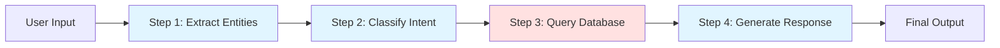

When you ask an AI to perform a complex task like "analyze this dataset and create a comprehensive report with visualizations," you're really asking for a sequence of specialized operations: data validation, statistical analysis, insight extraction, visualization generation, and narrative synthesis. **Prompt chaining** is the architectural pattern that breaks monolithic AI tasks into discrete, composable steps, each with its own focused prompt and purpose.

## 1. Concept Introduction

**In Simple Terms:**

Think of cooking a complex meal. You don't throw all ingredients into one pot and hope for the best. Instead, you follow a recipe with distinct steps: prep vegetables, marinate meat, cook components separately, then combine. Each step has a specific input, process, and output that feeds into the next step.

Prompt chaining works the same way. Instead of one massive prompt trying to do everything, you create a sequence of smaller, specialized prompts where the output of one becomes the input to the next.

Example:
- **Step 1:** "Summarize this customer review in one sentence" → Output: "Customer loved product quality but found shipping slow"
- **Step 2:** "Based on this summary: '{output_from_step_1}', identify the sentiment (positive/negative/mixed)" → Output: "Mixed"
- **Step 3:** "Given sentiment '{output_from_step_2}', generate an appropriate customer service response" → Output: "Thank you for your positive feedback on quality. We apologize for the shipping delay and are working to improve..."

**Technical Detail:**

Prompt chaining is a **workflow orchestration pattern** where:
- Each node in the chain is a distinct LLM call with a specialized prompt template
- Outputs are passed between nodes through a shared state or context object
- Control flow is deterministic (sequential, conditional, or parallel)
- Each step can be independently tested, modified, and optimized

This contrasts with single-shot prompting (one prompt does everything) or fully autonomous agents (agent decides its own workflow). Chains provide a middle ground: structured enough to be predictable and debuggable, yet flexible enough to handle complex, multi-step reasoning.



## 2. Historical & Theoretical Context

The concept emerged from the limitations of early GPT-2 and GPT-3 applications (2019-2021), where developers discovered that asking the model to perform multiple tasks simultaneously led to poor results. Researchers found that **task decomposition** dramatically improved both accuracy and reliability.

The theoretical foundation comes from **divide-and-conquer algorithms** in computer science and **modularity** in software engineering. By breaking complex problems into subproblems:
1. Each subproblem becomes simpler and more tractable
2. Errors can be isolated and debugged
3. Individual components can be reused across different workflows

The 2022 paper "Least-to-Most Prompting" by Zhou et al. formalized this approach for LLMs, showing that sequential decomposition outperformed monolithic prompts on complex reasoning tasks by 20-40%.

By 2023-2024, frameworks like **LangChain** and **LangGraph** emerged specifically to manage these chains with features like state persistence, error handling, and conditional branching.

## 3. Algorithms & Patterns

**Basic Sequential Chain:**

```python
def sequential_chain(input_data):
    state = {"original_input": input_data}

    # Step 1: Preprocessing
    prompt_1 = f"Extract key information from: {state['original_input']}"
    state['extracted_info'] = call_llm(prompt_1)

    # Step 2: Processing
    prompt_2 = f"Analyze this information: {state['extracted_info']}"
    state['analysis'] = call_llm(prompt_2)

    # Step 3: Synthesis
    prompt_3 = f"Based on {state['analysis']}, generate a summary"
    state['final_output'] = call_llm(prompt_3)

    return state['final_output']
```

**Conditional Chain (Branching Logic):**

```python
def conditional_chain(input_data):
    state = {"input": input_data}

    # Classification step
    classification = call_llm(f"Classify topic: {input_data}")
    state['topic'] = classification

    # Branch based on classification
    if state['topic'] == "technical":
        state['response'] = call_llm(f"Provide technical answer for: {input_data}")
    elif state['topic'] == "creative":
        state['response'] = call_llm(f"Provide creative answer for: {input_data}")
    else:
        state['response'] = call_llm(f"Provide general answer for: {input_data}")

    return state['response']
```

**Parallel Chain (Fan-Out/Fan-In):**

```python
import asyncio

async def parallel_chain(input_data):
    # Execute multiple analyses in parallel
    tasks = [
        call_llm_async(f"Analyze sentiment: {input_data}"),
        call_llm_async(f"Extract entities: {input_data}"),
        call_llm_async(f"Identify key topics: {input_data}")
    ]

    sentiment, entities, topics = await asyncio.gather(*tasks)

    # Combine results
    combined = f"Sentiment: {sentiment}, Entities: {entities}, Topics: {topics}"
    final = call_llm(f"Synthesize analysis: {combined}")

    return final
```

## 4. Design Patterns & Architectures

**Map-Reduce Pattern:**
Process multiple documents in parallel (map), then aggregate results (reduce). Example: Summarizing 100 customer reviews.

**Router Pattern:**
A classification step routes input to different specialized chains based on content type, user intent, or domain.

**Iterative Refinement:**
Output loops back as input with refinement instructions until quality threshold is met.

**Human-in-the-Loop:**
Chain pauses at critical points for human review/approval before proceeding.

**Error Recovery:**
Each step has a fallback handler that catches failures and either retries with modified prompts or routes to alternative chains.

Modern frameworks implement these as **State Graphs** (LangGraph) or **Directed Acyclic Graphs** (DAGs), where nodes are operations and edges define control flow.

## 5. Practical Application

**Real-World Example: Content Moderation Pipeline**

```python
from langchain.prompts import PromptTemplate
from langchain.chains import LLMChain
from langchain_openai import ChatOpenAI

llm = ChatOpenAI(model="gpt-4", temperature=0)

# Step 1: Content Classification
classify_prompt = PromptTemplate(
    input_variables=["content"],
    template="""Classify this content into ONE category:
    - safe
    - potentially_harmful
    - explicit_violation

    Content: {content}

    Category:"""
)
classify_chain = LLMChain(llm=llm, prompt=classify_prompt)

# Step 2: Risk Assessment (only for potentially harmful)
risk_prompt = PromptTemplate(
    input_variables=["content"],
    template="""Rate the risk level (1-10) and explain:
    Content: {content}

    Risk Level:
    Explanation:"""
)
risk_chain = LLMChain(llm=llm, prompt=risk_prompt)

# Step 3: Generate Explanation
explain_prompt = PromptTemplate(
    input_variables=["content", "category", "risk"],
    template="""Generate user-friendly explanation for moderation decision:

    Content: {content}
    Category: {category}
    Risk Assessment: {risk}

    Explanation:"""
)
explain_chain = LLMChain(llm=llm, prompt=explain_prompt)

# Orchestrator
def moderate_content(user_content):
    # Step 1: Classify
    category = classify_chain.run(content=user_content).strip()

    # Step 2: Conditional risk assessment
    risk_info = ""
    if category == "potentially_harmful":
        risk_info = risk_chain.run(content=user_content)
    elif category == "explicit_violation":
        risk_info = "Risk Level: 10\nExplanation: Clear policy violation"
    else:
        risk_info = "Risk Level: 0\nExplanation: Content is safe"

    # Step 3: Generate explanation
    explanation = explain_chain.run(
        content=user_content,
        category=category,
        risk=risk_info
    )

    return {
        "category": category,
        "risk_assessment": risk_info,
        "explanation": explanation,
        "action": "approve" if category == "safe" else "review"
    }

# Test
result = moderate_content("I love this product! Works perfectly.")
print(result)
```

**Using LangGraph for Complex Workflows:**

```python
from langgraph.graph import Graph, END

# Define the workflow
workflow = Graph()

# Add nodes (each is a function or LLM call)
workflow.add_node("extract", extract_data)
workflow.add_node("validate", validate_data)
workflow.add_node("process", process_data)
workflow.add_node("generate", generate_output)

# Define edges (control flow)
workflow.add_edge("extract", "validate")
workflow.add_conditional_edges(
    "validate",
    # Function that decides next step based on validation result
    lambda state: "process" if state["valid"] else END
)
workflow.add_edge("process", "generate")
workflow.add_edge("generate", END)

# Set entry point
workflow.set_entry_point("extract")

# Compile into runnable chain
app = workflow.compile()

# Execute
result = app.invoke({"input": "some data"})
```

## 6. Comparisons & Tradeoffs

**Prompt Chaining vs. Single-Shot Prompting:**
- **Pro:** Higher accuracy on complex tasks, better error isolation, more maintainable
- **Con:** Increased latency (multiple API calls), higher cost, more complex to debug

**Prompt Chaining vs. Autonomous Agents (ReAct/AutoGPT):**
- **Pro:** Predictable behavior, easier testing, better for production systems with strict requirements
- **Con:** Less flexible, requires upfront workflow design, can't adapt to unexpected situations as well

**Sequential vs. Parallel Chains:**
- **Sequential:** Simpler, each step uses previous outputs, lower resource usage
- **Parallel:** Faster (when steps are independent), higher throughput, but requires careful state management

**When to Use Each:**
- Single complex prompt: Simple tasks, cost-sensitive, need low latency
- Sequential chain: Multi-step tasks with clear dependencies (e.g., data pipeline)
- Conditional chain: Tasks requiring different handling based on content (e.g., customer support routing)
- Parallel chain: Independent analyses that can be aggregated (e.g., multi-document processing)
- Autonomous agent: Open-ended tasks where workflow can't be predetermined

## 7. Latest Developments & Research

**LangGraph (2024):**
Introduced stateful, cyclic graphs (vs. LangChain's acyclic chains). Allows agents to loop, backtrack, and maintain long-term memory across chain executions. Paradigm shift from "chains" to "cognitive architectures."

**Streaming and Progressive Output (2024):**
Instead of waiting for entire chain to complete, modern frameworks stream intermediate results. Users see "thinking process" in real-time, improving UX and allowing early termination.

**Multi-Modal Chains (2024-2025):**
Chains that combine text, vision, and audio models. Example: Image → Vision Model (describe) → Text Model (analyze) → Image Model (generate visualization).

**Research Frontiers:**
- **Automatic Chain Optimization:** Using LLMs to design optimal chains for specific tasks (meta-prompting)
- **Chain Compression:** Techniques to combine multiple steps into fewer calls without losing accuracy
- **Failure Recovery Patterns:** Sophisticated retry logic with prompt reformulation based on error types

**Benchmarks:**
The **ChainBench** dataset (2024) evaluates chains on complex reasoning tasks, showing that well-designed 3-5 step chains outperform single-shot prompts by 30-50% on tasks requiring multi-hop reasoning.

## 8. Cross-Disciplinary Insight

Prompt chaining mirrors **Behavioral Psychology's "Chaining"** technique, where complex behaviors are taught by breaking them into small, sequential steps. Each step reinforces the next, and mastery requires successful completion of the entire sequence.

It also reflects **Business Process Management (BPM)**, where organizations map workflows as sequences of tasks with defined inputs, outputs, and decision points. Tools like BPMN (Business Process Model and Notation) are conceptually identical to LangGraph's state graphs.

From **distributed systems**, we borrow patterns like:
- **Circuit Breaker:** If step fails repeatedly, stop trying and return cached/default response
- **Saga Pattern:** Each step has a compensating action for rollback if later steps fail
- **Event-Driven Architecture:** Steps communicate via events rather than direct calls, enabling loose coupling

## 9. Daily Challenge / Thought Exercise

**Design a Research Paper Summarization Chain:**

Your task is to create a 4-step chain that takes a research paper PDF and produces a structured summary. Define:

1. **What each step does** (e.g., "Extract abstract and introduction")
2. **The specific prompt** for each step
3. **What data passes between steps** (state shape)
4. **One potential failure point** and how you'd handle it

Spend 20 minutes sketching this out. Think about:
- Could any steps run in parallel?
- Where might you need conditional logic?
- How would you validate outputs between steps?

Bonus: Implement the first two steps in code using your favorite LLM library.

## 10. References & Further Reading

1. **"Least-to-Most Prompting" (2022):** [Zhou et al., arXiv:2205.10625](https://arxiv.org/abs/2205.10625) - Foundational paper on sequential decomposition
2. **LangChain Documentation:** [LangChain Chains](https://python.langchain.com/docs/modules/chains/) - Comprehensive guide to building chains
3. **LangGraph Tutorials:** [LangGraph Docs](https://langchain-ai.github.io/langgraph/) - Next-gen stateful workflows
4. **"Chain-of-Thought Prompting Elicits Reasoning in LLMs" (2022):** [Wei et al.](https://arxiv.org/abs/2201.11903) - Related technique that influenced chain design
5. **Prompt Engineering Guide:** [promptingguide.ai](https://www.promptingguide.ai/) - Section on advanced prompting techniques including chaining
6. **"Constitutional AI" (Anthropic, 2022):** [Paper link](https://arxiv.org/abs/2212.08073) - Uses multi-step chains for AI alignment
7. **CrewAI Framework:** [GitHub](https://github.com/joaomdmoura/crewAI) - Agent framework built on chaining principles

---

**Key Takeaway:** Prompt chaining transforms AI from a single-turn Q&A system into a reliable, orchestrated workflow engine. By decomposing complex tasks into specialized steps, you gain control, visibility, and the ability to build production-grade AI systems that users can trust.
