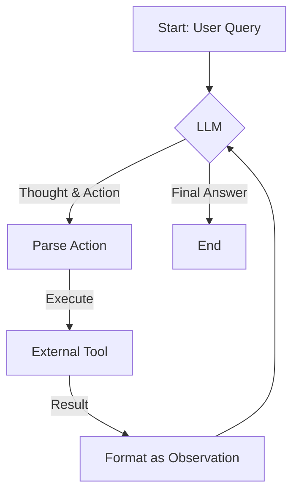

Welcome to our series on mastering AI agent programming. Today, we're exploring one of the most foundational patterns for building capable agents: **ReAct**, which stands for **Reason + Act**. It’s a simple yet powerful idea that dramatically improves the reliability and intelligence of Large Language Model (LLM) agents by teaching them to "think out loud" before acting.

### 1. Concept Introduction

**In Simple Terms:**
Imagine you ask a person to find out "Who was the monarch of the United Kingdom when the Beatles broke up?" They wouldn't just blurt out an answer. Their internal monologue might be:

1.  *Okay, first I need to know when the Beatles broke up.* (Reasoning)
2.  *I'll search online for "Beatles breakup date".* (Action)
3.  *The search result says April 10, 1970.* (Observation)
4.  *Now I need to find the UK monarch in 1970.* (Reasoning)
5.  *I'll search for "UK monarch 1970".* (Action)
6.  *The result is Queen Elizabeth II.* (Observation)
7.  *Great, I have the final answer.* (Reasoning)

ReAct enables an LLM to do exactly this: interleave reasoning (thinking about the plan) and acting (using a tool, like a search engine) in a loop until it finds the answer.

**Technical Detail:**
ReAct is a prompting framework where the LLM is instructed to generate output in a specific format, typically a sequence of `Thought`, `Action`, and `Observation` triplets.

- **Thought:** The LLM generates a private reasoning trace. It analyzes the current state of the problem, breaks it down, and decides what to do next. This is analogous to Chain-of-Thought (CoT) reasoning.
- **Action:** Based on its thought, the LLM decides to use an external tool. This could be a search query, a database lookup, a calculator, or any other API call.
- **Observation:** The agent system executes the action (e.g., runs the search query) and feeds the result back into the prompt as an "Observation."

This loop continues, with each new observation informing the next thought, allowing the agent to build context, correct its mistakes, and solve multi-step problems that would be impossible with a single query.



### 2. Historical & Theoretical Context

The ReAct framework was introduced by **Shunyu Yao, Jeffrey Zhao, and others in their 2022 paper, "ReAct: Synergizing Reasoning and Acting in Language Models."** At the time, LLM prompting was dominated by two main approaches: "thought-only" (like Chain-of-Thought) and "action-only" (direct tool use).

- **Chain-of-Thought (CoT)** improved reasoning but was prone to hallucination because it couldn't access external, real-time information.
- **Action-only models** could use tools but struggled with planning and adapting to unexpected results.

ReAct was a breakthrough because it combined the strengths of both. By externalizing the reasoning trace, it makes the agent's process interpretable. By grounding the reasoning in real-world observations from tools, it reduces hallucination and makes the agent far more effective.

### 3. Algorithms & Pseudocode

The core of ReAct is a control loop. Here is a simplified, high-level algorithm:

```
function react_agent(query):
  prompt = initialize_prompt(query)
  max_iterations = 10

  for i in 1 to max_iterations:
    response = llm.generate(prompt) // LLM generates Thought + Action

    thought = parse_thought(response)
    action, action_input = parse_action(response)

    if action == "Finish":
      return action_input // The final answer

    observation = execute_tool(action, action_input)
    prompt += "\nObservation: " + observation + "\nThought: "

  return "Agent failed to finish."
```
The key is the structure of the prompt, which is continuously appended with the `Observation` and the prompt for the next `Thought`.

### 4. Design Patterns & Architectures

ReAct is a specific implementation of a more general **Planner-Executor** loop.

- **Planner:** The "Reason" step is the planning phase, where the LLM decides what to do.
- **Executor:** The "Act" step is the execution phase, where the system calls the tool.

It also fits an **Event-Driven Architecture**. The `Observation` from a tool acts as an event that triggers the next cycle of the agent's reasoning loop. Modern agent frameworks like LangGraph formalize this by representing each step (reason, act, observe) as a node in a state machine graph.

### 5. Practical Application

**Simple Python Example:**
Let's simulate a ReAct loop with a fake LLM and a fake search tool.

```python
import re

# Mock external tool
def search(query: str) -> str:
    print(f"--> Searching for: {query}")
    if "beatles breakup date" in query.lower():
        return "The Beatles officially broke up on April 10, 1970."
    if "uk monarch 1970" in query.lower():
        return "Queen Elizabeth II was the monarch of the United Kingdom in 1970."
    return "No information found."

# Mock LLM call
def llm(prompt: str) -> str:
    print(f"\n--- Sending to LLM ---\n{prompt}\n--------------------")
    # This is where a real LLM call would go. We'll fake the responses.
    if "when the Beatles broke up" in prompt:
        return "Thought: I need to find out the date the Beatles broke up.\nAction: search[Beatles breakup date]"
    if "April 10, 1970" in prompt:
        return "Thought: Now that I know the date, I need to find the UK monarch at that time.\nAction: search[UK monarch 1970]"
    if "Queen Elizabeth II" in prompt:
        return "Thought: I have found the answer. I can now finish.\nAction: Finish[Queen Elizabeth II]"
    return "Action: Finish[Error]"

def run_agent(query: str):
    prompt = f"Question: {query}\n"
    
    for _ in range(5): # Loop limit
        response = llm(prompt)
        
        thought_match = re.search(r"Thought: (.*)", response)
        action_match = re.search(r"Action: (search|Finish)\[(.*)\]", response)
        
        if thought_match:
            print(f"Gemini's Thought: {thought_match.group(1).strip()}")
        
        if action_match:
            action, action_input = action_match.groups()
            
            if action == "Finish":
                print(f"\nFinal Answer: {action_input}")
                return
            
            observation = search(action_input)
            print(f"<-- Observation: {observation}")
            prompt += f"{response}\nObservation: {observation}\n"
        else:
            print("Error: Could not parse action.")
            return

# Run the agent
run_agent("Who was the monarch of the United Kingdom when the Beatles broke up?")
```

**In Frameworks:**
- **LangChain:** The `create_react_agent` function is a primary way to build agents, abstracting this loop away.
- **CrewAI:** Each agent in a crew implicitly uses a ReAct-style loop to decide which tool to use to accomplish its assigned task.
- **AutoGen:** A `UserProxyAgent` can execute code or function calls proposed by an `AssistantAgent`, forming a similar interactive loop.

### 6. Comparisons & Tradeoffs

- **ReAct vs. Chain-of-Thought:** ReAct is superior for tasks requiring up-to-date or external knowledge, as it grounds the agent in reality. CoT is faster and cheaper for self-contained reasoning tasks (e.g., math word problems) since it requires only one LLM call.
- **Strengths:** High interpretability (you can read the thoughts), reduced hallucination, and ability to handle complex, multi-step tasks.
- **Limitations:**
    - **Latency:** Each step requires a full LLM call, making it slow.
    - **Cost:** Multiple LLM calls can be expensive.
    - **Prompt Fragility:** The agent can get stuck in loops or fail if the LLM doesn't generate output in the exact expected format.

### 7. Latest Developments & Research

The original ReAct paper used simple text-based tool definitions. The biggest evolution has been the adoption of **structured function calling** (popularized by OpenAI). Instead of parsing text like `search[query]`, the LLM generates a structured JSON object specifying the function and its arguments. This is far more reliable.

Recent research explores:
- **Self-Correction:** Agents that can analyze the results of their actions, realize they made a mistake, and generate a new plan (e.g., the "Reflexion" paper).
- **Adaptive Planning:** Agents that can modify their high-level plans based on observations, not just their next action.
- **Multi-Agent ReAct:** Systems where multiple agents collaborate, with each agent's actions and thoughts becoming part of the observations for others.

### 8. Cross-Disciplinary Insight

ReAct is a computational mirror of the **OODA Loop (Observe, Orient, Decide, Act)**, a concept developed by military strategist John Boyd.

- **Observe:** The agent gets an `Observation` from a tool.
- **Orient:** The `Thought` step is where the agent makes sense of the new information in the context of its goal.
- **Decide:** The agent refines its plan and decides on the next specific action.
- **Act:** The agent executes the `Action`.

This cycle, which emphasizes rapid learning and adaptation based on feedback from the environment, is a core principle in fields ranging from military strategy to business and software development.

### 9. Daily Challenge / Thought Exercise

**Task:** Manually write out the `Thought, Action, Observation` trace for an agent trying to answer the query: *"What is the total market cap of Apple and Google combined?"*

Assume you have two tools: `search[query]` and `calculator[expression]`. This will help you internalize the step-by-step reasoning process.

### 10. References & Further Reading

1.  **Original Paper:** [Yao, S., et al. (2022). ReAct: Synergizing Reasoning and Acting in Language Models.](https://arxiv.org/abs/2210.03629)
2.  **Blog Post Explainer:** [ReAct: A Synergy of Reasoning and Acting in LLMs by Lilian Weng](https://lilianweng.github.io/posts/2023-03-15-prompt-engineering/#react)
3.  **LangChain Implementation:** [LangChain ReAct Agents Documentation](https://python.langchain.com/docs/modules/agents/agent_types/react)

```