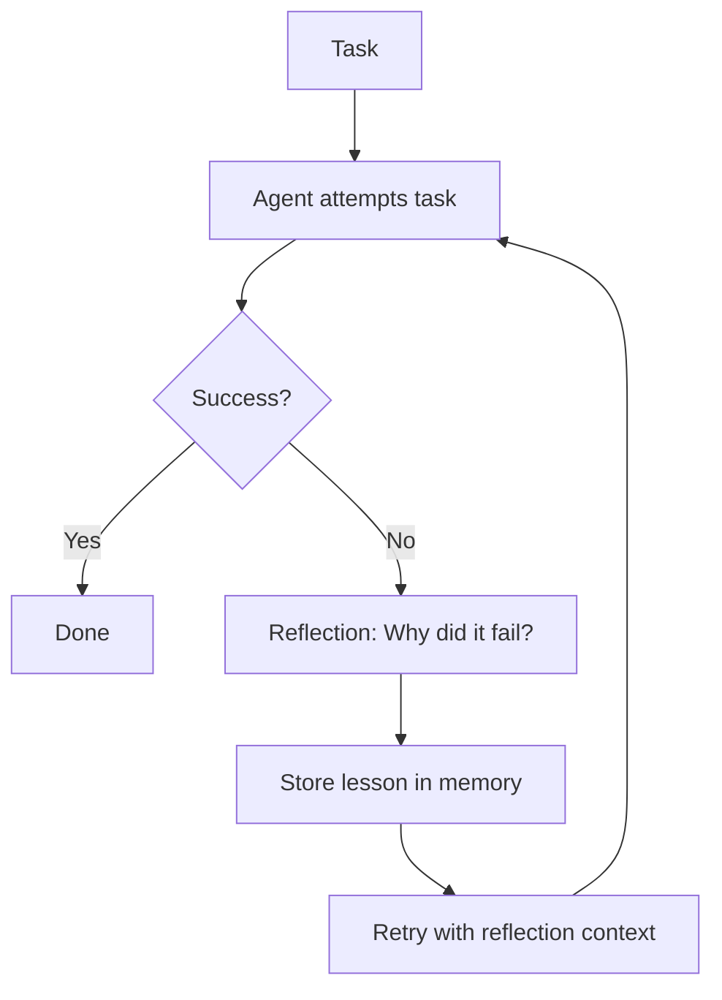

## 1. Concept Introduction

**Simple Explanation:**

Imagine you're solving a puzzle and you make a wrong move. A good problem-solver doesn't just try random alternatives—they pause, think about *why* the move failed, and use that insight to guide their next attempt. They might think: "I tried to put the red piece in the corner, but it didn't fit because the edge was curved, not straight. Next time, I should look for pieces with straight edges for corners."

This is **reflection**: the ability to analyze your own failures, extract lessons, and improve your strategy. AI agents with reflection can do the same thing.

**Technical Detail:**

Reflection in AI agents is a meta-cognitive process where the agent:

1. **Executes an action** (e.g., generates code, answers a question, makes a plan).
2. **Evaluates the outcome** (Did it work? Why or why not?).
3. **Generates self-critique** (Uses an LLM or evaluator to analyze the failure and produce actionable feedback).
4. **Stores the reflection in memory** (Persists the lesson for future reference).
5. **Uses the reflection to improve** (On the next attempt, the agent references past failures to avoid repeating mistakes).

The most well-known implementation is **Reflexion** (Shinn et al., 2023), which extends the ReAct (Reason + Act) pattern with an explicit reflection phase. Instead of blindly retrying after failure, the agent writes a natural language critique of its own performance and uses that critique as context for the next iteration.



## 2. Historical & Theoretical Context

The idea of learning from mistakes is ancient, but in AI, it has roots in several traditions:

- **Meta-Learning (1990s):** The concept of "learning to learn"—using past experience to improve the learning process itself.
- **Reinforcement Learning (RL):** Agents learn from rewards and penalties, but traditional RL lacks explicit introspection. It adjusts behavior through trial and error, not by reasoning about *why* a strategy failed.
- **Cognitive Psychology:** Human metacognition—the ability to think about one's own thinking—has been studied for decades. Researchers like John Flavell (1979) described how people monitor and regulate their own cognitive processes.

The modern incarnation for LLM agents emerged in 2023 with the **Reflexion paper** by Noah Shinn, Federico Cassano, and others at Northeastern University and MIT. They showed that adding a reflection step dramatically improved performance on coding tasks, decision-making benchmarks, and knowledge-intensive QA.

Unlike traditional RL, which updates model weights, Reflexion operates at the **semantic level**—it stores lessons as text in the agent's memory, making it interpretable and composable with existing LLM-based architectures.

## 3. Algorithms & Math

The core algorithm is a loop with an added reflection phase. Here's the pseudocode:

```
function reflexion_agent(task, max_trials):
  memory = []  # Stores past reflections

  for trial in 1 to max_trials:
    # 1. ACTOR: Generate a solution
    solution = actor.generate(task, memory)

    # 2. EVALUATOR: Test the solution
    success, feedback = evaluator.evaluate(solution, task)

    if success:
      return solution

    # 3. REFLECTOR: Generate self-critique
    reflection = reflector.critique(task, solution, feedback, memory)

    # 4. MEMORY: Store the reflection
    memory.append(reflection)

  return "Failed after max trials"
```

**Key Components:**

- **Actor:** The LLM generates a candidate solution (e.g., writes code, answers a question).
- **Evaluator:** An external oracle or heuristic that judges the solution (e.g., runs unit tests, checks for factual accuracy).
- **Reflector:** Another LLM call (or the same LLM with a different prompt) that analyzes the failure and produces a natural language critique.
- **Memory:** A short-term buffer (e.g., a list of reflections) that is injected into the actor's context on the next trial.

**No Complex Math:** Unlike gradient-based learning, Reflexion relies on the LLM's reasoning capabilities. The "learning" happens through prompt engineering and in-context learning, not parameter updates.

## 4. Design Patterns & Architectures

Reflection fits naturally into several agent architectures:

### **ReAct + Reflection = Reflexion**
The original ReAct pattern (Thought → Action → Observation) is extended with:
- **Reflection:** After a failure, the agent generates a reflection instead of immediately retrying.

### **Planner-Executor-Reflector Loop**
This is a three-phase cycle:
1. **Planner:** Creates a high-level plan.
2. **Executor:** Carries out the plan.
3. **Reflector:** If the plan fails, reflects on why and suggests refinements.

This is common in agent frameworks like **LangGraph**, where each phase is a node in a state machine graph.

### **Hierarchical Reflection**
For complex tasks:
- **Low-level reflection:** Critiques individual actions (e.g., "This function call failed because the API key was missing").
- **High-level reflection:** Critiques the overall strategy (e.g., "My approach of trying to brute-force the solution won't scale; I should use dynamic programming instead").

## 5. Practical Application

Let's build a simple self-reflective agent that solves math word problems.

```python
import re

# Mock LLM functions
def actor_llm(task, reflections):
    context = "\n".join(reflections) if reflections else "No prior attempts."
    prompt = f"Task: {task}\nPast Reflections:\n{context}\nProvide your solution:"
    print(f"\n[ACTOR] Generating solution...\n{prompt}")

    # Simulate different responses based on reflections
    if "use correct formula" in context.lower():
        return "The area of a circle is π * r^2. If radius is 5, area = 3.14159 * 25 = 78.54"
    return "The area is 2 * π * r. If radius is 5, area = 31.4"  # Wrong formula

def evaluator(solution, expected_answer):
    print(f"\n[EVALUATOR] Testing solution: {solution}")
    if "78.5" in solution:
        print("✓ Correct!")
        return True, "Solution is correct."
    print("✗ Incorrect!")
    return False, f"Expected answer near 78.54, but solution gave {solution}"

def reflector_llm(task, solution, feedback, reflections):
    prompt = f"Task: {task}\nYour solution: {solution}\nFeedback: {feedback}\nWhat went wrong?"
    print(f"\n[REFLECTOR] Analyzing failure...\n{prompt}")

    # Simulate reflection
    if "31.4" in solution:
        return "I used the circumference formula (2πr) instead of the area formula (πr²). I need to use the correct formula for area."
    return "Unknown error. Try a different approach."

def reflexion_agent(task, expected_answer, max_trials=3):
    memory = []

    for trial in range(1, max_trials + 1):
        print(f"\n{'='*60}\nTRIAL {trial}\n{'='*60}")

        solution = actor_llm(task, memory)
        success, feedback = evaluator(solution, expected_answer)

        if success:
            print(f"\n✓ Task solved in {trial} trial(s)!")
            return solution

        reflection = reflector_llm(task, solution, feedback, memory)
        memory.append(reflection)
        print(f"\n[MEMORY] Stored reflection: {reflection}")

    print("\n✗ Failed to solve after max trials.")
    return None

# Run the agent
task = "What is the area of a circle with radius 5?"
reflexion_agent(task, expected_answer=78.54)
```

**Output:**
```
============================================================
TRIAL 1
============================================================

[ACTOR] Generating solution...
Task: What is the area of a circle with radius 5?
Past Reflections:
No prior attempts.
Provide your solution:

[EVALUATOR] Testing solution: The area is 2 * π * r. If radius is 5, area = 31.4
✗ Incorrect!

[REFLECTOR] Analyzing failure...
Task: What is the area of a circle with radius 5?
Your solution: The area is 2 * π * r. If radius is 5, area = 31.4
Feedback: Expected answer near 78.54, but solution gave The area is 2 * π * r. If radius is 5, area = 31.4
What went wrong?

[MEMORY] Stored reflection: I used the circumference formula (2πr) instead of the area formula (πr²). I need to use the correct formula for area.

============================================================
TRIAL 2
============================================================

[ACTOR] Generating solution...
Task: What is the area of a circle with radius 5?
Past Reflections:
I used the circumference formula (2πr) instead of the area formula (πr²). I need to use the correct formula for area.
Provide your solution:

[EVALUATOR] Testing solution: The area of a circle is π * r^2. If radius is 5, area = 3.14159 * 25 = 78.54
✓ Correct!

✓ Task solved in 2 trial(s)!
```

### **In Modern Frameworks:**

- **LangGraph:** You can create a graph with `actor`, `evaluator`, and `reflector` nodes, with conditional edges that loop back to the actor if the evaluator returns failure.
- **CrewAI:** Assign a "Critic" agent whose job is to review and provide feedback on the work of other agents.
- **AutoGen:** Use a `UserProxyAgent` as an evaluator (e.g., running code) and an `AssistantAgent` as both actor and reflector.

## 6. Comparisons & Tradeoffs

| Approach | Mechanism | Strengths | Weaknesses |
|----------|-----------|-----------|------------|
| **Reflexion** | Natural language self-critique stored in memory | Interpretable, works with any LLM, no training needed | Relies on LLM's reasoning; can be verbose; limited memory window |
| **Traditional RL** | Gradient updates from reward signals | Can optimize over millions of trials | Black-box, requires many samples, hard to interpret |
| **Few-Shot Prompting** | Provide examples of correct solutions | Simple, fast | No learning from *this* task; examples may not cover edge cases |
| **Fine-Tuning** | Update model weights on task-specific data | Permanent improvement | Expensive, risks catastrophic forgetting, not real-time |

**Strengths of Reflection:**
- **Zero-shot improvement:** No training data or gradient updates needed.
- **Transparency:** Reflections are readable and debuggable.
- **Generalization:** Lessons learned on one task can inform related tasks if stored in long-term memory.

**Limitations:**
- **Context window:** Reflections consume tokens; long tasks may exceed context limits.
- **LLM quality:** Reflection quality depends on the LLM's reasoning ability. Weak models may generate unhelpful critiques.
- **No guarantees:** Unlike RL convergence theorems, there's no formal proof that reflection always improves performance.

## 7. Latest Developments & Research

### **2023: The Year of Reflexion**
- **Reflexion (Shinn et al., 2023):** The foundational paper showed 91% pass rate on HumanEval coding tasks (vs. 67% for baseline ReAct).
- **Self-Refine (Madaan et al., 2023):** A similar approach where the agent iteratively critiques and refines its own outputs without external feedback.

### **2024-2025: Advanced Self-Correction**
- **CRITIC (Gou et al., 2024):** Uses external tools (e.g., search engines, code interpreters) to verify answers before accepting them, then reflects on discrepancies.
- **Reflexion with Long-Term Memory:** Researchers are integrating vector databases to store reflections from past sessions, enabling agents to learn across tasks (e.g., remembering that "API X tends to timeout on large requests").
- **Multi-Agent Reflection:** Systems where one agent acts and another agent provides critique, avoiding the "judge and jury" problem where a single LLM must evaluate its own work.

### **Open Problems:**
- **Hallucinated Reflections:** LLMs sometimes generate plausible-sounding but incorrect critiques, leading the agent astray.
- **Overfitting to Reflections:** Agents might overweight recent failures and miss the bigger picture.
- **Scaling to Complex Domains:** Reflection works well for bounded tasks (coding, math) but is less proven for open-ended creative tasks.

## 8. Cross-Disciplinary Insight

Reflection in AI agents mirrors **Kolb's Experiential Learning Cycle** from education theory:

1. **Concrete Experience:** The agent attempts a task.
2. **Reflective Observation:** The agent analyzes what happened.
3. **Abstract Conceptualization:** The agent formulates a lesson or rule ("I should always validate inputs before processing").
4. **Active Experimentation:** The agent applies the lesson in the next attempt.

This cycle, which is foundational in adult learning and professional development, is now being computationally realized in autonomous systems. It suggests that effective AI agents, like effective learners, are not just *reactive* but *reflective*.

## 9. Daily Challenge / Thought Exercise

**Exercise: Build a Self-Correcting Code Generator**

**Task (30 minutes):**

1. Write a Python function `reflexive_code_generator(task_description, test_cases, max_trials=3)` that:
   - Uses an LLM to generate Python code based on `task_description`.
   - Runs the code against `test_cases`.
   - If tests fail, generates a reflection on why the code failed.
   - Retries with the reflection in context.

2. **Test it with:**
   - **Task:** "Write a function `is_palindrome(s)` that returns True if string `s` is a palindrome."
   - **Test Cases:**
     - `is_palindrome("racecar")` → `True`
     - `is_palindrome("hello")` → `False`
     - `is_palindrome("A man a plan a canal Panama")` → `True` (case-insensitive, ignores spaces)

3. **Bonus:** Make the first attempt deliberately naive (e.g., simple string reversal without handling case or spaces) to trigger a reflection loop.

**Reflection prompt for the LLM:**
```
The code failed on test case: {test_input}
Expected: {expected_output}
Got: {actual_output}
Error (if any): {error_message}

What went wrong with the code, and how should it be fixed?
```

## 10. References & Further Reading

### **Foundational Papers:**
- **Reflexion:** [Shinn, N., Cassano, F., et al. (2023). Reflexion: Language Agents with Verbal Reinforcement Learning.](https://arxiv.org/abs/2303.11366)
- **Self-Refine:** [Madaan, A., et al. (2023). Self-Refine: Iterative Refinement with Self-Feedback.](https://arxiv.org/abs/2303.17651)
- **CRITIC:** [Gou, Z., et al. (2024). CRITIC: Large Language Models Can Self-Correct with Tool-Interactive Critiquing.](https://arxiv.org/abs/2305.11738)

### **Tutorials & Blogs:**
- [LangChain: Self-Critique Agent Patterns](https://python.langchain.com/docs/use_cases/self_critique/)
- [Lilian Weng's Blog: LLM Powered Autonomous Agents](https://lilianweng.github.io/posts/2023-06-23-agent/)

### **Implementations:**
- [Reflexion GitHub Repo](https://github.com/noahshinn024/reflexion)
- [LangGraph: Building Self-Reflective Agents](https://langchain-ai.github.io/langgraph/tutorials/reflection/)

---

**Next Steps:**

Now that you understand reflection, think about how it complements other patterns you've learned:
- **Combine with RAG:** Store reflections in a vector database for long-term memory.
- **Integrate with Planning:** Use high-level reflections to improve the planner's strategy.
- **Multi-Agent Systems:** Designate a "Critic" agent to provide reflections for "Actor" agents.

The ability to learn from mistakes without retraining is one of the most powerful properties of modern LLM agents. Master this, and you'll build systems that genuinely improve over time.
