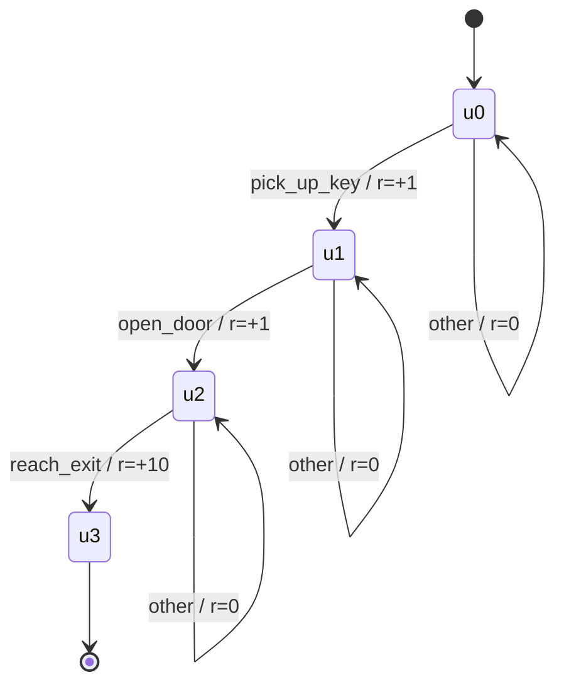

Standard RL algorithms assume the reward signal depends only on the current state. But many real tasks are structured and sequential: "first pick up the key, *then* open the door, *then* reach the exit." This kind of history-dependent reward breaks the Markov assumption. **Reward machines** address the problem by encoding task structure as a finite-state automaton that emits rewards as the agent progresses.

## Concept Introduction

Consider teaching an agent to make a cup of tea. The full reward only comes at the end, but the agent needs intermediate guidance: boil water (+1), add teabag (+1), steep for 3 minutes (+1), then pour (+1). These steps must happen *in order*. Doing them in the wrong order earns no reward.

A **reward machine** is a finite-state machine (FSM) where:
- Each **state** tracks how far along the task the agent is
- Each **edge** is labeled with a condition (something that happened in the environment) and an associated reward
- The machine reads events and transitions between states, emitting shaped rewards along the way

Formally, a reward machine is a tuple $\mathcal{R} = (U, u_0, F, \delta_u, \delta_r)$ where:
- $U$ is a finite set of machine states (task stages)
- $u_0 \in U$ is the initial machine state
- $F \subseteq U$ is the set of terminal states
- $\delta_u : U \times 2^\mathcal{P} \to U$ is the transition function over propositional symbols $\mathcal{P}$
- $\delta_r : U \times 2^\mathcal{P} \to \mathbb{R}$ is the reward function

At each environment step, the agent observes state $s$, takes action $a$, and receives a truth assignment $\ell \in 2^\mathcal{P}$ (e.g., "key-picked-up = true"). The machine transitions:

$$u_{t+1} = \delta_u(u_t, \ell_t), \quad r_t = \delta_r(u_t, \ell_t)$$

The full agent state becomes the augmented pair $(s_t, u_t)$, which *is* Markovian, even though the original reward was not.

## Historical & Theoretical Context

The idea of using automata to specify rewards emerged from the temporal logic and formal verification community. In the 1990s, researchers explored **Linear Temporal Logic (LTL)** for expressing robot task specifications. However, translating LTL formulae into practical reward signals for learning agents was cumbersome.

The breakthrough came with **Icarte et al. (2018)**, "Using Reward Machines for High-Level Task Specification and Decomposition in Reinforcement Learning" (ICML 2018). They showed that:

1. Reward machines can compactly represent non-Markovian reward functions
2. The augmented MDP $(s, u)$ restores the Markov property
3. Counterfactual reasoning (learning from *what would have happened* in other machine states) dramatically accelerates learning

The connection to **automata-theoretic model checking** (Vardi, Wolper, 1986) is deep: reward machines are essentially deterministic finite automata (DFAs) over propositional symbols, a fragment of LTL.

## Algorithms & Math

### Q-Learning for Reward Machines (QRM)

The standard approach augments Q-learning with the machine state:

$$Q(s, u, a) \leftarrow Q(s, u, a) + \alpha \left[ r + \gamma \max_{a'} Q(s', u', a') - Q(s, u, a) \right]$$

where $u' = \delta_u(u, \ell)$ and $r = \delta_r(u, \ell)$.

The key acceleration: **counterfactual experience sharing**. After each transition $(s, a, \ell, s')$, the agent updates *all* machine states simultaneously:

```
for each machine state u in U:
    u' = delta_u(u, l)           # where would we be if we were in state u?
    r  = delta_r(u, l)
    update Q(s, u, a) using (r, s', u')
```

This effectively runs $|U|$ parallel Q-learners that share environment transitions, yielding a massive sample efficiency gain.

### Reward Machine + HRL

Reward machines compose naturally with hierarchical RL. Each machine state $u$ defines a **subgoal**: learn a policy $\pi_u$ that achieves the propositional condition on the next edge. The machine state serves as an automatic subgoal curriculum:

$$\pi^*(s, u) = \text{policy optimized for reaching } \delta_u(u, \cdot) \text{ from state } u$$

The overall policy decomposes as: follow $\pi_u$ until a transition fires, then switch to $\pi_{u'}$.

### Pseudocode

```
Initialize: Q(s, u, a) = 0 for all s, u, a
            current_machine_state u = u_0

for each episode:
    s = env.reset()
    u = u_0
    while not done:
        a = epsilon_greedy(Q(s, u, *))
        s', l = env.step(a)          # l = propositional labels observed

        # Update ALL machine states (counterfactual)
        for each u_cf in U:
            u_cf_next = delta_u(u_cf, l)
            r_cf      = delta_r(u_cf, l)
            Q(s, u_cf, a) += alpha * (r_cf + gamma * max_a' Q(s', u_cf_next, a') - Q(s, u_cf, a))

        u = delta_u(u, l)            # actual machine transition
        s = s'
```

## Design Patterns & Architectures

Reward machines slot naturally into several agent architecture patterns:

In the **planner-executor** pattern, the reward machine *is* the plan. The current machine state tells the executor which subgoal to pursue, and when a subgoal is achieved (edge condition fires), the planner advances the machine.

In an **event-driven architecture**, environment events (propositions becoming true) drive machine transitions. This maps cleanly onto message-passing systems where tools or sensors publish events.

For **compositional task design**, complex tasks are built from simpler machines using automata operations (product, union, concatenation). A "coffee-making" machine, for example, can be composed from a "water-boiling" machine and a "cup-preparation" machine.



## Practical Application

Here's a minimal reward machine implementation and integration with a tabular RL agent:

```python
from dataclasses import dataclass, field
from typing import Callable, Dict, Set, Tuple, Any
import numpy as np
from collections import defaultdict

@dataclass
class RewardMachine:
    """A finite-state automaton that specifies task structure and emits rewards."""
    states: Set[str]
    initial_state: str
    terminal_states: Set[str]
    # transitions[(u, frozenset(props))] -> (next_u, reward)
    transitions: Dict[Tuple[str, frozenset], Tuple[str, float]]

    def step(self, state: str, labels: Set[str]) -> Tuple[str, float]:
        key = (state, frozenset(labels))
        if key in self.transitions:
            return self.transitions[key]
        # Default: stay, zero reward
        return state, 0.0

    def is_terminal(self, state: str) -> bool:
        return state in self.terminal_states


def build_key_door_machine() -> RewardMachine:
    """
    Task: pick up key, open door, reach exit (in order).
    Labels: 'key', 'door', 'exit'
    """
    return RewardMachine(
        states={"u0", "u1", "u2", "u3"},
        initial_state="u0",
        terminal_states={"u3"},
        transitions={
            ("u0", frozenset({"key"})): ("u1", 1.0),
            ("u1", frozenset({"door"})): ("u2", 1.0),
            ("u2", frozenset({"exit"})): ("u3", 10.0),
        },
    )


class QRMAgent:
    """Q-learning for Reward Machines with counterfactual updates."""

    def __init__(self, rm: RewardMachine, n_states: int, n_actions: int,
                 alpha: float = 0.1, gamma: float = 0.99, epsilon: float = 0.1):
        self.rm = rm
        self.alpha = alpha
        self.gamma = gamma
        self.epsilon = epsilon
        # Q[(env_state, machine_state, action)]
        self.Q = defaultdict(float)
        self.machine_states = list(rm.states)
        self.n_actions = n_actions

    def act(self, env_state: int, machine_state: str) -> int:
        if np.random.random() < self.epsilon:
            return np.random.randint(self.n_actions)
        q_values = [self.Q[(env_state, machine_state, a)] for a in range(self.n_actions)]
        return int(np.argmax(q_values))

    def update(self, s: int, a: int, labels: Set[str], s_next: int):
        """Counterfactual update across all machine states."""
        for u in self.machine_states:
            u_next, r = self.rm.step(u, labels)
            best_next = max(self.Q[(s_next, u_next, a2)] for a2 in range(self.n_actions))
            td_target = r + self.gamma * best_next
            self.Q[(s, u, a)] += self.alpha * (td_target - self.Q[(s, u, a)])


# --- Usage sketch with a grid-world environment ---
def run_episode(env, agent: QRMAgent, rm: RewardMachine) -> float:
    s = env.reset()
    u = rm.initial_state
    total_reward = 0.0

    for _ in range(200):
        a = agent.act(s, u)
        s_next, labels = env.step(a)    # env returns propositional labels
        agent.update(s, a, labels, s_next)

        u_next, r = rm.step(u, labels)
        total_reward += r
        s, u = s_next, u_next

        if rm.is_terminal(u):
            break

    return total_reward
```

This pattern integrates with **LangGraph**: the reward machine state maps to the graph's current node, and edge conditions correspond to tool-call outcomes or LLM-extracted propositions.

## Latest Developments & Research

**Learning reward machines from data (2019–2023)**: Several papers tackle the inverse problem of inferring the reward machine structure from agent trajectories. Icarte et al. (2019) showed this can be framed as a SAT problem. Furelos-Blanco et al. (2021, 2023) use inductive logic programming (ILP) to learn machines from minimal examples.

**Reward machines + LLMs (2023–2025)**: A natural synthesis: use an LLM to *generate* the reward machine from a natural language task description, then use QRM for efficient learning. The LLM handles the symbolic abstraction; the RM handles the credit assignment. Papers from NeurIPS 2024 demonstrated this pipeline on household task benchmarks.

**Probabilistic reward machines**: Extensions handle noisy or stochastic propositional labels, important for real-world sensor uncertainty. The machine transitions become distributions rather than deterministic mappings.

**Temporal logic RL (TLTL, LTL2Action)**: Projects like `ltl2action` (Illanes et al., 2020) and `safety-gym` integrate LTL specifications directly into training loops, with reward machines as the compilation target.

**Open problems**: Can we *automatically discover* the right propositional vocabulary? How do reward machines scale to continuous-state robotics tasks where propositions must be extracted from raw perception?

## Cross-Disciplinary Insight

Reward machines are formally identical to **Mealy machines** from automata theory, and to process algebra specifications from concurrent systems design. BPMN (Business Process Model and Notation) diagrams, state machines in XState, and saga patterns in distributed systems all encode the same intuition: complex processes are sequences of stages, and completion of each stage triggers the next.

In **neuroscience**, the basal ganglia and prefrontal cortex are thought to implement something like a hierarchical state machine for goal-directed behavior. The machine state $u$ parallels what neuroscientists call the "task set" (a configuration of rules and goals currently active in working memory).

The connection to **event sourcing** in software architecture is direct: the propositional label stream $(\ell_0, \ell_1, \ell_2, \ldots)$ is an event log, and the reward machine is a stateful projection over that log.

## Daily Challenge

**Build a coffee-machine reward machine.**

Model the following task for a kitchen robot:
1. Fill kettle with water
2. Boil kettle
3. Place coffee in cup
4. Pour hot water into cup
5. Wait 3 minutes (model as 3 consecutive "wait" steps)
6. Remove grounds
7. Optionally add milk (if "milk_requested" label is true)

Questions to answer:
- Draw the state diagram (or implement it in code)
- How do you handle the optional milk step? (Hint: parallel branches in the machine)
- What happens if the agent pours water before boiling it? Add a "failure" terminal state
- Write a QRM update loop and measure how many fewer episodes it needs vs. standard Q-learning on a toy grid world

```python
# Starter: implement the machine and a simulate_episode function
# that returns total_reward and episode_length

def build_coffee_machine() -> RewardMachine:
    # Your implementation here
    pass
```

## References & Further Reading

### Foundational Papers
- **"Using Reward Machines for High-Level Task Specification and Decomposition in Reinforcement Learning"**, Icarte et al., ICML 2018. The original reward machine paper.
- **"Reward Machines: Exploiting Reward Function Structure in Reinforcement Learning"**, Icarte et al., JAIR 2022. Extended journal version with theoretical analysis.
- **"Learning Reward Machines for Partially Observable Environments"**, Icarte et al., NeurIPS 2019. Infers machine structure from data.

### Temporal Logic & Formal Methods
- **"From LTL and PLTL to Automata for Pattern Recognition in Discrete and Continuous-Time Signals"**: a bridge to the signal temporal logic world
- **"LTL2Action: Generalizing LTL Instructions for Multi-Task RL"**, Illanes et al., ICML 2020

### Libraries & Code
- **jair-2020/reward-machines**: Reference implementation from the JAIR paper: `github.com/jair-2020/reward-machines`
- **ltl2action**: Integrates LTL task specs into Gym environments
- **FOND planning with reward machines**: Connects to classical AI planning under nondeterminism

### Blog Posts & Tutorials
- **"Reward Machines Explained"**: Lilian Weng's blog covers automata-based RL methods in her RL overview
- **"Specifying Agent Tasks with Temporal Logic"**: DeepMind technical blog, 2023

---
