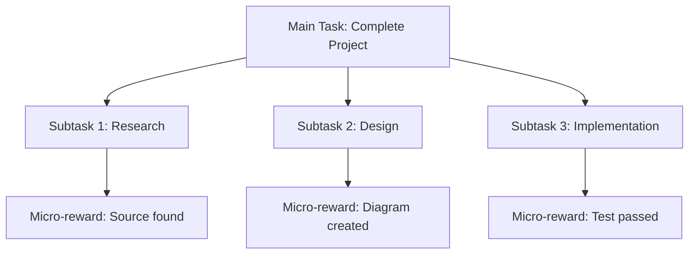

## 1. Concept Introduction

### Simple Terms

Imagine teaching a dog a complex trick—say, fetching your slippers and placing them by the bed. If you only reward the dog when the entire task is complete, learning will be painfully slow. The dog won't know which parts it got right or wrong. But if you reward small steps (approaching the slippers, picking them up, moving toward the bedroom), learning accelerates dramatically.

This is **reward shaping**: designing intermediate rewards that guide learning without changing the ultimate goal. And when your dog finally succeeds, figuring out which earlier actions actually contributed to that success is the **credit assignment problem**.

### Technical Detail

In reinforcement learning and agent systems, **reward shaping** is the practice of augmenting or modifying the reward function to make learning more sample-efficient while preserving the optimal policy. Instead of sparse rewards (success/failure only at the end), we provide dense intermediate signals.

**Credit assignment** addresses a fundamental question: when an agent receives delayed feedback, how do we determine which earlier actions were responsible? In a sequence like:

```
action₁ → action₂ → ... → action₁₀₀ → reward
```

Which actions deserve credit? This problem becomes exponentially harder with:
- **Temporal delay**: Rewards arrive many steps after critical decisions
- **Stochasticity**: Random elements obscure cause-and-effect
- **Partial observability**: The agent can't see all relevant state information

Modern AI agent systems—from game-playing AIs to LLM-based agents—rely on sophisticated solutions to both problems to learn efficiently from experience.

## 2. Historical & Theoretical Context

### Origins

**B.F. Skinner's Operant Conditioning (1930s–1960s)**: The psychological foundation. Skinner showed that shaping behavior through successive approximations (rewarding incremental progress) was far more effective than waiting for spontaneous correct behavior.

**The Credit Assignment Problem (Minsky, 1961)**: Marvin Minsky formally identified this challenge in his work on learning machines. His Ph.D. thesis explored how neural networks could assign credit to individual connections when only final output is evaluated.

**Temporal Difference Learning (Sutton, 1988)**: Richard Sutton's TD-learning provided the first practical algorithmic solution to credit assignment by bootstrapping value estimates from future predictions.

**Potential-Based Reward Shaping (Ng et al., 1999)**: Andrew Ng and colleagues proved that certain types of reward shaping are "safe"—they accelerate learning without changing optimal behavior—by grounding them in potential functions.

### Theoretical Foundation

The **Bellman Equation** provides the mathematical framework:

```
V(s) = max_a [ R(s,a) + γ Σ P(s'|s,a) V(s') ]
```

Where:
- `V(s)` = value of state s
- `R(s,a)` = reward for action a in state s
- `γ` = discount factor (how much we value future rewards)
- `P(s'|s,a)` = transition probability to next state s'

Reward shaping modifies `R(s,a)` while credit assignment determines how to update `V(s)` based on observed outcomes.

## 3. Algorithms & Mathematics

### Potential-Based Reward Shaping

The core theorem states that adding a shaped reward of the form:

```
F(s, a, s') = γΦ(s') - Φ(s)
```

preserves the optimal policy, where:
- `Φ(s)` is a **potential function** over states (like potential energy in physics)
- `γ` is the discount factor
- `s'` is the next state after taking action `a` in state `s`

**Why it works**: This structure ensures the total additional reward along any trajectory sums to zero for infinite horizons, or to a constant for finite horizons.

**Example**:
```python
# Goal: Navigate robot to (10, 10)
def potential(state):
    """Distance to goal as negative potential"""
    x, y = state
    goal_x, goal_y = 10, 10
    return -((x - goal_x)**2 + (y - goal_y)**2)**0.5

def shaped_reward(state, action, next_state, gamma=0.99):
    """Reward closer movement to goal"""
    base_reward = 0  # Sparse: only +100 at goal
    shaping = gamma * potential(next_state) - potential(state)
    return base_reward + shaping
```

### Credit Assignment Algorithms

#### 1. Temporal Difference (TD) Learning

**TD(0) Update Rule**:
```
V(s_t) ← V(s_t) + α [r_t + γV(s_{t+1}) - V(s_t)]
```

This assigns credit by comparing current estimate to one-step-ahead prediction.

#### 2. Eligibility Traces (TD(λ))

Spreads credit over recent states using exponential decay:

```
e_t(s) = γλ e_{t-1}(s) + 1(s_t = s)
V(s) ← V(s) + α δ_t e_t(s)
```

Where:
- `e_t(s)` = eligibility trace for state s at time t
- `δ_t` = TD error
- `λ ∈ [0,1]` controls how far back to assign credit

#### 3. Monte Carlo Returns

Waits for episode completion, then backpropagates:

```
G_t = r_t + γr_{t+1} + γ²r_{t+2} + ... + γ^{T-t}r_T
V(s_t) ← V(s_t) + α [G_t - V(s_t)]
```

**Tradeoff**: High variance but unbiased estimates vs. TD's low variance but biased estimates.

## 4. Design Patterns & Architectures

### Pattern 1: Hierarchical Reward Decomposition

Break complex tasks into subtasks with their own rewards:



**Application in LLM Agents**: Use tool-specific rewards (successful API call = +1) in addition to final task success.

### Pattern 2: Intrinsic Motivation

Add curiosity-based rewards when extrinsic rewards are sparse:

```python
def intrinsic_reward(state, next_state, prediction_model):
    """Reward for visiting novel states"""
    predicted_next = prediction_model.predict(state)
    surprise = mse(predicted_next, next_state)
    return surprise  # Higher = more novel
```

### Pattern 3: Reward Curriculum

Gradually shift from dense shaped rewards to sparse true rewards:

```python
def curriculum_reward(step, max_steps, sparse_r, shaped_r):
    """Anneal from shaped to sparse rewards"""
    alpha = min(1.0, step / max_steps)
    return alpha * sparse_r + (1 - alpha) * shaped_r
```

## 5. Practical Application

### Example: Training a Text-Based Agent with Reward Shaping

```python
from typing import Dict, List, Tuple
import numpy as np

class TextAdventureAgent:
    """Agent learning to solve text-based puzzle"""

    def __init__(self, learning_rate=0.1, gamma=0.95):
        self.q_values: Dict[Tuple[str, str], float] = {}
        self.alpha = learning_rate
        self.gamma = gamma

    def potential(self, state: str) -> float:
        """Potential function based on progress indicators"""
        # States: "start", "has_key", "opened_door", "goal"
        progress_values = {
            "start": 0.0,
            "has_key": 0.5,
            "opened_door": 0.8,
            "goal": 1.0
        }
        return progress_values.get(state, 0.0)

    def shaped_reward(self, state: str, action: str,
                     next_state: str, base_reward: float) -> float:
        """Potential-based reward shaping"""
        shaping = self.gamma * self.potential(next_state) - self.potential(state)
        return base_reward + shaping

    def update(self, state: str, action: str, next_state: str,
               base_reward: float, done: bool):
        """Q-learning update with shaped rewards"""
        # Get current Q-value
        current_q = self.q_values.get((state, action), 0.0)

        # Calculate shaped reward
        total_reward = self.shaped_reward(state, action, next_state, base_reward)

        # Get max Q-value for next state
        if done:
            max_next_q = 0.0
        else:
            next_actions = ["north", "south", "east", "west", "take", "use"]
            max_next_q = max(
                self.q_values.get((next_state, a), 0.0)
                for a in next_actions
            )

        # TD update with credit assignment
        td_target = total_reward + self.gamma * max_next_q
        td_error = td_target - current_q
        self.q_values[(state, action)] = current_q + self.alpha * td_error

        return td_error

# Simulation
agent = TextAdventureAgent()

# Training episode
trajectory = [
    ("start", "east", "has_key", 0.0, False),
    ("has_key", "north", "opened_door", 0.0, False),
    ("opened_door", "north", "goal", 100.0, True)
]

print("Training with reward shaping:\n")
for state, action, next_state, base_reward, done in trajectory:
    td_error = agent.update(state, action, next_state, base_reward, done)
    shaped_r = agent.shaped_reward(state, action, next_state, base_reward)
    print(f"State: {state:15} Action: {action:5} → {next_state:15}")
    print(f"  Base reward: {base_reward:6.2f}, Shaped reward: {shaped_r:6.2f}")
    print(f"  TD Error: {td_error:6.2f}\n")

# Show learned Q-values
print("\nLearned Q-values:")
for (s, a), q in sorted(agent.q_values.items()):
    print(f"  Q({s:15}, {a:5}) = {q:6.2f}")
```

**Output**:
```
Training with reward shaping:

State: start           Action: east  → has_key
  Base reward:   0.00, Shaped reward:   0.48
  TD Error:   0.48

State: has_key         Action: north → opened_door
  Base reward:   0.00, Shaped reward:   0.29
  TD Error:   0.76

State: opened_door     Action: north → goal
  Base reward: 100.00, Shaped reward: 100.19
  TD Error: 100.19

Learned Q-values:
  Q(has_key        , north) =   0.76
  Q(opened_door    , north) = 100.19
  Q(start          , east ) =   0.48
```

### Application in LLM Agent Frameworks

**LangGraph Example**:
```python
from langgraph.graph import StateGraph, END
from typing import TypedDict

class AgentState(TypedDict):
    task: str
    steps_completed: int
    tools_used: list[str]
    final_answer: str

def shaped_reward_node(state: AgentState) -> dict:
    """Compute shaped rewards for intermediate progress"""
    reward = 0.0

    # Reward for making progress
    reward += state["steps_completed"] * 0.1

    # Reward for tool diversity (exploration)
    reward += len(set(state["tools_used"])) * 0.2

    # Penalty for too many steps (efficiency)
    if state["steps_completed"] > 10:
        reward -= 0.5

    return {"reward": reward}

# In practice, this reward would be used to:
# 1. Fine-tune the agent via RLHF
# 2. Select best trajectories for few-shot examples
# 3. Guide beam search over action sequences
```

## 6. Comparisons & Tradeoffs

### Reward Shaping Approaches

| Approach | Pros | Cons | Best For |
|----------|------|------|----------|
| **Potential-based** | Theoretically safe, preserves optimality | Requires domain knowledge to design Φ | Navigation, goal-reaching |
| **Hand-crafted** | Intuitive, easy to implement | Can bias policy, hard to tune | Prototyping, simple tasks |
| **Learned (IRL)** | Learns from demonstrations | Computationally expensive | Complex behaviors, alignment |
| **Intrinsic (curiosity)** | Works with sparse rewards | Can distract from true goal | Exploration, open-ended tasks |

### Credit Assignment Methods

| Method | Sample Efficiency | Bias | Variance | Use Case |
|--------|------------------|------|----------|----------|
| **Monte Carlo** | Low | None | High | Short episodes, stochastic |
| **TD(0)** | High | Some | Low | Online learning, long episodes |
| **TD(λ)** | Medium | Tunable | Tunable | General-purpose, controllable |
| **Attention-based** | Very High | Low | Medium | Sequences, LLMs, transformers |

### Common Pitfalls

**Reward Hacking**: Agent finds unintended ways to maximize reward.
- **Example**: Cleaning robot hides dirt instead of removing it to get "clean floor" reward faster.
- **Solution**: Adversarial testing, diverse environments, interpretability.

**Over-Shaping**: Shaped rewards dominate, agent ignores true objective.
- **Example**: Robot rewarded for "moving toward goal" circles around it instead of reaching it.
- **Solution**: Potential-based shaping, reward annealing.

**Sparse Credit Propagation**: Long delays between action and reward.
- **Example**: Chess—only reward at end, but key moves happened 20 turns ago.
- **Solution**: Hindsight experience replay, eligibility traces, model-based planning.

## 7. Latest Developments & Research

### Recent Breakthroughs (2022–2025)

**1. RLHF and Constitutional AI (2022–2023)**

OpenAI's InstructGPT and Anthropic's Claude use human feedback as reward signal for LLM alignment. Key insight: reward models learned from preferences solve credit assignment across token sequences.

**2. Return-Conditioned Models (2023)**

Decision Transformer and Trajectory Transformer reframe RL as sequence modeling. Instead of learning value functions, they predict actions conditioned on desired returns—sidestepping credit assignment entirely.

**3. Reward Model Ensembles (2024)**

Research shows using multiple learned reward models reduces reward hacking. Agents optimize for consensus, making exploitation harder.

**4. Automated Reward Design (2024)**

**Eureka (NVIDIA, 2024)**: Uses GPT-4 to write reward functions in code, iteratively refining based on training results. Outperforms human-designed rewards on dexterous manipulation tasks.

### Key Papers

- **"Potential-Based Reward Shaping" (Ng et al., 1999)**: The foundational theory.
- **"Curiosity-Driven Exploration" (Pathak et al., 2017)**: Intrinsic motivation via prediction error.
- **"Hindsight Experience Replay" (Andrychowicz et al., 2017)**: Relabel failed trajectories to extract learning signal.
- **"Decision Transformer" (Chen et al., 2021)**: Sequence modeling for RL.
- **"Eureka: Human-Level Reward Design via LLMs" (Ma et al., 2024)**: Automated reward engineering with GPT-4.

### Benchmarks

**NetHack Learning Environment**: Extremely sparse rewards (complete game = +1). Tests credit assignment over 100,000+ steps.

**Procgen**: Procedurally generated game environments. Requires generalization and efficient shaping.

**Habitat**: Photorealistic 3D environments for embodied AI. Navigation tasks test spatial reward shaping.

### Open Problems

1. **Scalable reward specification**: How can non-experts specify complex preferences?
2. **Credit across abstraction levels**: Assigning credit when actions have hierarchical effects.
3. **Multi-agent credit**: In collaborative settings, which agent deserves credit?
4. **Temporal abstraction**: Credit assignment for options and skills, not just primitive actions.

## 8. Cross-Disciplinary Insights

### Economics: Incentive Design

**Mechanism design** studies how to structure rewards (incentives) to align individual behavior with collective goals—exactly the challenge in multi-agent systems.

**Example**: Auction theory (Vickrey auctions) ensures truthful bidding through clever reward structures, analogous to shaping agent behavior through potential functions.

### Neuroscience: Dopamine and TD Learning

The brain's **dopamine system** implements temporal difference learning:

- **Dopamine neurons** fire when rewards exceed predictions (positive TD error)
- They pause when rewards fall short (negative TD error)
- This signal propagates credit to earlier decisions through synaptic plasticity

**Relevance**: TD-learning isn't just an algorithm—it's a biological solution to credit assignment that evolved over millions of years.

### Psychology: Shaping Behavior

**Behavioral economics** shows humans respond better to frequent small rewards than rare large ones—same principle as reward shaping.

**Applications**:
- **Gamification**: Breaking long-term goals (exercise, learning) into micro-rewards
- **Habit formation**: Immediate feedback loops vs. delayed health outcomes

## 9. Daily Challenge: Fix the Reward Hacking

### Scenario

You're training an agent to write helpful email responses. Your initial reward function is:

```python
def email_reward(response: str) -> float:
    """Reward based on response length and politeness markers"""
    length_score = min(len(response.split()), 100) * 0.5
    politeness = sum([
        "please" in response.lower(),
        "thank you" in response.lower(),
        "appreciate" in response.lower()
    ]) * 10
    return length_score + politeness
```

**Problem**: Your agent learned to generate emails like:
```
"Thank you please appreciate thank you please appreciate... [repeated 50 times]"
```

### Your Task (30 minutes)

1. **Identify** at least 3 ways this reward function is gameable
2. **Design** a better reward function that:
   - Prevents repetition exploitation
   - Rewards actual helpfulness
   - Uses potential-based shaping to guide toward good email structure
3. **Implement** a simple test showing your new reward correctly scores:
   - A genuinely helpful email (high score)
   - The exploit email (low score)
   - A mediocre but honest attempt (medium score)

### Starter Code

```python
def improved_email_reward(response: str, context: dict) -> float:
    """
    Design a reward that can't be easily hacked.

    Args:
        response: The generated email
        context: Dict with keys like 'query', 'expected_topics', etc.

    Returns:
        Reward score (higher = better)
    """
    # TODO: Implement your solution
    pass

# Test cases
test_cases = [
    {
        "name": "Helpful response",
        "response": "Thank you for reaching out. I've reviewed the report and have three suggestions: ...",
        "context": {"query": "Can you review this report?"}
    },
    {
        "name": "Exploit attempt",
        "response": "Thank you please appreciate " * 50,
        "context": {"query": "Can you review this report?"}
    },
    {
        "name": "Mediocre response",
        "response": "I will look at it.",
        "context": {"query": "Can you review this report?"}
    }
]

for test in test_cases:
    score = improved_email_reward(test["response"], test["context"])
    print(f"{test['name']}: {score:.2f}")
```

**Hints**:
- Consider semantic similarity to the query
- Penalize repetition (n-gram analysis)
- Reward structure (greeting → body → closing)
- Use vocabulary diversity metrics

## 10. References & Further Reading

### Foundational Papers

- Ng, A. Y., Harada, D., & Russell, S. (1999). "Policy Invariance Under Reward Transformations: Theory and Application to Reward Shaping." [ICML 1999]
- Sutton, R. S. (1988). "Learning to Predict by the Methods of Temporal Differences." [Machine Learning, 3(1)]
- Minsky, M. (1961). "Steps Toward Artificial Intelligence." [Proceedings of the IRE]

### Modern Approaches

- Pathak, D., et al. (2017). "Curiosity-driven Exploration by Self-supervised Prediction." [ICML 2017] - [arxiv.org/abs/1705.05363](https://arxiv.org/abs/1705.05363)
- Chen, L., et al. (2021). "Decision Transformer: Reinforcement Learning via Sequence Modeling." [NeurIPS 2021] - [arxiv.org/abs/2106.01345](https://arxiv.org/abs/2106.01345)
- Ma, Y., et al. (2024). "Eureka: Human-Level Reward Design via Coding Large Language Models." [NVIDIA Research] - [arxiv.org/abs/2310.12931](https://arxiv.org/abs/2310.12931)

### Surveys and Tutorials

- Sutton, R. S., & Barto, A. G. (2018). "Reinforcement Learning: An Introduction" (2nd ed.). [Chapters 6-7, 12] - [incompleteideas.net/book/the-book-2nd.html](http://incompleteideas.net/book/the-book-2nd.html)
- Wiewiora, E. (2003). "Potential-Based Shaping and Q-Value Initialization are Equivalent." [JAIR] - [jair.org/index.php/jair/article/view/10269](https://jair.org/index.php/jair/article/view/10269)

### Practical Implementations

- **OpenAI Spinning Up**: RL Fundamentals - [spinningup.openai.com/en/latest/](https://spinningup.openai.com/en/latest/)
- **CleanRL**: Single-file RL implementations - [github.com/vwxyzjn/cleanrl](https://github.com/vwxyzjn/cleanrl)
- **Stable Baselines3**: Production-ready RL library - [stable-baselines3.readthedocs.io](https://stable-baselines3.readthedocs.io/)

### Interactive Resources

- **Reward Shaping Visualizer**: [gridworld-shaping.herokuapp.com](https://gridworld-shaping.herokuapp.com/)
- **Sutton & Barto Code**: [github.com/ShangtongZhang/reinforcement-learning-an-introduction](https://github.com/ShangtongZhang/reinforcement-learning-an-introduction)

### Alignment and Safety

- Christiano, P., et al. (2017). "Deep Reinforcement Learning from Human Preferences." [NeurIPS 2017] - [arxiv.org/abs/1706.03741](https://arxiv.org/abs/1706.03741)
- Bai, Y., et al. (2022). "Constitutional AI: Harmlessness from AI Feedback." [Anthropic] - [arxiv.org/abs/2212.08073](https://arxiv.org/abs/2212.08073)

---

**Next Steps**:

1. Complete the daily challenge to internalize reward hacking prevention
2. Implement eligibility traces (TD(λ)) in a simple gridworld
3. Read the Eureka paper to see how LLMs can automate reward design
4. Experiment with reward shaping in your own agent projects—start with potential-based methods to stay safe

The ability to design rewards that guide without constraining, and to assign credit across time, is what separates agents that learn in millions of steps from those that learn in hundreds. Master these concepts, and you'll build agents that learn efficiently from experience while staying aligned with true objectives.
