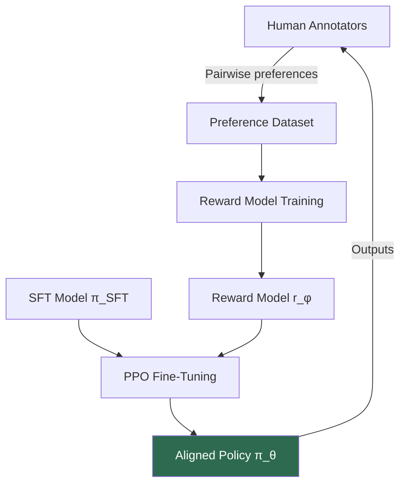

Your agent is technically perfect. It produces grammatically correct, factually accurate responses. And users hate it. It's too verbose. Too hedging. Too robotic. Classic optimization: you got exactly what you asked for, but not what you wanted.

This gap — between measurable objectives and human intent — is what **Reinforcement Learning from Human Feedback (RLHF)** was designed to close. It's the core algorithm behind ChatGPT, Claude, Gemini, and nearly every modern aligned language model. If you want to build agents people actually enjoy using, understanding RLHF is non-negotiable.

## 1. Concept Introduction

### Simple Explanation

Imagine training a dog. You don't program a reward function that assigns +1 for sitting and -2 for chewing shoes. You watch the dog, react to its behavior, and it gradually learns to do what pleases you — even in novel situations.

RLHF works the same way for language models. A human evaluator is shown two agent responses and picks which is better. A **reward model** learns to predict these preferences. Then the agent is trained to produce outputs that score highly on the reward model — while not drifting too far from its original behavior.

### Technical Detail

The full RLHF pipeline has three stages:

1. **Supervised Fine-Tuning (SFT)**: Fine-tune a base LLM on high-quality demonstrations to get a well-behaved starting point.
2. **Reward Model Training**: Train a separate model $r_\phi(x, y)$ to predict which of two completions $y_w$ (winner) vs $y_l$ (loser) a human prefers, given prompt $x$.
3. **RL Fine-Tuning**: Use the reward model as a proxy reward signal to optimize the policy $\pi_\theta$ with PPO, while adding a KL-divergence penalty against the SFT model to prevent reward hacking.

## 2. Historical & Theoretical Context

The idea of learning reward functions from human feedback predates LLMs by decades. Key milestones:

- **1983 – Inverse Optimal Control** (Kalman): Inferring objectives from observed behavior.
- **2017 – "Deep Reinforcement Learning from Human Preferences"** (Christiano et al., OpenAI/DeepMind): Demonstrated RLHF on Atari and MuJoCo with pairwise comparisons — no hand-designed reward needed.
- **2020 – InstructGPT** (Ouyang et al., OpenAI): Applied RLHF to GPT-3, producing a model much preferred by human raters despite being 100× smaller.
- **2022 – ChatGPT**: Brought RLHF to mass consumer awareness.
- **2023 – DPO** (Rafailov et al.): Eliminated the RL phase entirely, solving preference learning directly through supervised fine-tuning.

The theoretical underpinning comes from **utility theory** and the **Bradley-Terry model** of paired comparisons — a framework originally developed for chess ranking in the 1950s.

## 3. Algorithms & Math

### The Bradley-Terry Preference Model

Given a prompt $x$ and two completions $y_w$ and $y_l$, humans prefer $y_w$ with probability:

$$P(y_w \succ y_l \mid x) = \sigma\!\left(r^*(x, y_w) - r^*(x, y_l)\right)$$

where $r^*(x, y)$ is a latent true reward and $\sigma$ is the sigmoid function. We can't observe $r^*$, so we train a parametric reward model $r_\phi$ by minimizing the negative log-likelihood over a dataset $\mathcal{D}$ of human preferences:

$$\mathcal{L}_{\text{RM}}(\phi) = -\mathbb{E}_{(x, y_w, y_l) \sim \mathcal{D}}\left[\log \sigma\!\left(r_\phi(x, y_w) - r_\phi(x, y_l)\right)\right]$$

### PPO with KL Penalty

Once we have $r_\phi$, we optimize the policy with a KL-penalized objective:

$$\max_{\pi_\theta} \; \mathbb{E}_{x \sim \mathcal{D},\, y \sim \pi_\theta(\cdot \mid x)}\!\left[r_\phi(x, y)\right] - \beta \cdot D_{\text{KL}}\!\left(\pi_\theta(\cdot \mid x) \;\|\; \pi_{\text{SFT}}(\cdot \mid x)\right)$$

The KL term (weighted by $\beta$) prevents the model from exploiting the reward model in degenerate ways — like generating gibberish that scores high but isn't actually good.

### Direct Preference Optimization (DPO)

DPO (Rafailov et al., 2023) showed that the optimal solution to the KL-penalized RL objective can be written analytically, giving a supervised loss directly over preferences:

$$\mathcal{L}_{\text{DPO}}(\theta) = -\mathbb{E}_{(x, y_w, y_l)}\!\left[\log \sigma\!\left(\beta \log \frac{\pi_\theta(y_w \mid x)}{\pi_{\text{ref}}(y_w \mid x)} - \beta \log \frac{\pi_\theta(y_l \mid x)}{\pi_{\text{ref}}(y_l \mid x)}\right)\right]$$

No reward model. No RL loop. Just fine-tuning.

### Pseudocode for the RLHF Pipeline

```
# Stage 1: Supervised Fine-Tuning
sft_model = fine_tune(base_model, demonstrations)

# Stage 2: Reward Model Training
reward_model = RM(sft_model)  # Initialize from SFT
for (prompt, chosen, rejected) in preference_dataset:
    r_chosen = reward_model(prompt, chosen)
    r_rejected = reward_model(prompt, rejected)
    loss = -log(sigmoid(r_chosen - r_rejected))
    update(reward_model, loss)

# Stage 3: PPO Fine-Tuning
policy = copy(sft_model)
ref_policy = copy(sft_model)  # Frozen reference
for batch in prompts:
    responses = policy.generate(batch)
    rewards = reward_model(batch, responses)
    kl = kl_divergence(policy, ref_policy, batch)
    ppo_objective = rewards - beta * kl
    update_via_ppo(policy, ppo_objective)
```

## 4. Design Patterns & Architectures

RLHF slots into agent architectures in several ways:



**RLHF as a feedback loop pattern**: The aligned policy generates outputs, which enter a human evaluation loop, which improves the reward model, which improves the policy. This mirrors classic control theory's observe–evaluate–correct cycle.

**Integration with agent frameworks**: In agentic settings, RLHF typically trains the underlying LLM that powers the agent's reasoning. But recent work applies preference learning directly to *trajectories* — entire sequences of agent actions — rather than single responses.

## 5. Practical Application

Here's a minimal DPO training loop using Hugging Face's `trl` library:

```python
from datasets import Dataset
from trl import DPOTrainer, DPOConfig
from transformers import AutoModelForCausalLM, AutoTokenizer

model_name = "Qwen/Qwen2.5-1.5B-Instruct"

model = AutoModelForCausalLM.from_pretrained(model_name)
ref_model = AutoModelForCausalLM.from_pretrained(model_name)  # Frozen reference
tokenizer = AutoTokenizer.from_pretrained(model_name)

# Preference dataset: each row has a prompt, chosen, and rejected response
preference_data = [
    {
        "prompt": "Explain recursion to a 10-year-old.",
        "chosen": "Imagine a Russian doll — each doll contains a smaller version of itself. Recursion works the same way: a function calls itself on a smaller problem until it's simple enough to solve directly.",
        "rejected": "Recursion is when a function calls itself. It requires a base case to terminate the recursive calls and prevent stack overflow.",
    },
    {
        "prompt": "What is the capital of France?",
        "chosen": "Paris is the capital of France.",
        "rejected": "The capital city of France, a country located in Western Europe, is Paris, which is also its largest city.",
    },
]

dataset = Dataset.from_list(preference_data)

training_args = DPOConfig(
    output_dir="./dpo-output",
    num_train_epochs=3,
    per_device_train_batch_size=2,
    learning_rate=5e-7,
    beta=0.1,           # KL penalty weight
    loss_type="sigmoid", # Standard DPO loss
    logging_steps=10,
)

trainer = DPOTrainer(
    model=model,
    ref_model=ref_model,
    args=training_args,
    train_dataset=dataset,
    tokenizer=tokenizer,
)

trainer.train()
```

For **agentic trajectory-level preference learning**, you'd build preference pairs over full action sequences:

```python
# Trajectory-level preference dataset
trajectory_preferences = [
    {
        "prompt": "Book me a flight to Tokyo for next week.",
        "chosen": [
            {"tool": "search_flights", "args": {"destination": "Tokyo", "date": "2026-03-08"}},
            {"tool": "filter_results", "args": {"max_price": 1200, "direct_only": False}},
            {"tool": "book_flight", "args": {"flight_id": "NH106"}},
        ],
        "rejected": [
            {"tool": "search_hotels", "args": {"city": "Tokyo"}},  # Wrong order
            {"tool": "search_flights", "args": {"destination": "Tokyo"}},
        ],
    }
]
```

## 6. Comparisons & Tradeoffs

| Method | Reward Model | RL Phase | Stability | Data Efficiency | Notes |
|---|---|---|---|---|---|
| **RLHF (PPO)** | Yes | Yes | Low | Moderate | Original, most powerful but unstable |
| **DPO** | No | No | High | High | Simpler, widely adopted |
| **IPO** | No | No | High | High | Fixes overfitting in DPO |
| **ORPO** | No | No | High | High | No reference model needed |
| **RLAIF** | AI feedback | Yes | Moderate | Very High | Scales without human annotators |
| **Constitutional AI** | Implicit | Yes | Moderate | High | Self-critique based |

**Key tradeoffs**:
- RLHF with PPO is more flexible but notoriously unstable — hyperparameter sensitivity can derail training.
- DPO is stable and simple but can overfit to the preference dataset and struggles with out-of-distribution prompts.
- Reward models can be **hacked**: the policy finds inputs that score high without genuinely improving.

## 7. Latest Developments & Research

**SimPO (Simple Preference Optimization, 2024)** eliminates the reference model while using average log-probability as an implicit reward, outperforming DPO on AlpacaEval 2 and MT-Bench.

**Online DPO** (Guo et al., 2024) uses the model's own current generations as the source of preference pairs rather than a fixed dataset, closing the distribution shift gap that hurts offline DPO.

**SPIN (Self-Play Fine-Tuning, 2024)** frames alignment as a two-player game: the current policy tries to fool a discriminator that distinguishes model outputs from human demonstrations. No human preference labels required.

**Process Reward Models (PRMs)** (Lightman et al., OpenAI, 2023): Instead of rating full outputs, reward each reasoning *step* separately. Critical for math and code, where a correct final answer can follow from flawed intermediate steps.

**Trajectory-level RLHF for agents**: Recent work (e.g., AgentTuning, 2024) applies preference learning to full agent trajectories collected from real environments, teaching agents better tool-use and planning behaviors rather than just response style.

## 8. Cross-Disciplinary Insight

RLHF is deeply rooted in **psychometrics and social choice theory**. The Bradley-Terry model was originally developed by R.A. Bradley and M.E. Terry in 1952 for ranking sports teams from win-loss data. The Thurstone model (1927) preceded it with a similar structure for psychological scaling.

In **economics**, this mirrors revealed preference theory (Samuelson, 1938): you can't directly observe utility, but you can infer it from choices. RLHF operationalizes this: instead of asking "what do you want?", we observe "which of these two do you prefer?" — a much more reliable signal.

The instability of RL fine-tuning also echoes **control theory**: high-gain feedback loops amplify noise, and the KL penalty acts as a stabilizing damping term. The deeper insight is that any system trying to maximize a proxy of a true objective will eventually diverge — Goodhart's Law in action.

## 9. Daily Challenge

**Exercise: Build a Mini Preference Dataset**

Pick any task where subjective quality matters (writing style, explanation clarity, code readability). Generate 10–20 pairs of responses from a small model (Qwen-1.5B, Phi-3.8B, etc.) and manually annotate your preferences. Then:

1. Calculate the **inter-annotator agreement** if you have a friend annotate the same pairs — you'll be surprised how often humans disagree.
2. Train a simple reward model: a small classifier that takes the concatenated [prompt + response] as input and predicts your preference score.
3. **Thought experiment**: If you used your reward model to generate more training data automatically (RLAIF), what biases might compound?

**Bonus**: Implement the DPO loss from scratch:

```python
import torch
import torch.nn.functional as F

def dpo_loss(logits_chosen, logits_rejected, ref_logits_chosen, ref_logits_rejected, beta=0.1):
    """
    logits_*: log-probabilities of chosen/rejected under the policy
    ref_logits_*: log-probabilities under the frozen reference model
    """
    policy_ratio_chosen = logits_chosen - ref_logits_chosen
    policy_ratio_rejected = logits_rejected - ref_logits_rejected
    loss = -F.logsigmoid(beta * (policy_ratio_chosen - policy_ratio_rejected))
    return loss.mean()
```

Run it with a few synthetic examples and observe how the loss changes as you vary $\beta$.

## 10. References & Further Reading

### Foundational Papers
- **"Deep Reinforcement Learning from Human Preferences"** (Christiano et al., 2017): https://arxiv.org/abs/1706.03741
- **"Training Language Models to Follow Instructions with Human Feedback"** (Ouyang et al., 2022): https://arxiv.org/abs/2203.02155
- **"Direct Preference Optimization: Your Language Model is Secretly a Reward Model"** (Rafailov et al., 2023): https://arxiv.org/abs/2305.18290

### Recent Advances
- **"SimPO: Simple Preference Optimization with a Reference-Free Reward"** (Meng et al., 2024): https://arxiv.org/abs/2405.14734
- **"SPIN: Self-Play Fine-Tuning Converts Weak Language Models to Strong Language Models"** (Chen et al., 2024): https://arxiv.org/abs/2401.01335
- **"Let's Verify Step by Step"** (Lightman et al., 2023): https://arxiv.org/abs/2305.20050

### Libraries & Tools
- **TRL (Transformer Reinforcement Learning)**: https://github.com/huggingface/trl — Hugging Face's library for RLHF and DPO
- **OpenRLHF**: https://github.com/OpenRLHF/OpenRLHF — Large-scale RLHF framework
- **Argilla**: https://github.com/argilla-io/argilla — Human preference annotation tooling

### Blog Posts
- **"RLHF: Reinforcement Learning from Human Feedback"** (Hugging Face, 2023): Deep dive with code
- **"DPO: Direct Preference Optimization"** (Chip Huyen's blog): Intuition and derivation

---

## Key Takeaways

1. **RLHF bridges the gap** between measurable metrics and what humans actually prefer — a gap that purely supervised training can't close.
2. **Three stages**: SFT baseline → reward model from pairwise preferences → RL fine-tuning with KL penalty.
3. **DPO is simpler**: it eliminates the reward model and RL loop, turning alignment into supervised fine-tuning.
4. **Reward hacking is real**: any proxy reward will eventually be exploited; KL penalties and diverse preference data help, but don't eliminate the problem.
5. **RLHF scales beyond responses**: applying preference learning to full agent trajectories is an active research frontier.
6. **The math is classical**: Bradley-Terry, revealed preferences, Goodhart's Law — alignment problems are fundamentally about the gap between proxies and true objectives.

The deep lesson of RLHF isn't algorithmic — it's epistemological. You can't fully specify what you want in advance. The best you can do is show the system examples of better and worse, and trust it to generalize. That's not so different from how humans learn to do most things.
