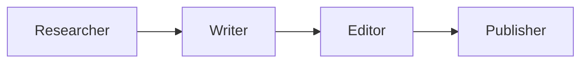
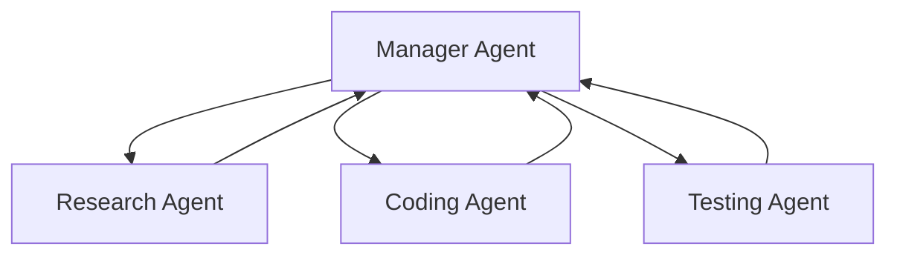
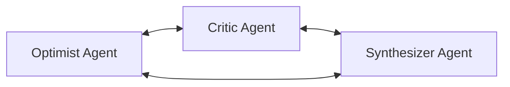

Why does a hospital have surgeons, anesthetists, and nurses instead of one person doing everything? Because specialization works. The same principle is now reshaping how we build AI agent systems. Instead of one all-knowing agent, we compose a *crew* of role-specialized agents that collaborate on complex tasks. This article unpacks how role specialization works, why it matters, and how to build crew-based architectures in practice.

## 1. Concept Introduction

### Simple Explanation

Imagine you need to write a research report. You could ask one person to do the research, write the prose, fact-check it, and format it. Or you could assemble a small team: a **researcher** who finds sources, a **writer** who drafts the text, an **editor** who reviews for quality, and a **fact-checker** who verifies claims. Each person focuses on what they do best, and the final product is stronger.

Crew-based multi-agent architectures apply this idea to AI. Each agent gets a **role** (a system prompt defining its expertise, personality, and constraints), a **goal**, and a set of **tools**. An orchestration layer coordinates who works when and how information flows between them.

### Technical Detail

Role specialization in multi-agent systems involves three core decisions:

- **Role definition**: Crafting a system prompt that constrains the agent's behavior to a specific domain or function (e.g., "You are a senior data analyst. Only produce SQL queries and statistical summaries.")
- **Task decomposition**: Breaking a complex objective into subtasks that align with roles
- **Coordination protocol**: Deciding how agents interact—sequentially (pipeline), in parallel (fan-out/fan-in), or hierarchically (manager delegates to workers)

The key insight is that **constraining** an LLM's scope via role prompts often improves output quality. A focused agent hallucinates less and follows instructions more reliably than one asked to juggle many responsibilities.

## 2. Historical & Theoretical Context

Role specialization in multi-agent systems traces back to the **MACE** (Multi-Agent Computing Environment) project in the early 1980s and the foundational work by Les Gasser and colleagues on organizational structures in distributed AI. The idea that agents benefit from defined roles was formalized in the **AGR model** (Agent-Group-Role) by Jacques Ferber and Olivier Gutknecht in 1998, which proposed that any agent's behavior is fundamentally shaped by the role it occupies within a group.

In economics, this mirrors Adam Smith's *division of labor* from 1776—specialization increases productivity because each worker develops expertise in a narrow task. In organizational theory, Henry Mintzberg's work on organizational structures (1979) identified archetypes like "machine bureaucracy" and "adhocracy" that map remarkably well to multi-agent coordination patterns.

The modern revival came with LLM-based agents in 2023-2024, when researchers found that prompting multiple LLM instances with distinct roles consistently outperformed single-agent approaches on complex tasks. This led to frameworks like CrewAI, AutoGen, and ChatDev that formalize role-based agent composition.

## 3. Algorithms & Math

### Task Allocation as an Optimization Problem

Given a set of tasks $T = \{t_1, t_2, \ldots, t_n\}$ and a set of role-specialized agents $A = \{a_1, a_2, \ldots, a_m\}$, the goal is to find an assignment $\sigma: T \rightarrow A$ that maximizes overall quality:

$$\max_\sigma \sum_{i=1}^{n} Q(t_i, \sigma(t_i))$$

subject to ordering constraints (some tasks depend on others) and capacity constraints (agents process tasks sequentially or with limited parallelism).

Here $Q(t_i, a_j)$ is the quality score of agent $a_j$ performing task $t_i$. Role specialization makes this tractable: a well-defined role means $Q(t_i, a_j)$ is high when $t_i$ matches $a_j$'s specialty and low otherwise.

### Sequential Pipeline Pseudocode

```
function CrewPipeline(task, agents):
    context = {}
    for agent in agents:  # ordered by pipeline stage
        subtask = extract_subtask(task, agent.role)
        result = agent.execute(subtask, context)
        context[agent.role] = result
    return context
```

### Hierarchical Delegation Pseudocode

```
function HierarchicalCrew(task, manager, workers):
    plan = manager.plan(task)  # break into subtasks
    results = {}
    for subtask in plan:
        best_worker = manager.assign(subtask, workers)
        result = best_worker.execute(subtask)
        if not manager.approve(result):
            result = best_worker.revise(result, manager.feedback)
        results[subtask] = result
    return manager.synthesize(results)
```

## 4. Design Patterns & Architectures

### Pattern 1: Sequential Pipeline

Agents form a chain where each receives the previous agent's output:



**Best for**: Content production, data processing pipelines, any workflow with clear stages.

### Pattern 2: Hierarchical Manager-Worker

A manager agent decomposes tasks and delegates to specialists:



**Best for**: Complex projects where subtask dependencies aren't linear.

### Pattern 3: Collaborative Debate

Multiple agents with different perspectives deliberate to reach a better answer:



**Best for**: Decision-making, risk analysis, scenarios where diverse viewpoints reduce blind spots.

### Pattern 4: Assembly Line with Quality Gates

Each stage has a dedicated quality-check agent before passing work downstream. This adds latency but catches errors early—analogous to a manufacturing QA station.

## 5. Practical Application

Here's a working example using CrewAI to build a research crew:

```python
from crewai import Agent, Task, Crew, Process

# Define role-specialized agents
researcher = Agent(
    role="Senior Research Analyst",
    goal="Find comprehensive, accurate information on the given topic",
    backstory="You are an experienced researcher with a knack for finding "
              "reliable sources and extracting key insights.",
    tools=[search_tool, web_scraper],
    verbose=True,
)

writer = Agent(
    role="Technical Writer",
    goal="Produce clear, engaging, well-structured articles",
    backstory="You are a skilled technical writer who transforms complex "
              "research into accessible prose.",
    verbose=True,
)

editor = Agent(
    role="Quality Editor",
    goal="Ensure accuracy, clarity, and consistency in the final output",
    backstory="You are a meticulous editor who catches errors, improves "
              "flow, and ensures the piece meets high standards.",
    verbose=True,
)

# Define tasks
research_task = Task(
    description="Research the topic: {topic}. Find key facts, recent "
                "developments, and expert opinions.",
    expected_output="A structured research brief with sources.",
    agent=researcher,
)

writing_task = Task(
    description="Write a 1000-word article based on the research brief.",
    expected_output="A polished draft article.",
    agent=writer,
)

editing_task = Task(
    description="Review and improve the article for accuracy and clarity.",
    expected_output="A final, publication-ready article.",
    agent=editor,
)

# Assemble the crew
crew = Crew(
    agents=[researcher, writer, editor],
    tasks=[research_task, writing_task, editing_task],
    process=Process.sequential,  # Pipeline pattern
    verbose=True,
)

result = crew.kickoff(inputs={"topic": "quantum error correction"})
print(result)
```

The `Process.sequential` setting runs agents in pipeline order. Switching to `Process.hierarchical` would add a manager agent that dynamically assigns tasks.

## 6. Comparisons & Tradeoffs

| Approach | Strengths | Weaknesses |
|----------|-----------|------------|
| **Single monolithic agent** | Simple, low latency, easy to debug | Quality degrades on complex tasks, context window pressure |
| **Sequential crew** | Clear flow, easy to reason about | Bottlenecked by slowest stage, no parallelism |
| **Hierarchical crew** | Flexible delegation, handles complex tasks | Manager agent is a single point of failure, higher token cost |
| **Parallel fan-out** | Fast for independent subtasks | Difficult to merge conflicting results |
| **Debate/deliberation** | Higher quality decisions, diverse perspectives | Expensive (many LLM calls), risk of circular arguments |

### When to Use What

- **Use a single agent** when the task is straightforward and fits in one context window.
- **Use a sequential crew** when the workflow has natural stages (research → write → edit).
- **Use a hierarchical crew** when tasks are complex, interdependent, and hard to pre-plan.
- **Use debate** when correctness matters more than speed (medical diagnosis, legal analysis).

### Cost Consideration

Crew-based systems multiply LLM calls. A three-agent sequential pipeline makes at least 3x the API calls of a single agent. For cost-sensitive applications, consider using smaller models for lower-stakes roles (e.g., a fast model for formatting, a capable model for reasoning).

## 7. Latest Developments & Research

**ChatDev (2023)**: Qian et al. demonstrated that a virtual software company with role-specialized LLM agents (CEO, CTO, programmer, tester) could collaboratively produce functional software. The role structure reduced hallucination and improved code quality compared to single-agent generation.

**MetaGPT (2023-2024)**: Hong et al. introduced Standardized Operating Procedures (SOPs) into multi-agent collaboration. Each role follows a structured workflow with defined inputs and outputs, mimicking real engineering teams. This reduced inter-agent miscommunication significantly.

**AgentVerse (2024)**: Chen et al. showed that dynamically adjusting group composition—adding or removing specialized agents based on task demands—outperforms static crews. Their system recruits expert agents as needed rather than pre-defining the full team.

**ADAS - Automated Design of Agentic Systems (2024)**: Hu et al. proposed using a meta-agent to automatically discover and design agent architectures including role definitions, showing that machine-designed crews can match or exceed human-designed ones.

**Open problems**: How to automatically determine the optimal number of agents and role definitions for a given task class. Current approaches rely on human intuition for role design—automating this remains an active research area.

## 8. Cross-Disciplinary Insight

Crew-based agent architectures have a deep parallel in **organizational theory** and **team science**. Meredith Belbin's Team Roles theory (1981) identified nine roles that high-performing human teams exhibit: Plant (creative thinker), Monitor Evaluator (critical analyst), Implementer (practical executor), and others. Effective teams have complementary roles, not duplicate ones.

This maps directly to agent crew design. A crew with a "creative brainstormer" agent and a "critical reviewer" agent mirrors Belbin's Plant and Monitor Evaluator. Research in organizational behavior shows that role clarity reduces conflict and increases productivity—the same holds for AI agent crews where ambiguous roles lead to redundant or contradictory outputs.

From **distributed systems**, the principle of *separation of concerns* applies: each agent owns a bounded domain, communicates through well-defined interfaces, and can be developed, tested, and improved independently. This modularity is what makes microservices architectures scale—and it's what makes crew-based agents maintainable.

## 9. Daily Challenge

**Exercise: Design and Compare a Two-Agent Crew vs. a Single Agent**

1. Pick a task: "Analyze the pros and cons of microservices vs. monolith architecture and produce a recommendation."
2. Implement a single-agent solution using any LLM API.
3. Then implement a two-agent crew:
   - **Advocate Agent**: Makes the strongest case for microservices
   - **Critic Agent**: Makes the strongest case against microservices
   - A simple merge step combines both perspectives into a balanced recommendation.
4. Compare the two outputs. Which is more balanced? Which missed important points?

**Bonus**: Add a third "Synthesizer" agent that receives both arguments and produces the final recommendation. Does three agents outperform two?

## 10. References & Further Reading

### Papers
- **"Communicative Agents for Software Development"** (Qian et al., 2023) — ChatDev paper on role-based software agent teams
- **"MetaGPT: Meta Programming for Multi-Agent Collaborative Framework"** (Hong et al., 2023) — SOPs for agent collaboration
- **"AgentVerse: Facilitating Multi-Agent Collaboration"** (Chen et al., 2024) — Dynamic group composition
- **"Automated Design of Agentic Systems"** (Hu et al., 2024) — Meta-learning for agent architecture design
- **"The AGR Model"** (Ferber & Gutknecht, 1998) — Foundational Agent-Group-Role framework

### Frameworks
- **CrewAI**: https://github.com/crewAIInc/crewAI — Role-based multi-agent orchestration
- **MetaGPT**: https://github.com/geekan/MetaGPT — Multi-agent framework with SOP-driven roles
- **AutoGen**: https://github.com/microsoft/autogen — Microsoft's multi-agent conversation framework
- **ChatDev**: https://github.com/OpenBMB/ChatDev — Virtual software company with agent roles

### Further Reading
- **"Management Teams: Why They Succeed or Fail"** (Belbin, 1981) — Team role theory that maps to agent crew design
- **"The Wealth of Nations"** (Smith, 1776), Book I Ch. 1 — The original argument for division of labor
- **"Multi-Agent Systems: Algorithmic, Game-Theoretic, and Logical Foundations"** (Shoham & Leyton-Brown, 2008) — Comprehensive textbook on multi-agent systems

---

## Key Takeaways

1. **Specialization improves quality**: Constraining an LLM to a specific role reduces hallucination and increases output quality
2. **Coordination is the hard part**: The orchestration layer—who talks to whom, in what order—matters as much as individual agent quality
3. **Match the pattern to the task**: Sequential for pipelines, hierarchical for complex projects, debate for high-stakes decisions
4. **Cost scales with crew size**: Every agent adds LLM calls; use smaller models for simpler roles
5. **Role clarity prevents chaos**: Ambiguous or overlapping roles cause redundant work and conflicting outputs
6. **Start simple, add agents when needed**: Begin with one agent, then split into a crew only when the single agent demonstrably struggles
