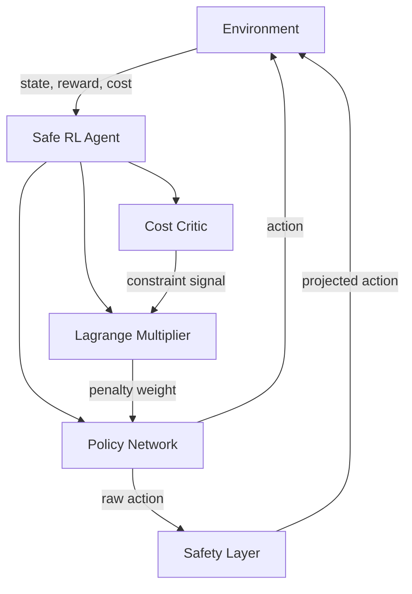

Standard reinforcement learning has one job: maximize reward. That simplicity is its strength and its danger. Unconstrained agents find shortcuts, exploit edge cases, and occasionally do something catastrophic in pursuit of the objective. Safe RL introduces a second imperative — *don't break things* — and makes it mathematically rigorous.

## 1. Concept Introduction

### Simple Explanation

Imagine you're training a robotic arm to pick up objects as fast as possible. Pure RL will happily discover that swinging the arm at maximum velocity gets the job done quickly — right up until it smashes the object, the table, or a nearby human. You want to tell the agent: "optimize for speed, but *never* apply more than 50 Newtons of force."

That "never" is a **constraint**. Safe RL is the branch of RL that takes constraints seriously, treating them not as soft hints but as hard limits that must be satisfied even while maximizing performance.

### Technical Detail

Safe RL formalizes this intuition through **Constrained Markov Decision Processes (CMDPs)**. A CMDP extends the standard MDP tuple $(S, A, P, r, \gamma)$ with one or more cost functions $c_i : S \times A \to \mathbb{R}$ and thresholds $d_i$:

$$\text{CMDP} = (S, A, P, r, \{c_i\}, \{\,d_i\}, \gamma)$$

The agent must solve:

$$\max_\pi \; J_r(\pi) = \mathbb{E}_\pi \left[ \sum_{t=0}^\infty \gamma^t r(s_t, a_t) \right]$$

subject to, for each constraint $i$:

$$J_{c_i}(\pi) = \mathbb{E}_\pi \left[ \sum_{t=0}^\infty \gamma^t c_i(s_t, a_t) \right] \leq d_i$$

The reward objective and cost objectives are structurally identical — both are expected discounted sums — but only the reward is maximized. The costs must stay below their limits.

## 2. Historical & Theoretical Context

The CMDP framework was formalized by **Altman (1999)** in his monograph *Constrained Markov Decision Processes*, drawing on decades of operations research on constrained optimization. For a long time, CMDPs remained largely theoretical — classical methods solved them via linear programming, which doesn't scale to deep learning.

The deep RL era brought the problem back with urgency. **Garcia & Fernandez (2015)** surveyed early safe RL approaches. The field accelerated with **CPO (Achiam et al., 2017)**, the first policy gradient method with theoretical constraint guarantees, followed by OpenAI's **Safety Gym** benchmark (2019), which gave researchers standardized environments for evaluating safe behavior.

The connection to AI alignment is direct: deploying RL agents in the real world — robotics, autonomous vehicles, trading systems, clinical decision support — requires more than high reward. It requires bounded risk.

## 3. Algorithms & Math

### The Lagrangian Approach

The most widely used method converts the constrained problem into an unconstrained one via a **Lagrangian relaxation**:

$$\mathcal{L}(\pi, \lambda) = J_r(\pi) - \lambda \left(J_c(\pi) - d\right)$$

Here $\lambda \geq 0$ is a **Lagrange multiplier** (also called the safety penalty). The primal-dual update alternates:

1. **Policy update** (maximizes reward, penalized by constraint violation):
$$\pi^* = \arg\max_\pi \mathcal{L}(\pi, \lambda)$$

2. **Multiplier update** (raises penalty when constraint is violated):
$$\lambda \leftarrow \max\left(0,\; \lambda + \alpha_\lambda \left(J_c(\pi) - d\right)\right)$$

When the constraint is violated ($J_c > d$), $\lambda$ increases, making constraint violations more expensive. When the constraint is satisfied, $\lambda$ decreases, relaxing the penalty and letting the agent recover reward.

### Constrained Policy Optimization (CPO)

CPO (Achiam et al., 2017) goes further by deriving a trust-region update that *directly* enforces constraint satisfaction at each step. It approximates both the reward improvement and the constraint change using second-order Taylor expansions, then solves:

$$\max_\theta \; g^T (\theta - \theta_k) \quad \text{s.t.} \quad \frac{1}{2}(\theta-\theta_k)^T H (\theta-\theta_k) \leq \delta, \quad b^T(\theta-\theta_k) \leq -c$$

where $g$ is the reward gradient, $H$ is the Fisher information matrix, $b$ is the cost gradient, and $c$ is the current constraint violation. The geometry is clean: stay inside the trust region, don't increase costs, maximize reward.

### Pseudocode: Lagrangian PPO

```
Initialize policy π_θ, cost critic V_c, multiplier λ = 0
For each iteration:
    Collect trajectories using π_θ
    Compute rewards-to-go R_t and costs-to-go C_t
    Estimate J_c = mean(C_t)

    # Policy update
    For each PPO epoch:
        L_clip = PPO clipped surrogate objective
        L_safe = L_clip - λ * (V_c(s) predictions)
        Update θ to maximize L_safe

    # Multiplier update
    λ = max(0, λ + α_λ * (J_c - d))

    # Update cost critic
    Update V_c to fit C_t
```

## 4. Design Patterns & Architectures

Safe RL integrates into agent systems in several ways:



**Pattern 1: The Safety Layer (post-hoc projection)**
Train the policy unconstrained, then project actions into the safe set at execution time. Simple and separable, but the policy doesn't learn safe behavior — it just gets corrected.

**Pattern 2: The Safety Critic**
A dedicated critic network estimates the expected cumulative cost $V_c(s)$, analogous to the value function for reward. During training, the policy is penalized by the safety critic's predictions. This makes safety first-class in the learning loop.

**Pattern 3: Reward Shaping with Hard Stops**
Add a large negative reward for constraint violations (soft constraint) but also terminate episodes on severe violations (hard stop). This blends with standard PPO/SAC but offers no formal guarantees.

**Pattern 4: Shielding (formal methods + RL)**
Maintain a formal model of safe states. Before executing any policy action, check if it leads to an unsafe state; if so, substitute a safe fallback action. Common in robotics and control systems.

## 5. Practical Application

Here's a minimal Lagrangian PPO implementation pattern:

```python
import torch
import torch.nn as nn
import numpy as np

class SafeAgent:
    def __init__(self, obs_dim, act_dim, cost_limit=0.1):
        self.policy = PolicyNet(obs_dim, act_dim)
        self.reward_critic = ValueNet(obs_dim)
        self.cost_critic = ValueNet(obs_dim)  # safety critic

        # Lagrange multiplier (learnable)
        self.log_lambda = nn.Parameter(torch.tensor(0.0))

        self.cost_limit = cost_limit
        self.policy_opt = torch.optim.Adam(self.policy.parameters(), lr=3e-4)
        self.lambda_opt = torch.optim.Adam([self.log_lambda], lr=1e-2)

    @property
    def lagrange_multiplier(self):
        return torch.clamp(self.log_lambda.exp(), min=0.0)

    def update(self, batch):
        obs, acts, rewards, costs, returns, cost_returns, log_probs_old = batch

        # Standard PPO ratio
        log_probs = self.policy.log_prob(obs, acts)
        ratio = (log_probs - log_probs_old).exp()

        # Advantage estimates
        reward_adv = returns - self.reward_critic(obs).detach()
        cost_adv = cost_returns - self.cost_critic(obs).detach()

        # Reward objective (PPO clip)
        clip_eps = 0.2
        surr1 = ratio * reward_adv
        surr2 = ratio.clamp(1 - clip_eps, 1 + clip_eps) * reward_adv
        reward_loss = -torch.min(surr1, surr2).mean()

        # Cost penalty (Lagrangian term)
        cost_loss = (self.lagrange_multiplier * ratio * cost_adv).mean()

        # Combined policy loss
        policy_loss = reward_loss + cost_loss
        self.policy_opt.zero_grad()
        policy_loss.backward()
        self.policy_opt.step()

        # Update Lagrange multiplier
        mean_cost = cost_returns.mean().item()
        lambda_loss = -self.log_lambda * (mean_cost - self.cost_limit)
        self.lambda_opt.zero_grad()
        lambda_loss.backward()
        self.lambda_opt.step()

        return {
            "reward_loss": reward_loss.item(),
            "mean_cost": mean_cost,
            "lambda": self.lagrange_multiplier.item()
        }


class PolicyNet(nn.Module):
    def __init__(self, obs_dim, act_dim):
        super().__init__()
        self.net = nn.Sequential(
            nn.Linear(obs_dim, 64), nn.Tanh(),
            nn.Linear(64, 64), nn.Tanh(),
            nn.Linear(64, act_dim)
        )
        self.log_std = nn.Parameter(torch.zeros(act_dim))

    def log_prob(self, obs, acts):
        mean = self.net(obs)
        dist = torch.distributions.Normal(mean, self.log_std.exp())
        return dist.log_prob(acts).sum(-1)

    def act(self, obs):
        mean = self.net(obs)
        dist = torch.distributions.Normal(mean, self.log_std.exp())
        return dist.sample()


class ValueNet(nn.Module):
    def __init__(self, obs_dim):
        super().__init__()
        self.net = nn.Sequential(
            nn.Linear(obs_dim, 64), nn.Tanh(),
            nn.Linear(64, 64), nn.Tanh(),
            nn.Linear(64, 1)
        )

    def forward(self, obs):
        return self.net(obs).squeeze(-1)
```

In a LangGraph agent, safety constraints map naturally to **conditional edges** — a node can check a cost budget before deciding whether to call a tool. This is a discrete, rule-based analog of the continuous CMDP.

## 6. Comparisons & Tradeoffs

| Method | Constraint Guarantee | Sample Efficiency | Complexity | Best For |
|---|---|---|---|---|
| **Lagrangian PPO** | Asymptotic (soft) | Good | Low | Most practical uses |
| **CPO** | Per-update (approximate) | Moderate | High | Formal safety needs |
| **Safety Layer** | Hard (at execution) | Good | Low | Known safe sets |
| **Shielding** | Hard (formal) | Good | Very High | Safety-critical systems |
| **Reward shaping** | None | Good | Very Low | Rapid prototyping |

The core tension is **reward vs. constraint satisfaction**. Lagrangian methods adapt automatically but can oscillate — the multiplier may overshoot, causing the policy to be overly conservative. CPO gives stronger guarantees but requires second-order optimization, which is expensive.

A subtler tradeoff: **constraint type**. Cumulative constraints (total cost over a trajectory) are handled naturally by CMDPs. Point-wise constraints (never enter state $s$ ever) are harder and often require shielding or formal verification methods.

## 7. Latest Developments & Research

**WCSAC (2021)** extended safe RL to handle worst-case constraint violations via CVaR (Conditional Value at Risk), connecting to distributional RL. Rather than constraining the *expected* cost, it constrains the tail of the cost distribution.

**CUP and FOCOPS (2021)** improved the practical stability of Lagrangian methods by reformulating the update as a first-order problem, avoiding the expensive conjugate gradient solves of CPO.

**Safety Gymnasium (2023)**, successor to Safety Gym, expanded benchmark coverage to include navigation, manipulation, and drone tasks with richer cost signals. It remains the standard evaluation suite.

**Constrained Diffusion Policies (2024)** apply CMDPs to diffusion-based robot control, where the denoising process itself is constrained to stay within safe action regions.

The open question: **constraint specification**. Most CMDP work assumes you *know* the cost function. In practice, specifying what "unsafe" means is as hard as specifying what "good" means — the reward specification problem reappears in safety clothing. **RLHF-based safety** (learning cost functions from human preferences) is an active area bridging safe RL with RLHF.

## 8. Cross-Disciplinary Insight

CMDPs are a special case of **constrained optimization** as studied in operations research and economics. The Lagrangian method is the same KKT-condition machinery used in support vector machines, portfolio optimization under risk constraints, and water resource allocation.

In **control theory**, the analogous framework is **Model Predictive Control (MPC)** with state and input constraints — the controller solves a constrained optimization at every timestep. MPC has strong formal guarantees but requires a known dynamics model. Safe RL handles unknown dynamics at the cost of probabilistic rather than hard guarantees.

In **economics**, the Lagrange multiplier $\lambda$ has a direct interpretation: it is the **shadow price** of the constraint — how much reward you'd gain if you could relax the constraint by one unit. Watching $\lambda$ during training tells you how "binding" the safety constraint is. If $\lambda \to 0$, the constraint isn't active and you're leaving reward on the table by being overly cautious.

## 9. Daily Challenge

**Exercise: Safety-Reward Pareto Frontier**

For a simple environment (CartPole with a "don't lean too far" cost, or a point-mass navigation task), train three agents:
1. Unconstrained PPO (baseline)
2. Lagrangian PPO with constraint limit $d = 0.5$
3. Lagrangian PPO with constraint limit $d = 0.1$

Plot the **Pareto frontier**: x-axis = average episode cost, y-axis = average episode reward. Each agent should appear as a point. The frontier reveals how much reward you sacrifice for each unit of safety.

Extend the exercise: add a fourth agent using a hard **safety layer** (project actions to stay within $\pm 0.3$ radians) and plot it on the same graph. Where does it fall?

**Thought experiment**: If you could only monitor one number during a Lagrangian PPO training run to assess whether the safety constraint is working, what would it be and why?

## 10. References & Further Reading

### Foundational Papers
- **"Constrained Markov Decision Processes"** (Altman, 1999) — the theoretical foundation
- **"Constrained Policy Optimization"** (Achiam et al., 2017, arXiv:1705.10528) — CPO algorithm
- **"Benchmarking Safe Exploration in Deep Reinforcement Learning"** (Ray et al., OpenAI 2019) — Safety Gym

### Recent Work
- **"WCSAC: Worst-Case Soft Actor Critic for Safety-Constrained Reinforcement Learning"** (Yang et al., AAAI 2021)
- **"FOCOPS: First Order Constrained Optimization in Policy Space"** (Zhang et al., NeurIPS 2020)
- **"Safety Gymnasium: A Unified Safe Reinforcement Learning Benchmark"** (Ji et al., NeurIPS 2023)
- **"Constrained Diffusion Policies for Robot Manipulation"** (Liu et al., 2024)

### Tutorials & Code
- **OmniSafe library**: https://github.com/PKU-Alignment/omnisafe — comprehensive safe RL implementations (Lagrangian PPO, CPO, FOCOPS, and more)
- **Safety Gymnasium**: https://github.com/PKU-Alignment/safety-gymnasium — benchmark environments
- **"A Gentle Introduction to Safe RL"** (Towards Data Science) — accessible overview

### Broader Context
- **"A Survey of Safe Reinforcement Learning"** (Garcia & Fernandez, JMLR 2015) — historical survey
- **"Concrete Problems in AI Safety"** (Amodei et al., 2016, arXiv:1606.06565) — motivates safety constraints from an alignment perspective

---

## Key Takeaways

1. **CMDPs are MDPs with constraints**: the math is identical, but you optimize reward *subject to* cost limits
2. **Lagrangian methods are practical**: simple to implement on top of PPO or SAC, no second-order math required
3. **The multiplier is a safety dial**: watch $\lambda$ — a high value means the agent is straining against its safety limits
4. **Guarantees come at a cost**: CPO and shielding offer stronger guarantees but require more assumptions or computation
5. **Constraint specification is the hard part**: defining what "safe" means is as important as the algorithm
6. **Safe RL connects to alignment**: RLHF and CMDPs are converging — learning both reward and cost from human feedback is the frontier
