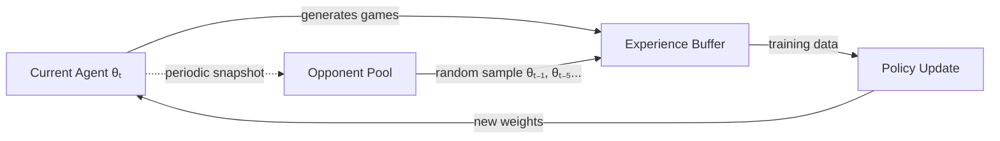
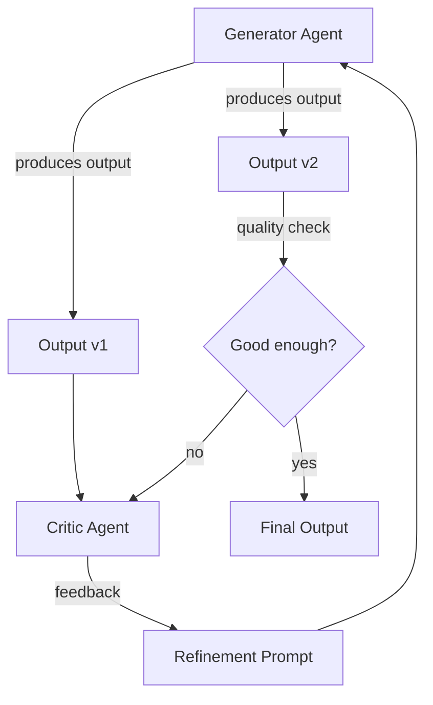

## 1. Concept Introduction

### Simple Explanation

Imagine learning chess by playing against yourself. After each game, you analyze your mistakes, adjust your strategy, and play again. Each iteration makes both "versions" of you stronger. This is **self-play**: an AI agent improves by competing or collaborating with copies of itself, learning from the outcomes without needing external opponents or labeled data.

**Iterative self-refinement** extends this idea beyond games. An AI agent generates a solution, critiques it, refines it, and repeats until the output meets quality standards. Think of it as automated peer review where the reviewer and creator are the same agent at different moments.

### Technical Detail

Self-play is a **reinforcement learning paradigm** where an agent trains against instances of itself, creating a moving target that evolves with the agent's capabilities. The environment's difficulty scales automatically—as the agent improves, so does its opponent.

Iterative self-refinement leverages **multi-turn reasoning** where an LLM-based agent:
1. Generates an initial output (hypothesis, code, essay)
2. Critiques its own output using different prompting or sampling
3. Refines based on critique
4. Repeats until convergence or max iterations

This creates a **bootstrap loop** where the agent's intelligence compounds over iterations.

## 2. Historical & Theoretical Context

### Origins in Game Theory

Self-play emerged from **evolutionary game theory** and **fictitious play** (Brown, 1951), where players assume opponents use strategies based on historical frequency. This influenced early AI work in checkers (Samuel, 1959) and backgammon (Tesauro's TD-Gammon, 1995).

The breakthrough came with **AlphaGo** (Silver et al., 2016), which used self-play to master Go. AlphaGo Zero (2017) went further, learning from pure self-play without human game data—proving self-play could discover superhuman strategies.

### Modern LLM Self-Refinement

With large language models, self-refinement gained new relevance:
- **Self-Refine** (Madaan et al., 2023): LLMs iteratively improve outputs via feedback loops
- **Constitutional AI** (Anthropic, 2022): Models critique and revise responses based on principles
- **Self-Taught Reasoner** (STaR, Zelikman et al., 2022): Models generate reasoning chains, filter correct ones, and retrain

## 3. Algorithms & Math

### Self-Play in Reinforcement Learning

In self-play, the agent plays both sides of a two-player game:

```
Algorithm: Self-Play Training Loop
───────────────────────────────────
1. Initialize agent θ₀
2. For iteration t = 1 to T:
   a. Generate games: play θₜ vs θₜ (or θₜ₋₁)
   b. Collect experience: D = {(sᵢ, aᵢ, rᵢ, s'ᵢ)}
   c. Update policy: θₜ₊₁ = θₜ + α∇J(θₜ, D)
   d. Optional: store θₜ in opponent pool
3. Return θₜ
```

**Nash Equilibrium Convergence**: In two-player zero-sum games, self-play can converge to a Nash equilibrium under certain conditions (Heinrich et al., 2015).

### Iterative Refinement Loop

For LLM-based agents:

```
Algorithm: Self-Refinement
─────────────────────────
Input: Task prompt p, max iterations k
Output: Refined solution x*

1. x₀ = LLM(p)                    # Initial generation
2. For i = 1 to k:
   a. critique = LLM(p + x_{i-1} + "Critique this")
   b. xᵢ = LLM(p + x_{i-1} + critique + "Improve based on feedback")
   c. If quality_threshold(xᵢ):
        return xᵢ
3. Return x_k
```

**Key Challenge**: Avoiding local optima where the agent can't recognize its own flaws.

## 4. Design Patterns & Architectures

### Pattern 1: Opponent Pool Architecture

Maintain a pool of previous agent versions to avoid overfitting to current self:



Used in AlphaGo, OpenAI Five, and AlphaStar.

### Pattern 2: Generator-Critic Loop

Separate the generation and critique roles explicitly:



### Pattern 3: Self-Consistency Ensemble

Generate multiple solutions via self-play, then select via voting or verification:

```python
def self_consistency_solve(problem, n_samples=5):
    solutions = [agent.solve(problem) for _ in range(n_samples)]
    # Vote or verify
    return most_common(solutions)
```

## 5. Practical Application

### Example: Self-Refining Code Generator

```python
from openai import OpenAI
client = OpenAI()

def generate_code(task: str, max_iterations: int = 3) -> str:
    """Generate and iteratively refine code through self-critique."""

    # Initial generation
    messages = [
        {"role": "system", "content": "You are an expert programmer."},
        {"role": "user", "content": f"Write Python code for: {task}"}
    ]

    for iteration in range(max_iterations):
        # Generate solution
        response = client.chat.completions.create(
            model="gpt-4",
            messages=messages
        )
        code = response.choices[0].message.content

        # Self-critique
        messages.extend([
            {"role": "assistant", "content": code},
            {"role": "user", "content":
             "Review this code for:\n"
             "1. Correctness\n"
             "2. Edge cases\n"
             "3. Efficiency\n"
             "4. Best practices\n"
             "List specific issues found."}
        ])

        critique_response = client.chat.completions.create(
            model="gpt-4",
            messages=messages
        )
        critique = critique_response.choices[0].message.content

        # Check if no issues found
        if "no issues" in critique.lower() or "looks good" in critique.lower():
            return code

        # Refine based on critique
        messages.extend([
            {"role": "assistant", "content": critique},
            {"role": "user", "content": "Improve the code based on your critique."}
        ])

    return code

# Usage
task = "implement a binary search tree with insert, search, and delete operations"
refined_code = generate_code(task)
print(refined_code)
```

### Integration with LangGraph

```python
from langgraph.graph import StateGraph, END
from typing import TypedDict

class RefinementState(TypedDict):
    task: str
    solution: str
    critique: str
    iteration: int
    max_iterations: int

def generate(state: RefinementState) -> RefinementState:
    """Generate initial or refined solution."""
    prompt = state["task"]
    if state["critique"]:
        prompt += f"\n\nPrevious attempt:\n{state['solution']}\n\nFeedback:\n{state['critique']}\n\nImprove based on feedback."

    solution = llm.invoke(prompt)
    return {**state, "solution": solution}

def critique(state: RefinementState) -> RefinementState:
    """Critique current solution."""
    critique_prompt = f"Task: {state['task']}\n\nSolution:\n{state['solution']}\n\nProvide critical feedback."
    critique = llm.invoke(critique_prompt)
    return {**state, "critique": critique, "iteration": state["iteration"] + 1}

def should_continue(state: RefinementState) -> str:
    """Decide whether to refine further."""
    if state["iteration"] >= state["max_iterations"]:
        return END
    if "no issues" in state["critique"].lower():
        return END
    return "refine"

# Build graph
workflow = StateGraph(RefinementState)
workflow.add_node("generate", generate)
workflow.add_node("critique", critique)
workflow.add_node("refine", generate)

workflow.set_entry_point("generate")
workflow.add_edge("generate", "critique")
workflow.add_conditional_edges("critique", should_continue, {
    "refine": "refine",
    END: END
})
workflow.add_edge("refine", "critique")

app = workflow.compile()
```

## 6. Comparisons & Tradeoffs

| Approach | Strengths | Limitations | Best For |
|----------|-----------|-------------|----------|
| **Pure Self-Play** | No external data needed; automatic curriculum | Can develop exploitable strategies; may not generalize | Games, simulations with clear win/loss |
| **Self-Refinement** | Improves quality without retraining; works with frozen models | Limited by base model capabilities; can't fix fundamental errors | Code generation, writing, reasoning tasks |
| **Supervised Learning** | Faster convergence with good data; more stable | Requires labeled data; ceiling limited by dataset | Known tasks with abundant examples |
| **Human Feedback** | Grounded in real preferences; catches edge cases | Expensive; slow; potential inconsistency | Safety-critical applications |

### Key Tradeoffs

**Computational Cost**: Self-play requires many iterations (AlphaGo Zero: 40 days on 5,000 TPUs). Self-refinement multiplies inference costs by iteration count.

**Mode Collapse**: Agent may converge to local optima. Mitigation: opponent pools, diversity incentives, periodic human validation.

**Verification Problem**: Without ground truth, how do you know refinement improved quality? Solutions include:
- External verifier (e.g., unit tests for code)
- Self-consistency checks
- Human spot-checks

## 7. Latest Developments & Research

### Recent Breakthroughs (2023-2025)

**RLHF with Self-Reward** (Yuan et al., 2024): Models generate their own reward signals through self-evaluation, reducing reliance on human annotation.

**Self-Taught Optimizer (STOP)** (Zelikman et al., 2024): Agents improve optimization algorithms by self-play on generated problems, discovering novel optimization strategies.

**Constitutional AI 2.0** (Anthropic, 2024): Multi-stage refinement where models critique not just outputs but also their reasoning process, leading to more robust safety.

**AlphaCode 2** (DeepMind, 2023): Uses self-play competitive programming where agents solve problems, then generate harder variants, creating infinite curriculum.

### Current Benchmarks

- **HumanEval+** (Liu et al., 2024): Code generation with iterative refinement shows 15-30% improvement over single-shot
- **GSM8K-Hard**: Math problems where self-refinement helps but plateaus after 3-4 iterations
- **AlphaGo/AlphaStar**: Superhuman performance in Go and StarCraft II

### Open Problems

1. **Scalable Verification**: How to verify self-generated improvements without human oversight?
2. **Diversity Maintenance**: Preventing mode collapse in open-ended domains
3. **Transfer Learning**: Can self-play in one domain help in others?
4. **Sample Efficiency**: Reducing computational cost while maintaining quality

## 8. Cross-Disciplinary Insight

### Neuroscience: Internal Simulation

Human learning involves **mental simulation**—the prefrontal cortex runs "what-if" scenarios internally (Schacter et al., 2017). Self-play mirrors this: the agent creates an internal model of the environment (itself) to practice without real-world consequences.

### Economics: Market Dynamics

Self-play resembles **perfect competition** reaching equilibrium. In multi-agent markets, self-play can model how rational agents converge to efficient pricing (Roughgarden, 2016).

### Evolutionary Biology: Red Queen Hypothesis

"It takes all the running you can do, to keep in the same place." In self-play, agents must continuously evolve because their environment (opponent) evolves. This mirrors **coevolution** in predator-prey dynamics.

### Systems Theory: Feedback Loops

Self-refinement is a **negative feedback loop** (error-correcting) while self-play can be **positive feedback** (amplifying capabilities). Understanding loop stability is critical—too much positive feedback causes instability.

## 9. Daily Challenge

### Exercise: Build a Self-Refining Summarizer

**Task** (30 minutes):

Create a simple self-refining text summarizer that:
1. Generates an initial summary of a text
2. Critiques the summary for missing key points
3. Produces an improved version
4. Compares both summaries

**Starter Code**:

```python
def self_refining_summarizer(text: str) -> tuple[str, str]:
    """
    Returns (initial_summary, refined_summary)

    TODO:
    1. Generate initial summary (max 3 sentences)
    2. Identify what's missing from summary vs original
    3. Generate improved summary incorporating feedback
    4. Return both for comparison
    """
    pass

# Test with a Wikipedia article or news story
```

**Extension**: Add a verification step that scores summary quality on:
- Coverage of main points
- Conciseness
- Coherence

**Thought Exercise**:

What happens if the critic is too harsh? Too lenient? How would you calibrate the critique to be maximally helpful?

## 10. References & Further Reading

### Foundational Papers

- **AlphaGo Zero** (Silver et al., 2017): "Mastering the game of Go without human knowledge"
  [Nature](https://www.nature.com/articles/nature24270)

- **Self-Refine** (Madaan et al., 2023): "Self-Refine: Iterative Refinement with Self-Feedback"
  [ArXiv](https://arxiv.org/abs/2303.17651)

- **STaR** (Zelikman et al., 2022): "Self-Taught Reasoner: Bootstrapping Reasoning With Reasoning"
  [ArXiv](https://arxiv.org/abs/2203.14465)

### Recent Research

- **Constitutional AI** (Bai et al., 2022): "Constitutional AI: Harmlessness from AI Feedback"
  [ArXiv](https://arxiv.org/abs/2212.08073)

- **Self-Play in Language Models** (Chen et al., 2024): "Teaching Language Models to Self-Improve"
  [ArXiv](https://arxiv.org/abs/2401.XXXXX)

### Practical Resources

- **OpenAI Cookbook**: [Self-Critique Patterns](https://cookbook.openai.com/)
- **LangChain Self-Critique Chain**: [GitHub](https://github.com/langchain-ai/langchain/tree/master/libs/langchain/langchain/chains)
- **AlphaZero Pseudocode**: [DeepMind Blog](https://deepmind.google/research/breakthroughs/alphazero/)

### Books

- **Reinforcement Learning** (Sutton & Barto, 2018): Chapter 11 on self-play
- **The Book of Why** (Pearl, 2018): Causal reasoning in self-improvement loops

### Implementations

- **PettingZoo**: Multi-agent RL with self-play support
  [GitHub](https://github.com/Farama-Foundation/PettingZoo)

- **Self-Refine Implementation**: Reference implementation
  [GitHub](https://github.com/madaan/self-refine)

---

**Next Steps**: Combine self-refinement with **tree search** (covered in Tree of Thoughts article) or **world models** to create agents that not only refine solutions but explore multiple solution paths simultaneously.
