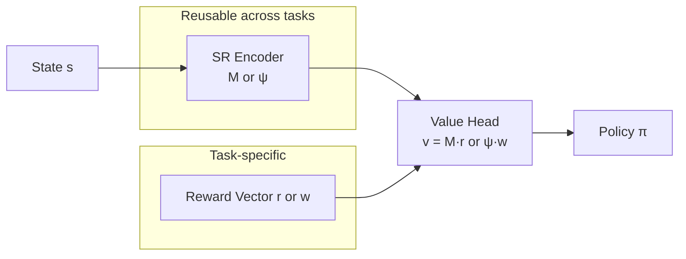

Imagine you're navigating a city you know well. When your favorite coffee shop closes, you don't need to relearn the entire city layout — you already know how to get to that neighborhood, so you just redirect your final step. Successor Representations (SRs) give an agent exactly this ability: a cached map of where each state leads, decoupled from what those destinations are worth.

## 1. Concept Introduction

### Simple Explanation

In standard Q-learning, an agent learns a single number per state-action pair: the expected cumulative reward. That number bakes together two things — the **structure of the environment** (where can you go from here?) and the **reward function** (what's valuable?).

Successor Representations separate these two concerns. The SR answers: *"If I start here and follow my current policy, which future states will I visit, and how often?"* The reward function then answers: *"What's each of those states worth?"*

The payoff: if the reward function changes — a new goal, a different task — you only need to update one half. The environmental map stays the same.

### Technical Detail

Formally, the SR for policy $\pi$ starting at state $s$ is:

$$M^\pi(s, s') = \mathbb{E}_\pi\left[\sum_{t=0}^{\infty} \gamma^t \mathbf{1}[s_t = s'] \;\middle|\; s_0 = s\right]$$

Here $M^\pi(s, s')$ counts the discounted expected number of future visits to state $s'$ when starting from state $s$ under policy $\pi$. Think of each row of the matrix $M^\pi$ as a "future occupancy fingerprint" of state $s$.

The key identity that makes this useful:

$$V^\pi(s) = \sum_{s'} M^\pi(s, s')\, r(s')$$

Or in matrix form: $\mathbf{v}^\pi = M^\pi \mathbf{r}$. The value function is just a **linear combination** of the SR rows, weighted by rewards. Change the reward vector $\mathbf{r}$ and you get the new value function instantly — no re-training required.

## 2. Historical & Theoretical Context

The Successor Representation was introduced by **Peter Dayan in 1993** ("Improving Generalization for Temporal Difference Learning: The Successor Representation", *Neural Computation*). Dayan noticed that TD learning was learning both environmental structure and reward signal simultaneously, making transfer between related tasks needlessly expensive.

The idea sat relatively quiet for two decades before a 2017 renaissance:

- **Momennejad et al. (2017)** showed that the human hippocampus appears to encode something strikingly like the SR, linking it to the neuroscience of place cells and cognitive maps.
- **Barreto et al. (2017)** generalized SRs to **Successor Features (SFs)** for continuous/deep settings, and proved the **Generalized Policy Improvement (GPI)** theorem, enabling cross-task transfer.

The SR sits in a conceptually clean sweet spot in the model-based / model-free spectrum, and that clarity has made it increasingly influential.

## 3. Algorithms & Math

### Computing the Tabular SR

The SR satisfies a Bellman-like equation:

$$M^\pi(s, s') = \mathbf{1}[s = s'] + \gamma \sum_{a} \pi(a|s) \sum_{s''} P(s''|s,a)\, M^\pi(s'', s')$$

In matrix form: $M^\pi = (I - \gamma P^\pi)^{-1}$, where $P^\pi$ is the policy-weighted transition matrix. This is the **resolvent** of the transition operator — a spectral fact that turns out to be deeply connected to graph theory and the geometry of state spaces.

### TD Learning for the SR

You can learn $M^\pi$ incrementally via a TD update that mirrors the Bellman equation above:

```
Initialize M(s, s') for all s, s' (e.g., M = Identity)

For each transition (s, a, s_next):
    For each s' in states:
        one_hot = 1 if s == s' else 0
        target  = one_hot + gamma * M(s_next, s')
        M(s, s') += alpha * (target - M(s, s'))
```

The one-hot term says "I'm in $s$ right now" and the bootstrapped remainder propagates future visitation forward — just like TD(0) for value learning.

### Successor Features (Deep Extension)

For continuous state spaces, replace state-indicator features with a learned feature function $\phi(s) \in \mathbb{R}^d$. The successor feature vector becomes:

$$\psi^\pi(s) = \mathbb{E}_\pi\left[\sum_{t=0}^{\infty} \gamma^t \phi(s_t) \;\middle|\; s_0 = s\right]$$

Reward is then approximated as $r(s) \approx \phi(s)^\top \mathbf{w}$, and the value function becomes:

$$V^\pi(s) = \psi^\pi(s)^\top \mathbf{w}$$

Transfer across tasks with different $\mathbf{w}$ — same environment structure — is then a simple inner product.

## 4. Design Patterns & Architectures

The SR creates a natural two-module agent architecture:



This connects naturally to several patterns:
- **Planner-Executor loop**: The SR acts as a cached forward model that the planner can query cheaply.
- **Memory architecture**: Each state's SR row is a retrievable "future trajectory summary", queryable like a key-value memory.
- **Skill libraries**: Different $\mathbf{w}$ vectors represent different goals; GPI selects the best available policy for any new task from a library.

## 5. Practical Application

```python
import numpy as np

class TabularSR:
    """
    Learns the Successor Representation M(s, s') via TD updates.
    Works with any discrete, finite MDP.
    """
    def __init__(self, n_states: int, gamma: float = 0.9, alpha: float = 0.1):
        self.gamma = gamma
        self.alpha = alpha
        # Initialize SR as identity: currently, only I've visited myself
        self.M = np.eye(n_states)

    def update(self, s: int, s_next: int):
        """TD update for a single transition under the current policy."""
        one_hot = np.zeros(self.M.shape[0])
        one_hot[s] = 1.0
        target = one_hot + self.gamma * self.M[s_next]
        self.M[s] += self.alpha * (target - self.M[s])

    def value(self, reward_vector: np.ndarray) -> np.ndarray:
        """Compute value function for any reward vector instantly."""
        return self.M @ reward_vector

    def transfer(self, new_reward_vector: np.ndarray) -> np.ndarray:
        """Zero-shot transfer: same SR, new task rewards."""
        return self.value(new_reward_vector)


# --- Demo: GridWorld with two reward locations ---
n_states = 16  # 4x4 grid
sr = TabularSR(n_states=n_states, gamma=0.9)

# Simulate random-walk transitions (for learning M)
np.random.seed(42)
for _ in range(5000):
    s = np.random.randint(n_states)
    # Random neighbor in grid
    neighbors = [s - 1, s + 1, s - 4, s + 4]
    s_next = np.random.choice([n for n in neighbors if 0 <= n < n_states])
    sr.update(s, s_next)

# Task 1: reward at state 15 (bottom-right corner)
r1 = np.zeros(n_states); r1[15] = 1.0
v1 = sr.value(r1)
print("Task 1 values (top row):", v1[:4].round(3))

# Task 2: reward moved to state 3 (top-right) — instant transfer, no retraining
r2 = np.zeros(n_states); r2[3] = 1.0
v2 = sr.transfer(r2)
print("Task 2 values (top row):", v2[:4].round(3))
```

In a LangGraph setting, the SR pattern maps naturally to **routing by goal**: store a successor feature vector per goal, and at runtime dot-product with the current state embedding to route to the right sub-agent without re-planning from scratch.

## 6. Comparisons & Tradeoffs

| Approach | Structural Knowledge | Reward Sensitivity | Sample Efficiency | Compute at Transfer |
|---|---|---|---|---|
| **Model-free (Q/TD)** | Implicit in $Q$ | Baked in | Low | Full retraining |
| **Model-based (Dyna)** | Explicit transition model | Flexible | High | Full re-planning |
| **Successor Representation** | Encoded in $M$ or $\psi$ | Decoupled in $\mathbf{w}$ | Medium | $O(d)$ dot product |

**Strengths:**
- Instant reward re-evaluation when environment structure is stable
- Principled connection to spectral methods and geometry of state space
- Neuroscienfically motivated; provides a hypothesis about hippocampal function

**Limitations:**
- The SR assumes a **fixed policy** — it must be recomputed when the policy changes
- In large state spaces, the full $M$ matrix is $|S|^2$ — intractable without function approximation
- Successor Features depend on good $\phi(s)$ representations; learning these jointly is non-trivial
- Doesn't help when **environment dynamics** change (only reward changes benefit from instant transfer)

## 7. Latest Developments & Research

**Deep Successor Features (Zhang et al., 2019)** extended SFs to pixel-level Atari games, training $\phi$ and $\psi$ jointly with auxiliary losses. The learned feature space factored reward from dynamics even in visually complex domains.

**Eigenoptions (Machado et al., 2018, 2023)** showed that the eigenvectors of the SR matrix define a set of intrinsically useful "options" (temporally extended actions) that span the state space efficiently. This gives a spectral method for automatically discovering skills — the eigenvectors literally encode the bottleneck states and long-horizon directions of the environment.

**Hippocampal SRs (Stachenfeld et al., 2017; Whittington et al., 2020)** showed that grid cells and place cells in mammalian brains approximate eigenvectors of the SR under different environmental geometries. This remains one of the tightest connections between modern RL theory and cognitive neuroscience.

**Online SR for LLM planning (2024-2025)** is an emerging direction: using learned trajectory statistics from LLM rollouts to build approximate SRs over abstract "plan states", enabling fast policy adjustment when a sub-goal becomes unavailable. Early results show 2-3× fewer LLM calls during replanning compared to full ReAct restarts.

Open problems include:
- Learning $\phi$ that remains stable as the policy improves (non-stationarity problem)
- SR under **non-Markovian** observation histories (relevant for LLM agents)
- Efficient online SR updates in high-dimensional continuous spaces

## 8. Cross-Disciplinary Insight

The SR is, at its core, the **resolvent** $(I - \gamma P)^{-1}$ of the transition operator — a concept from **spectral graph theory** and **functional analysis**. Its eigenvectors are the graph Laplacian eigenfunctions of the state graph, which show up in:

- **Spectral clustering** (grouping similar future-trajectory states)
- **Diffusion maps** (dimensionality reduction based on random-walk geometry)
- **PageRank** (Google's original algorithm is a resolvent of the web link matrix)

In **economics**, the SR mirrors the concept of a **present-value discounted stream of visits** — essentially the same math used to price infinite-horizon cash flows. An agent learning SRs is, in a formal sense, pricing the "visitation futures" of each state.

In **cognitive science**, the SR offers a computational account of why humans can rapidly generalize: our mental maps encode *where paths lead*, not just *how much each step is worth*.

## 9. Daily Challenge

**Exercise: Eigenoptions from the SR**

1. Implement a small 5×5 gridworld with walls.
2. Run random-walk episodes and learn the tabular SR matrix $M$.
3. Compute the eigenvectors of $M$ using `numpy.linalg.eig`.
4. Visualize the first 4 eigenvectors as heatmaps on the grid. You should see patterns that roughly highlight "bottleneck" states and room boundaries.
5. **Bonus**: Use those eigenvectors as intrinsic reward signals and observe whether an agent discovers useful sub-goals faster than one using pure reward.

This exercise makes the geometry of the state space *visible* — the SR isn't just a technical trick, it's literally a map of the agent's possible futures.

## 10. References & Further Reading

### Foundational Papers
- **Dayan, P. (1993)** "Improving Generalization for Temporal Difference Learning: The Successor Representation" — *Neural Computation* 5(4). The original.
- **Barreto et al. (2017)** "Successor Features for Transfer in Reinforcement Learning" — NeurIPS. Introduces SF&GPI.
- **Stachenfeld et al. (2017)** "The hippocampus as a predictive map" — *Nature Neuroscience*. The neuroscience connection.

### Extensions
- **Machado et al. (2018)** "Eigenoption Discovery Through the Deep Successor Representation" — ICLR.
- **Zhang et al. (2019)** "Learning near Optimal Policies with Low Inherent Bellman Error" — deep SF paper.
- **Whittington et al. (2020)** "The Tolman-Eichenbaum Machine" — *Cell*. Unifying grid cells, place cells, and SRs.

### Blog Posts & Tutorials
- **"The Successor Representation"** — Dileep George's tutorial on the spectral view
- **"Successor Features & GPI: Transfer RL Made Simple"** — Lilian Weng's blog
- **"Eigenoptions: Skills from the SR"** — Marlos Machado's talk slides

### GitHub Repositories
- **successor-features-A3C**: PyTorch implementation of deep successor features with GPI transfer
- **sr-eigenoptions**: Tabular SR + eigenoption discovery in simple gridworlds
- **gym-minigrid**: Lightweight gridworld environments ideal for SR experiments

---

## Key Takeaways

1. **The SR decouples structure from value**: it encodes where you'll go (from the environment), separately from what that's worth (from the task).
2. **Instant transfer**: change the reward without retraining — multiply the same SR by the new reward vector.
3. **The math is elegant**: $M^\pi = (I - \gamma P^\pi)^{-1}$ is a resolvent — connecting RL to spectral graph theory.
4. **Eigenvectors are skills**: the SR's eigenvectors reveal the natural subgoal structure of an environment.
5. **Biologically plausible**: hippocampal place cells and grid cells may implement something close to the SR.
6. **Limitations are real**: the SR is policy-dependent and struggles with dynamic environments.

The Successor Representation is one of those rare ideas in RL that is both mathematically beautiful and practically useful — a map not of where you are, but of everywhere you're going.
