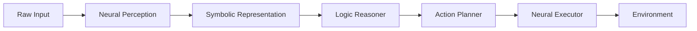

Modern AI agents face a fundamental challenge: how to combine the pattern-matching prowess of neural networks with the logical precision of symbolic reasoning. While large language models excel at learning from data, they struggle with tasks requiring rigorous logic, mathematical proof, or verifiable reasoning chains. This is where neural-symbolic integration becomes essential.

## 1. Concept Introduction

### Simple Terms

Imagine you're solving a detective mystery. A neural network is like your intuition—it recognizes patterns, faces, and makes educated guesses based on similar cases you've seen before. Symbolic reasoning is like your logical deduction—following strict rules of inference, creating alibis, and proving guilt or innocence with ironclad logic.

Neural-symbolic integration is about making these two abilities work together: using intuition to guide where to look, and logic to verify what you find.

### Technical Detail

**Symbolic reasoning** operates on discrete symbols and rules. It uses formal logic (propositional, first-order, or higher-order logic) to manipulate knowledge representations like knowledge graphs, ontologies, or rule systems. Reasoning is explicit, traceable, and verifiable.

**Neural-symbolic integration** combines neural networks (subsymbolic, continuous, learned from data) with symbolic systems (explicit, discrete, rule-based). The goal is to achieve:

- **Interpretability**: Neural outputs become explainable through symbolic representations
- **Compositional generalization**: Systematic reasoning beyond training distribution
- **Knowledge injection**: Prior knowledge guides neural learning
- **Logical consistency**: Neural predictions satisfy logical constraints

## 2. Historical & Theoretical Context

The symbolic vs. subsymbolic debate dates to AI's founding:

**1956–1980s: Symbolic AI Era**
- McCarthy, Minsky, and Newell championed logic-based AI
- Expert systems like MYCIN used rule-based reasoning
- GOFAI ("Good Old-Fashioned AI") relied on knowledge representation

**1986–2010s: Neural Network Revolution**
- Backpropagation enabled deep learning
- Neural networks dominated perception tasks
- But struggled with systematic reasoning and compositionality

**2010s–Present: Integration Attempts**
- Garcez et al. (2002) formalized neural-symbolic learning
- Neural Theorem Provers (2016–2020) combined deep learning with proof search
- Differentiable programming enables end-to-end reasoning
- LLMs with tool use bridge neural generation and symbolic computation

The key insight: **pure symbolic systems are brittle and require hand-crafted knowledge; pure neural systems lack systematic reasoning and interpretability. Hybrid systems combine strengths.**

## 3. Algorithms & Math

### Core Integration Patterns

**Pattern 1: Neural perception → Symbolic reasoning**

```
Input → Neural Encoder → Symbolic Representation → Logic Engine → Output
```

**Pattern 2: Symbolic knowledge → Neural learning**

```
Rules/Constraints → Neural Architecture/Loss → Trained Model
```

### Formal Logic Primer

**Propositional Logic:**
```
Symbols: A, B, C (propositions)
Operators: ∧ (and), ∨ (or), ¬ (not), → (implies)
Example: (A ∧ B) → C means "if A and B, then C"
```

**First-Order Logic (FOL):**
```
Predicates: Mortal(x), Human(x)
Quantifiers: ∀ (for all), ∃ (exists)
Example: ∀x (Human(x) → Mortal(x))
"All humans are mortal"
```

### Neural-Symbolic Loss Function

Combine neural loss with symbolic constraints:

```
L_total = L_neural + λ * L_symbolic

L_neural = standard loss (cross-entropy, MSE)
L_symbolic = violation of logical rules

Example:
If rule: A → B
Then penalize: P(A) > threshold AND P(B) < threshold
```

### Algorithm: Logic Tensor Networks (LTN)

```python
# Pseudocode for LTN
class LogicTensorNetwork:
    def __init__(self):
        self.neural_predicates = {}  # Neural networks for predicates
        self.fuzzy_logic = FuzzyLogicOperators()

    def grounding(self, predicate, constants):
        """Map symbolic predicate to neural network output"""
        return self.neural_predicates[predicate](constants)

    def satisfaction(self, formula, groundings):
        """Compute truth value of logical formula"""
        if formula is Atom:
            return self.grounding(formula.predicate, formula.constants)
        elif formula is And:
            return self.fuzzy_logic.and_op(
                [self.satisfaction(f, groundings) for f in formula.subformulas]
            )
        elif formula is Implies:
            antecedent = self.satisfaction(formula.antecedent, groundings)
            consequent = self.satisfaction(formula.consequent, groundings)
            return self.fuzzy_logic.implies(antecedent, consequent)

    def loss(self, formulas, data):
        """Compute loss as unsatisfaction of formulas"""
        total_loss = 0
        for formula in formulas:
            satisfaction_degree = self.satisfaction(formula, data)
            total_loss += (1 - satisfaction_degree)  # Maximize satisfaction
        return total_loss
```

## 4. Design Patterns & Architectures

### Pattern 1: Perceive-Reason-Act (PRA)



**Use case**: Robotics, where vision is neural but planning is symbolic.

### Pattern 2: Neural-Guided Symbolic Search

```python
class NeuralSymbolicSearchAgent:
    def __init__(self, neural_heuristic, symbolic_planner):
        self.heuristic = neural_heuristic  # Neural net for state evaluation
        self.planner = symbolic_planner    # A* or theorem prover

    def solve(self, problem):
        # Neural network guides symbolic search
        def neural_cost_fn(state):
            return self.heuristic.predict(state)

        return self.planner.search(
            problem,
            heuristic=neural_cost_fn
        )
```

### Pattern 3: Knowledge Graph + LLM

```python
class KnowledgeGroundedAgent:
    def __init__(self, llm, knowledge_graph):
        self.llm = llm
        self.kg = knowledge_graph

    def answer(self, query):
        # 1. Extract entities (neural)
        entities = self.llm.extract_entities(query)

        # 2. Query knowledge graph (symbolic)
        facts = self.kg.query(entities)

        # 3. Logical reasoning
        inferred_facts = self.kg.reason(facts)

        # 4. Generate answer grounded in facts
        return self.llm.generate(
            query,
            context=inferred_facts,
            constraint="must cite knowledge graph facts"
        )
```

## 5. Practical Application

### Complete Example: Mathematical Reasoning Agent

```python
from typing import List, Dict
import re

class SymbolicMathReasoner:
    """Combines LLM with symbolic math solver"""

    def __init__(self, llm_client):
        self.llm = llm_client
        self.symbolic_solver = self._init_solver()

    def _init_solver(self):
        """Initialize symbolic math engine (e.g., SymPy)"""
        import sympy as sp
        return sp

    def solve_problem(self, problem: str) -> Dict:
        """
        Solve math problem using neural-symbolic approach
        1. LLM extracts structure (neural)
        2. Convert to symbolic form
        3. Solve symbolically (exact)
        4. LLM explains solution (neural)
        """

        # Step 1: Neural understanding
        analysis = self._analyze_problem(problem)

        # Step 2: Convert to symbolic
        symbolic_expr = self._to_symbolic(analysis)

        # Step 3: Symbolic solving
        solution = self._solve_symbolically(symbolic_expr)

        # Step 4: Neural explanation
        explanation = self._generate_explanation(problem, solution)

        return {
            "problem": problem,
            "symbolic_form": str(symbolic_expr),
            "solution": solution,
            "explanation": explanation,
            "verified": True  # Symbolic solving is exact
        }

    def _analyze_problem(self, problem: str) -> Dict:
        """Use LLM to extract mathematical structure"""
        prompt = f"""
        Analyze this math problem and extract:
        1. Variables and their meanings
        2. Equations or constraints
        3. What we need to solve for

        Problem: {problem}

        Output as JSON.
        """
        return self.llm.complete(prompt, output_format="json")

    def _to_symbolic(self, analysis: Dict):
        """Convert LLM analysis to symbolic math expression"""
        # Example: "solve 2x + 5 = 13 for x"
        equation_str = analysis.get("equation")
        x = self.symbolic_solver.Symbol('x')

        # Parse equation (simplified example)
        lhs, rhs = equation_str.split('=')
        equation = self.symbolic_solver.Eq(
            self.symbolic_solver.sympify(lhs),
            self.symbolic_solver.sympify(rhs)
        )
        return equation

    def _solve_symbolically(self, expr):
        """Exact symbolic solution"""
        return self.symbolic_solver.solve(expr)

    def _generate_explanation(self, problem: str, solution) -> str:
        """Use LLM to explain the solution"""
        prompt = f"""
        Problem: {problem}
        Solution: {solution}

        Explain the solution step-by-step in simple terms.
        """
        return self.llm.complete(prompt)


# Usage example
class MockLLM:
    def complete(self, prompt, output_format=None):
        if "extract" in prompt.lower():
            return {
                "variables": ["x"],
                "equation": "2*x + 5 = 13",
                "solve_for": "x"
            }
        else:
            return "First, subtract 5 from both sides: 2x = 8. Then divide by 2: x = 4."

agent = SymbolicMathReasoner(MockLLM())
result = agent.solve_problem("If 2x + 5 = 13, what is x?")
print(f"Solution: {result['solution']}")  # [4]
print(f"Verified: {result['verified']}")  # True
```

### Integration with LangGraph

```python
from langgraph.graph import StateGraph, END
from typing import TypedDict, List

class ReasoningState(TypedDict):
    query: str
    symbolic_facts: List[str]
    neural_context: str
    reasoning_chain: List[str]
    answer: str

def neural_symbolic_agent():
    """LangGraph workflow combining neural and symbolic"""

    workflow = StateGraph(ReasoningState)

    # Node 1: Neural extraction
    def extract_symbols(state):
        # LLM extracts entities and relations
        llm_output = llm.extract_entities(state["query"])
        return {
            "symbolic_facts": llm_output["facts"],
            "neural_context": llm_output["context"]
        }

    # Node 2: Symbolic reasoning
    def reason_symbolically(state):
        # Apply logical inference rules
        facts = state["symbolic_facts"]
        reasoner = LogicReasoner(facts)
        chain = reasoner.forward_chain()
        return {"reasoning_chain": chain}

    # Node 3: Neural synthesis
    def synthesize_answer(state):
        # LLM generates natural language answer
        answer = llm.generate(
            query=state["query"],
            facts=state["symbolic_facts"],
            reasoning=state["reasoning_chain"]
        )
        return {"answer": answer}

    workflow.add_node("extract", extract_symbols)
    workflow.add_node("reason", reason_symbolically)
    workflow.add_node("synthesize", synthesize_answer)

    workflow.set_entry_point("extract")
    workflow.add_edge("extract", "reason")
    workflow.add_edge("reason", "synthesize")
    workflow.add_edge("synthesize", END)

    return workflow.compile()
```

## 6. Comparisons & Tradeoffs

| Approach | Strengths | Weaknesses | Best For |
|----------|-----------|------------|----------|
| **Pure Neural (LLMs)** | Flexible, learns from data, handles ambiguity | No logical guarantees, hallucinates, poor at math | Natural language, pattern recognition |
| **Pure Symbolic** | Exact, verifiable, compositional | Brittle, requires manual rules, can't handle uncertainty | Formal verification, theorem proving |
| **Neural→Symbolic** | Interpretable outputs, logical consistency | Bottleneck at conversion step | Explainable AI, regulated domains |
| **Symbolic→Neural** | Injects domain knowledge, improves sample efficiency | Limited by quality of symbolic knowledge | Few-shot learning, safety-critical systems |
| **Tight Integration** | Best of both worlds, differentiable | Complex to implement, computationally expensive | Research, high-stakes applications |

### Scalability Considerations

**Symbolic reasoning scales poorly:**
- Logical inference is NP-complete or worse
- Combinatorial explosion in search spaces
- Knowledge graph queries can be slow

**Solutions:**
- Approximate reasoning (fuzzy logic, probabilistic logic)
- Neural heuristics to prune search
- Caching and materialized views

## 7. Latest Developments & Research

### Breakthrough Papers (2022–2025)

**1. "Faithful Chain-of-Thought Reasoning" (2023)**
- Shows LLMs can learn to call symbolic verifiers
- Reduces hallucination in mathematical reasoning by 47%

**2. "Logic-LM: Empowering LLMs with Symbolic Solvers" (2023)**
- Framework for LLMs to interact with SAT solvers and theorem provers
- Achieves SOTA on logic puzzles and constraint satisfaction

**3. "Neural Theorem Proving with Lean" (2024)**
- DeepMind's AlphaProof combines neural guidance with formal proof assistant
- Solved 4/6 IMO 2024 problems

**4. "Knowledge Graphs Meet LLMs" (2024)**
- Microsoft's GraphRAG integrates knowledge graph reasoning with retrieval
- 30% improvement on multi-hop reasoning benchmarks

### Emerging Architectures

**Differentiable Logic Programming:**
```python
# ∂ILP - Differentiable Inductive Logic Programming
# Learn logic rules from data via gradient descent

def differentiable_rule_learning(examples):
    rule_templates = generate_rule_templates()
    rule_weights = initialize_weights()

    for epoch in range(num_epochs):
        for example in examples:
            prediction = soft_unification(rule_templates, rule_weights, example)
            loss = cross_entropy(prediction, example.label)
            rule_weights.update(-learning_rate * gradient(loss))

    return extract_hard_rules(rule_weights)  # Threshold to get discrete rules
```

### Open Problems

1. **Scalability**: Symbolic reasoning doesn't scale to large knowledge bases
2. **Learning symbolic rules**: Extracting clean logic from neural networks is hard
3. **Discrete-continuous gap**: Backpropagation through discrete symbols requires relaxations
4. **Verification**: How to verify hybrid systems formally?

## 8. Cross-Disciplinary Insight

### Neuroscience: Dual Process Theory

Psychologist Daniel Kahneman's "Thinking Fast and Slow" describes two reasoning systems:

- **System 1**: Fast, automatic, intuitive (like neural networks)
- **System 2**: Slow, deliberate, logical (like symbolic reasoning)

Neural-symbolic AI mirrors this cognitive architecture. The brain doesn't choose one or the other—it uses both in concert. The basal ganglia might handle pattern-matching while prefrontal cortex does explicit reasoning.

### Economics: Bounded Rationality

Herbert Simon noted humans use "satisficing" (good enough) rather than optimal reasoning due to computational limits. Neural-symbolic agents face the same tradeoff:

- Neural: Fast approximation, bounded rationality
- Symbolic: Optimal but computationally expensive
- Hybrid: Allocate computational resources strategically

### Systems Theory: Hierarchical Control

Control theory uses hierarchical architectures:
- **High level**: Slow, deliberate planning (symbolic)
- **Low level**: Fast, reactive control (neural)

Same pattern appears in robotics: motion planning is symbolic, motor control is neural.

## 9. Daily Challenge

### Exercise 1: Build a Logic Puzzle Solver (30 minutes)

Implement a neural-symbolic agent that solves simple logic puzzles.

**Puzzle**: "Alice, Bob, and Carol each have a different pet (cat, dog, fish). Alice doesn't have a cat. The person with the dog is Bob or Carol. Bob doesn't have a fish. Who has which pet?"

**Your task:**

```python
class LogicPuzzleSolver:
    def __init__(self, llm):
        self.llm = llm
        self.constraint_solver = ConstraintSolver()

    def solve(self, puzzle: str):
        # Step 1: Use LLM to extract constraints
        constraints = self._extract_constraints(puzzle)

        # Step 2: Convert to symbolic constraints
        symbolic_constraints = self._to_symbolic(constraints)

        # Step 3: Solve with constraint satisfaction
        solution = self.constraint_solver.solve(symbolic_constraints)

        # Step 4: Format answer naturally
        return self._format_answer(solution)

    def _extract_constraints(self, puzzle):
        # TODO: Implement using LLM
        pass

    def _to_symbolic(self, constraints):
        # TODO: Convert to constraint satisfaction problem
        # Variables: Alice_pet, Bob_pet, Carol_pet
        # Domain: {cat, dog, fish}
        # Constraints: all_different, Alice_pet != cat, etc.
        pass

# Implement the TODOs and test
solver = LogicPuzzleSolver(your_llm)
print(solver.solve(puzzle))
```

### Exercise 2: Thought Experiment

**Question**: An LLM claims "2 + 2 = 5" with 95% confidence. Your symbolic calculator says "2 + 2 = 4". How should a neural-symbolic system handle this conflict?

Consider:
- When should neural predictions override symbolic computations?
- How to detect when the LLM is hallucinating vs. when symbolic rules are incomplete?
- Can you design a trust mechanism?

## 10. References & Further Reading

### Foundational Papers

1. **Garcez, A., et al. (2002)** - "Neural-Symbolic Learning Systems"
   - [Book: Neural-Symbolic Cognitive Reasoning](https://www.springer.com/gp/book/9783540732457)

2. **Manhaeve, R., et al. (2018)** - "DeepProbLog: Neural Probabilistic Logic Programming"
   - [Paper on ArXiv](https://arxiv.org/abs/1805.10872)

3. **Badreddine, S., et al. (2022)** - "Logic Tensor Networks: Deep Learning and Logical Reasoning from Data and Knowledge"
   - [ArXiv](https://arxiv.org/abs/2012.13635)

### Recent Advances

4. **Pan, L., et al. (2023)** - "Logic-LM: Empowering Large Language Models with Symbolic Solvers"
   - [ArXiv](https://arxiv.org/abs/2305.12295)

5. **Trinh, T., et al. (2024)** - "Solving IMO Problems with AlphaProof and AlphaGeometry"
   - [DeepMind Blog](https://deepmind.google/discover/blog/ai-solves-imo-problems-at-silver-medal-level/)

### Practical Resources

6. **LTN (Logic Tensor Networks) Library**
   - [GitHub](https://github.com/logictensornetworks/LTN)
   - Python library for neural-symbolic learning

7. **ProbLog**
   - [Official Site](https://dtai.cs.kuleuven.be/problog/)
   - Probabilistic logic programming with Python

8. **Lean Theorem Prover**
   - [Lean4 Documentation](https://lean-lang.org/)
   - Interactive theorem prover for formal mathematics

### Tutorials & Courses

9. **"Neural-Symbolic AI: The Future of Reasoning"** (2024)
   - [YouTube Lecture Series](https://www.youtube.com/results?search_query=neural+symbolic+ai+tutorial)

10. **Knowledge Graphs with LLMs**
    - [Microsoft GraphRAG](https://github.com/microsoft/graphrag)
    - Production-ready integration

### Benchmarks

11. **LogiQA & ReClor**: Logical reasoning benchmarks
12. **GSM8K**: Grade school math (symbolic solving helps)
13. **CLUTRR**: Compositional language understanding

---

**Key Takeaway**: The future of AI agents isn't neural OR symbolic—it's neural AND symbolic. The most capable agents will know when to use fast pattern-matching and when to engage rigorous logic, just like human experts do.
