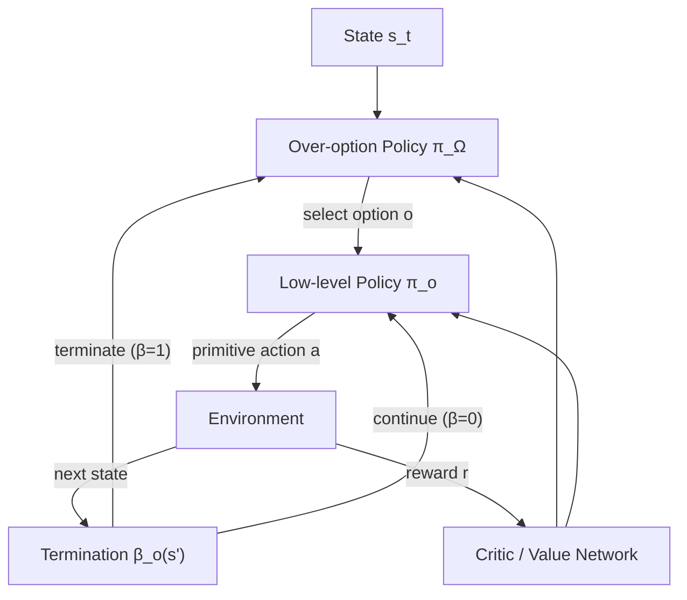

Most reinforcement learning agents think one step at a time. They observe the environment, pick an action, collect a reward, and repeat. This works fine for simple tasks—but real-world problems often require *sustained commitment to a plan*: navigate to the kitchen, open the fridge, grab the milk, then pour it. Each of those steps involves dozens of low-level actions, and treating them all as independent decisions leads to agents that never learn anything useful.

The **Options Framework** solves this by letting agents reason at multiple levels of abstraction simultaneously—choosing not just *which action* to take, but *which extended behavior* to pursue.

## 1. Concept Introduction

### Simple Explanation

Think about how you drive to work. You don't consciously decide to move each muscle in your leg each millisecond. Instead, your brain operates at a high level—"take the highway"—while a lower-level system handles the moment-to-moment steering. This layered control is **temporal abstraction**: thinking in terms of extended behaviors that span many low-level steps.

In agent design, an **option** is exactly that: a mini-policy with a clear start condition and a stopping criterion. An agent chooses an option the way you choose a route—commit to it, execute it automatically, then reassess at the end.

### Technical Detail

Formally, the Options Framework extends the standard Markov Decision Process (MDP) with *temporally extended actions*. Instead of choosing from the primitive action set $\mathcal{A}$, the agent picks from an option set $\mathcal{O}$, where each option $o \in \mathcal{O}$ is a triple:

$$o = (I_o, \pi_o, \beta_o)$$

- $I_o \subseteq \mathcal{S}$: the **initiation set**—states from which this option can be started
- $\pi_o : \mathcal{S} \times \mathcal{A} \to [0,1]$: the option's **internal policy**
- $\beta_o : \mathcal{S} \to [0,1]$: the **termination condition**—probability of ending the option in each state

When the agent selects option $o$ in state $s$, it executes $\pi_o$ until termination (sampled from $\beta_o$), then selects a new option. This creates a two-level loop: a **high-level policy** selects options, and each **low-level policy** $\pi_o$ handles the primitive steps.

## 2. Historical & Theoretical Context

The Options Framework was formalized by **Sutton, Precup, and Singh in 1999** in their landmark paper *"Between MDPs and Semi-MDPs: A Framework for Temporal Abstraction in Reinforcement Learning."* But the intuition traces further back.

- **Semi-MDPs (SMDPs)** from the 1970s modeled systems where actions take variable amounts of time—the mathematical skeleton that options build upon.
- **MAXQ** (Dietterich, 2000) and **HAM** (Hierarchical Abstract Machines, Parr & Russell, 1997) offered competing hierarchical RL frameworks around the same era.
- In cognitive science, **chunking theory** (Newell & Simon, 1972) described how humans compress sequences of actions into single cognitive units—the biological precursor to options.

The key theoretical result is that the options framework is a *conservative extension* of standard RL: primitive actions are just options with $\beta_o(s) = 1$ everywhere. Any tabular MDP result carries over cleanly.

## 3. Algorithms & Math

### Semi-MDP Bellman Equations

When options are in play, the standard Bellman equation generalizes. Let $V^\pi(s)$ be the value function under a policy $\pi$ that selects options. The value of starting option $o$ in state $s$ is:

$$Q(s, o) = \mathbb{E}\left[\sum_{t=0}^{\tau-1} \gamma^t r_{t+1} + \gamma^\tau \max_{o'} Q(s_\tau, o') \;\middle|\; s_0 = s, o_0 = o\right]$$

where $\tau$ is the (random) termination time. This is the **intra-option Q-learning** update rule.

The TD update for intra-option learning at each primitive step becomes:

$$Q(s, o) \leftarrow Q(s, o) + \alpha\left[r + \gamma\left[(1 - \beta_o(s'))\,Q(s', o) + \beta_o(s')\,\max_{o'} Q(s', o')\right] - Q(s, o)\right]$$

The key insight: when an option doesn't terminate ($\beta_o(s') \approx 0$), the agent bootstraps off its own $Q(s', o)$ value—continuing the commitment. When it terminates, it re-evaluates globally.

### Subgoal Discovery via Bottleneck States

How do you find good options automatically? One classic approach identifies **bottleneck states**—states that frequently appear on successful trajectories between regions of the state space. These become option subgoals.

```
function discover_bottleneck_options(trajectories):
    # Build a graph of state transitions
    G = build_transition_graph(trajectories)

    # Find states with high betweenness centrality
    bottlenecks = []
    for each state s in G:
        centrality = betweenness_centrality(G, s)
        if centrality > threshold:
            bottlenecks.append(s)

    # For each bottleneck, create an option
    options = []
    for subgoal in bottlenecks:
        option = Option(
            initiation_set = all_states,
            policy = train_policy_to_reach(subgoal),
            termination = lambda s: s == subgoal
        )
        options.append(option)

    return options
```

## 4. Design Patterns & Architectures

The Options Framework slots naturally into several agent architectures:

**Hierarchical Actor-Critic (HAC / HIRO)**
Two separate actor-critic networks operate at different timescales. The high-level policy proposes a subgoal every $k$ steps; the low-level policy is rewarded for reaching that subgoal. No manual option design needed.

**Option-Critic Architecture**
A single end-to-end network learns options and the over-option policy simultaneously. It contains:
- A set of $n$ option policies $\{\pi_{o_1}, \ldots, \pi_{o_n}\}$
- Termination heads $\{\beta_{o_1}, \ldots, \beta_{o_n}\}$
- An over-option policy $\pi_\Omega(o|s)$

All components are trained jointly with policy gradient, avoiding manual subgoal specification entirely.



**Connection to other patterns:**
- The **Planner-Executor loop** is essentially a two-level options hierarchy
- **Behavior Trees** encode options as subtrees with their own preconditions and postconditions
- **GOAP** (Goal-Oriented Action Planning) discovers options dynamically via backward chaining

## 5. Practical Application

Here's a minimal Options Framework implementation with a hierarchical agent that can navigate a grid world with reusable "go-to-room" options:

```python
import numpy as np
from dataclasses import dataclass
from typing import Callable, Optional

@dataclass
class Option:
    name: str
    initiation_set: Callable[[tuple], bool]
    policy: Callable[[tuple], int]
    termination: Callable[[tuple], float]

class HierarchicalAgent:
    def __init__(self, options: list[Option], n_actions: int, n_states: int):
        self.options = options
        # Q-values over (state, option) pairs
        self.Q_options = np.zeros((n_states, len(options)))
        self.alpha = 0.1
        self.gamma = 0.99
        self.current_option: Optional[int] = None

    def select_option(self, state: int, epsilon: float = 0.1) -> int:
        available = [
            i for i, o in enumerate(self.options)
            if o.initiation_set(state)
        ]
        if np.random.random() < epsilon:
            return np.random.choice(available)
        return available[np.argmax(self.Q_options[state, available])]

    def step(self, state: int, next_state: int, reward: float) -> int:
        o_idx = self.current_option
        option = self.options[o_idx]

        # Should we terminate?
        terminates = np.random.random() < option.termination(next_state)

        if terminates:
            # Intra-option Q update: bootstrap off max Q at next state
            best_next = np.max(self.Q_options[next_state])
            td_target = reward + self.gamma * best_next
        else:
            # Continue: bootstrap off same option's value
            td_target = reward + self.gamma * self.Q_options[next_state, o_idx]

        self.Q_options[state, o_idx] += self.alpha * (
            td_target - self.Q_options[state, o_idx]
        )

        if terminates:
            self.current_option = self.select_option(next_state)

        return option.policy(next_state)


# Example: two "go to hallway" options for a two-room grid
hallway_left = Option(
    name="go_to_left_hallway",
    initiation_set=lambda s: s < 50,          # left room
    policy=lambda s: navigate_toward(s, goal=25),
    termination=lambda s: float(s == 25),     # reached hallway
)

hallway_right = Option(
    name="go_to_right_hallway",
    initiation_set=lambda s: s >= 50,         # right room
    policy=lambda s: navigate_toward(s, goal=75),
    termination=lambda s: float(s == 75),
)
```

In **LangGraph**, options translate naturally to reusable subgraphs—a node that selects which subgraph to enter (option selection), with each subgraph having its own termination edge:

```python
from langgraph.graph import StateGraph

def build_option_graph(options: list):
    graph = StateGraph(AgentState)

    # High-level option selector
    graph.add_node("select_option", option_selector)

    for opt in options:
        # Each option is a compiled subgraph
        graph.add_node(opt.name, opt.subgraph)
        graph.add_edge("select_option", opt.name)
        # Termination routes back to selector
        graph.add_conditional_edges(
            opt.name,
            opt.should_terminate,
            {"terminate": "select_option", "continue": opt.name}
        )

    return graph.compile()
```

## 6. Comparisons & Tradeoffs

| Approach | Temporal Abstraction | Manual Design | Sample Efficiency | Reusability |
|---|---|---|---|---|
| **Flat RL** | None | Low | Poor on long horizons | N/A |
| **HTN Planning** | High (symbolic) | Very High | N/A (planning) | Good |
| **Options Framework** | High | Medium (initiation/termination) | Good | Excellent |
| **Option-Critic** | High (learned) | None | Moderate | Good |
| **HIRO / HAC** | High (goal-conditioned) | None | Moderate | Good |

**Key limitations:**
- **Option discovery is still hard.** Manual option design is expensive; automated methods often find trivial or redundant options.
- **Non-stationarity.** When the high-level policy changes how often it uses an option, the low-level policy's training distribution shifts.
- **Credit assignment.** Assigning blame across hundreds of primitive steps inside a long option remains mathematically tricky.
- **Scalability.** With $n$ options and $|\mathcal{S}|$ states, the $Q$-table grows as $|\mathcal{S}| \times n$, manageable but nonzero overhead.

## 7. Latest Developments & Research

**Option-Critic with Interest Functions (Khetarpal et al., 2020)** added *interest functions* $f_o(s) \in [0,1]$ that modulate how often options are active, improving diversity and specialization.

**LOVE: Learning to reuse Options for Variable-length Environments (2022)** showed that options transfer across tasks with different horizon lengths—a practical win for multi-task agents.

**Skill Discovery in Large Language Models (2023–2024)**: Several papers have adapted the options idea to LLM-based agents. Instead of neural policies, options are reusable **prompt templates or tool chains** that activate under certain context conditions. Work like **SKILL-IT** (Chen et al., 2023) showed that LLMs can learn to compose skill libraries that mirror option reuse.

**HIRO in robotics (Nachum et al., 2018, with recent extensions)**: Hierarchical reinforcement learning with HIRO-style goal conditioning has become a standard baseline for robotics manipulation benchmarks (Meta-World, FurnitureBench), with newer variants incorporating diffusion policies at the low level.

**Open problems:**
- Principled termination learning without reward sparsity collapse
- Composing options in partially observable settings (POMDPs + options)
- Verifiably safe options with formal guarantees

## 8. Cross-Disciplinary Insight

The Options Framework is cognitive science in mathematical form. **Chunking theory** (Newell & Simon, 1972) proposes that human expertise is built by compiling frequently used action sequences into single cognitive *chunks*—stored in long-term memory and triggered as units. A chess grandmaster doesn't think about individual piece moves; they think in *attacks*, *defenses*, *endgame patterns*. Options are precisely these chunks, encoded as policies with initiation and termination conditions.

From **motor control neuroscience**, the cerebellum and basal ganglia implement a similar hierarchy: the prefrontal cortex selects behavioral programs (options) while subcortical circuits execute them as smooth, continuous actions—with termination signals driven by reward prediction errors. The intra-option Q-learning update mirrors temporal difference learning in dopaminergic neurons.

In **software engineering**, this maps to the **Strategy Pattern**: a context object selects a strategy (option) at runtime based on state, delegates execution to it, and switches strategies when conditions change.

## 9. Daily Challenge

**Exercise: Option Discovery on a Maze**

Take a simple 10×10 grid maze (you can hardcode walls or use `gym-maze`). Run a flat Q-learning agent to collect successful trajectories. Then:

1. Build a state-transition graph from the trajectories
2. Compute **betweenness centrality** for each state (use `networkx.betweenness_centrality`)
3. Mark the top-5 high-centrality states as subgoals
4. Train one option per subgoal: a policy that navigates from any state to that subgoal
5. Run a hierarchical agent that uses these options instead of primitive moves

Compare the learning curves of flat Q-learning vs. the hierarchical agent on a longer maze variant. How many fewer environment steps does the option-based agent need to find a good policy?

**Bonus challenge**: Replace the manual betweenness centrality step with a learned termination function using Option-Critic. Does it discover the same bottleneck states?

## 10. References & Further Reading

### Foundational Papers
- **Sutton, Precup & Singh (1999)** — *"Between MDPs and Semi-MDPs: A Framework for Temporal Abstraction in Reinforcement Learning"* — the original Options paper
- **Dietterich (2000)** — *"Hierarchical Reinforcement Learning with the MAXQ Value Function Decomposition"*
- **Bacon, Harb & Precup (2017)** — *"The Option-Critic Architecture"* — end-to-end option learning

### Hierarchical RL & Applications
- **Nachum et al. (2018)** — *"Data-Efficient Hierarchical Reinforcement Learning (HIRO)"*
- **Levy et al. (2019)** — *"Learning Multi-Level Hierarchies with Hindsight (HAC)"*
- **Khetarpal et al. (2020)** — *"Options of Interest: Temporal Abstraction with Interest Functions"*

### LLM & Skill Libraries
- **Chen et al. (2023)** — *"SKILL-IT! A Data-Driven Skills Framework for Understanding and Training Language Models"*
- **Wang et al. (2023)** — *"Voyager: An Open-Ended Embodied Agent with Large Language Models"* — Minecraft agent that builds a skill library as reusable JS code

### Implementations
- **stable-baselines3**: includes DDPG/SAC used in HIRO-style agents
- **RL Baselines3 Zoo**: https://github.com/DLR-RM/rl-baselines3-zoo
- **Gym-Taxi** / **Four Rooms**: classic option benchmark environments in OpenAI Gym

---

## Key Takeaways

1. **Options are reusable mini-policies** with initiation sets, internal policies, and termination conditions
2. **Temporal abstraction lets agents commit** to extended behaviors rather than re-deciding every step
3. **Intra-option Q-learning** bootstraps off either the same option (continue) or the global max (terminate)
4. **Good options cluster around bottleneck states**—high-traffic junctions on successful paths
5. **Option-Critic learns options end-to-end**, removing the need for hand-designed subgoals
6. **LLM skill libraries are the modern analogue**: prompt chains and tool sequences that activate under context conditions
7. **Transfer and reuse** are the payoff: options learned on one task speed up learning on related tasks

Flat RL is myopic. Options give agents the ability to plan with their whole body—committing to purpose-driven subroutines the way expert humans chunk complex tasks into practiced, reliable moves.
