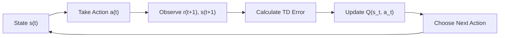

Welcome to today's deep dive into one of the most influential algorithms in AI agent programming: **Temporal Difference (TD) Learning** and its famous variant, **Q-Learning**. These algorithms are the bridge between the theoretical world of reinforcement learning and the practical world of agents that learn from experience to make optimal decisions.

## 1. Concept Introduction

### In Simple Terms

Imagine you're learning to play chess. You don't need to play thousands of complete games to learn that sacrificing your queen early is usually a bad idea. After just a few moves into a game, you might think, "This position looks worse than where I was three moves ago." You're learning from the **difference** between your expectations at different **time** steps—hence, "Temporal Difference."

Q-Learning takes this idea further. It learns a "quality score" (the Q in Q-Learning) for every action you can take in every situation. Over time, by trying actions and seeing their outcomes, the agent builds a mental map: "If I'm in situation X and do action Y, I can expect Z amount of reward." Eventually, it learns to pick the action with the highest Q-value, making it behave optimally.

### Technical Detail

**Temporal Difference Learning** is a class of model-free reinforcement learning algorithms that learn by bootstrapping: they update estimates based on other estimates, rather than waiting for a final outcome. The key insight is the **TD error**—the difference between the current value estimate and a better estimate obtained after taking an action.

The **TD(0)** update rule for state values is:

```
V(s_t) ← V(s_t) + α [r_{t+1} + γ V(s_{t+1}) - V(s_t)]
```

Where:
- `V(s_t)` is the value estimate of the current state
- `α` is the learning rate
- `r_{t+1}` is the reward received after taking an action
- `γ` (gamma) is the discount factor (how much we value future rewards)
- `V(s_{t+1})` is the value estimate of the next state
- The term in brackets is the **TD error**

**Q-Learning** extends this to learn action-value functions (Q-values) that tell us the quality of taking a specific action in a specific state:

```
Q(s_t, a_t) ← Q(s_t, a_t) + α [r_{t+1} + γ max_a Q(s_{t+1}, a) - Q(s_t, a_t)]
```

The critical difference: we update using the **maximum** Q-value of the next state, regardless of what action we actually take next. This makes Q-Learning an **off-policy** algorithm—it can learn the optimal policy even while following a different, exploratory policy.



## 2. Historical & Theoretical Context

Temporal Difference learning was formalized by **Richard Sutton** in his seminal 1988 paper, "Learning to Predict by the Methods of Temporal Differences." However, the seeds of the idea go back to earlier work in animal learning psychology and operations research.

**Q-Learning** was introduced by **Christopher Watkins** in his 1989 PhD thesis. It was revolutionary because it was the first algorithm proven to converge to the optimal policy under certain conditions (infinite exploration, appropriate learning rate decay), even when the agent follows a suboptimal exploration policy during learning.

TD learning sits at the intersection of two classical approaches:
- **Monte Carlo methods**: Wait until the end of an episode to update values based on actual returns. Unbiased but high variance.
- **Dynamic Programming**: Update values based on the Bellman equation using a complete model of the environment. Requires a model and full sweeps over the state space.

TD learning combines the best of both: it updates online (like DP) without needing a model (like Monte Carlo). This makes it extremely practical for agents operating in real-world, unknown environments.

## 3. Algorithms & Math

### Q-Learning Algorithm (Pseudocode)

```
Initialize Q(s, a) arbitrarily for all s ∈ S, a ∈ A
Set Q(terminal_state, ·) = 0

For each episode:
    Initialize state s

    While s is not terminal:
        Choose action a from s using policy derived from Q
        (e.g., ε-greedy: with probability ε choose random, else choose argmax_a Q(s, a))

        Take action a, observe reward r and next state s'

        Q(s, a) ← Q(s, a) + α [r + γ max_a' Q(s', a') - Q(s, a)]

        s ← s'
```

### Key Mathematical Properties

The TD error has a beautiful property: **if you sum all TD errors along a trajectory, you get the Monte Carlo error**.

```
Σ δ_t = Σ [r_{t+1} + γ V(s_{t+1}) - V(s_t)] = G_t - V(s_t)
```

Where `G_t` is the actual return (sum of discounted future rewards).

This means TD learning is doing something fundamentally sound—it's distributing the total prediction error across all the intermediate steps.

## 4. Design Patterns & Architectures

Q-Learning fits naturally into the **Planner-Executor-Memory** pattern we've discussed in previous articles:

- **Memory**: The Q-table (or Q-network in deep Q-learning) is the agent's learned knowledge. It stores the quality of state-action pairs.
- **Planner**: The policy derived from Q-values (e.g., always pick `argmax_a Q(s, a)`) is the planning strategy.
- **Executor**: The agent executes the chosen action in the environment and observes the outcome.

Q-Learning also exemplifies the **value-based** approach to reinforcement learning, as opposed to policy-based methods like policy gradients. The agent doesn't directly learn a policy; it learns values and derives a policy from them.

### Integration with Modern Agent Systems

In LLM-based agents, Q-Learning can be used to:
1. **Tool selection**: Learn which tools are most valuable in which contexts.
2. **Plan refinement**: Assign Q-values to different planning strategies and learn which work best.
3. **Multi-step reasoning**: Learn to evaluate the quality of intermediate reasoning steps.

## 5. Practical Application

Let's build a simple Q-Learning agent that learns to navigate a grid world.

```python
import numpy as np
import random

# Environment: 4x4 grid, goal at (3, 3), hole at (1, 1)
GRID_SIZE = 4
GOAL = (3, 3)
HOLE = (1, 1)
ACTIONS = ['up', 'down', 'left', 'right']

# Q-table: state is (x, y), action is index in ACTIONS
Q = np.zeros((GRID_SIZE, GRID_SIZE, len(ACTIONS)))

# Hyperparameters
alpha = 0.1      # Learning rate
gamma = 0.99     # Discount factor
epsilon = 0.1    # Exploration rate
episodes = 1000

def move(state, action):
    """Execute action and return new state and reward."""
    x, y = state

    if action == 'up':
        x = max(0, x - 1)
    elif action == 'down':
        x = min(GRID_SIZE - 1, x + 1)
    elif action == 'left':
        y = max(0, y - 1)
    elif action == 'right':
        y = min(GRID_SIZE - 1, y + 1)

    new_state = (x, y)

    if new_state == GOAL:
        return new_state, 10, True  # reward, done
    elif new_state == HOLE:
        return new_state, -10, True
    else:
        return new_state, -0.1, False  # Small penalty for each step

def choose_action(state, epsilon):
    """Epsilon-greedy action selection."""
    if random.random() < epsilon:
        return random.randint(0, len(ACTIONS) - 1)
    else:
        x, y = state
        return np.argmax(Q[x, y])

# Training loop
for episode in range(episodes):
    state = (0, 0)
    done = False

    while not done:
        action_idx = choose_action(state, epsilon)
        next_state, reward, done = move(state, ACTIONS[action_idx])

        # Q-Learning update
        x, y = state
        nx, ny = next_state

        old_q = Q[x, y, action_idx]
        max_next_q = np.max(Q[nx, ny])

        # TD update
        td_error = reward + gamma * max_next_q - old_q
        Q[x, y, action_idx] = old_q + alpha * td_error

        state = next_state

    if episode % 100 == 0:
        print(f"Episode {episode} complete")

# Display learned policy
print("\nLearned Policy (best action at each state):")
for x in range(GRID_SIZE):
    row = []
    for y in range(GRID_SIZE):
        if (x, y) == GOAL:
            row.append('G')
        elif (x, y) == HOLE:
            row.append('H')
        else:
            best_action = np.argmax(Q[x, y])
            symbols = {'up': '↑', 'down': '↓', 'left': '←', 'right': '→'}
            row.append(symbols[ACTIONS[best_action]])
    print(' '.join(row))
```

### In Modern Frameworks

While classical Q-Learning uses tables, modern implementations use neural networks (Deep Q-Networks, DQN):

```python
# Conceptual example with LangGraph for tool selection
from langgraph.graph import StateGraph

class AgentState:
    situation: str
    available_tools: list
    q_values: dict  # Maps (situation, tool) to Q-value

def select_tool_with_q_learning(state: AgentState):
    """Select tool using epsilon-greedy based on learned Q-values."""
    if random.random() < epsilon:
        return random.choice(state.available_tools)
    else:
        # Pick tool with highest Q-value for current situation
        best_tool = max(
            state.available_tools,
            key=lambda t: state.q_values.get((state.situation, t), 0)
        )
        return best_tool

# Build agent graph
graph = StateGraph(AgentState)
graph.add_node("select_tool", select_tool_with_q_learning)
graph.add_node("execute_tool", execute_tool_function)
graph.add_node("update_q", update_q_values_based_on_outcome)
# ... connect nodes
```

## 6. Comparisons & Tradeoffs

### Q-Learning vs. SARSA

**SARSA** (State-Action-Reward-State-Action) is an on-policy alternative to Q-Learning:

```
Q(s, a) ← Q(s, a) + α [r + γ Q(s', a') - Q(s, a)]
```

The difference: SARSA uses the Q-value of the action **actually taken** (a'), not the maximum.

- **Q-Learning**: Off-policy, learns optimal policy even while exploring. Can be more aggressive (learns to take risks if they lead to rewards).
- **SARSA**: On-policy, learns the policy it's following. More conservative (learns to avoid risky actions if it's exploring randomly).

### Strengths
- **Simple**: Easy to implement and understand.
- **Model-free**: Doesn't need to know environment dynamics.
- **Convergence guarantees**: Proven to converge to optimal policy under certain conditions.

### Limitations
- **Scalability**: Q-tables explode in size for large state spaces. (Solution: function approximation with neural networks → DQN)
- **Discrete actions**: Standard Q-Learning requires discrete action spaces.
- **Sample efficiency**: Can be slow to learn without good exploration strategies.
- **Delayed rewards**: Struggles when rewards are sparse and far in the future.

## 7. Latest Developments & Research

The field has evolved dramatically since 1989:

### Deep Q-Networks (DQN) - 2013
DeepMind's **DQN** paper revolutionized the field by using neural networks to approximate Q-values, enabling agents to play Atari games from pixels. Key innovations:
- **Experience replay**: Store transitions in a buffer and sample randomly to break temporal correlations.
- **Target networks**: Use a separate, slowly-updating network to generate targets, stabilizing training.

### Rainbow DQN - 2017
Combined six extensions to DQN:
1. Double Q-Learning (reduces overestimation)
2. Prioritized Experience Replay
3. Dueling Networks (separate value and advantage streams)
4. Multi-step Learning
5. Distributional RL
6. Noisy Nets (better exploration)

### Recent Trends (2023-2025)
- **Offline RL**: Learn from pre-collected datasets without environment interaction (crucial for LLM agents learning from human demonstrations).
- **World Models**: Learn a model of the environment, then use Q-Learning in the learned model for sample efficiency.
- **Q-Learning for LLM Agents**: Research into using RL to fine-tune tool selection, planning strategies, and reasoning chains in LLM-based systems.

**Open Problems**:
- How to efficiently explore in environments with delayed, sparse rewards?
- Can we combine symbolic planning with Q-Learning for better sample efficiency?
- How to transfer Q-values across related tasks?

## 8. Cross-Disciplinary Insight

Q-Learning mirrors concepts from **neuroscience**, particularly **dopamine-based reward learning** in the brain. Neuroscientist **Wolfram Schultz** discovered that dopamine neurons in the brain fire in proportion to a **reward prediction error**—essentially the TD error!

When an animal expects a reward and doesn't get it, dopamine dips (negative TD error). When it gets an unexpected reward, dopamine spikes (positive TD error). This suggests that the brain is literally doing temporal difference learning.

From **economics**, Q-Learning relates to the concept of **option value**—the value of having the option to make a choice in the future. The Q-value captures not just immediate reward, but the value of the state you'll be in, which includes all future options.

## 9. Daily Challenge / Thought Exercise

**Exercise**: Modify the grid world code above to include a **second goal** at position (0, 3) that gives a reward of +5.

1. Run the training and observe the learned policy.
2. Now change the goal at (3, 3) to give a reward of +3 instead of +10.
3. Train again from scratch. How does the policy change?
4. **Challenge**: Can you modify the code to use **Double Q-Learning** to reduce overestimation bias? (Hint: Maintain two Q-tables and randomly choose which to update and which to use for selecting the max action.)

**Thought Experiment**: Imagine an LLM agent choosing between different tools (search, calculator, code executor). How would you define the "state" for Q-Learning? How would you handle the fact that the state space is effectively infinite (any text prompt)?

## 10. References & Further Reading

### Classic Papers
1. **Sutton, R. S. (1988).** "Learning to Predict by the Methods of Temporal Differences." [Machine Learning 3, 9-44](https://link.springer.com/article/10.1007/BF00115009)
2. **Watkins, C. J., & Dayan, P. (1992).** "Q-learning." [Machine Learning 8, 279-292](https://link.springer.com/article/10.1007/BF00992698)

### Modern Breakthroughs
3. **Mnih, V., et al. (2013).** "Playing Atari with Deep Reinforcement Learning." [arXiv:1312.5602](https://arxiv.org/abs/1312.5602) (The original DQN paper)
4. **Hessel, M., et al. (2017).** "Rainbow: Combining Improvements in Deep Reinforcement Learning." [arXiv:1710.02298](https://arxiv.org/abs/1710.02298)

### Neuroscience Connection
5. **Schultz, W., Dayan, P., & Montague, P. R. (1997).** "A Neural Substrate of Prediction and Reward." [Science 275(5306), 1593-1599](https://www.science.org/doi/10.1126/science.275.5306.1593)

### Tutorials & Code
6. **Sutton & Barto's Reinforcement Learning Book** (2nd Edition, 2018): The bible of RL. [Free online](http://incompleteideas.net/book/the-book.html)
7. **OpenAI Spinning Up**: Excellent tutorials and clean implementations. [spinningup.openai.com](https://spinningup.openai.com)
8. **DeepMind's DQN Implementation**: [github.com/deepmind/dqn](https://github.com/google-deepmind/dqn)

### Recent Research
9. **Levine, S., et al. (2020).** "Offline Reinforcement Learning: Tutorial, Review, and Perspectives on Open Problems." [arXiv:2005.01643](https://arxiv.org/abs/2005.01643)

---

**Next Steps**: Now that you understand Q-Learning, you're ready to explore more advanced value-based methods like **Soft Actor-Critic (SAC)** for continuous actions, or pivot to policy-based methods like **PPO** (Proximal Policy Optimization). Each builds on the foundation you've learned today.
