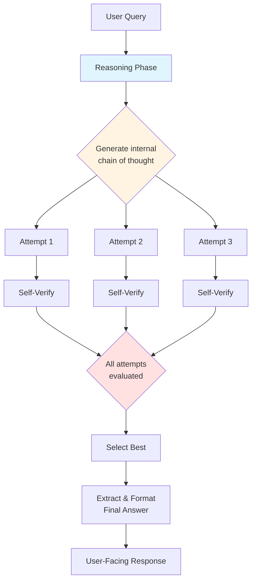

We're entering a new era of AI capabilities where **how long** an AI thinks matters as much as **how much** it was trained. Today's focus is on **test-time compute scaling** and the breakthrough reasoning approach exemplified by OpenAI's o1 model family. This paradigm shift is reshaping how we build intelligent agents.

## 1. Concept Introduction

**Simple Explanation**: Imagine you're taking a math test. You can either blurt out the first answer that comes to mind (fast but risky), or you can spend several minutes working through the problem step-by-step, checking your work, and trying different approaches (slower but more accurate). Test-time compute is the AI equivalent of that second approach.

**Technical Detail**: Most language models generate responses through a single forward pass—they read your prompt and immediately start outputting tokens. **Test-time compute scaling** is the principle that by allowing a model to "think longer" during inference (using more computational resources at test/runtime), it can solve harder problems more reliably. This is achieved through extended reasoning chains, self-verification, backtracking, and exploring multiple solution paths before committing to a final answer.

OpenAI's **o1** models (formerly codenamed "Strawberry") are the flagship example. Instead of outputting an immediate response, o1 spends significant compute generating an internal "chain of thought" that can be thousands of tokens long, evaluating different approaches, catching mistakes, and refining its reasoning before presenting a final answer to the user.

## 2. Historical & Theoretical Context

The dominant paradigm in AI over the past decade has been **training-time scaling**: bigger models trained on more data yield better performance. The famous "scaling laws" showed predictable improvements as compute budgets for training increased.

However, there's a fundamental limitation: training is expensive and happens only once. What if we could also improve performance by spending more compute **during inference**?

This idea has roots in classical AI:
- **Iterative deepening** in search algorithms (progressively deeper tree searches)
- **Anytime algorithms** that improve their answers given more time
- **Best-first search** strategies that allocate compute to the most promising paths

The modern resurgence began around 2022-2023 with several key developments:
1. **Chain-of-Thought prompting** (Wei et al., 2022) showed that explicit reasoning steps improve accuracy
2. **Self-Consistency** (Wang et al., 2022) demonstrated that sampling multiple reasoning paths and voting yields better results
3. **Tree of Thoughts** (Yao et al., 2023) explored backtracking and deliberate search through reasoning trees

In 2024, OpenAI synthesized these ideas into **o1**, a model specifically trained (via reinforcement learning) to use its "thinking time" productively. The key insight: train a model not just to predict the next token, but to **produce long, high-quality internal reasoning** that systematically improves final answer quality.

## 3. Algorithms & Math

The core algorithmic pattern is **search with self-evaluation**. Here's a simplified pseudocode:

```python
def test_time_reasoning(problem, budget):
    """
    Solve a problem using test-time compute scaling.

    Args:
        problem: The user's question or task
        budget: How much compute to spend (time/tokens/iterations)

    Returns:
        Best solution found within budget
    """
    solutions = []

    for attempt in range(budget.num_attempts):
        # Generate an extended reasoning chain
        reasoning_chain = generate_chain_of_thought(
            problem,
            max_tokens=budget.max_reasoning_tokens
        )

        # Self-verification: Does this reasoning make sense?
        is_valid, critique = verify_reasoning(reasoning_chain)

        if not is_valid:
            # Backtrack: Try a different approach
            reasoning_chain = refine_with_critique(
                problem,
                reasoning_chain,
                critique
            )

        # Extract final answer from reasoning chain
        answer = extract_answer(reasoning_chain)

        # Score this solution (via self-evaluation or external verifier)
        score = evaluate_solution(problem, answer, reasoning_chain)

        solutions.append({
            'reasoning': reasoning_chain,
            'answer': answer,
            'score': score
        })

    # Return the highest-scoring solution
    return max(solutions, key=lambda x: x['score'])
```

**Key Mathematical Principle**: The relationship between compute and performance. While traditional scaling is:

```
Performance ≈ α * log(Training_Compute)
```

Test-time scaling adds another dimension:

```
Performance ≈ α * log(Training_Compute) + β * log(Inference_Compute)
```

The coefficient β is what makes test-time scaling valuable. For certain reasoning tasks (math, code, logic), β can be surprisingly large, meaning doubling inference compute can yield substantial accuracy gains.

## 4. Design Patterns & Architectures

Test-time compute introduces several architectural patterns:

### The Hidden Thinking Pattern



### Integration with Agent Architectures

In a typical agent loop, test-time compute becomes part of the **Planner** component:

- **Without test-time scaling**: Planner generates a quick plan → Executor runs it
- **With test-time scaling**: Planner explores multiple plans, verifies each, selects best → Executor runs it

The trade-off is latency vs. quality. For critical decisions (medical diagnosis, financial planning, code generation), spending 30 seconds on reasoning is worthwhile. For casual chat, it's overkill.

## 5. Practical Application

While o1's exact implementation is proprietary, we can approximate the pattern using open models:

```python
import anthropic
from typing import List, Dict

class TestTimeReasoningAgent:
    def __init__(self, api_key: str):
        self.client = anthropic.Anthropic(api_key=api_key)

    def generate_reasoning_attempt(self, problem: str, attempt_num: int) -> Dict:
        """Generate one extended reasoning chain."""

        prompt = f"""Problem: {problem}

Think through this problem step by step. Show all your work.
Try approach #{attempt_num}. Be thorough and check your reasoning.

Start your reasoning below:"""

        message = self.client.messages.create(
            model="claude-sonnet-4-5-20250929",
            max_tokens=4000,  # Allow long reasoning
            temperature=0.8,  # Some randomness for diversity
            messages=[{"role": "user", "content": prompt}]
        )

        reasoning = message.content[0].text
        return {"reasoning": reasoning, "attempt": attempt_num}

    def verify_and_score(self, problem: str, reasoning: str) -> float:
        """Self-verification: score the quality of this reasoning."""

        verify_prompt = f"""Original Problem: {problem}

Proposed Reasoning:
{reasoning}

On a scale of 0-100, how confident are you that this reasoning is:
1. Logically sound
2. Free of errors
3. Leads to the correct answer

Provide ONLY a number between 0-100."""

        message = self.client.messages.create(
            model="claude-sonnet-4-5-20250929",
            max_tokens=10,
            temperature=0.0,
            messages=[{"role": "user", "content": verify_prompt}]
        )

        try:
            score = float(message.content[0].text.strip())
            return min(100, max(0, score))  # Clamp to [0, 100]
        except:
            return 50.0  # Default if parsing fails

    def solve_with_test_time_compute(
        self,
        problem: str,
        num_attempts: int = 3
    ) -> Dict:
        """
        Solve a problem using multiple reasoning attempts.
        Returns the best-scoring solution.
        """

        attempts = []

        print(f"Generating {num_attempts} reasoning attempts...")
        for i in range(num_attempts):
            reasoning_result = self.generate_reasoning_attempt(problem, i+1)
            score = self.verify_and_score(problem, reasoning_result["reasoning"])

            attempts.append({
                **reasoning_result,
                "score": score
            })
            print(f"Attempt {i+1} score: {score}/100")

        # Select the highest-scored attempt
        best = max(attempts, key=lambda x: x["score"])

        return {
            "problem": problem,
            "best_reasoning": best["reasoning"],
            "confidence": best["score"],
            "attempts_tried": num_attempts
        }

# Usage
agent = TestTimeReasoningAgent(api_key="your-key")

problem = """
A bat and a ball cost $1.10 in total.
The bat costs $1.00 more than the ball.
How much does the ball cost?
"""

result = agent.solve_with_test_time_compute(problem, num_attempts=3)
print(f"\n{'='*60}")
print(f"Best Solution (confidence: {result['confidence']}/100):")
print(result['best_reasoning'])
```

This simple implementation demonstrates the core pattern: generate multiple attempts, score them, and select the best. Real o1 uses far more sophisticated RL-trained verifiers and search strategies.

## 6. Comparisons & Tradeoffs

| Aspect | Traditional LLM | Test-Time Compute (o1-style) |
|--------|----------------|------------------------------|
| **Latency** | Fast (1-3 seconds) | Slow (15-60+ seconds) |
| **Token Cost** | Low (visible tokens only) | High (includes hidden reasoning) |
| **Accuracy on Hard Problems** | Moderate | Significantly higher |
| **Best For** | Chat, simple tasks | Math, code, logic, planning |
| **Scalability** | Linear with requests | Each request is more expensive |
| **Transparency** | Full output visible | Reasoning often hidden |

**Key Limitation**: Not all problems benefit equally. Creative writing, casual conversation, or simple factual queries don't need extended reasoning. The gains are primarily in **verifiable domains** where answers can be checked (math has a right answer, code can be tested).

**Strength**: As problems become harder, test-time scaling continues to help, whereas traditional models plateau. o1 shows dramatically better performance on competition-level math (AIME), coding challenges (Codeforces), and PhD-level science questions.

## 7. Latest Developments & Research

**2024-2025 Breakthroughs:**

1. **OpenAI o1 & o1-pro** (Dec 2024): Demonstrated that high test-time compute can achieve performance comparable to PhDs in physics, biology, and mathematics on expert-level benchmarks. o1-pro uses even more compute per query.

2. **DeepMind's Gemini 2.0 Flash Thinking** (Dec 2024): Google's response to o1, showing extended reasoning chains. Emphasized that thinking tokens can be exposed to users for transparency.

3. **Scaling Laws for Test-Time Compute** (Multiple papers, 2024): Researchers are now characterizing how performance scales with inference compute, similar to how training scaling laws were mapped.

4. **Process Reward Models (PRMs)**: Instead of just scoring final answers, PRMs score each step of reasoning. This enables more fine-grained search and better allocation of compute to promising reasoning paths.

5. **Verifier-Guided Search**: Using external verifiers (code executors, theorem provers, unit tests) to ground the search in reality rather than just model self-evaluation.

**Open Problems:**
- **Cost vs. Performance trade-offs**: When is extended reasoning worth the price?
- **Generalizing beyond verification-friendly domains**: Can we get similar gains in creative or subjective tasks?
- **Combining training and test-time scaling optimally**: What's the right balance?

## 8. Cross-Disciplinary Insight

Test-time compute connects deeply to **cognitive science** and dual-process theory:

- **System 1 (Fast Thinking)**: Intuitive, automatic, low-effort → Traditional LLM inference
- **System 2 (Slow Thinking)**: Deliberate, effortful, logical → o1-style extended reasoning

Humans naturally switch between these modes. We use System 1 for casual conversation, System 2 for complex problem-solving. Similarly, agent systems should adaptively allocate compute:
- Simple query → fast model, no extended reasoning
- Complex query → reasoning model, high test-time budget

This is also related to **anytime algorithms** in computer science: algorithms that can return progressively better answers the longer they run, allowing graceful performance/latency trade-offs.

## 9. Daily Challenge / Thought Exercise

**Exercise: Reasoning Budget Allocation**

You're building an AI tutor that helps students with math homework. You have:
- A fast model (50ms response, $0.001/query, 60% accuracy on hard problems)
- A reasoning model (30s response, $0.10/query, 95% accuracy on hard problems)

Design a simple decision system:

1. What features of a student's question would you use to decide which model to invoke?
2. Write pseudocode for a "routing function" that takes a question and returns which model to use.
3. Bonus: Could you use the fast model to help decide if the reasoning model is needed?

**Example starter code:**

```python
def route_to_model(question: str, student_context: dict) -> str:
    """
    Return 'fast' or 'reasoning' based on the question.

    Consider:
    - Question complexity (word count, mathematical notation)
    - Student's grade level
    - Previous failure rate on similar questions
    - Time constraints (test vs. homework)
    """
    # Your logic here
    pass
```

## 10. References & Further Reading

**Papers:**
1. **"Let's Verify Step by Step"** (Lightman et al., 2023) - Process reward models: [https://arxiv.org/abs/2305.20050](https://arxiv.org/abs/2305.20050)
2. **"Scaling Laws for Neural Language Models"** (Kaplan et al., 2020) - Original training scaling laws: [https://arxiv.org/abs/2001.08361](https://arxiv.org/abs/2001.08361)
3. **"STaR: Self-Taught Reasoner"** (Zelikman et al., 2022) - Training models to reason better: [https://arxiv.org/abs/2203.14465](https://arxiv.org/abs/2203.14465)

**Blog Posts:**
1. **OpenAI o1 System Card**: [https://openai.com/o1-system-card](https://openai.com/o1-system-card) - Official technical details
2. **Anthropic's Extended Thinking**: Blog post on Claude's approach to reasoning
3. **"The Shift to Test-Time Compute"** by Nathan Lambert: [https://www.interconnects.ai/](https://www.interconnects.ai/)

**Benchmarks:**
1. **AIME (American Invitational Mathematics Examination)**: Competition math benchmark where o1 scores in 83rd percentile
2. **Codeforces**: Competitive programming; o1 reaches 89th percentile
3. **GPQA (Graduate-Level Google-Proof Q&A)**: PhD-level science questions

---

**Key Takeaway**: The future of AI agents isn't just about bigger models trained on more data. It's also about **smarter inference**—agents that know when to think fast and when to think slow, allocating compute where it matters most. Test-time scaling is opening a new frontier in agent capability, particularly for complex reasoning tasks where correctness is critical.
