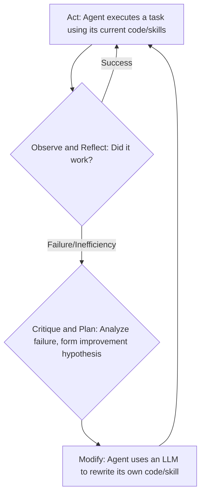

## 1. Concept Introduction

We have explored how agents can reason, plan, remember, act, and collaborate. The final, ultimate step in this journey is to create an agent that can improve its own capabilities. A **self-improving agent** is one that can analyze its own performance, identify its flaws, and modify its own internal logic or code to become more effective over time.

A key process that enables this is **Autoformalization**. This is the ability of an agent to translate a vague, high-level goal stated in natural language (e.g., "Make this process more efficient") into a formal, precise, and verifiable representation that it can work with (e.g., a unit test, a mathematical equation, or a piece of executable code).

An agent that can formalize its goals and then rewrite its own code to better achieve them is no longer just a tool; it's a dynamic system capable of growth and adaptation, representing the current frontier of AI research.

## 2. Historical & Theoretical Context

The idea of self-modifying programs is as old as computer science itself, often discussed under the banner of **reflection** or **meta-programming**. In AI, early systems like Douglas Lenat's **Eurisko** (1980s) were designed to discover new heuristics by modifying their own rules. However, these systems were brittle and highly specialized.

The modern pursuit of self-improvement has been unlocked by the fusion of several key technologies we've discussed:
1.  **Large Language Models** provide the reasoning and code-generation capabilities.
2.  **Tool Use** provides the sandboxed environments (like code interpreters and test suites) for the agent to safely test its modifications.
3.  **Memory** provides the mechanism for the agent to store its successful modifications and learn from its past mistakes.

Recent breakthroughs, such as DeepMind's **AlphaCode**—an AI that can compete in human programming competitions—demonstrate a powerful form of autoformalization, translating complex, ambiguous problem descriptions into correct, efficient code.

## 3. The Mechanics: The Self-Improvement Loop

A self-improving agent operates on a continuous feedback loop, much like a human developer.



1.  **Act:** The agent attempts to perform a task using its current skill set (e.g., a library of Python functions).
2.  **Observe & Reflect:** The agent monitors the outcome. This is often done via tools. A code interpreter might return an error, a unit test might fail, or a timer might show that the process was too slow. This is the critical feedback signal.
3.  **Critique & Plan:** The agent uses its reasoning ability (an LLM call) to analyze the failure. It critiques its own performance and forms a hypothesis for improvement. This is where autoformalization happens: the agent turns a fuzzy failure signal ("error") into a concrete plan ("The `process_data` function needs a null check on the 'user' field").
4.  **Modify:** The agent uses its code generation ability to rewrite the flawed function in its skill library. It might be prompted to "fix the bug" or "refactor for efficiency." The new code replaces the old one.
5.  **Retry:** The agent attempts the task again with its new, improved code, restarting the loop.

## 4. Design Patterns & Architectures

-   **Skill Library as Source Code:** A powerful pattern is to define an agent's capabilities not as prompts, but as a directory of executable code files (e.g., a `skills/` folder with `.py` files). The agent is given tools to read, write, and test the code in this directory. Self-improvement becomes a tangible act of editing its own source code.
-   **Test-Driven Development (TDD) for Agents:** This is a robust pattern for autoformalization. To solve a problem, the agent is first tasked with writing a **verifiable test case** that captures the goal. For example, for the goal "write a function that sorts a list," the agent first writes a test that checks if `sort([3, 1, 2])` returns `[1, 2, 3]`. It then enters the self-improvement loop, modifying its `sort` function until the test passes.
-   **Reflective Architecture:** This involves a separation of concerns. A "base-level" agent performs tasks, while a "meta-level" agent observes the base agent. This meta-agent is responsible for the reflection, critique, and modification steps, acting as a built-in coach or programmer for the base agent.

## 5. Practical Application

Here is a conceptual Python sketch of an agent that can fix its own bugs.

```python
import json

class SelfImprovingAgent:
    def __init__(self):
        # The agent's capabilities are defined as code in a skill library.
        self.skill_library = {
            "process_user_data": "def process_user_data(data): return 'Processed ' + data['user']['name']"
        }

    def execute_skill(self, skill_name, data):
        skill_code = self.skill_library[skill_name]
        try:
            # WARNING: exec is dangerous! This requires strong sandboxing.
            exec(skill_code, globals())
            result = globals()[skill_name](data)
            return {"status": "success", "result": result}
        except Exception as e:
            print(f"EXECUTION FAILED: {e}")
            return {"status": "error", "error": str(e), "code": skill_code}

    def self_improve(self, skill_name, error, code):
        print("INITIATING SELF-IMPROVEMENT...")
        # This would be a call to a powerful LLM
        prompt = f"""
        The function `{skill_name}` failed with the error: {error}.
        Here is the failing code:
        ```python
        {code}
        ```
        Please analyze the error and rewrite the function to fix the bug.
        Only return the new, corrected Python code.
        """
        # --- Simulated LLM Response ---
        corrected_code = "def process_user_data(data):\n    if 'user' in data and data['user'] and 'name' in data['user']:\n        return 'Processed ' + data['user']['name']\n    return 'Error: User name not found.'"
        # -----------------------------
        
        print("IMPROVEMENT SUGGESTED. UPDATING SKILL LIBRARY.")
        self.skill_library[skill_name] = corrected_code

# --- Simulation ---
agent = SelfImprovingAgent()
bad_data = {"user": None} # Data that will cause a TypeError

# 1. First attempt fails
result = agent.execute_skill("process_user_data", bad_data)

# 2. Agent reflects and improves
if result["status"] == "error":
    agent.self_improve("process_user_data", result["error"], result["code"])

# 3. Second attempt succeeds
result = agent.execute_skill("process_user_data", bad_data)
print(f"Final Result: {result}")
```

## 6. Comparisons & Tradeoffs

-   **vs. Static Agents:** The difference is between a compiled program and a learning system. A static agent is fixed at deployment. A self-improving agent is dynamic and can evolve its capabilities in response to its environment.
-   **Strengths:**
    -   **Adaptability:** Can learn to handle new situations and fix its own bugs.
    -   **Capability Growth:** Has the potential for continuous, even exponential, improvement.
-   **Limitations & Extreme Risks:**
    -   **Safety:** This is the bleeding edge of AI safety research. An agent that can write its own code is immensely powerful. It could accidentally remove its own safety constraints, introduce security holes, or optimize for a flawed goal with disastrous consequences (the "paperclip maximizer" problem).
    -   **Requires Sandboxing:** All self-modification must happen in a strictly controlled, sandboxed environment with no access to sensitive systems.

## 7. Latest Developments & Research

-   **Competitive Programming (AlphaCode):** Systems from DeepMind and others have shown the ability to take a natural language description of a programming challenge, formalize it into a set of requirements, and generate correct, novel code that passes a suite of hidden tests.
-   **Self-Rewarding Models:** Research is underway on models that can generate their own reward signals. For example, an agent could learn that "code that passes more unit tests is better" and use that signal to guide its self-improvement loop, reducing the need for external human feedback.
-   **Autoformalization in Mathematics:** A grand challenge is using LLMs to translate mathematical proofs from informal, human-readable text into a formal language that can be verified by a computer. This could revolutionize mathematics by allowing for perfectly rigorous, machine-checked proofs.

## 8. Cross-Disciplinary Insight

The self-improvement loop is a direct parallel to the **Scientific Method** and the philosophical ideas of **Karl Popper**.
1.  **Hypothesize:** The agent's plan to modify its code is a hypothesis ("I hypothesize that adding a null check will fix this bug").
2.  **Experiment:** The agent acts by running the modified code against a test case.
3.  **Analyze (Falsification):** The agent observes the result. If the test fails, the hypothesis is falsified. If it passes, the hypothesis is provisionally accepted.
4.  **Refine Theory:** The agent's updated code represents a new, refined "theory" of how to solve the problem.

In this view, a self-improving agent is a scientist, and its subject of study is itself.

## 9. Daily Challenge / Thought Exercise

Look at a recurring, inefficient task in your own daily workflow (digital or otherwise).
1.  **Formalize the Goal:** Write a single, clear sentence that defines what a "better" or "more efficient" outcome would look like. (e.g., "The weekly report should be generated in under 5 minutes," or "My desktop files should be sorted into the correct folders automatically.")
2.  **Plan the Improvement:** Write a "meta-prompt" to yourself or an AI, detailing the steps you would take to create a script or a tool to automate or improve this process.

This exercise of turning a vague frustration into a formal goal and a concrete plan is a manual form of autoformalization.

## 10. References & Further Reading

1.  **Li, Y., et al. (2022).** *Competition-Level Code Generation with AlphaCode.* (The paper describing the system that competes with human programmers). [https://www.science.org/doi/10.1126/science.abq1158](https://www.science.org/doi/10.1126/science.abq1158)
2.  **The AI Revolution in Mathematical Proof:** [https://www.quantamagazine.org/the-ai-revolution-in-mathematical-proof-20240125/](https://www.quantamagazine.org/the-ai-revolution-in-mathematical-proof-20240125/) (An article on autoformalization in mathematics).
3.  **Sutton, R. S. (2022).** *The Bitter Lesson.* [http://www.incompleteideas.net/IncIdeas/BitterLesson.html](http://www.incompleteideas.net/IncIdeas/BitterLesson.html) (A famous essay arguing that general methods that leverage computation, like self-improvement, are ultimately what drive progress in AI).
---