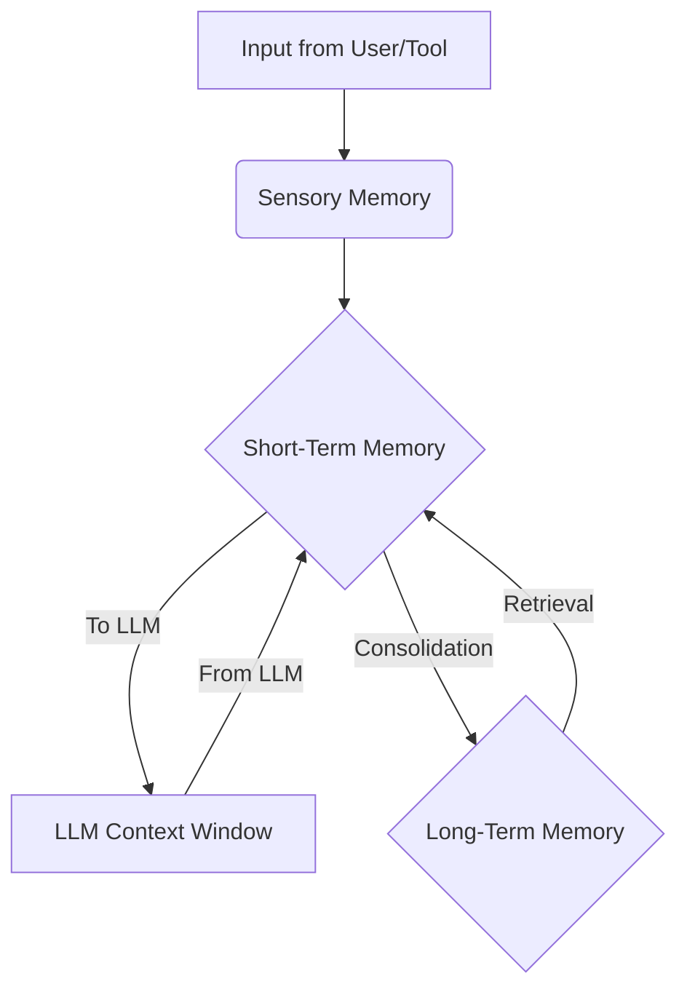

## 1. Concept Introduction

When you read this sentence, you hold its beginning in your mind to understand its end. That's **short-term memory**. To understand the words themselves, you draw upon a lifetime of accumulated knowledge. That's **long-term memory**.

AI agents need an analogous cognitive architecture to be effective. Without memory, every interaction is a blank slate, and the agent is doomed to repeat its mistakes and forget its successes. We can broadly categorize agent memory into two types:

1.  **Short-Term (or Working) Memory:** This is the agent's "scratchpad." It's the context of the current conversation, the results of recent tool calls, and the immediate plan of action. It's volatile and limited.
2.  **Long-Term Memory:** This is the agent's persistent knowledge store. It's where the agent saves key facts, past conversations, user preferences, and learned insights. It's vast and durable.

Architecting the flow of information between these memory systems is one of the most critical aspects of designing an intelligent agent.

## 2. Historical & Theoretical Context

The concept of a shared working memory is a classic idea in AI. In the 1970s, **Blackboard Systems** were developed as a model for complex problem-solving. In this architecture, various specialist programs (or "knowledge sources") would watch a central, shared data structure—the blackboard. When they saw data relevant to their expertise, they would activate, process it, and write their conclusions back to the blackboard for others to see. This blackboard was the system's working memory.

More recently, the challenge of memory in language models has been defined by the physical limitations of the Transformer architecture—the **fixed context window**. Early Recurrent Neural Networks (RNNs) had a form of "memory" in their hidden state, but it was notoriously difficult to maintain over long sequences. The modern approach treats memory less as a passive state and more as an active, external component that the agent interacts with.

## 3. Algorithms & Mechanics: The Memory Pipeline

Information flows from the environment through the agent's memory systems in a structured way.



-   **Sensory Memory:** This is the raw, unprocessed input. It's the user's latest prompt or the JSON output from a tool call. It's the most fleeting type of memory.

-   **Short-Term Memory:** This is the context that will be passed to the LLM on the next turn. Managing it is a balancing act to stay within the model's context window. Common strategies include:
    -   **Conversational Buffer:** The simplest method. Keep a sliding window of the last `k` messages. It's perfectly accurate but has a fixed, often short, memory span.
    -   **Summary Buffer:** As the conversation grows, use an LLM to periodically summarize the older parts of the interaction. This is a "lossy" compression, trading detail for a much longer memory span.
    -   **Token-Based Buffer:** A more precise version of the conversational buffer that keeps messages until the total number of tokens reaches a certain limit.

-   **Long-Term Memory:** This is where the agent stores information for the future. It is almost always implemented as a **retrieval** system, connecting directly to our previous article on RAG.
    1.  **Storage (Consolidation):** When a key fact, a successful plan, or a user preference is identified, it is "consolidated" into long-term memory. This involves using an embedding model to convert the piece of text into a vector.
    2.  **Vector Store:** The vector (and the original text) is stored in a vector database.
    3.  **Retrieval:** At the start of a new interaction, the agent can embed the user's query and search the vector database for relevant past experiences or facts. These retrieved memories are then loaded into the short-term memory to provide relevant context for the upcoming task.

## 4. Design Patterns & Architectures

-   **The Core of the Cognitive Loop:** Memory is the central component of the **Planner-Executor-Memory** loop. The Planner reads from memory to decide what to do. The Executor writes the results of its actions back to memory. This continuous read/write cycle drives the agent's behavior.
-   **Reflective Agents:** A powerful pattern is to create agents that periodically perform "memory consolidation." At the end of a task or a day, the agent can trigger a meta-process where it reviews its entire short-term memory log. It uses an LLM to ask itself questions like, "What were the most important facts I learned?" or "What mistakes did I make, and how can I avoid them?" The answers are then explicitly stored in its long-term memory. This mimics the human process of reflection and learning.
-   **Memory Hierarchies:** Advanced agents can have multiple, specialized long-term memory stores. For example, one vector database for conversational memories, another for factual knowledge from documents (a standard RAG store), and a third for executable code snippets or "skills" it has learned.

## 5. Practical Application

Here is a simplified Python class that sketches out a combined memory system.

```python
from collections import deque
# Assume we have these functions from a vector DB library
# from vector_db import get_embedding, store_vector, search_vectors

class AgentMemory:
    def __init__(self, short_term_k=10):
        # Short-term memory: keep the last k interactions
        self.short_term_buffer = deque(maxlen=short_term_k)

    def add_interaction(self, user_input, agent_response):
        """Adds a user/agent turn to short-term memory."""
        self.short_term_buffer.append({"user": user_input, "agent": agent_response})

    def get_context(self):
        """Formats the short-term memory for the LLM prompt."""
        return list(self.short_term_buffer)

    def store_fact(self, text):
        """Embeds a fact and stores it in long-term memory."""
        print(f"MEMORY: Storing fact -> '{text}'")
        # vector = get_embedding(text)
        # store_vector(vector, text)
        pass # Simulate storing

    def retrieve_relevant_facts(self, query, top_n=3):
        """Searches long-term memory for facts relevant to a query."""
        print(f"MEMORY: Searching for facts related to -> '{query}'")
        # query_vector = get_embedding(query)
        # results = search_vectors(query_vector, top_n)
        # return results
        # Simulate finding a relevant memory
        return ["Fact: The user's favorite color is blue."]

# --- Usage ---
memory = AgentMemory()
memory.add_interaction("Hi there!", "Hello! How can I help you?")
memory.add_interaction("What's my favorite color?", "You told me earlier it's blue.")

# A "reflective" moment
memory.store_fact("The user's favorite color is blue.")

# Later, in a new session...
context = memory.get_context() # Would be empty in a new session
relevant_memories = memory.retrieve_relevant_facts("Do you remember my preferences?")
# The agent would then add relevant_memories to its prompt context.
print(relevant_memories)
```
Frameworks like **LangChain** and **LlamaIndex** offer powerful, pre-built `Memory` modules that handle various buffering strategies and vector store integrations automatically.

## 6. Comparisons & Tradeoffs

-   **Short-Term:** The main tradeoff is between **context length** and **cost/speed**. A simple buffer is fast and cheap but short. A summarizing buffer can remember more but is slower and costs more in API calls.
-   **Long-Term:** The key tradeoff is **retrieval quality**. A simple vector search is fast but might miss relevant information. More complex retrieval strategies (like re-ranking or query transformation) can provide better context but add latency.
-   **Forgetting:** Is forgetting a bug or a feature? A perfect memory might be overwhelming or cause the agent to bring up irrelevant old information. Some architectures are exploring "memory decay" or relevance-based pruning.

## 7. Latest Developments & Research

-   **State-Space Models & "Infinite" Context:** The biggest limitation of short-term memory is the Transformer's fixed context window. New architectures like Mamba or research into state-space models aim to overcome this, potentially allowing for near-infinite context windows, which would fundamentally change short-term memory management.
-   **Generative Agents & Memory Streams:** The influential "Generative Agents" paper from Stanford and Google introduced a sophisticated memory architecture. Agents stored their experiences in a comprehensive "memory stream." Three key processes operated on this stream: **retrieval** (finding relevant memories), **reflection** (synthesizing memories into higher-level insights), and **planning**.

## 8. Cross-Disciplinary Insight

The architecture of agent memory systems is a direct and intentional parallel to the **Atkinson–Shiffrin memory model** (1968), a foundational theory in **Cognitive Psychology**. This model proposes that human memory is split into three components:
1.  **Sensory Memory:** A brief buffer for sensory inputs (sights, sounds).
2.  **Short-Term Memory:** A limited-capacity store for active information.
3.  **Long-Term Memory:** A vast, durable store for knowledge and experiences.

Information flows from sensory to short-term memory. Through processes like rehearsal and elaboration, it can be encoded into long-term memory. When needed, it's retrieved from long-term back into short-term memory to be used. The design of our AI agents' minds is directly mimicking our scientific understanding of our own.

## 9. Daily Challenge / Thought Exercise

Pay attention to your own memory today. Find one clear example of each of the following:
-   **Using Short-Term Memory:** What information did you have to hold in your head temporarily to complete a task (e.g., remembering a phone number while you walked to find your phone)?
-   **Using Long-Term Memory:** What piece of knowledge or past experience did you recall to solve a problem or answer a question?
-   **Memory Consolidation:** Did you learn something new? How might you "save" it for the future? Do you take notes, repeat it to yourself, or connect it to something you already know?

## 10. References & Further Reading

1.  **Park, J. S., et al. (2023).** *Generative Agents: Interactive Simulacra of Human Behavior.* (The groundbreaking paper on believable, memory-driven agents). [https://arxiv.org/abs/2304.03442](https://arxiv.org/abs/2304.03442)
2.  **LangChain Documentation on Memory:** [https://python.langchain.com/docs/modules/memory/](https://python.langchain.com/docs/modules/memory/) (A practical guide to implementing different memory types).
3.  **Atkinson, R. C., & Shiffrin, R. M. (1968).** *Human memory: A proposed system and its control processes.* (The classic cognitive psychology paper).
---
