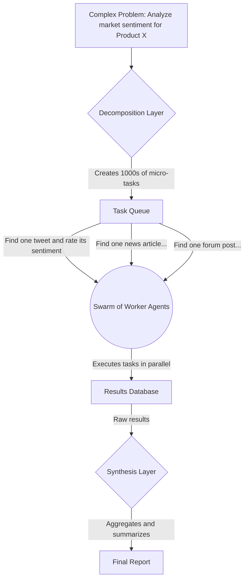

## 1. Concept Introduction

Observe a colony of ants. No single ant possesses a grand blueprint. There is no "leader" ant giving orders. Each ant operates on a few simple rules, reacting to its local environment and the pheromone trails of its peers. Yet, from these simple, decentralized actions, a stunningly complex intelligence emerges: the colony builds intricate nests, finds the shortest path to food, and defends its territory.

This is the core philosophy behind an **AI Agent Swarm**. Instead of building one monolithic, super-intelligent agent or a small team of specialized agents, a swarm consists of a massive number of relatively simple, often identical agents working in parallel. The complex, intelligent behavior of the system is an **emergent property** of their collective actions, not the design of any single member.

## 2. Historical & Theoretical Context

The idea is a direct import from biology, specifically the field of **Swarm Intelligence**. Researchers in the 1980s and 90s, like Marco Dorigo and James Kennedy, developed computational models inspired by natural swarms. This led to powerful optimization algorithms:
-   **Ant Colony Optimization (ACO):** Inspired by how ants find the shortest path to a food source, used to solve routing and scheduling problems.
-   **Particle Swarm Optimization (PSO):** Inspired by the flocking of birds, used to find optimal solutions in complex, high-dimensional spaces.

These early swarms were composed of simple mathematical agents. The modern revolution is the fusion of this swarm paradigm with the advanced reasoning capabilities of LLMs. Now, each "ant" in the colony can be a sophisticated language model, capable of performing much more complex tasks.

## 3. The Mechanics: Decompose, Distribute, Synthesize

While swarms can be designed in many ways, a common and powerful workflow for problem-solving involves three main phases.



1.  **Decomposition:** A central problem is broken down into hundreds or thousands of independent micro-tasks. The key is that these tasks can be completed in parallel without needing to know the results of the others.
2.  **Distribution & Execution:** The micro-tasks are placed in a queue. A large number of worker agents are instantiated. Each agent pulls a single task from the queue, executes it, and writes its result to a shared data store (like a database or a "blackboard"). The agent then either terminates or pulls the next available task.
3.  **Synthesis (or Reduction):** After the swarm has processed all the tasks, a separate process or a different type of "synthesizer" agent reads all the raw results. It filters, aggregates, clusters, and summarizes the outputs to produce a single, coherent final answer.

The core principles of this architecture are:
-   **Decentralized Execution:** The workers are independent and don't communicate with each other.
-   **Massive Parallelism:** The ability to throw vast computational resources at a problem by simply adding more agents.
-   **Simple, Local Rules:** Each worker agent's logic is simple: `Read Task -> Execute Task -> Write Result`.
-   **Emergent Result:** The final, high-quality report is an emergent property of the thousands of micro-reports generated by the swarm.

## 4. Design Patterns & Architectures

-   **Massively Parallel Task Execution:** This is the canonical use case for swarms. It's ideal for any problem that can be described as "for each item in this giant list, do X." Examples include: scraping millions of websites, analyzing sentiment on thousands of social media posts, or testing millions of code parameter combinations.
-   **Generative-Critique Swarms:** A more dynamic pattern where the swarm is split into two groups. **Generators** create potential solutions or ideas. **Critics** evaluate these solutions based on a set of criteria. The best solutions are then fed back to the generators for refinement, creating an evolutionary loop.
-   **Blackboard Systems:** Swarms often use a blackboard architecture for communication. Instead of sending messages directly to each other, agents communicate indirectly by reading from and writing to a shared data space. This decouples the agents and makes the system highly scalable.

## 5. Practical Application

Here is a conceptual Python example using `concurrent.futures` to simulate a swarm processing a list of URLs.

```python
import concurrent.futures
import time

# The simple, repeatable task for each agent
def worker_agent_task(url):
    """
    A simple agent that takes a URL, simulates processing it,
    and returns a piece of information.
    """
    print(f"AGENT: Processing {url}...")
    # In a real scenario, this would involve web scraping, LLM analysis, etc.
    time.sleep(1) # Simulate network and processing time
    result = f"Data from {url}"
    print(f"AGENT: Finished {url}.")
    return result

# --- Swarm Orchestration ---
# 1. Decomposition: The list of URLs is our decomposed task list.
urls_to_process = [
    "http://example.com/a",
    "http://example.com/b",
    "http://example.com/c",
    "http://example.com/d",
    "http://example.com/e",
]

# 2. Distribution & Execution: Use a thread pool to run agents in parallel.
# We create a "swarm" of 5 worker agents.
swarm_size = 5
all_results = []
with concurrent.futures.ThreadPoolExecutor(max_workers=swarm_size) as executor:
    # The executor.map function distributes the tasks to the swarm
    future_to_url = {executor.submit(worker_agent_task, url): url for url in urls_to_process}
    for future in concurrent.futures.as_completed(future_to_url):
        try:
            data = future.result()
            all_results.append(data)
        except Exception as exc:
            print(f'URL generated an exception: {exc}')

# 3. Synthesis: Combine the results into a final report.
final_report = "\n".join(all_results)
print("\n--- SYNTHESIS COMPLETE ---")
print("Final Report:")
print(final_report)
```
Frameworks like **Swarms.ai** are being developed to provide high-level abstractions for defining, deploying, and managing these large-scale agentic systems.

## 6. Comparisons & Tradeoffs

**Agent Swarms vs. Hierarchical Agent Teams (e.g., CrewAI-style):**

-   **Structure:** Swarms are flat and decentralized. Teams are hierarchical with specialized roles.
-   **Agents:** Swarm agents are numerous, simple, and often identical. Team agents are few, complex, and unique.
-   **Task Type:** Swarms excel at **breadth-first**, parallelizable tasks (e.g., "check 1000 websites"). Teams excel at **depth-first**, sequential tasks requiring diverse skills (e.g., "write a business plan").
-   **Robustness:** Swarms are highly robust; losing a few agents is irrelevant. In a team, losing a critical specialist can halt the entire process.

**Limitations:**
-   **Not for Sequential Tasks:** Swarms are the wrong tool for problems that require a step-by-step workflow where each step depends on the last.
-   **Synthesis is Hard:** The challenge is often shifted from execution to the final synthesis step, which can be a complex sense-making and data analysis problem in itself.

## 7. Latest Developments & Research

-   **The Swarm as a Model:** Some researchers speculate that the next generation of foundation models might be trained using swarm-like architectures, where a vast number of smaller, specialized models collaborate during training and inference.
-   **Self-Organizing Swarms:** The frontier of research is in creating swarms that can dynamically organize themselves without a central decomposer/synthesizer. This would involve agents autonomously deciding how to break down a problem and how to combine their results, a much closer mimicry of natural swarms.
-   **Human-in-the-Loop Swarms:** Systems that allow humans to guide and prune the work of a swarm in real-time, acting as a "shepherd" for the collective intelligence.

## 8. Cross-Disciplinary Insight

The agent swarm paradigm is a powerful application of principles from **Distributed Computing**, most notably the **MapReduce** programming model, which became famous for its use in big data processing.
-   **Map:** The swarm of worker agents is the "Map" phase. Each agent applies a function (its core logic) to a piece of the input data (its assigned micro-task).
-   **Reduce:** The synthesis layer is the "Reduce" phase. It takes all the mapped outputs and aggregates them into a final result.

Viewing agent swarms through this lens shows that they are a natural evolution of proven big data architectures, adapted for the age of AI.

## 9. Daily Challenge / Thought Exercise

Imagine you are tasked with creating a comprehensive report on "the future of renewable energy."
1.  **Decomposition:** How would you break this enormous topic down into hundreds of simple, parallelizable micro-tasks for an agent swarm? (e.g., "Find one 2023 academic paper on solar panel efficiency," "Find one news article about a new wind farm project," etc.)
2.  **Synthesis:** After your swarm has run and you have 10,000 small pieces of information, what would your strategy be for the synthesis agent to turn that raw data into a coherent report?

## 10. References & Further Reading

1.  **Dorigo, M., Birattari, M., & Stutzle, T. (2006).** *Ant Colony Optimization.* (A foundational look at one of the classic swarm intelligence algorithms).
2.  **Swarms.ai Documentation:** [https://github.com/kyrolabs/swarms](https://github.com/kyrolabs/swarms) (An example of a modern, open-source framework for building agent swarms).
3.  **MapReduce: Simplified Data Processing on Large Clusters:** [https://static.googleusercontent.com/media/research.google.com/en//archive/mapreduce-osdi04.pdf](https://static.googleusercontent.com/media/research.google.com/en//archive/mapreduce-osdi04.pdf) (The original Google paper that popularized the MapReduce model).
---