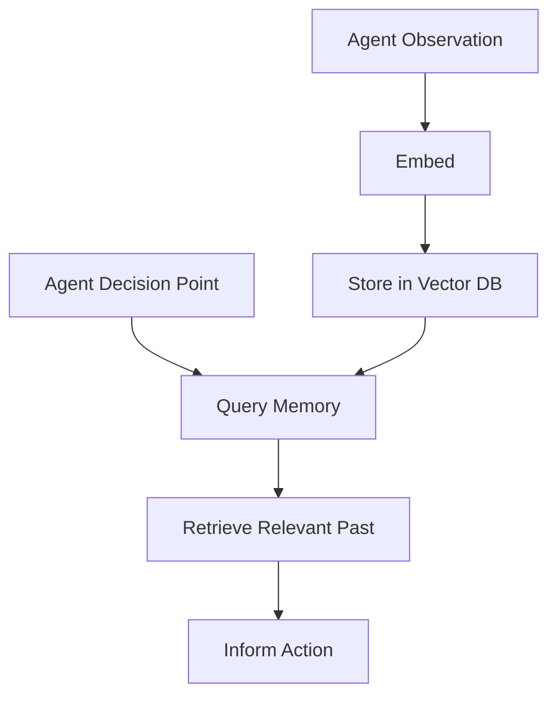

## Concept Introduction

### For Beginners

Imagine you need to find "documents about cats" in a massive library. Traditional search looks for the exact word "cats," but what about documents that say "feline," "kitty," or "tabby"? Semantic search understands **meaning**, not just words.

Vector embeddings transform text (or images, audio, etc.) into arrays of numbers—points in high-dimensional space—where **similar meanings cluster together**. "Cat" and "feline" end up close in this space, while "cat" and "automobile" are far apart.

For AI agents, this is revolutionary. Instead of exact keyword matching, agents can:
- Remember conversations by meaning, not just keywords
- Retrieve relevant context from millions of documents in milliseconds
- Make decisions based on semantic similarity to past experiences

### For Practitioners

A **vector embedding** is a learned continuous representation of data in ℝⁿ (typically n=384 to 4096 dimensions). Modern embedding models are deep neural networks trained via contrastive learning or other self-supervised objectives to satisfy:

```
similarity(embed(text_a), embed(text_b)) ≈ semantic_similarity(text_a, text_b)
```

The embedding function `f: Text → ℝⁿ` maps discrete tokens into a dense vector space where cosine similarity, Euclidean distance, or dot product serve as semantic proximity metrics.

**Key properties:**
- **Semantic preservation**: Similar inputs → similar vectors
- **Dimensionality**: Trade-off between expressiveness and efficiency
- **Metric space**: Enables efficient nearest-neighbor search (ANN)

## Historical & Theoretical Context

### Origins

The journey from symbolic AI to semantic embeddings:

**1986-1990s**: Distributed representations emerge
- Hinton's family tree experiment (1986) showed neural networks could learn hierarchical relationships
- Bengio's neural language models (2003) introduced learned word representations

**2013**: Word2Vec revolution
- Mikolov et al. at Google introduced Skip-gram and CBOW
- First practical, scalable word embeddings
- Famous equation: `king - man + woman ≈ queen`

**2018-Present**: Transformer-based embeddings
- BERT (2018) introduced contextual embeddings
- Sentence-BERT (2019) made sentence-level embeddings practical
- OpenAI's text-embedding-ada-002 (2022), Cohere's embed-v3, Google's Gecko (2024)

### Theoretical Foundation

Embeddings formalize the **distributional hypothesis** from linguistics: "You shall know a word by the company it keeps" (Firth, 1957).

Mathematically, we optimize:

```
L = -log σ(v_target · v_context) - Σ log σ(-v_target · v_noise_i)
```

Where:
- `v` are embedding vectors
- `σ` is sigmoid function
- Positive pairs (actual context) attract
- Negative samples (noise) repel

## Algorithms & Math

### Creating Embeddings

**Modern embedding models** (e.g., E5, Instructor, BGE) use:

1. **Tokenization**: Text → token IDs
2. **Transformer encoding**: Bidirectional attention
3. **Pooling**: Token embeddings → sentence embedding
   - Mean pooling: Average of token vectors
   - CLS token: Use [CLS] token output
   - Max pooling: Element-wise maximum

**Pseudocode:**

```python
def embed(text, model):
    # Tokenize
    tokens = tokenizer(text)

    # Forward pass through transformer
    hidden_states = transformer(tokens)

    # Pool to single vector
    if pooling == "mean":
        embedding = mean(hidden_states, axis=0)
    elif pooling == "cls":
        embedding = hidden_states[0]  # CLS token

    # Normalize to unit length (for cosine similarity)
    embedding = embedding / ||embedding||

    return embedding
```

### Similarity Search

**Exact search** (brute force):
```
For query q, compute similarity(q, v_i) for all vectors v_i
Return top-k by score
```

**Complexity**: O(n·d) where n=database size, d=dimensions

**Approximate Nearest Neighbor (ANN)** algorithms:

1. **HNSW (Hierarchical Navigable Small World)**
   - Graph-based, O(log n) search
   - Industry standard (used in FAISS, Pinecone, Weaviate)

2. **IVF (Inverted File Index)**
   - Cluster vectors, search only relevant clusters
   - O(√n) with good tuning

3. **Product Quantization**
   - Compress vectors for memory efficiency
   - 8x-32x compression with minimal accuracy loss

## Design Patterns & Architectures

### Pattern 1: Retrieval-Augmented Generation (RAG)

```
User Query → Embed → Similarity Search → Retrieve Docs → LLM Context → Response
```

**Components:**
- **Embedding model**: Query + document encoding
- **Vector database**: Stores embeddings + metadata
- **Retrieval logic**: Top-k, filtering, re-ranking
- **LLM**: Generates response with retrieved context

### Pattern 2: Semantic Memory for Agents



### Pattern 3: Hybrid Search

Combine semantic + keyword search:

```python
score = α · semantic_score + (1-α) · bm25_score
```

Used in Pinecone, Weaviate for best-of-both-worlds retrieval.

## Practical Application

### Minimal Example: Building Agent Memory

```python
from sentence_transformers import SentenceTransformer
import numpy as np
from numpy.linalg import norm

class SemanticMemory:
    def __init__(self, model_name='all-MiniLM-L6-v2'):
        self.model = SentenceTransformer(model_name)
        self.memories = []  # List of (text, embedding) tuples

    def remember(self, text):
        """Store a memory"""
        embedding = self.model.encode(text)
        self.memories.append((text, embedding))

    def recall(self, query, top_k=3):
        """Retrieve most relevant memories"""
        query_emb = self.model.encode(query)

        # Compute cosine similarities
        scores = []
        for text, mem_emb in self.memories:
            cosine = np.dot(query_emb, mem_emb) / (norm(query_emb) * norm(mem_emb))
            scores.append((text, cosine))

        # Return top-k
        scores.sort(key=lambda x: x[1], reverse=True)
        return scores[:top_k]

# Usage
memory = SemanticMemory()

# Agent experiences
memory.remember("The user prefers Python over JavaScript")
memory.remember("Last project used FastAPI framework")
memory.remember("User mentioned disliking overly verbose code")

# Later, agent recalls
results = memory.recall("What are the user's coding preferences?")
for text, score in results:
    print(f"{score:.3f}: {text}")
```

**Output:**
```
0.712: The user prefers Python over JavaScript
0.658: User mentioned disliking overly verbose code
0.432: Last project used FastAPI framework
```

### Integration with LangGraph

```python
from langgraph.graph import StateGraph
from langchain_openai import OpenAIEmbeddings
from langchain_pinecone import PineconeVectorStore

# Define agent state
class AgentState(TypedDict):
    messages: list
    context: list  # Retrieved memories

# Retrieval node
def retrieve_memories(state):
    query = state["messages"][-1].content

    # Query vector DB
    vectorstore = PineconeVectorStore(
        embedding=OpenAIEmbeddings(),
        index_name="agent-memory"
    )
    docs = vectorstore.similarity_search(query, k=5)

    return {"context": docs}

# LLM node with context
def respond(state):
    context = "\n".join([doc.page_content for doc in state["context"]])
    prompt = f"Context:\n{context}\n\nUser: {state['messages'][-1].content}"
    # ... call LLM with prompt

# Build graph
workflow = StateGraph(AgentState)
workflow.add_node("retrieve", retrieve_memories)
workflow.add_node("respond", respond)
workflow.add_edge("retrieve", "respond")
```

## Comparisons & Tradeoffs

### Embedding Models

| Model | Dimensions | Speed | Quality | Use Case |
|-------|-----------|-------|---------|----------|
| all-MiniLM-L6-v2 | 384 | Fast | Good | Prototypes, low-latency |
| text-embedding-3-small | 1536 | Medium | Better | Production, cost-effective |
| text-embedding-3-large | 3072 | Slow | Best | High-accuracy, research |
| Cohere embed-v3 | 1024 | Medium | Excellent | Multilingual, custom |

**Tradeoffs:**
- **Dimension size**: Higher = more expressive but slower search + more memory
- **Domain-specific fine-tuning**: Better accuracy but requires labeled data
- **Multilingual**: Universal models trade per-language quality for breadth

### Vector Databases

| Database | ANN Algorithm | Scalability | Best For |
|----------|--------------|-------------|----------|
| FAISS | HNSW, IVF | Billions | Research, custom setups |
| Pinecone | Proprietary | Billions | Managed, production |
| Weaviate | HNSW | Millions-billions | Open source, hybrid search |
| Chroma | HNSW | Millions | Lightweight, local dev |
| Qdrant | HNSW | Billions | Filtering, metadata |

**Limitations:**
- **Curse of dimensionality**: Very high dimensions (>2000) degrade ANN performance
- **Semantic gaps**: Embeddings struggle with negation, sarcasm, highly technical jargon
- **Cold start**: Need sufficient data to build effective indexes

## Latest Developments & Research

### 2023-2025 Breakthroughs

**1. Matryoshka Embeddings (2023)**
- Single model produces nested embeddings (e.g., 64, 128, 256, ... 1024 dims)
- Truncate to desired size without retraining
- [Paper: "Matryoshka Representation Learning"](https://arxiv.org/abs/2205.13147)

**2. ColBERT v2 (2024)**
- Late interaction: Store token-level embeddings
- 2-10x better accuracy than single-vector retrieval
- Used in RAG systems for nuanced matching

**3. E5-Mistral-7B (2024)**
- First decoder-only embedding model
- Matches encoder quality with unified architecture
- Enables embedding + generation in one model

**4. Contextual Retrieval (Anthropic, 2024)**
- Prepend chunk context before embedding
- 67% reduction in retrieval failures
- [Anthropic Blog](https://www.anthropic.com/news/contextual-retrieval)

**5. Hypothetical Document Embeddings (HyDE)**
- Embed LLM-generated "ideal answer" instead of query
- Better retrieval for complex questions
- 5-10% accuracy gains on open-domain QA

### Open Problems

- **Compositionality**: "red car" vs "car that is red"—embeddings often conflate
- **Temporal dynamics**: Meanings drift (e.g., "tweet" pre/post Twitter)
- **Efficient updates**: Most indexes require full rebuild for new data
- **Explainability**: Why did this document match? (black-box similarity)

## Cross-Disciplinary Insight

### Connection to Neuroscience

The brain's **hippocampus** performs semantic memory retrieval analogous to vector search:

- **Grid cells** create spatial embeddings (Nobel Prize 2014)
- **Place cells** fire for specific locations → sparse distributed representations
- **Memory consolidation** = strengthening synaptic weights in semantic networks

Computational models like **Hopfield Networks** (1982) inspired modern attention mechanisms (Transformer = modern Hopfield, 2021 proof).

### Distributed Systems Parallel

Vector databases solve similar problems as **Content Delivery Networks (CDNs)**:

- **Sharding**: Partition embeddings across nodes (like geographic CDN distribution)
- **Replication**: Multiple copies for fault tolerance
- **Caching**: Hot vectors in memory (L1/L2 cache hierarchy)

**CAP Theorem** applies: Vector DBs typically choose **AP** (availability + partition tolerance) over consistency, using eventual consistency for writes.

## Daily Challenge

### Thought Exercise: Embedding Geometry

**Question**: If you have embeddings for:
- "The cat sat on the mat" (vector A)
- "A feline rested on the rug" (vector B)
- "Python is a programming language" (vector C)

And `cosine(A, B) = 0.85`, `cosine(A, C) = 0.12`, what would you expect for:
1. `cosine(B, C)` - approximate value and why?
2. The embedding of "The cat sat on the python"?

### Coding Challenge (30 mins)

**Build a multi-modal memory system:**

```python
# Challenge: Extend SemanticMemory to support:
# 1. Memory decay (older memories less relevant)
# 2. Memory importance weighting
# 3. Forgetting (remove low-score memories when full)

class AdvancedMemory(SemanticMemory):
    def __init__(self, max_size=100):
        super().__init__()
        # Add: timestamps, importance scores, decay function
        pass

    def remember(self, text, importance=1.0):
        # Store with timestamp and importance
        pass

    def recall(self, query, top_k=3):
        # Apply time decay and importance weighting
        # Formula: score = cosine * importance * exp(-λ * age)
        pass

    def forget(self):
        # Remove lowest-scoring memories when over max_size
        pass
```

**Bonus**: Implement cluster-based retrieval (group similar memories, search clusters first).

## References & Further Reading

### Foundational Papers

1. **Mikolov et al. (2013)**: "Efficient Estimation of Word Representations in Vector Space"
   - [https://arxiv.org/abs/1301.3781](https://arxiv.org/abs/1301.3781)

2. **Reimers & Gurevych (2019)**: "Sentence-BERT: Sentence Embeddings using Siamese BERT-Networks"
   - [https://arxiv.org/abs/1908.10084](https://arxiv.org/abs/1908.10084)

3. **Malkov & Yashunin (2018)**: "Efficient and robust approximate nearest neighbor search using Hierarchical Navigable Small World graphs"
   - [https://arxiv.org/abs/1603.09320](https://arxiv.org/abs/1603.09320)

### Modern Resources

4. **MTEB Leaderboard**: Massive Text Embedding Benchmark
   - [https://huggingface.co/spaces/mteb/leaderboard](https://huggingface.co/spaces/mteb/leaderboard)
   - Compare 100+ embedding models on 56 datasets

5. **Anthropic's Contextual Retrieval Guide** (2024)
   - [https://www.anthropic.com/news/contextual-retrieval](https://www.anthropic.com/news/contextual-retrieval)

6. **Pinecone Learning Center**: Vector database fundamentals
   - [https://www.pinecone.io/learn/](https://www.pinecone.io/learn/)

### Code Repositories

7. **FAISS**: Facebook AI Similarity Search
   - [https://github.com/facebookresearch/faiss](https://github.com/facebookresearch/faiss)

8. **Sentence Transformers**: Easy-to-use embeddings
   - [https://www.sbert.net/](https://www.sbert.net/)

9. **LlamaIndex**: RAG framework with embedding integrations
   - [https://github.com/run-llama/llama_index](https://github.com/run-llama/llama_index)

### Advanced Topics

10. **Rau et al. (2024)**: "Matryoshka Representation Learning"
    - [https://arxiv.org/abs/2205.13147](https://arxiv.org/abs/2205.13147)

11. **Khattab & Zaharia (2020)**: "ColBERT: Efficient and Effective Passage Search"
    - [https://arxiv.org/abs/2004.12832](https://arxiv.org/abs/2004.12832)

---

**Tomorrow's Preview**: We'll explore **"Agentic Loops with Tool Use: From ReAct to Function Calling Orchestration"**—how agents decide *which* tool to use and *when* to stop reasoning.

*Master one concept daily. Build agents systematically.*
