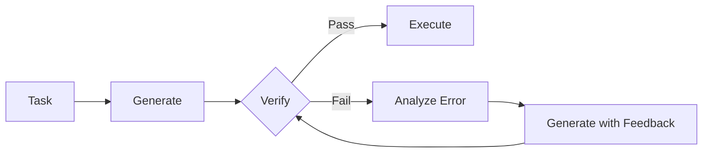
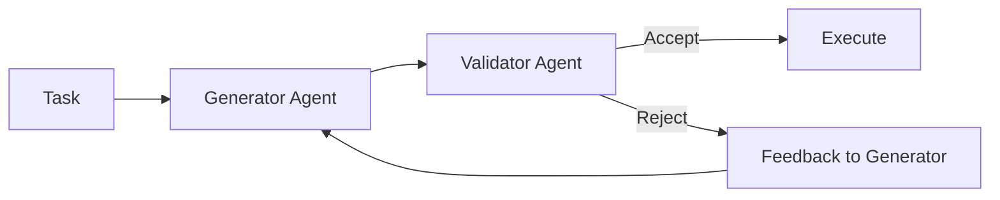

When an AI agent writes code, queries a database, or makes a critical decision, how do you know it got it right? Unlike traditional software where logic is deterministic, AI agents introduce probabilistic behavior that can fail in subtle ways. **Verification and Validation (V&V) loops** are the safety net that catches these failures before they cause harm.

## 1. Concept Introduction

### Simple Terms

Imagine you're writing an important email. Before hitting send, you re-read it, check for typos, and verify the recipient is correct. Verification and validation loops give AI agents this same self-checking capability—they generate an output, then critically examine it before taking action.

### Technical Detail

V&V loops are architectural patterns where agents:
1. **Generate** an output (code, text, decision, action)
2. **Verify** syntactic correctness (does it parse? follow format rules?)
3. **Validate** semantic correctness (does it solve the right problem? meet constraints?)
4. **Correct** or **retry** if checks fail

This creates a feedback loop where the agent becomes its own quality assurance system, dramatically improving reliability in production environments.

## 2. Historical & Theoretical Context

### Origins

The concept comes from software engineering's **V-model** (1980s), where each development phase has a corresponding testing phase. For AI agents, this pattern gained prominence around 2020-2023 with:

- **Codex/GPT-4** showing that LLMs could both generate and critique code
- **Tool-using agents** needing to validate outputs before external API calls
- **Production failures** demonstrating the cost of unchecked agent outputs

### Core Principle

V&V loops embody the **"trust but verify"** principle from control theory and systems engineering. They recognize that:
- No generator is perfect (including AI models)
- Early error detection is cheaper than downstream failure
- Multiple weak validators can create strong guarantees

## 3. Algorithms & Math

### Basic V&V Loop Algorithm

```python
def vv_loop(task, max_retries=3):
    """
    Execute task with verification and validation
    """
    for attempt in range(max_retries):
        # Generate
        output = agent.generate(task)

        # Verify (syntactic checks)
        if not verify(output):
            feedback = get_verification_errors(output)
            task = enhance_with_feedback(task, feedback)
            continue

        # Validate (semantic checks)
        if not validate(output, task.constraints):
            feedback = get_validation_errors(output, task)
            task = enhance_with_feedback(task, feedback)
            continue

        # Success
        return output

    # All retries exhausted
    raise ValidationError("Failed to produce valid output")
```

### Probabilistic Formulation

Let $G$ be the generation function, $V$ the verification function, and $C$ the correction function. The probability of success after $n$ attempts is:

$$P(\text{success})_n = 1 - \prod_{i=1}^{n} (1 - P(V(G(C^{i-1}(prompt)))))$$

Where $C^{i-1}$ represents $i-1$ correction iterations. Each retry with feedback typically increases success probability.

### Multi-Validator Ensemble

For critical applications, use multiple validators:

```python
def ensemble_validation(output, validators):
    """
    Require majority agreement among validators
    """
    votes = [v(output) for v in validators]
    confidence = sum(votes) / len(votes)

    return {
        'valid': confidence >= 0.5,
        'confidence': confidence,
        'disagreements': [i for i, v in enumerate(votes) if not v]
    }
```

## 4. Design Patterns & Architectures

### Pattern 1: Generate-Verify-Correct (GVC)



**Use when:** Output has clear correctness criteria (code, structured data)

### Pattern 2: Dual-Agent Validator



**Use when:** Validation requires complex reasoning (security review, logic checking)

### Pattern 3: Hierarchical V&V

```python
class HierarchicalVV:
    def __init__(self):
        self.checks = [
            ('syntax', fast_syntax_check),
            ('type', type_checker),
            ('logic', expensive_formal_verification),
            ('security', security_scan)
        ]

    def validate(self, output):
        """Run checks in order of cost/speed"""
        for name, check in self.checks:
            if not check(output):
                return False, f"Failed {name} check"
        return True, "All checks passed"
```

**Use when:** Some checks are expensive—fail fast on cheap checks first

### Integration with Agent Architecture

V&V loops fit into the Planner-Executor-Memory pattern:

```
Planner → Executor → [V&V Loop] → Memory
                ↑_________|
```

The V&V loop gates entry to execution and memory storage, preventing bad outputs from propagating.

## 5. Practical Application

### Code Validation Example

```python
import ast
import subprocess
from typing import Tuple

class CodeValidator:
    def __init__(self, llm):
        self.llm = llm

    def generate_code(self, task: str, max_retries: int = 3) -> str:
        """Generate Python code with V&V loop"""
        prompt = task

        for attempt in range(max_retries):
            # Generate
            code = self.llm.generate(prompt)

            # Verify: Syntax check
            syntax_valid, syntax_error = self._verify_syntax(code)
            if not syntax_valid:
                prompt = f"{task}\n\nPrevious attempt had syntax error:\n{syntax_error}\n\nPlease fix."
                continue

            # Verify: Runs without error
            runtime_valid, runtime_error = self._verify_runtime(code)
            if not runtime_valid:
                prompt = f"{task}\n\nPrevious code raised error:\n{runtime_error}\n\nPlease fix."
                continue

            # Validate: Meets requirements
            semantic_valid, semantic_feedback = self._validate_semantics(code, task)
            if not semantic_valid:
                prompt = f"{task}\n\nCode runs but: {semantic_feedback}\n\nPlease revise."
                continue

            return code

        raise ValueError(f"Failed to generate valid code after {max_retries} attempts")

    def _verify_syntax(self, code: str) -> Tuple[bool, str]:
        """Check if code is syntactically valid Python"""
        try:
            ast.parse(code)
            return True, ""
        except SyntaxError as e:
            return False, str(e)

    def _verify_runtime(self, code: str) -> Tuple[bool, str]:
        """Execute code in sandbox and catch errors"""
        try:
            result = subprocess.run(
                ['python', '-c', code],
                capture_output=True,
                text=True,
                timeout=5
            )
            if result.returncode != 0:
                return False, result.stderr
            return True, ""
        except subprocess.TimeoutExpired:
            return False, "Code execution timed out"

    def _validate_semantics(self, code: str, task: str) -> Tuple[bool, str]:
        """Use LLM to check if code solves the task"""
        validation_prompt = f"""
        Task: {task}

        Generated code:
        ```python
        {code}
        ```

        Does this code correctly solve the task?
        Answer with YES or NO, followed by explanation.
        """

        response = self.llm.generate(validation_prompt)
        valid = response.strip().upper().startswith('YES')
        feedback = response.split('\n', 1)[1] if '\n' in response else ""

        return valid, feedback

# Usage with LangChain
from langchain.chat_models import ChatOpenAI

validator = CodeValidator(ChatOpenAI(model="gpt-4", temperature=0))

task = "Write a function that finds the longest palindromic substring"
code = validator.generate_code(task)
print(code)
```

### Integration with LangGraph

```python
from langgraph.graph import StateGraph, END

def create_vv_agent():
    workflow = StateGraph()

    # Nodes
    workflow.add_node("generate", generate_output)
    workflow.add_node("verify", verify_output)
    workflow.add_node("validate", validate_output)
    workflow.add_node("correct", apply_corrections)

    # Edges
    workflow.set_entry_point("generate")
    workflow.add_edge("generate", "verify")

    # Conditional edges
    workflow.add_conditional_edges(
        "verify",
        should_retry,
        {
            "pass": "validate",
            "fail": "correct"
        }
    )

    workflow.add_conditional_edges(
        "validate",
        should_retry,
        {
            "pass": END,
            "fail": "correct"
        }
    )

    workflow.add_edge("correct", "generate")

    return workflow.compile()
```

## 6. Comparisons & Tradeoffs

| Approach | Latency | Reliability | Cost | Best For |
|----------|---------|-------------|------|----------|
| **No V&V** | Low | Poor | Low | Prototypes only |
| **Static Rules** | Low | Medium | Low | Well-defined formats |
| **LLM Validator** | High | High | High | Complex semantics |
| **Ensemble V&V** | Very High | Very High | Very High | Mission-critical |
| **Hybrid** | Medium | High | Medium | Production systems |

### Strengths

- **Catches errors early** before they propagate
- **Improves reliability** without retraining models
- **Provides interpretability** through explicit checks
- **Scales with criticality** (add more validators as needed)

### Limitations

- **Latency cost**: Each retry adds generation time
- **Validator quality**: Validators can have false positives/negatives
- **Infinite loops**: Poor feedback can cause repetitive failures
- **Cost**: Multiple LLM calls multiply API expenses

### When to Use

✅ **Use V&V loops when:**
- Errors are costly (financial transactions, code deployment)
- Output format is critical (JSON API, database queries)
- Domain has clear correctness criteria (math, logic, code)

❌ **Skip V&V loops when:**
- Subjective creative tasks (story writing, brainstorming)
- Latency is paramount (real-time chat)
- Errors are easily recoverable by humans

## 7. Latest Developments & Research

### Recent Research (2023-2025)

**Self-Debugging (Chen et al., 2023)**
- Paper: "Teaching Large Language Models to Self-Debug"
- Finding: GPT-4 improved code correctness from 48% to 68% with simple self-debugging loops
- Key insight: Explicit error messages enable better self-correction than general prompts

**Constitutional AI for Validation (Anthropic, 2024)**
- Using structured critiques as validators
- Reduces harmful outputs by 75% compared to base models
- Combines rule-based and LLM-based validation

**Formal Verification Integration (2024)**
- Tools like Dafny and Coq integrated with LLM agents
- Mathematically proven correctness for critical code paths
- Hybrid approach: LLM generates, theorem prover verifies

**Benchmarks**
- **HumanEval+**: Extended code benchmark with validation tests (2023)
- **AgentBench**: Multi-task agent benchmark with correctness metrics (2024)
- Agents with V&V loops achieve 15-30% higher success rates

### Open Problems

1. **Validator training**: How to train specialized validator models?
2. **Feedback quality**: What feedback maximizes correction success?
3. **Optimal retry strategies**: When to give up vs. keep trying?
4. **Cost optimization**: How to minimize validation overhead?

## 8. Cross-Disciplinary Insight

### From Software Engineering: Design by Contract

Bertrand Meyer's **Design by Contract** (1986) introduced preconditions, postconditions, and invariants. V&V loops are the runtime equivalent:

```python
def divide(a: float, b: float) -> float:
    # Precondition (verify)
    assert b != 0, "Divisor cannot be zero"

    result = a / b

    # Postcondition (validate)
    assert abs(result * b - a) < 1e-10, "Result failed sanity check"

    return result
```

### From Control Theory: Closed-Loop Control

V&V loops implement **closed-loop control** where:
- **Setpoint**: Desired output properties
- **Process**: LLM generation
- **Sensor**: Verification/validation checks
- **Controller**: Feedback-based correction

This provides stability and error correction, just like thermostats or cruise control.

### From Biology: Immune System

The immune system uses multi-layered validation:
1. **Skin barrier** (syntax checks)
2. **Innate immunity** (pattern matching)
3. **Adaptive immunity** (learned validation)

Similarly, effective V&V uses defense in depth with multiple validation layers.

## 9. Daily Challenge

### Challenge: Build a JSON Schema Validator Agent

**Task**: Create an agent that generates JSON data matching a schema, with a V&V loop ensuring compliance.

```python
import json
from jsonschema import validate, ValidationError

# Your task:
# 1. Write a function that uses an LLM to generate JSON for this schema
# 2. Add verification (valid JSON syntax)
# 3. Add validation (matches schema)
# 4. Implement retry with feedback
# 5. Test with edge cases

schema = {
    "type": "object",
    "properties": {
        "name": {"type": "string"},
        "age": {"type": "integer", "minimum": 0, "maximum": 120},
        "email": {"type": "string", "format": "email"}
    },
    "required": ["name", "age", "email"]
}

task = "Generate profile for a 25-year-old software engineer named Alice"

# Your implementation here
def generate_json_with_vv(task, schema, llm):
    # TODO: Implement V&V loop
    pass

# Test cases to handle:
# - Invalid JSON syntax
# - Missing required fields
# - Type mismatches
# - Constraint violations (age out of range)
```

**Extension**: Add a semantic validator that checks if generated data is **plausible** (e.g., name matches gender, age matches job seniority).

**Time**: 30 minutes

## 10. References & Further Reading

### Papers
- **"Teaching Large Language Models to Self-Debug"** (Chen et al., 2023)
  https://arxiv.org/abs/2304.05128

- **"Self-Refine: Iterative Refinement with Self-Feedback"** (Madaan et al., 2023)
  https://arxiv.org/abs/2303.17651

- **"Constitutional AI: Harmlessness from AI Feedback"** (Bai et al., 2022)
  https://arxiv.org/abs/2212.08073

- **"Reflexion: Language Agents with Verbal Reinforcement Learning"** (Shinn et al., 2023)
  https://arxiv.org/abs/2303.11366

### Tools & Frameworks
- **Guardrails AI**: https://github.com/guardrails-ai/guardrails
  Python framework for output validation with custom validators

- **Instructor**: https://github.com/jxnl/instructor
  Structured output validation for OpenAI/Anthropic models

- **LangChain Output Parsers**: https://python.langchain.com/docs/modules/model_io/output_parsers/
  Built-in validation for common formats

- **Guidance**: https://github.com/guidance-ai/guidance
  Constrained generation with built-in validation

### Blog Posts
- **"Building Reliable AI Agents"** (OpenAI, 2024)
  https://platform.openai.com/docs/guides/reliability

- **"How Anthropic Ensures Claude Reliability"** (Anthropic, 2024)
  https://www.anthropic.com/index/claude-reliability

### GitHub Repositories
- **Self-Debug**: https://github.com/teachllms/self-debug
  Implementation of self-debugging loops

- **Agent-Eval**: https://github.com/agent-eval/agent-eval
  Benchmarking framework for agent reliability

---

## Key Takeaways

1. **V&V loops are essential** for production AI agents—they catch errors before they cause harm
2. **Layer your defenses**: Combine fast syntax checks with expensive semantic validation
3. **Feedback quality matters**: Clear error messages enable better self-correction
4. **Balance cost vs. reliability**: More validation loops increase both
5. **Design for failure**: Assume generation will fail and plan the recovery path

The difference between a prototype and a production agent often comes down to verification and validation. By building these loops into your agent architecture from the start, you create systems that are not just intelligent, but **reliably** intelligent—the foundation of real-world AI agent deployment.
