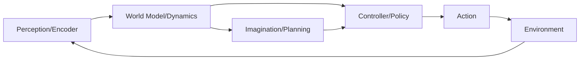

# World Models: Teaching Agents to Imagine the Future

## Concept Introduction

Imagine you're about to push a glass toward the edge of a table. Before you act, you *simulate* what will happen—the glass falls, shatters. This mental rehearsal lets you avoid disaster without experiencing it. **World models** give AI agents this same power: the ability to predict consequences before taking action.

At its simplest, a world model is a learned representation of how the environment works. Given the current state and an action, it predicts the next state (and potentially a reward). This transforms an agent from purely reactive to genuinely *planning*—it can evaluate multiple possible futures in its "imagination" before committing to real action.

**For practitioners**: A world model is typically a neural network trained to approximate the environment's transition dynamics: `s_{t+1} = f(s_t, a_t)`. This enables **model-based reinforcement learning (MBRL)**, where agents can:
1. Learn from simulated rollouts (cheaper than real experience)
2. Plan ahead by searching through predicted futures
3. Transfer knowledge to new situations by reusing the learned dynamics

## Historical & Theoretical Context

The idea traces back to Kenneth Craik's 1943 book *The Nature of Explanation*, which proposed that organisms carry "small-scale models" of reality to anticipate events. In AI, this crystallized into **model-based planning** in the 1980s-90s, contrasting with model-free methods that learn policies directly from rewards.

The modern deep learning revival began with **Ha & Schmidhuber's "World Models" paper (2018)**, which showed agents could learn compressed representations of environments (using VAEs) and then train controllers entirely within dreams. This work demonstrated that a simple linear controller, trained in imagination, could solve challenging tasks like CarRacing.

World models connect to several theoretical foundations:
- **Predictive coding** in neuroscience: the brain constantly predicts sensory input
- **Forward models** in control theory: used for planning and motor control
- **Model predictive control (MPC)**: optimizing actions over a predicted horizon

## Algorithms & Math

The core learning objective for a world model:

```
L = E_{(s,a,s') ~ D} [ ||f_θ(s, a) - s'||² ]
```

Where `f_θ` is the learned dynamics model and `D` is a dataset of transitions.

### Dyna-style Planning (Pseudocode)

```python
# Initialize
Q = {}  # value function
model = WorldModel()  # learned dynamics

for episode in range(num_episodes):
    s = env.reset()

    while not done:
        # Act in real environment
        a = epsilon_greedy(Q, s)
        s_next, r, done = env.step(a)

        # Update Q from real experience
        Q[s, a] += alpha * (r + gamma * max(Q[s_next]) - Q[s, a])

        # Update world model
        model.update(s, a, r, s_next)

        # Planning: simulate k steps using the model
        for _ in range(k):
            s_sim = sample_visited_state()
            a_sim = random_action()
            r_sim, s_next_sim = model.predict(s_sim, a_sim)

            # Update Q from imagined experience
            Q[s_sim, a_sim] += alpha * (r_sim + gamma * max(Q[s_next_sim]) - Q[s_sim, a_sim])

        s = s_next
```

This **Dyna architecture** (Sutton, 1991) interleaves real experience with simulated planning, dramatically improving sample efficiency.

## Design Patterns & Architectures

World models fit into a three-component architecture:



**Key patterns:**

1. **Encoder-Decoder**: Compress observations into latent states (VAE, autoencoder)
2. **Recurrent dynamics**: Predict sequences (RNN, LSTM, Transformer)
3. **Ensemble models**: Multiple models to estimate uncertainty
4. **Latent planning**: Search in compressed state space, not raw pixels

This connects with:
- **Planner-Executor loops**: World model enables the planner
- **Model Predictive Control**: Replan at each step using predictions
- **Hierarchical planning**: Different models at different time scales

## Practical Application

Here's a minimal world model implementation using PyTorch:

```python
import torch
import torch.nn as nn

class WorldModel(nn.Module):
    def __init__(self, state_dim, action_dim, hidden_dim=64):
        super().__init__()
        self.dynamics = nn.Sequential(
            nn.Linear(state_dim + action_dim, hidden_dim),
            nn.ReLU(),
            nn.Linear(hidden_dim, hidden_dim),
            nn.ReLU(),
            nn.Linear(hidden_dim, state_dim + 1)  # next_state + reward
        )

    def forward(self, state, action):
        x = torch.cat([state, action], dim=-1)
        out = self.dynamics(x)
        next_state = out[..., :-1]
        reward = out[..., -1]
        return next_state, reward

    def rollout(self, state, action_sequence):
        """Imagine a trajectory given a sequence of actions."""
        states, rewards = [state], []
        for action in action_sequence:
            state, reward = self.forward(state, action)
            states.append(state)
            rewards.append(reward)
        return torch.stack(states), torch.stack(rewards)

# Training loop
def train_world_model(model, buffer, epochs=100):
    optimizer = torch.optim.Adam(model.parameters(), lr=1e-3)

    for _ in range(epochs):
        states, actions, rewards, next_states = buffer.sample(batch_size=256)

        pred_next, pred_reward = model(states, actions)

        loss = nn.MSELoss()(pred_next, next_states) + nn.MSELoss()(pred_reward, rewards)

        optimizer.zero_grad()
        loss.backward()
        optimizer.step()

    return model

# Using for planning (simple random shooting)
def plan_with_model(model, current_state, num_candidates=100, horizon=10):
    best_return = -float('inf')
    best_actions = None

    for _ in range(num_candidates):
        # Sample random action sequence
        actions = [torch.randn(action_dim) for _ in range(horizon)]

        # Imagine the trajectory
        _, rewards = model.rollout(current_state, actions)
        total_return = rewards.sum()

        if total_return > best_return:
            best_return = total_return
            best_actions = actions

    return best_actions[0]  # Return first action (MPC style)
```

**In LLM Agent Frameworks**: World models appear as the agent's "mental simulation" capability. In LangGraph, you might implement this as a node that predicts the outcomes of different tool calls before executing them:

```python
def world_model_node(state):
    """Simulate outcomes of candidate actions before choosing."""
    candidates = generate_action_candidates(state)

    predictions = []
    for action in candidates:
        # Use LLM to predict outcome
        predicted_result = llm.predict(f"If I {action}, what will happen?")
        score = evaluate_prediction(predicted_result, state.goal)
        predictions.append((action, predicted_result, score))

    best_action = max(predictions, key=lambda x: x[2])[0]
    return {"chosen_action": best_action}
```

## Comparisons & Tradeoffs

| Aspect | World Models (Model-Based) | Model-Free RL |
|--------|---------------------------|---------------|
| Sample efficiency | High (learns from imagination) | Low (needs real experience) |
| Computational cost | High (model learning + planning) | Lower per step |
| Asymptotic performance | Limited by model accuracy | Can be optimal |
| Generalization | Better (learned structure) | Task-specific |

**Key tradeoffs:**
- **Model error compounds**: Small prediction errors grow over long horizons
- **Exploration**: Model-based methods can be overconfident in unexplored regions
- **Computational cost**: Planning takes time; not suitable for all real-time applications

**When to use world models:**
- Sample efficiency matters (robotics, expensive simulators)
- Environment has learnable structure
- Planning horizon is moderate (not too long)

## Latest Developments & Research

**DreamerV3 (2023)**: Hafner et al. created a general algorithm that masters diverse domains (Atari, robotics, Minecraft) with a single set of hyperparameters. Uses a recurrent state-space model with discrete latents and achieves superhuman performance on many benchmarks.

**IRIS (2023)**: Micheli et al. showed that transformer-based world models (autoregressive in discrete tokens) can achieve strong results, bringing language model architectures to world modeling.

**Genie (2024)**: DeepMind's generative model learns world models from unlabeled video, enabling agents to act in imagined environments generated from a single image prompt.

**Open problems:**
- Long-horizon accuracy (compounding errors)
- Combining world models with LLM reasoning
- Handling stochastic, partially observable environments
- Scaling to complex, real-world dynamics

## Cross-Disciplinary Insight

**Neuroscience**: The brain's predictive processing framework suggests we constantly generate predictions about sensory input and update based on prediction errors—essentially running a world model. The cerebellum is thought to maintain forward models for motor control.

**Physics engines in games**: Video game physics engines are hand-coded world models. Learned world models are the AI equivalent—discovering physics from data rather than encoding it manually.

**Economics**: Agents with world models are performing "policy simulation"—what economists do when they model how markets will respond to interventions.

## Daily Challenge

**Task**: Implement a simple world model for CartPole and use it for planning.

1. Collect 1000 transitions from a random policy in CartPole
2. Train a neural network to predict `(next_state, reward)` from `(state, action)`
3. Implement random shooting: sample 50 random action sequences of length 20, use your model to predict returns, execute the first action of the best sequence
4. Compare sample efficiency: how many real environment steps does your planner need vs. a model-free Q-learning agent?

**Bonus**: Add an ensemble of 5 models and only act when they agree (uncertainty-aware planning).

## References & Further Reading

**Foundational Papers:**
- Ha & Schmidhuber, "World Models" (2018): https://worldmodels.github.io/
- Sutton, "Dyna, an Integrated Architecture for Learning, Planning, and Reacting" (1991)
- Hafner et al., "Dream to Control: Learning Behaviors by Latent Imagination" (DreamerV1, 2020)

**Recent Work:**
- Hafner et al., "Mastering Diverse Domains through World Models" (DreamerV3, 2023): https://arxiv.org/abs/2301.04104
- Micheli et al., "Transformers are Sample-Efficient World Models" (IRIS, 2023): https://arxiv.org/abs/2209.00588

**Tutorials & Code:**
- DreamerV3 official implementation: https://github.com/danijar/dreamerv3
- World Models tutorial: https://github.com/ctallec/world-models
- MBRL-Lib (Model-Based RL library): https://github.com/facebookresearch/mbrl-lib

**Conceptual:**
- Kenton et al., "Alignment of Language Agents" (2021) - discusses world models for LLM agents
- "The Forward-Forward Algorithm" - Hinton (2022) - related predictive learning
