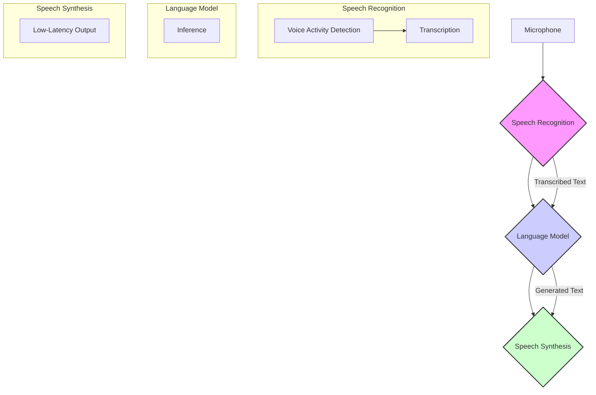
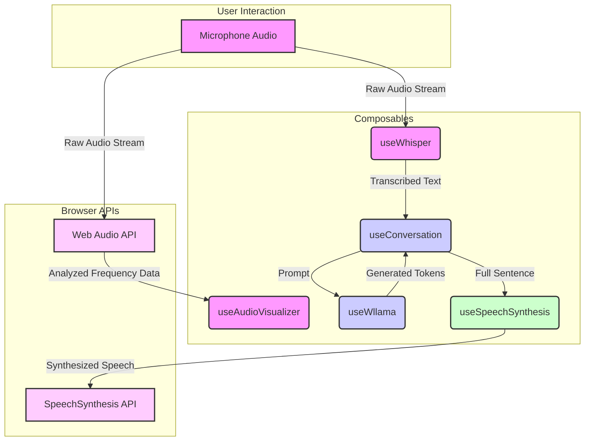

This post is about an experiment to understand how to use LLM models completely on the client side and use it with speech.

**GitHub Repository:** [https://github.com/muthuspark/ava/](https://github.com/muthuspark/ava/)

**Live Demo:** [https://ava.muthu.co](https://ava.muthu.co)


Ava is a privacy-first AI voice assistant that runs entirely in the browser. It is an experimental project to understand how to use LLM models completely on the client side and use it with speech. It leverages the power of WebAssembly to perform all of its functions locally on the user's device. This means that no data is ever sent to a server, ensuring complete privacy. Ava's capabilities include:

*   **Voice Activity Detection (VAD):** Detects when the user is speaking and when they have finished.
*   **Speech-to-Text:** Transcribes the user's speech into text.
*   **Language Model:** Generates a response based on the user's query.
*   **Text-to-Speech:** Converts the generated response into speech.

This document provides a technical overview of Ava's architecture, technical stack, and configuration.

## Architecture

Ava uses a three-stage pipeline architecture, with each stage powered by WebAssembly-based components. This design ensures that all processing occurs on the client-side, preserving user privacy.




1.  **Speech Recognition:** This initial stage captures and processes audio from the user's microphone.
    *   **Voice Activity Detection (VAD):** Using the Silero VAD model, Ava listens for speech activity. It determines when the user starts and stops speaking, which is a more natural approach than fixed-interval processing.
    *   **Transcription:** Once the VAD detects the end of speech, the captured audio segment is transcribed into text using the Whisper (tiny-en) model, which is run via `Transformers.js`.

2.  **Language Model:** The transcribed text from the previous stage is then fed into the language model.
    *   **Inference:** Ava uses the Gemma 3 270M model, running on `Wllama` (a llama.cpp WASM port), to generate a response. The `useConversation.ts` composable manages this process, triggering inference and streaming the generated tokens.

3.  **Speech Synthesis:** The final stage converts the generated text response back into speech.
    *   **Low-Latency Output:** The response text is split into sentences at punctuation boundaries (`.`, `!`, `?`, `,`). Each sentence is then queued for synthesis using the browser's native `SpeechSynthesis` API. This allows Ava to start speaking before the entire response has been generated, providing a more interactive experience.

## Technical Stack

The following table details the technologies used in Ava:

| Component | Technology | Size |
|---|---|---|
| Voice Activity Detection | Silero VAD v5 (@ricky0123/vad-web) | ~2MB |
| Speech-to-Text | Whisper tiny-en (@huggingface/transformers) | ~40MB |
| LLM | Gemma 3 270M Instruct (Wllama) | ~180MB |
| Text-to-Speech | Web Speech Synthesis API | Native |
| Audio Visualization | Web Audio API | Native |
| Frontend | Vue 3 + TypeScript | — |
| Build | Vite | — |

## Project Structure

The project is structured as follows:

```
src/
├── App.vue                      # Main application shell
├── components/
│   ├── AboutPopup.vue           # Info modal
│   └── WaveformVisualizer.vue   # Real-time audio visualization
├── composables/
│   ├── useConversation.ts       # Orchestrates conversation flow
│   ├── useWhisper.ts            # VAD + Whisper speech recognition
│   ├── useWllama.ts             # Gemma LLM inference
│   ├── useSpeechSynthesis.ts    # Browser TTS wrapper
│   └── useAudioVisualizer.ts    # Web Audio frequency analysis
├── styles/
│   └── main.css                 # Global styles
└── types/
    └── index.ts                 # TypeScript definitions
```

## Workflow

The following diagram illustrates the event-driven data flow between the core composables:



### Explanation of the Workflow

1.  **Audio Input:** The `useAudioVisualizer` and `useWhisper` composables both receive the raw audio stream from the microphone via the Web Audio API.
2.  **Visualization:** `useAudioVisualizer` analyzes the frequency data of the audio stream to create the waveform visualization on the UI.
3.  **Speech Recognition:** `useWhisper` processes the audio stream. It uses the Silero VAD model to detect speech and, once the user stops talking, sends the audio to the Whisper model for transcription.
4.  **Conversation Orchestration:** The transcribed text is passed to the `useConversation` composable, which manages the overall conversation flow.
5.  **LLM Inference:** `useConversation` sends the transcribed text as a prompt to the `useWllama` composable. `useWllama` then uses the Gemma 3 LLM to generate a response, streaming the tokens back to `useConversation`.
6.  **Speech Synthesis:** As `useConversation` receives tokens from `useWllama`, it assembles them into sentences. Once a complete sentence is formed (determined by the `SENTENCE_BOUNDARY` regex), it's passed to the `useSpeechSynthesis` composable. `useSpeechSynthesis` then uses the browser's SpeechSynthesis API to speak the sentence aloud. This process repeats until the entire response has been synthesized.


## Configuration

Ava's behavior can be customized by adjusting the following parameters:

### LLM Settings (`useWllama.ts`)

```typescript
nPredict: 64,              // Max tokens (lower = faster response)
temp: 0.7,                 // Sampling temperature
top_k: 40,                 // Top-k sampling
top_p: 0.9,                // Nucleus sampling
```

### VAD Settings (`useWhisper.ts`)

```typescript
positiveSpeechThreshold: 0.5,  // Confidence threshold for speech detection
negativeSpeechThreshold: 0.35, // Threshold for non-speech
redemptionMs: 800,             // Wait time after speech ends before triggering
minSpeechMs: 200,              // Minimum speech duration to consider
preSpeechPadMs: 300,           // Audio to include before speech detected
```

### Sentence Boundary (`useWllama.ts`)

```typescript
const SENTENCE_BOUNDARY = /[.!?,](?:\s|$)/  // TTS triggers on punctuation
```

## Requirements

- **Browser**: Chrome 90+ or Edge 90+ (requires `SharedArrayBuffer`)
- **Headers**: Cross-Origin Isolation must be enabled on the hosting server:
  ```
  Cross-Origin-Opener-Policy: same-origin
  Cross-Origin-Embedder-Policy: require-corp
  ```

## Permissions

Ava requires the following browser permissions:

| Permission | Purpose | Required |
|---|---|---|
| Microphone | Voice input for Whisper | Yes |
| Audio Playback | Text-to-speech output | Yes |

## Performance

- **First load**: Downloads ~220MB of models, which are then cached by the browser.
- **Inference**:
    - VAD runs in real-time.
    - Whisper transcription takes approximately 0.3-0.5 seconds.
    - The LLM takes about 1-2 seconds to generate a response.
- **Memory**: Consumes between 500MB and 1GB of RAM during operation.
- **WebGPU**: Not yet supported; all processing runs on the CPU via WASM SIMD.

## Future Work

- **WebGPU Support:** Integrating WebGPU would offload processing to the GPU, significantly speeding up inference times.
- **Improved Speech Synthesis:** While the native browser API is effective, exploring more advanced, natural-sounding TTS options could enhance the user experience.
- **Conversation Context:** Implementing a mechanism to carry context over multiple turns would allow for more coherent and engaging conversations.


