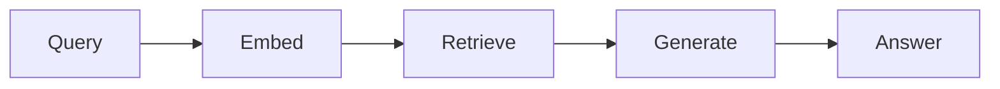
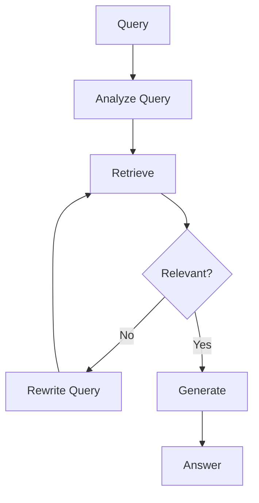

Traditional RAG (Retrieval-Augmented Generation) follows a simple pattern: embed the query, find similar documents, generate an answer. But this "naive RAG" approach breaks down when queries are complex, ambiguous, or require information from multiple sources.

Agentic RAG solves this by letting the LLM make decisions about retrieval. Instead of a fixed pipeline, the LLM can:
- Decompose complex queries into sub-queries
- Decide if retrieved documents are sufficient
- Reformulate queries when initial retrieval fails
- Synthesize information from multiple retrieval rounds

In this article, we'll build an Agentic RAG system using LangGraph.

## The Problem with Naive RAG



Naive RAG has a fixed flow. If retrieval returns irrelevant documents, the generator hallucinates. If the query is ambiguous, retrieval fails silently. There's no feedback loop.

## The Agentic RAG Solution



Agentic RAG adds decision points. The LLM evaluates retrieval quality and can loop back to try different queries.

## Building the Pipeline

### Step 1: Define the State

LangGraph requires an explicit state schema. For Agentic RAG, we track the query, search attempts, retrieved documents, and the final answer.

```python
from typing import TypedDict, Annotated, Literal
from langgraph.graph import StateGraph, END
import operator

class RAGState(TypedDict):
    query: str                                          # Original user query
    search_queries: Annotated[list[str], operator.add]  # Generated search queries
    documents: Annotated[list[dict], operator.add]      # Retrieved documents
    answer: str                                         # Final generated answer
    needs_more_info: bool                               # Flag for retrieval loop
    iteration: int                                      # Prevent infinite loops
```

The `Annotated` type with `operator.add` tells LangGraph to accumulate values instead of replacing them.

### Step 2: Query Analyzer

The first agent analyzes the query and decides how to search. For complex queries, it might generate multiple sub-queries.

```python
from langchain_openai import ChatOpenAI

llm = ChatOpenAI(model="gpt-4o-mini")

def query_analyzer(state: RAGState) -> dict:
    """Analyze and decompose the user query."""
    query = state["query"]

    messages = [
        {"role": "user", "content": f"""Analyze this query and generate 1-3 search queries that would help answer it. Return only the queries, one per line.

Query: {query}"""}
    ]
    response = llm.invoke(messages)

    search_queries = [q.strip() for q in response.content.split("\n") if q.strip()]
    return {"search_queries": search_queries}
```

### Step 3: Retriever

The retriever searches your vector store. Here's an example using ChromaDB:

```python
import chromadb
from sentence_transformers import SentenceTransformer

# Initialize (in production, load existing collection)
client = chromadb.Client()
collection = client.get_or_create_collection("documents")
embedder = SentenceTransformer("all-MiniLM-L6-v2")

def retriever(state: RAGState) -> dict:
    """Retrieve documents for each search query."""
    search_queries = state["search_queries"]
    all_docs = []

    for query in search_queries:
        # Embed and search
        embedding = embedder.encode(query).tolist()
        results = collection.query(
            query_embeddings=[embedding],
            n_results=3
        )

        for i, doc in enumerate(results["documents"][0]):
            all_docs.append({
                "content": doc,
                "metadata": results["metadatas"][0][i],
                "query": query
            })

    # Deduplicate by content
    seen = set()
    unique_docs = []
    for doc in all_docs:
        if doc["content"] not in seen:
            seen.add(doc["content"])
            unique_docs.append(doc)

    return {"documents": unique_docs}
```

### Step 4: Relevance Checker

This is the key agentic component. The LLM evaluates whether retrieved documents can answer the query.

```python
def relevance_checker(state: RAGState) -> dict:
    """Check if retrieved documents are sufficient."""
    docs = state["documents"]
    query = state["query"]

    if not docs:
        return {"needs_more_info": True, "iteration": state["iteration"] + 1}

    # Ask LLM to evaluate relevance
    doc_summaries = "\n".join([d["content"][:200] for d in docs[:5]])

    messages = [
        {"role": "user", "content": f"""Given the query and retrieved documents, can you answer the query?

Query: {query}

Documents:
{doc_summaries}

Reply with only YES or NO."""}
    ]
    response = llm.invoke(messages)

    needs_more = "NO" in response.content.upper()

    # Prevent infinite loops
    if state["iteration"] >= 2:
        needs_more = False

    return {"needs_more_info": needs_more, "iteration": state["iteration"] + 1}
```

### Step 5: Query Rewriter

When retrieval fails, the query rewriter generates alternative queries.

```python
def query_rewriter(state: RAGState) -> dict:
    """Rewrite the query for better retrieval."""
    query = state["query"]
    previous_queries = state["search_queries"]

    messages = [
        {"role": "user", "content": f"""The following search queries didn't find relevant results:
{previous_queries}

Original question: {query}

Generate 2 alternative search queries that might work better.
Use different keywords, synonyms, or rephrasings.
Return only the queries, one per line."""}
    ]
    response = llm.invoke(messages)

    new_queries = [q.strip() for q in response.content.split("\n") if q.strip()]
    return {"search_queries": new_queries}
```

### Step 6: Generator

Finally, the generator synthesizes an answer from retrieved documents.

```python
def generator(state: RAGState) -> dict:
    """Generate answer from retrieved documents."""
    docs = state["documents"]
    query = state["query"]

    if not docs:
        return {"answer": "I couldn't find relevant information to answer your question."}

    context = "\n\n".join([d["content"] for d in docs[:5]])

    messages = [
        {"role": "user", "content": f"""Answer the question based on the provided context.
If the context doesn't contain the answer, say so.

Context:
{context}

Question: {query}"""}
    ]
    response = llm.invoke(messages)

    return {"answer": response.content}
```

### Step 7: Build the Graph

Now wire everything together with conditional edges:

```python
def should_continue(state: RAGState) -> Literal["rewrite", "generate"]:
    """Route based on relevance check."""
    if state["needs_more_info"]:
        return "rewrite"
    return "generate"


def create_agentic_rag():
    """Build the Agentic RAG graph."""
    workflow = StateGraph(RAGState)

    # Add all nodes
    workflow.add_node("analyze", query_analyzer)
    workflow.add_node("retrieve", retriever)
    workflow.add_node("check", relevance_checker)
    workflow.add_node("rewrite", query_rewriter)
    workflow.add_node("generate", generator)

    # Define the flow
    workflow.set_entry_point("analyze")
    workflow.add_edge("analyze", "retrieve")
    workflow.add_edge("retrieve", "check")

    # Conditional branching
    workflow.add_conditional_edges(
        "check",
        should_continue,
        {"rewrite": "rewrite", "generate": "generate"}
    )

    # Loop back from rewrite to retrieve
    workflow.add_edge("rewrite", "retrieve")
    workflow.add_edge("generate", END)

    return workflow.compile()
```

## Running the Pipeline

```python
graph = create_agentic_rag()

result = graph.invoke({
    "query": "How does transformer attention work?",
    "search_queries": [],
    "documents": [],
    "answer": "",
    "needs_more_info": False,
    "iteration": 0
})

print(f"Iterations: {result['iteration']}")
print(f"Documents used: {len(result['documents'])}")
print(f"Answer: {result['answer']}")
```

## Key Design Decisions

### 1. Iteration Limits

Always cap the number of retrieval loops to prevent runaway costs:

```python
if state["iteration"] >= 2:
    needs_more = False  # Force generation after 2 attempts
```

### 2. Document Deduplication

Multiple search queries may return overlapping results. Deduplicate before generation to avoid redundancy.

### 3. Graceful Degradation

If retrieval completely fails, generate an honest "I don't know" rather than hallucinating.

## Comparison: Naive vs Agentic RAG

| Aspect | Naive RAG | Agentic RAG |
|--------|-----------|-------------|
| Query handling | Single embedding | Multi-query decomposition |
| Retrieval failures | Silent failure | Retry with reformulation |
| Complex queries | Poor performance | Handles well |
| Cost | Lower | Higher (more LLM calls) |
| Latency | Faster | Slower (multiple rounds) |

## When to Use Agentic RAG

Use Agentic RAG when:
*   Queries are complex or multi-part
*   Your document corpus is large and diverse
*   Retrieval quality is inconsistent
*   Users expect high-quality, sourced answers

Stick with naive RAG when:
*   Queries are simple and direct
*   Latency is critical
*   Cost per query must be minimized

## What's Next

This basic Agentic RAG can be extended with:
*   **Parallel retrieval:** Search multiple sources simultaneously
*   **Source ranking:** Let the LLM rank and filter retrieved documents
*   **Citation generation:** Include source references in answers
*   **Streaming:** Return partial answers as retrieval progresses

Agentic RAG represents the evolution from simple retrieval to intelligent information synthesis. The LLM becomes an active participant in the search process, not just a passive consumer of retrieved documents.

---

## Try It Yourself

Copy this prompt into your AI coding agent to build this project:

```
Build an Agentic RAG pipeline using LangGraph with these components:
1. Query analyzer that decomposes complex queries into sub-queries
2. Retriever that searches a ChromaDB vector store
3. Relevance checker that evaluates if retrieved docs can answer the query
4. Query rewriter that reformulates queries when retrieval fails
5. Generator that synthesizes the final answer

Use StateGraph with conditional edges for the retry loop. Include an iteration
limit to prevent infinite loops. Test with sample documents about a technical
topic and show how the agent handles queries that need multiple retrieval attempts.
```
