# PART 1: HIGH-LEVEL DESIGN

---

## 1. Vision & Problem Statement

Organizations need AI automation across multiple business functions — code review, customer support, QA, documentation, data analysis, and more. Today, each of these is a siloed solution with its own interface, deployment, and learning curve.

**AI Agents Universe** solves this by providing a single platform where each AI capability is a self-contained, subscription-based plugin. One interface, one orchestrator, unlimited capabilities — added without touching existing code.

**Core promise:** A customer subscribes to the plugins they need. A developer publishes a plugin. The universe expands.

---

## 2. Technology Stack

All technology decisions are fixed here. These are not suggestions — they are the choices the platform is built on.

| Layer | Technology | Rationale |
|-------|-----------|-----------|
| **API framework** | FastAPI + Uvicorn | Async-native, auto-generates OpenAPI docs, strong AI/ML ecosystem |
| **Agent framework** | LangGraph | Stateful graph-based agents, explicit control flow, production-grade for multi-step workflows |
| **Default LLM** | `claude-sonnet-4-6` | Strong reasoning, good cost/performance balance for agentic tasks |
| **Embedding model** | `text-embedding-3-small` (OpenAI) | Hosted, fast, ~$0.02/1M tokens, sufficient for capability matching |
| **Primary database** | PostgreSQL 16 + SQLAlchemy 2 (async) + Alembic | All operational data; Alembic manages schema migrations |
| **Vector store** | pgvector extension (same PostgreSQL instance) | RAG for org knowledge; no separate service up to ~1M vectors per tenant |
| **Cache** | Redis 7 | Auth cache, plugin registry, circuit breakers, route cache, rate limits, Redis Streams queues |
| **Async queues** | Redis Streams | Task execution, background summarisation, webhook delivery — reuses Redis, no extra service |
| **Object storage** | MinIO (self-hosted, S3-compatible) | Artifacts and reports; cloud-agnostic |
| **Container registry** | Zot (self-hosted OCI registry) | Plugin container images; MinIO is S3, not an OCI registry |
| **Secrets (v1)** | Kubernetes Secrets + pgcrypto | Platform credentials in K8s Secrets; tenant tokens AES-256 encrypted in PostgreSQL |
| **Rate limiting** | `slowapi` (FastAPI middleware) | Sliding window; plugs into FastAPI route decorators |
| **Metrics** | Prometheus + Grafana | Kubernetes-native metrics and dashboards |
| **Logs** | Loki + Grafana | Structured log aggregation alongside metrics in Grafana |
| **Deployment** | Self-hosted Kubernetes (cloud-agnostic) | Plain Deployments + PVCs; no operators needed at v1 single-replica scale |
| **Local dev** | Docker Compose | Full local stack: app, PostgreSQL, Redis, MinIO, Zot |

**v1 scope:** Single replicas for all services (no explicit HA). SSE streaming deferred to v2. Third-party plugins are invite-only at launch. Vault introduced in v2 when untrusted third-party plugins require isolated secret management and audit trails.

**What was simplified vs. earlier drafts:**

| Removed / replaced | With | Why |
|--------------------|------|-----|
| HashiCorp Vault | K8s Secrets + pgcrypto | No untrusted plugins in v1; Vault overhead not justified |
| RabbitMQ | Redis Streams | Already have Redis; three queue use cases don't need AMQP |
| 5 separate microservices | 1 FastAPI app + 2 background workers | Registration, billing, notification are not services at this scale |
| 5 Kubernetes operators | Plain Deployments + PVCs | Operators are for HA clusters; v1 is single-replica |
| Custom Schema Registry service | `envelope_schemas` table + in-process cache | A service for one table is over-engineering |
| MinIO as image store | Zot (OCI registry) | Containerd cannot pull from S3; OCI images need an OCI registry |
| bcrypt for API key hashing | SHA-256 | bcrypt is for passwords; API keys are long random strings; SHA-256 is fast and sufficient |
| 3 routing confidence thresholds | 2 configurable thresholds | Simpler to calibrate; removes an undefined dead zone between 0.45–0.65 |
| Gateway + Orchestrator (2 pods) | Single FastAPI app | Internal HTTP hop for nothing; auth is middleware, not a separate service |

---

## 3. System Overview

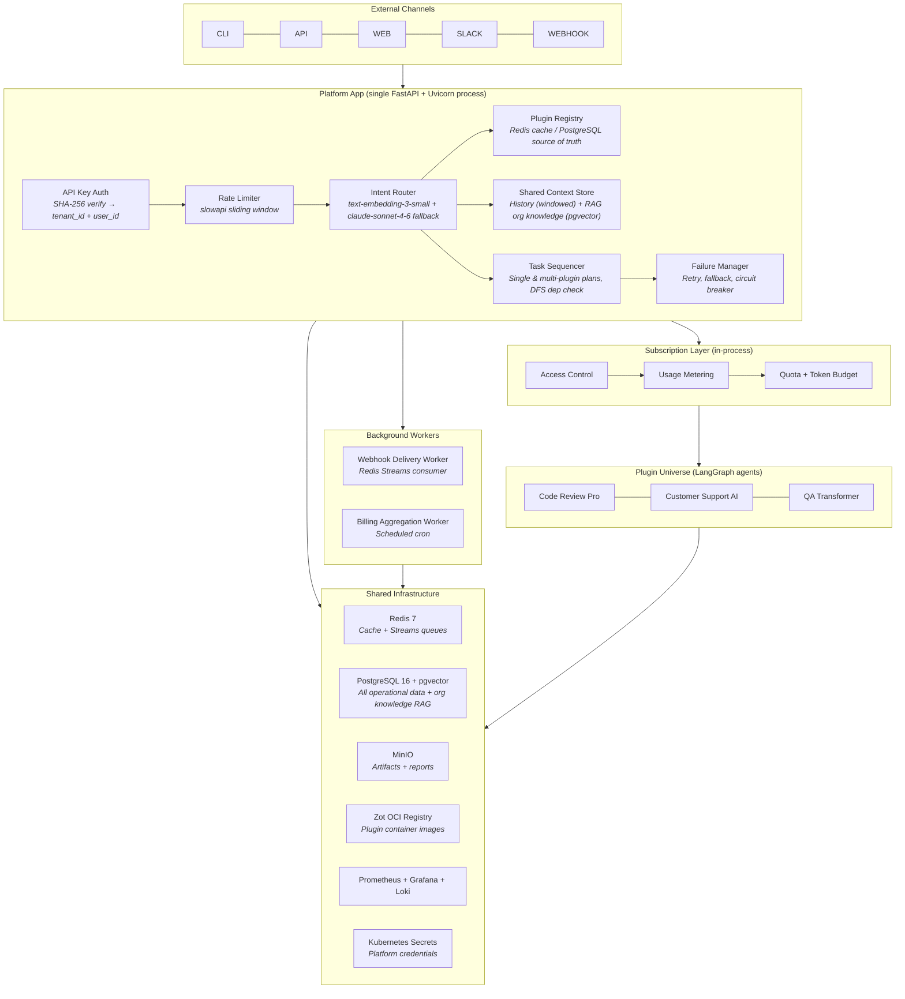
```mermaid
flowchart TB
    subgraph External["External Channels"]
        direction LR
        CLI --- API --- WEB --- SLACK --- WEBHOOK
    end

    subgraph App["Platform App (single FastAPI + Uvicorn process)"]
        AUTH["API Key Auth<br/><i>SHA-256 verify → tenant_id + user_id</i>"]
        RATE["Rate Limiter<br/><i>slowapi sliding window</i>"]
        ROUTER["Intent Router<br/><i>text-embedding-3-small + claude-sonnet-4-6 fallback</i>"]
        REGISTRY["Plugin Registry<br/><i>Redis cache / PostgreSQL source of truth</i>"]
        CONTEXT["Shared Context Store<br/><i>History (windowed) + RAG org knowledge (pgvector)</i>"]
        SEQUENCER["Task Sequencer<br/><i>Single & multi-plugin plans, DFS dep check</i>"]
        FAILURE["Failure Manager<br/><i>Retry, fallback, circuit breaker</i>"]

        AUTH --> RATE --> ROUTER
        ROUTER --> REGISTRY
        ROUTER --> CONTEXT
        ROUTER --> SEQUENCER
        SEQUENCER --> FAILURE
    end

    subgraph Workers["Background Workers"]
        WDELIVER["Webhook Delivery Worker<br/><i>Redis Streams consumer</i>"]
        WBILLING["Billing Aggregation Worker<br/><i>Scheduled cron</i>"]
    end

    subgraph Subscription["Subscription Layer (in-process)"]
        ACCESS["Access Control"]
        METER["Usage Metering"]
        QUOTA["Quota + Token Budget"]
        ACCESS --> METER --> QUOTA
    end

    subgraph PluginUniverse["Plugin Universe (LangGraph agents)"]
        direction LR
        P1["Code Review Pro"] --- P2["Customer Support AI"] --- P3["QA Transformer"]
    end

    subgraph Infra["Shared Infrastructure"]
        REDIS2["Redis 7<br/><i>Cache + Streams queues</i>"]
        PG["PostgreSQL 16 + pgvector<br/><i>All operational data + org knowledge RAG</i>"]
        MINIO["MinIO<br/><i>Artifacts + reports</i>"]
        ZOT["Zot OCI Registry<br/><i>Plugin container images</i>"]
        PROM["Prometheus + Grafana + Loki"]
        K8SSEC["Kubernetes Secrets<br/><i>Platform credentials</i>"]
    end

    External --> App
    App --> Subscription
    Subscription --> PluginUniverse
    App --> Workers
    App --> Infra
    Workers --> Infra
    PluginUniverse --> Infra
```

---

## 4. Core Architecture Layers

### Layer 1: Interface, Auth & Rate Limiting

The platform is a **single FastAPI application**. Auth middleware and rate limiting run in-process before route handlers — no separate gateway pod, no internal HTTP hop, no serialisation of auth context between services.

#### API Key Authentication

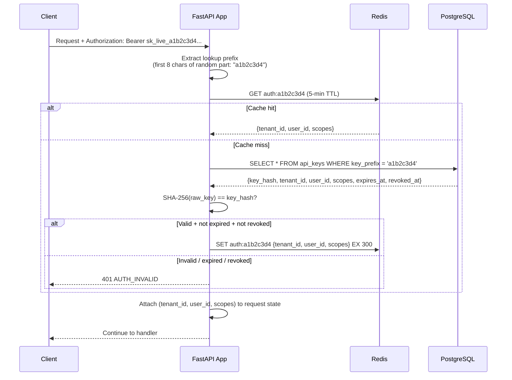
```mermaid
sequenceDiagram
    participant Client
    participant App as FastAPI App
    participant Cache as Redis
    participant DB as PostgreSQL

    Client->>App: Request + Authorization: Bearer sk_live_a1b2c3d4...
    App->>App: Extract lookup prefix<br/>(first 8 chars of random part: "a1b2c3d4")
    App->>Cache: GET auth:a1b2c3d4 (5-min TTL)

    alt Cache hit
        Cache-->>App: {tenant_id, user_id, scopes}
    else Cache miss
        App->>DB: SELECT * FROM api_keys WHERE key_prefix = 'a1b2c3d4'
        DB-->>App: {key_hash, tenant_id, user_id, scopes, expires_at, revoked_at}
        App->>App: SHA-256(raw_key) == key_hash?
        alt Valid + not expired + not revoked
            App->>Cache: SET auth:a1b2c3d4 {tenant_id, user_id, scopes} EX 300
        else Invalid / expired / revoked
            App-->>Client: 401 AUTH_INVALID
        end
    end

    App->>App: Attach (tenant_id, user_id, scopes) to request state
    App-->>Client: Continue to handler
```

**Key format:** `sk_live_<32-char random hex>` for production; `sk_test_<32-char random hex>` for sandbox. The **lookup prefix is the first 8 characters of the random part** (the hex after `sk_live_`), not `sk_live_` itself which is identical on every key. SHA-256 is used for hashing — API keys are long random strings, not passwords; SHA-256 runs in microseconds and is cryptographically sufficient for this use case. bcrypt's brute-force resistance adds nothing over a 32-byte random value.

#### API Key Lifecycle

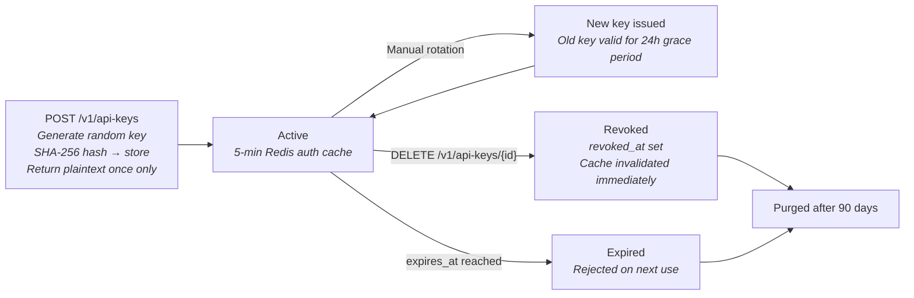
```mermaid
flowchart LR
    CREATE["POST /v1/api-keys<br/><i>Generate random key<br/>SHA-256 hash → store<br/>Return plaintext once only</i>"]
    --> ACTIVE["Active<br/><i>5-min Redis auth cache</i>"]
    ACTIVE -->|"Manual rotation"| ROTATE["New key issued<br/><i>Old key valid for 24h grace period</i>"]
    ROTATE --> ACTIVE
    ACTIVE -->|"DELETE /v1/api-keys/{id}"| REVOKED["Revoked<br/><i>revoked_at set<br/>Cache invalidated immediately</i>"]
    ACTIVE -->|"expires_at reached"| EXPIRED["Expired<br/><i>Rejected on next use</i>"]
    REVOKED --> PURGED["Purged after 90 days"]
    EXPIRED --> PURGED
```

#### Rate Limiting

`slowapi` runs as FastAPI middleware in the same process. Every response includes standard rate limit headers.

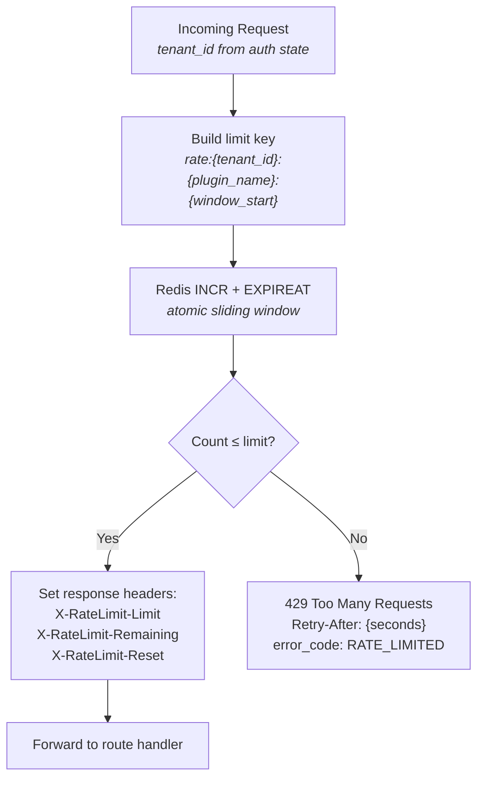
```mermaid
flowchart TD
    REQ["Incoming Request<br/><i>tenant_id from auth state</i>"]
    --> KEY["Build limit key<br/><i>rate:{tenant_id}:{plugin_name}:{window_start}</i>"]
    --> INCR["Redis INCR + EXPIREAT<br/><i>atomic sliding window</i>"]
    --> CHECK{"Count ≤ limit?"}

    CHECK -->|"Yes"| HEADERS["Set response headers:<br/>X-RateLimit-Limit<br/>X-RateLimit-Remaining<br/>X-RateLimit-Reset"]
    CHECK -->|"No"| REJECT["429 Too Many Requests<br/>Retry-After: {seconds}<br/>error_code: RATE_LIMITED"]

    HEADERS --> PROCEED["Forward to route handler"]
```

**Default limits (configurable per tenant):**

| Tier | Requests/min per plugin |
|------|------------------------|
| Starter | 20 |
| Professional | 100 |
| Enterprise | Custom |

### Layer 2: Orchestrator (same process)

Intent Router, Plugin Registry, Context Store, Task Sequencer, Failure Manager — all in-process. See Section 14 for deep-dive.

### Layer 3: Subscription Layer (in-process)

Access control, metering, quota enforcement. The subscription check occurs inside the intent router before any plan is built. See Section 17 for deep-dive.

### Layer 4: Plugin Universe

Each plugin is a LangGraph `StateGraph`. Fully stateless per execution. See Section 10 for deep-dive.

### Layer 5: Shared Infrastructure

- **Redis 7:** Auth cache, plugin registry cache, circuit breaker state, route cache, rate limit counters, and **Redis Streams** for all async queues
- **PostgreSQL 16 + pgvector:** All operational data + org knowledge RAG embeddings
- **MinIO:** Artifact and report storage. Path: `/{tenant_id}/{plugin_name}/{task_id}/`
- **Zot:** Self-hosted OCI registry for plugin container images
- **Prometheus + Grafana + Loki:** Metrics, dashboards, log aggregation
- **Kubernetes Secrets:** Platform-level credentials (LLM API keys, embedding API key)

---

## 5. Request Lifecycle

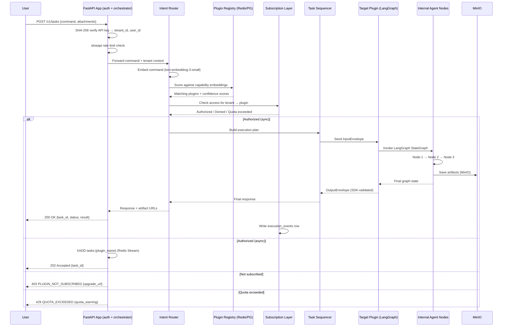
```mermaid
sequenceDiagram
    participant User
    participant App as FastAPI App (auth + orchestrator)
    participant Router as Intent Router
    participant Registry as Plugin Registry (Redis/PG)
    participant Sub as Subscription Layer
    participant Sequencer as Task Sequencer
    participant Plugin as Target Plugin (LangGraph)
    participant Agents as Internal Agent Nodes
    participant Store as MinIO

    User->>App: POST /v1/tasks {command, attachments}
    App->>App: SHA-256 verify API key → tenant_id, user_id
    App->>App: slowapi rate limit check

    App->>Router: Forward command + tenant context
    Router->>Router: Embed command (text-embedding-3-small)
    Router->>Registry: Score against capability embeddings
    Registry-->>Router: Matching plugins + confidence scores

    Router->>Sub: Check access for tenant → plugin
    Sub-->>Router: Authorized / Denied / Quota exceeded

    alt Authorized (sync)
        Router->>Sequencer: Build execution plan
        Sequencer->>Plugin: Send InputEnvelope

        Plugin->>Agents: Invoke LangGraph StateGraph
        Agents->>Agents: Node 1 → Node 2 → Node 3
        Agents->>Store: Save artifacts (MinIO)
        Agents-->>Plugin: Final graph state

        Plugin-->>Sequencer: OutputEnvelope (SDK-validated)
        Sequencer-->>Router: Final response
        Router-->>App: Response + artifact URLs
        App-->>User: 200 OK {task_id, status, result}

        Sub->>Sub: Write execution_events row
    else Authorized (async)
        App->>App: XADD tasks:{plugin_name} (Redis Stream)
        App-->>User: 202 Accepted {task_id}
    else Not subscribed
        App-->>User: 403 PLUGIN_NOT_SUBSCRIBED {upgrade_url}
    else Quota exceeded
        App-->>User: 429 QUOTA_EXCEEDED {quota_warning}
    end
```

---

## 6. REST API Specification

All endpoints require `Authorization: Bearer <api_key>`.

### 6.1 Task Endpoints

| Method | Path | Description | Response |
|--------|------|-------------|----------|
| `POST` | `/v1/tasks` | Submit a task | `202 {task_id}` or `200 {result}` |
| `GET` | `/v1/tasks/{task_id}` | Poll task status | `200 {task}` |
| `DELETE` | `/v1/tasks/{task_id}` | Cancel a running task | `202 {task_id, status: cancelling}` |
| `GET` | `/v1/tasks` | List tasks (paginated) | `200 {tasks[], next_cursor}` |

### 6.2 Plugin Endpoints

| Method | Path | Description | Response |
|--------|------|-------------|----------|
| `GET` | `/v1/plugins` | List available plugins for tenant | `200 {plugins[]}` |
| `GET` | `/v1/plugins/{name}` | Plugin detail + capabilities | `200 {plugin}` |
| `GET` | `/v1/plugins/{name}/health` | Plugin health status | `200 {status, components}` |

### 6.3 Auth Endpoints

| Method | Path | Description | Response |
|--------|------|-------------|----------|
| `POST` | `/v1/api-keys` | Create API key | `201 {id, key (shown once), prefix}` |
| `GET` | `/v1/api-keys` | List API keys for tenant | `200 {keys[]}` |
| `DELETE` | `/v1/api-keys/{id}` | Revoke API key | `204` |

### 6.4 Registration Endpoints (internal — plugin pods only)

| Method | Path | Description | Response |
|--------|------|-------------|----------|
| `POST` | `/internal/registry/register` | Plugin self-registers on startup | `201 {plugin_id}` |
| `DELETE` | `/internal/registry/{name}/{version}` | Plugin deregisters on shutdown | `204` |
| `POST` | `/internal/registry/{name}/health` | Plugin reports health | `200` |

### 6.5 Webhook Endpoints

| Method | Path | Description | Response |
|--------|------|-------------|----------|
| `POST` | `/v1/webhooks` | Register a webhook endpoint | `201 {webhook_id}` |
| `DELETE` | `/v1/webhooks/{webhook_id}` | Remove a webhook | `204` |
| `GET` | `/v1/webhooks/{webhook_id}/deliveries` | View delivery attempts | `200 {deliveries[]}` |

### 6.6 Standard Error Format

```json
{
  "error": {
    "code": "PLUGIN_NOT_SUBSCRIBED",
    "message": "Your plan does not include the code-review plugin.",
    "upgrade_url": "https://app.aau.io/billing/upgrade",
    "task_id": "task_abc123",
    "request_id": "req_xyz789"
  }
}
```

### 6.7 Error Code Taxonomy

| Code | HTTP | Category | Retry? |
|------|------|----------|--------|
| `PLUGIN_NOT_SUBSCRIBED` | 403 | Permanent | No |
| `QUOTA_EXCEEDED` | 429 | Permanent | No |
| `RATE_LIMITED` | 429 | Transient | Yes (`Retry-After`) |
| `PLUGIN_UNAVAILABLE` | 503 | Transient | Yes |
| `PLUGIN_TIMEOUT` | 504 | Transient | Yes |
| `CIRCULAR_DEPENDENCY` | 422 | Permanent | No |
| `INVALID_INPUT` | 422 | Permanent | No |
| `TOKEN_BUDGET_EXCEEDED` | 200 (partial) | Overage | Billed, no retry |
| `CONTENT_POLICY_VIOLATION` | 422 | Permanent | No |
| `CONTEXT_WINDOW_OVERFLOW` | 200 (retry) | Transient | Yes (auto-truncated) |
| `DEPENDENCY_FAILED` | 200 (partial) | Depends | Partial result returned |
| `AUTH_INVALID` | 401 | Permanent | No |

---

## 7. Subscription & Commercial Model

### 7.1 Subscription Tiers

| Tier | Plugins Included | Cross-Plugin Chaining | Custom Plugins | Pricing Model |
|------|-----------------|----------------------|----------------|---------------|
| **Starter** | 1 plugin of choice | No | No | Flat monthly per plugin |
| **Professional** | Up to 5 plugins | Yes | No | Bundle discount + per-execution overage |
| **Enterprise** | Unlimited | Yes | Yes (custom-built) | Annual contract, volume pricing |

**Subscription enforcement position:** The intent router checks the tenant's subscription immediately after scoring plugins — before building an execution plan.

### 7.2 Plugin Marketplace

Third-party plugins are **invite-only at launch**. Marketplace infrastructure is a v2 deliverable.

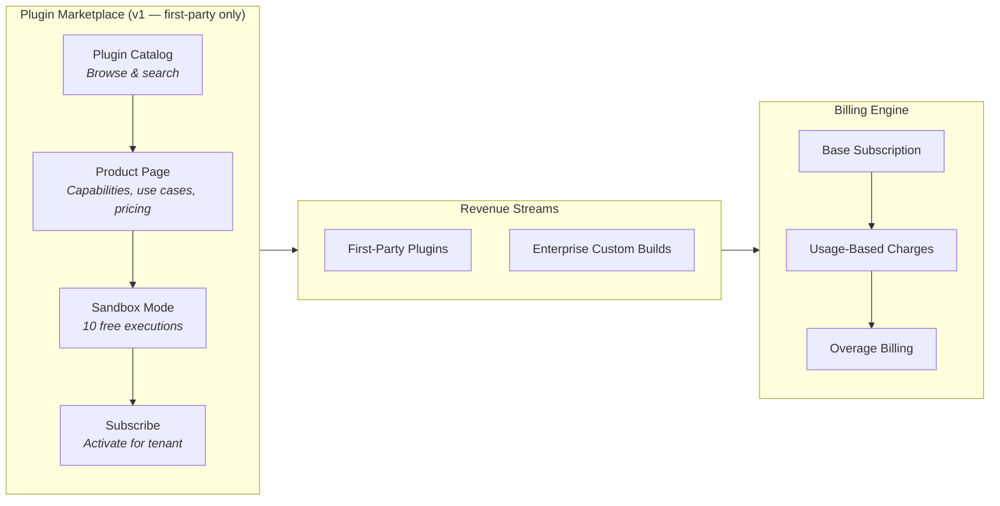
```mermaid
graph LR
    subgraph Marketplace["Plugin Marketplace (v1 — first-party only)"]
        CATALOG["Plugin Catalog<br/><i>Browse & search</i>"]
        DETAIL["Product Page<br/><i>Capabilities, use cases, pricing</i>"]
        SANDBOX["Sandbox Mode<br/><i>10 free executions</i>"]
        SUB["Subscribe<br/><i>Activate for tenant</i>"]
        CATALOG --> DETAIL --> SANDBOX --> SUB
    end

    subgraph Revenue["Revenue Streams"]
        FIRST["First-Party Plugins"]
        CUSTOM["Enterprise Custom Builds"]
    end

    subgraph Billing["Billing Engine"]
        BASE["Base Subscription"]
        USAGE["Usage-Based Charges"]
        OVERAGE["Overage Billing"]
        BASE --> USAGE --> OVERAGE
    end

    Marketplace --> Revenue
    Revenue --> Billing
```

---

## 8. Sample Plugin Catalog

| Plugin | Domain | Capabilities | Agents Inside |
|--------|--------|-------------|---------------|
| **Code Review Pro** | Engineering | PR reviews, security scanning, style checks, refactor suggestions | Diff Analyzer, Security Scanner, Style Checker, Summary Writer |
| **Customer Support AI** | Support | Ticket classification, resolution, response drafting, escalation | Classifier, Resolution Engine, Response Drafter, Escalation Agent |
| **QA Transformer** | Quality | Test case generation, coverage validation, gap analysis | Code Analyzer, Test Generator, Coverage Validator |
| **Ticket Processor** | Operations | Triage, assignment, status tracking, SLA monitoring | Triager, Assigner, Status Tracker, SLA Monitor |
| **Doc Generator** | Content | PRDs, tech docs, reports from conversations | Extractor, Structurer, Writer, Reviewer |
| **Data Analyst** | Analytics | SQL generation, visualization, insight surfacing | Query Builder, Visualizer, Insight Generator, Narrator |

---

# PART 2: LOW-LEVEL DESIGN

---

## 9. Database Schema

### 9.1 Entity Relationship Diagram

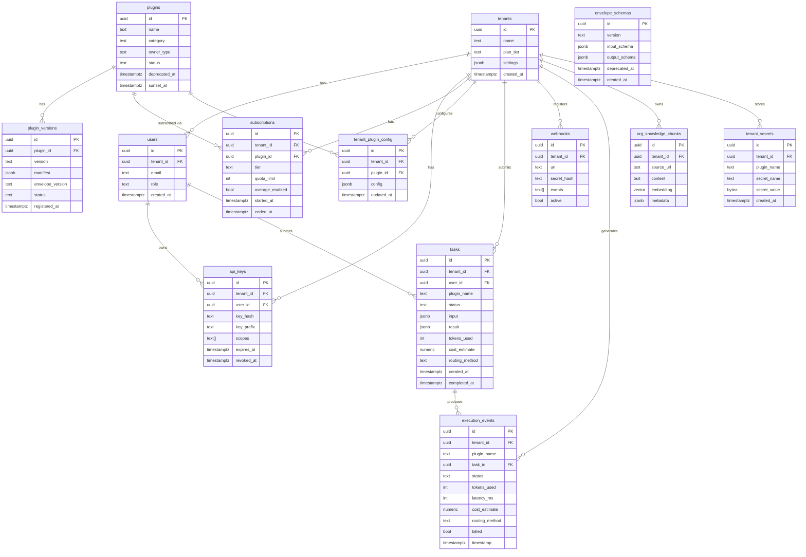
```mermaid
erDiagram
    tenants {
        uuid id PK
        text name
        text plan_tier
        jsonb settings
        timestamptz created_at
    }
    users {
        uuid id PK
        uuid tenant_id FK
        text email
        text role
        timestamptz created_at
    }
    api_keys {
        uuid id PK
        uuid tenant_id FK
        uuid user_id FK
        text key_hash
        text key_prefix
        text[] scopes
        timestamptz expires_at
        timestamptz revoked_at
    }
    tenant_secrets {
        uuid id PK
        uuid tenant_id FK
        text plugin_name
        text secret_name
        bytea secret_value
        timestamptz created_at
    }
    plugins {
        uuid id PK
        text name
        text category
        text owner_type
        text status
        timestamptz deprecated_at
        timestamptz sunset_at
    }
    plugin_versions {
        uuid id PK
        uuid plugin_id FK
        text version
        jsonb manifest
        text envelope_version
        text status
        timestamptz registered_at
    }
    envelope_schemas {
        uuid id PK
        text version
        jsonb input_schema
        jsonb output_schema
        timestamptz deprecated_at
        timestamptz created_at
    }
    subscriptions {
        uuid id PK
        uuid tenant_id FK
        uuid plugin_id FK
        text tier
        int quota_limit
        bool overage_enabled
        timestamptz started_at
        timestamptz ended_at
    }
    tenant_plugin_config {
        uuid id PK
        uuid tenant_id FK
        uuid plugin_id FK
        jsonb config
        timestamptz updated_at
    }
    tasks {
        uuid id PK
        uuid tenant_id FK
        uuid user_id FK
        text plugin_name
        text status
        jsonb input
        jsonb result
        int tokens_used
        numeric cost_estimate
        text routing_method
        timestamptz created_at
        timestamptz completed_at
    }
    webhooks {
        uuid id PK
        uuid tenant_id FK
        text url
        text secret_hash
        text[] events
        bool active
    }
    execution_events {
        uuid id PK
        uuid tenant_id FK
        text plugin_name
        uuid task_id FK
        text status
        int tokens_used
        int latency_ms
        numeric cost_estimate
        text routing_method
        bool billed
        timestamptz timestamp
    }
    org_knowledge_chunks {
        uuid id PK
        uuid tenant_id FK
        text source_url
        text content
        vector embedding
        jsonb metadata
    }

    tenants ||--o{ users : "has"
    tenants ||--o{ api_keys : "has"
    tenants ||--o{ subscriptions : "has"
    tenants ||--o{ tenant_plugin_config : "configures"
    tenants ||--o{ tasks : "submits"
    tenants ||--o{ webhooks : "registers"
    tenants ||--o{ execution_events : "generates"
    tenants ||--o{ org_knowledge_chunks : "owns"
    tenants ||--o{ tenant_secrets : "stores"
    users ||--o{ api_keys : "owns"
    users ||--o{ tasks : "submits"
    plugins ||--o{ plugin_versions : "has"
    plugins ||--o{ subscriptions : "subscribed via"
    plugins ||--o{ tenant_plugin_config : "configured by"
    tasks ||--o{ execution_events : "produces"
```

### 9.2 PostgreSQL — Full DDL

```sql
CREATE EXTENSION IF NOT EXISTS vector;
CREATE EXTENSION IF NOT EXISTS pgcrypto;

-- Tenants and users
CREATE TABLE tenants (
    id          UUID PRIMARY KEY DEFAULT gen_random_uuid(),
    name        TEXT NOT NULL,
    plan_tier   TEXT NOT NULL CHECK (plan_tier IN ('starter', 'professional', 'enterprise')),
    settings    JSONB DEFAULT '{}',
    created_at  TIMESTAMPTZ NOT NULL DEFAULT now()
);

CREATE TABLE users (
    id          UUID PRIMARY KEY DEFAULT gen_random_uuid(),
    tenant_id   UUID NOT NULL REFERENCES tenants(id),
    email       TEXT NOT NULL UNIQUE,
    role        TEXT NOT NULL DEFAULT 'member',
    created_at  TIMESTAMPTZ NOT NULL DEFAULT now()
);

-- API keys — SHA-256 hashed, not bcrypt
CREATE TABLE api_keys (
    id           UUID PRIMARY KEY DEFAULT gen_random_uuid(),
    tenant_id    UUID NOT NULL REFERENCES tenants(id),
    user_id      UUID REFERENCES users(id),   -- NULL = service account
    key_hash     TEXT NOT NULL UNIQUE,         -- SHA-256(raw_key), hex-encoded
    key_prefix   TEXT NOT NULL,               -- first 8 chars of random part for lookup
    scopes       TEXT[] NOT NULL DEFAULT '{}',
    description  TEXT,
    last_used_at TIMESTAMPTZ,
    expires_at   TIMESTAMPTZ,
    revoked_at   TIMESTAMPTZ,
    created_at   TIMESTAMPTZ NOT NULL DEFAULT now()
);

-- Tenant-owned secrets: AES-256 via pgcrypto, replaces Vault for v1
-- Platform encryption key stored in Kubernetes Secret, injected as env var ENCRYPT_KEY
CREATE TABLE tenant_secrets (
    id           UUID PRIMARY KEY DEFAULT gen_random_uuid(),
    tenant_id    UUID NOT NULL REFERENCES tenants(id),
    plugin_name  TEXT NOT NULL,
    secret_name  TEXT NOT NULL,               -- e.g. "github_token", "jira_api_key"
    secret_value BYTEA NOT NULL,              -- pgp_sym_encrypt(value, ENCRYPT_KEY)
    created_at   TIMESTAMPTZ NOT NULL DEFAULT now(),
    UNIQUE (tenant_id, plugin_name, secret_name)
);

-- Helper functions for encrypt/decrypt
-- encrypt: SELECT pgp_sym_encrypt('value', current_setting('app.encrypt_key'))
-- decrypt: SELECT pgp_sym_decrypt(secret_value, current_setting('app.encrypt_key'))

-- Plugin registry (durable source of truth — Redis is the cache)
CREATE TABLE plugins (
    id            UUID PRIMARY KEY DEFAULT gen_random_uuid(),
    name          TEXT NOT NULL UNIQUE,
    category      TEXT NOT NULL,
    owner_type    TEXT NOT NULL CHECK (owner_type IN ('first_party', 'enterprise_custom')),
    status        TEXT NOT NULL DEFAULT 'active'
                      CHECK (status IN ('active', 'deprecated', 'sunset', 'retired')),
    deprecated_at TIMESTAMPTZ,
    sunset_at     TIMESTAMPTZ,
    created_at    TIMESTAMPTZ NOT NULL DEFAULT now()
);

CREATE TABLE plugin_versions (
    id               UUID PRIMARY KEY DEFAULT gen_random_uuid(),
    plugin_id        UUID NOT NULL REFERENCES plugins(id),
    version          TEXT NOT NULL,
    manifest         JSONB NOT NULL,
    envelope_version TEXT NOT NULL DEFAULT '1.0',
    status           TEXT NOT NULL DEFAULT 'active',
    registered_at    TIMESTAMPTZ NOT NULL DEFAULT now(),
    UNIQUE (plugin_id, version)
);

-- Envelope schema registry — a table, not a service
-- Cached in-process by orchestrator on startup; refreshed on NOTIFY envelope_schemas
CREATE TABLE envelope_schemas (
    id             UUID PRIMARY KEY DEFAULT gen_random_uuid(),
    version        TEXT NOT NULL UNIQUE,
    input_schema   JSONB NOT NULL,
    output_schema  JSONB NOT NULL,
    deprecated_at  TIMESTAMPTZ,
    created_at     TIMESTAMPTZ NOT NULL DEFAULT now()
);

-- Subscriptions
CREATE TABLE subscriptions (
    id              UUID PRIMARY KEY DEFAULT gen_random_uuid(),
    tenant_id       UUID NOT NULL REFERENCES tenants(id),
    plugin_id       UUID NOT NULL REFERENCES plugins(id),
    tier            TEXT NOT NULL,
    quota_limit     INTEGER,
    overage_enabled BOOLEAN NOT NULL DEFAULT false,
    started_at      TIMESTAMPTZ NOT NULL DEFAULT now(),
    ended_at        TIMESTAMPTZ,
    UNIQUE (tenant_id, plugin_id)
);

-- Tenant-specific plugin config
CREATE TABLE tenant_plugin_config (
    id         UUID PRIMARY KEY DEFAULT gen_random_uuid(),
    tenant_id  UUID NOT NULL REFERENCES tenants(id),
    plugin_id  UUID NOT NULL REFERENCES plugins(id),
    config     JSONB NOT NULL DEFAULT '{}',
    updated_at TIMESTAMPTZ NOT NULL DEFAULT now(),
    UNIQUE (tenant_id, plugin_id)
);

-- Task tracking
CREATE TABLE tasks (
    id             UUID PRIMARY KEY DEFAULT gen_random_uuid(),
    tenant_id      UUID NOT NULL REFERENCES tenants(id),
    user_id        UUID NOT NULL REFERENCES users(id),
    plugin_name    TEXT NOT NULL,
    status         TEXT NOT NULL DEFAULT 'pending'
                       CHECK (status IN
                           ('pending','queued','running','success','partial','failed','cancelled')),
    input          JSONB NOT NULL,
    result         JSONB,
    error          JSONB,
    tokens_used    INTEGER,
    cost_estimate  NUMERIC(10,6),
    routing_method TEXT,
    created_at     TIMESTAMPTZ NOT NULL DEFAULT now(),
    started_at     TIMESTAMPTZ,
    completed_at   TIMESTAMPTZ
);

-- Webhooks
CREATE TABLE webhooks (
    id          UUID PRIMARY KEY DEFAULT gen_random_uuid(),
    tenant_id   UUID NOT NULL REFERENCES tenants(id),
    url         TEXT NOT NULL,
    secret_hash TEXT NOT NULL,
    events      TEXT[] NOT NULL DEFAULT '{task.completed}',
    active      BOOLEAN NOT NULL DEFAULT true,
    created_at  TIMESTAMPTZ NOT NULL DEFAULT now()
);

-- Metering (v1 in PostgreSQL; v2 upgrade to ClickHouse at billing scale)
CREATE TABLE execution_events (
    id               UUID PRIMARY KEY DEFAULT gen_random_uuid(),
    tenant_id        UUID NOT NULL,
    plugin_name      TEXT NOT NULL,
    plugin_version   TEXT NOT NULL,
    task_id          UUID NOT NULL,
    status           TEXT NOT NULL,
    tokens_used      INTEGER,
    latency_ms       INTEGER,
    cost_estimate    NUMERIC(10,6),
    routing_method   TEXT,
    envelope_version TEXT,
    billed           BOOLEAN NOT NULL DEFAULT false,
    timestamp        TIMESTAMPTZ NOT NULL DEFAULT now()
);

CREATE INDEX ON execution_events (tenant_id, timestamp);
CREATE INDEX ON execution_events (task_id);

-- pgvector: org knowledge RAG
CREATE TABLE org_knowledge_chunks (
    id         UUID PRIMARY KEY DEFAULT gen_random_uuid(),
    tenant_id  UUID NOT NULL REFERENCES tenants(id),
    source_url TEXT,
    content    TEXT NOT NULL,
    embedding  vector(1536),              -- text-embedding-3-small output dimension
    metadata   JSONB DEFAULT '{}',
    created_at TIMESTAMPTZ NOT NULL DEFAULT now()
);

-- HNSW index: no minimum row requirement, no reindexing needed, better recall at v1 scale
CREATE INDEX ON org_knowledge_chunks
    USING hnsw (embedding vector_cosine_ops)
    WITH (m = 16, ef_construction = 64);

CREATE INDEX ON org_knowledge_chunks (tenant_id);
```

**Why HNSW over IVFFlat:** IVFFlat requires `3 × lists` minimum rows (300 rows with `lists=100`) to produce useful results and needs periodic `REINDEX` as new rows are inserted. HNSW has no minimum, never needs reindexing, and has better recall at small-to-medium scale. Switch to IVFFlat only if memory pressure becomes a concern at large scale.

---

## 10. Plugin Architecture — Deep Dive

### 10.1 Plugin Internal Structure

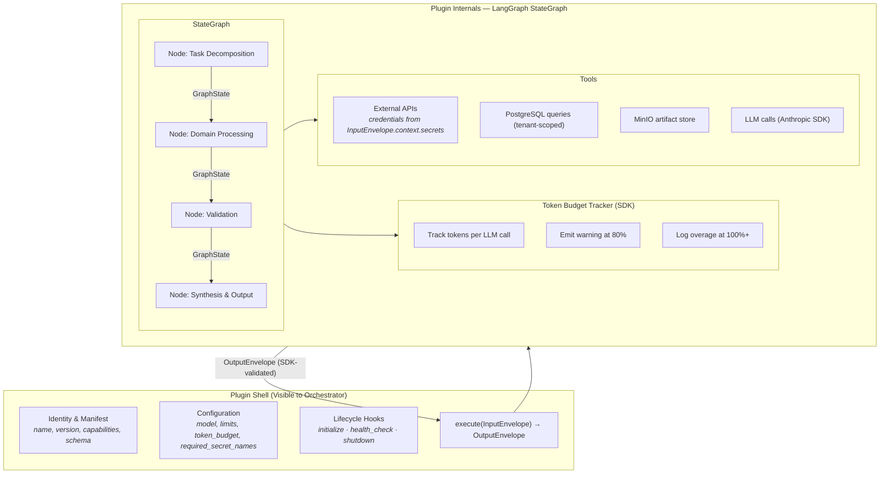
```mermaid
graph TB
    subgraph PluginShell["Plugin Shell (Visible to Orchestrator)"]
        META["Identity & Manifest<br/><i>name, version, capabilities, schema</i>"]
        CONFIG["Configuration<br/><i>model, limits, token_budget, required_secret_names</i>"]
        LIFECYCLE["Lifecycle Hooks<br/><i>initialize · health_check · shutdown</i>"]
        EXECUTE["execute(InputEnvelope) → OutputEnvelope"]
    end

    subgraph PluginInternals["Plugin Internals — LangGraph StateGraph"]
        subgraph AgentGraph["StateGraph"]
            A1["Node: Task Decomposition"]
            A2["Node: Domain Processing"]
            A3["Node: Validation"]
            A4["Node: Synthesis & Output"]
            A1 -->|"GraphState"| A2
            A2 -->|"GraphState"| A3
            A3 -->|"GraphState"| A4
        end

        subgraph Budget["Token Budget Tracker (SDK)"]
            TB1["Track tokens per LLM call"]
            TB2["Emit warning at 80%"]
            TB3["Log overage at 100%+"]
        end

        subgraph Tools["Tools"]
            T1["External APIs<br/><i>credentials from InputEnvelope.context.secrets</i>"]
            T2["PostgreSQL queries (tenant-scoped)"]
            T3["MinIO artifact store"]
            T4["LLM calls (Anthropic SDK)"]
        end

        AgentGraph --> Budget
        AgentGraph --> Tools
    end

    EXECUTE --> PluginInternals
    PluginInternals -->|"OutputEnvelope (SDK-validated)"| EXECUTE
```

**How plugins access credentials:** The orchestrator resolves `required_secret_names` from `tenant_secrets` (decrypting with pgcrypto) and injects the resolved key-value pairs into `InputEnvelope.context.secrets` before calling `execute()`. Plugins never call the secrets store directly — the orchestrator is the only component that decrypts.

### 10.2 Plugin Interface Contract

**Identity & Manifest:**

| Field | Type | Purpose |
|-------|------|---------|
| `name` | string | Unique identifier (e.g., `"code-review"`) |
| `version` | string | Semantic version |
| `description` | string | Human-readable summary |
| `capabilities` | list[string] | What it can do — embedded for routing |
| `category` | string | Domain tag |
| `dependencies` | list[PluginDep] | `{name, version_constraint}` |
| `input_schema` | dict | JSON schema for expected input |
| `envelope_version` | string | Which envelope version this plugin speaks |
| `estimated_latency` | string | `fast` / `medium` / `slow` |
| `required_scopes` | list[string] | Declared capability scopes |
| `required_secret_names` | list[string] | Secret names needed from `tenant_secrets` |

**Configuration:**

| Field | Type | Purpose |
|-------|------|---------|
| `model` | string | LLM override (default: `claude-sonnet-4-6`) |
| `temperature` | float | LLM temperature |
| `max_retries` | int | Retry count before failing |
| `timeout_seconds` | int | Max execution time |
| `token_budget` | int | Max tokens per execution |

**Lifecycle Methods:**

| Method | When Called | Returns |
|--------|-----------|---------|
| `initialize()` | Once at registration | Sets up connections, compiles LangGraph |
| `health_check()` | Every 30s | `HealthStatus` |
| `execute(input)` | Per request | `OutputEnvelope` |
| `shutdown()` | On deregistration | Cleans up connections |

**Health check returns structured status:**

```python
@dataclass
class HealthStatus:
    status: Literal["healthy", "degraded", "unhealthy"]
    components: dict[str, str]  # {"llm": "healthy", "github_api": "degraded"}
    message: str | None = None
```

Three consecutive `unhealthy` responses trip the circuit breaker.

---

## 11. Standardized Envelopes

### 11.1 InputEnvelope

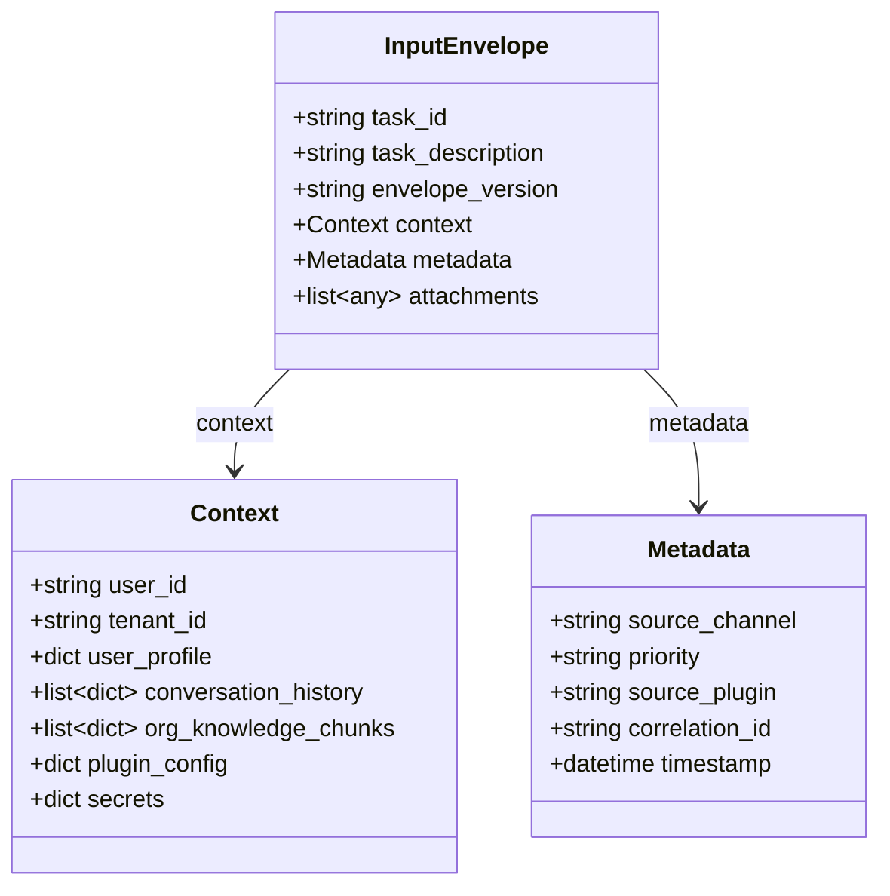
```mermaid
classDiagram
    class InputEnvelope {
        +string task_id
        +string task_description
        +string envelope_version
        +Context context
        +Metadata metadata
        +list~any~ attachments
    }

    class Context {
        +string user_id
        +string tenant_id
        +dict user_profile
        +list~dict~ conversation_history
        +list~dict~ org_knowledge_chunks
        +dict plugin_config
        +dict secrets
    }

    class Metadata {
        +string source_channel
        +string priority
        +string source_plugin
        +string correlation_id
        +datetime timestamp
    }

    InputEnvelope --> Context : context
    InputEnvelope --> Metadata : metadata
```

| Field | Type | Description |
|-------|------|-------------|
| `task_id` | string | Unique ID for tracking |
| `task_description` | string | Natural language task |
| `envelope_version` | string | Schema version (e.g., `"1.0"`) |
| `context.conversation_history` | list | Last 20 turns (sliding window) |
| `context.org_knowledge_chunks` | list | RAG-retrieved chunks (top-k, tenant-scoped) |
| `context.plugin_config` | dict | Tenant config from `tenant_plugin_config` |
| `context.secrets` | dict | Decrypted secrets from `tenant_secrets` (orchestrator-resolved, never stored) |
| `metadata.correlation_id` | string | End-to-end trace ID |
| `attachments` | list[any] | Files, code snippets, URLs, PRs |

### 11.2 OutputEnvelope

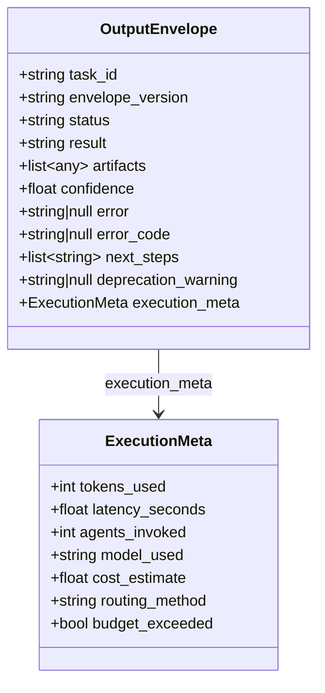
```mermaid
classDiagram
    class OutputEnvelope {
        +string task_id
        +string envelope_version
        +string status
        +string result
        +list~any~ artifacts
        +float confidence
        +string|null error
        +string|null error_code
        +list~string~ next_steps
        +string|null deprecation_warning
        +ExecutionMeta execution_meta
    }

    class ExecutionMeta {
        +int tokens_used
        +float latency_seconds
        +int agents_invoked
        +string model_used
        +float cost_estimate
        +string routing_method
        +bool budget_exceeded
    }

    OutputEnvelope --> ExecutionMeta : execution_meta
```

**OutputEnvelope validation:** The SDK validates every `OutputEnvelope` against the in-process schema cache (loaded from the `envelope_schemas` table) before returning to the orchestrator.

---

## 12. Envelope Versioning

### 12.1 Versioning Rules

- **Additive changes** (new optional fields): minor bump. Old plugins ignore unknown fields.
- **Breaking changes** (removal, type change, rename): major bump. Orchestrator runs a version adapter.
- **Schema storage:** `envelope_schemas` table in PostgreSQL. Orchestrator loads schemas into an in-process dict at startup and listens for `NOTIFY envelope_schemas` to refresh on updates — no schema registry service, no extra network calls.
- **Multi-version support:** Current + one prior major version. Plugins on older versions receive `deprecation_warning` in `execution_meta`.

### 12.2 Adapter Flow

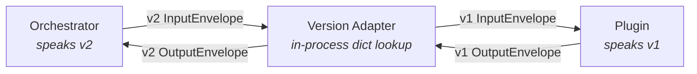
```mermaid
flowchart LR
    ORCH["Orchestrator<br/><i>speaks v2</i>"]
    ADAPT["Version Adapter<br/><i>in-process dict lookup</i>"]
    PLUGIN["Plugin<br/><i>speaks v1</i>"]

    ORCH -->|"v2 InputEnvelope"| ADAPT
    ADAPT -->|"v1 InputEnvelope"| PLUGIN
    PLUGIN -->|"v1 OutputEnvelope"| ADAPT
    ADAPT -->|"v2 OutputEnvelope"| ORCH
```

Plugin developers are notified 90 days before a major version is sunset.

---

## 13. Plugin Registration & Discovery

### 13.1 Plugin Deployment Models


```mermaid
flowchart TD
    subgraph Dev["Local Development (Docker Compose)"]
        FILE["Plugin .py file"] --> WATCH["aau plugin dev<br/><i>File watcher + hot-reload</i>"]
        WATCH --> STUB["Local app stub<br/><i>Sends test InputEnvelopes, prints OutputEnvelopes</i>"]
    end

    subgraph Prod["Production (Kubernetes)"]
        IMAGE["Plugin Container Image<br/><i>aau plugin publish → Zot OCI registry</i>"]
        --> DEPLOY["kubectl apply / Helm chart"]
        --> STARTUP["Container starts, initialize() called"]
        --> REGAPI["POST /internal/registry/register<br/><i>{manifest, envelope_version, required_scopes}</i>"]
        --> VALIDATE{"Contract check +<br/>scope allowlist +<br/>cosign signature verify"}
        VALIDATE -->|"Valid"| PGWRITE["INSERT plugin_versions (PostgreSQL)"]
        VALIDATE -->|"Invalid"| REJECT["400 — reject + log"]
        PGWRITE --> HEALTH{"health_check() passes?"}
        HEALTH -->|"Yes"| REDISCACHE["SET registry:{name} in Redis<br/>PUBLISH registry.updated"]
        HEALTH -->|"No"| BACKOFF["Log degraded + retry backoff"]
        REDISCACHE --> READY["Plugin live in orchestrator"]
    end

    subgraph Teardown["Plugin Removal"]
        SCALE["Scale to 0"] --> DRAIN["In-flight requests drain<br/><i>grace = timeout_seconds</i>"]
        DRAIN --> DEREG["DELETE /internal/registry/{name}/{version}"]
        DEREG --> PGMARK["UPDATE plugin_versions SET status='inactive'"]
        PGMARK --> REDINVAL["DEL registry:{name} + PUBLISH registry.removed"]
    end
```

### 13.2 Registration Rules

- **Contract validation:** `name`, `version`, `capabilities`, `required_scopes`, `execute()`. Fails fast with a clear error.
- **Scope enforcement:** `required_scopes` validated against an allowlist at registration.
- **Health gating:** Only healthy plugins enter the registry.
- **Registry durability:** PostgreSQL is source of truth. Redis rebuilt from PostgreSQL on cache miss or restart.

---

## 14. Orchestrator — Deep Dive

### 14.1 Intent Routing Architecture

The router uses **two configurable thresholds**: `CONFIDENCE_MIN` (below which asks for clarification or falls back to LLM) and `CHAIN_THRESHOLD` (above which routes directly; between the two, considers chaining). Both are environment config values with documented defaults.

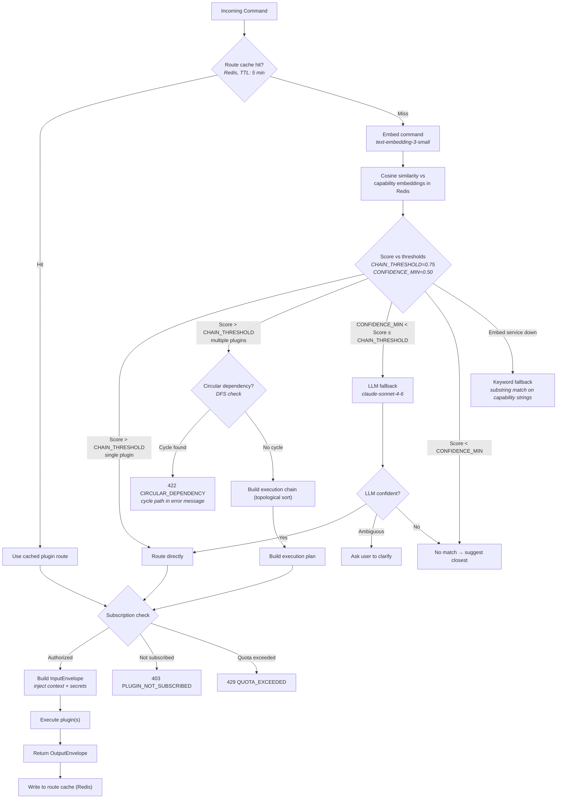
```mermaid
flowchart TD
    CMD["Incoming Command"] --> CACHE{"Route cache hit?<br/><i>Redis, TTL: 5 min</i>"}
    CACHE -->|"Hit"| CACHED["Use cached plugin route"]
    CACHE -->|"Miss"| EMBED["Embed command<br/><i>text-embedding-3-small</i>"]

    EMBED --> MATCH["Cosine similarity vs<br/>capability embeddings in Redis"]
    MATCH --> EVAL{"Score vs thresholds<br/><i>CHAIN_THRESHOLD=0.75<br/>CONFIDENCE_MIN=0.50</i>"}

    EVAL -->|"Score > CHAIN_THRESHOLD<br/>single plugin"| DIRECT["Route directly"]
    EVAL -->|"Score > CHAIN_THRESHOLD<br/>multiple plugins"| DEPCHECK{"Circular dependency?<br/><i>DFS check</i>"}
    EVAL -->|"CONFIDENCE_MIN < Score ≤ CHAIN_THRESHOLD"| LLM["LLM fallback<br/><i>claude-sonnet-4-6</i>"]
    EVAL -->|"Score < CONFIDENCE_MIN"| NOPE["No match → suggest closest"]
    EVAL -->|"Embed service down"| KEYWORD["Keyword fallback<br/><i>substring match on capability strings</i>"]

    LLM --> EVAL2{"LLM confident?"}
    EVAL2 -->|"Yes"| DIRECT
    EVAL2 -->|"Ambiguous"| CLARIFY["Ask user to clarify"]
    EVAL2 -->|"No"| NOPE

    DEPCHECK -->|"Cycle found"| ERROR["422 CIRCULAR_DEPENDENCY<br/><i>cycle path in error message</i>"]
    DEPCHECK -->|"No cycle"| CHAIN["Build execution chain (topological sort)"]

    DIRECT --> SUBCHECK{"Subscription check"}
    CHAIN --> PLAN["Build execution plan"]
    PLAN --> SUBCHECK

    SUBCHECK -->|"Authorized"| ENVELOPE["Build InputEnvelope<br/><i>inject context + secrets</i>"]
    SUBCHECK -->|"Not subscribed"| UPSELL["403 PLUGIN_NOT_SUBSCRIBED"]
    SUBCHECK -->|"Quota exceeded"| QUOTA["429 QUOTA_EXCEEDED"]

    ENVELOPE --> EXEC["Execute plugin(s)"]
    EXEC --> RESULT["Return OutputEnvelope"]
    RESULT --> WRITECACHE["Write to route cache (Redis)"]
    CACHED --> SUBCHECK
```

**Threshold calibration:** `CHAIN_THRESHOLD` and `CONFIDENCE_MIN` are set in environment config. Calibrate by running a labeled command corpus through the router and adjusting to maximise precision while keeping recall above 95%. Two values are easier to tune and reason about than three.

**LLM routing cost target:** < 5% of requests. Tracked via `routing_method` in every `execution_meta`. Grafana alert fires if LLM fallback rate exceeds 10%.

### 14.2 Multi-Plugin Task Sequencing

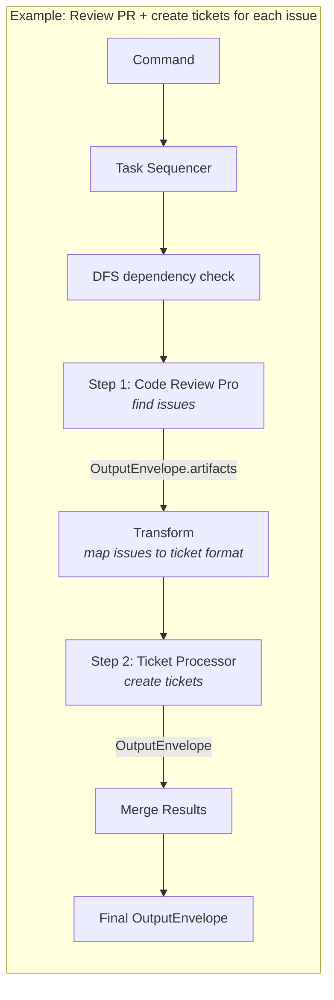
```mermaid
flowchart LR
    subgraph Example["Example: Review PR + create tickets for each issue"]
        direction TB
        CMD2["Command"] --> DECOMPOSE["Task Sequencer"]
        DECOMPOSE --> DEPCHECK2["DFS dependency check"]
        DEPCHECK2 --> STEP1["Step 1: Code Review Pro<br/><i>find issues</i>"]
        STEP1 -->|"OutputEnvelope.artifacts"| TRANSFORM["Transform<br/><i>map issues to ticket format</i>"]
        TRANSFORM --> STEP2["Step 2: Ticket Processor<br/><i>create tickets</i>"]
        STEP2 -->|"OutputEnvelope"| MERGE["Merge Results"]
        MERGE --> FINAL["Final OutputEnvelope"]
    end
```

**Sequencing rules:**
- **Serial chaining:** Output of plugin A feeds plugin B
- **Parallel execution:** Independent plugins run concurrently; results merged
- **Conditional branching:** Plugin A output determines next plugin
- **Early termination:** Failed step → `status: partial` with what completed

### 14.3 Shared Context Store

#### Context Assembly Pipeline

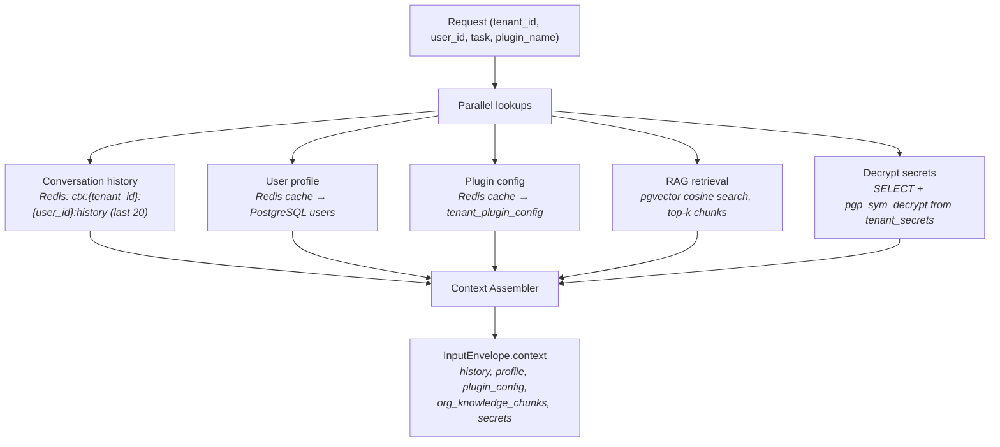
```mermaid
flowchart TD
    REQ["Request (tenant_id, user_id, task, plugin_name)"] --> PARALLEL["Parallel lookups"]

    PARALLEL --> HIST["Conversation history<br/><i>Redis: ctx:{tenant_id}:{user_id}:history (last 20)</i>"]
    PARALLEL --> PROF["User profile<br/><i>Redis cache → PostgreSQL users</i>"]
    PARALLEL --> CFG["Plugin config<br/><i>Redis cache → tenant_plugin_config</i>"]
    PARALLEL --> RAG["RAG retrieval<br/><i>pgvector cosine search, top-k chunks</i>"]
    PARALLEL --> SECRETS["Decrypt secrets<br/><i>SELECT + pgp_sym_decrypt from tenant_secrets</i>"]

    HIST --> ASSEMBLE["Context Assembler"]
    PROF --> ASSEMBLE
    CFG --> ASSEMBLE
    RAG --> ASSEMBLE
    SECRETS --> ASSEMBLE

    ASSEMBLE --> ENVELOPE3["InputEnvelope.context<br/><i>history, profile, plugin_config,<br/>org_knowledge_chunks, secrets</i>"]
```

#### RAG Pipeline — Org Knowledge Indexing

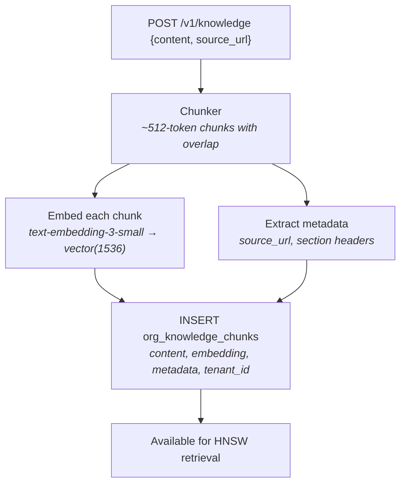
```mermaid
flowchart TD
    UPLOAD["POST /v1/knowledge {content, source_url}"]
    --> CHUNK["Chunker<br/><i>~512-token chunks with overlap</i>"]
    --> EMBED2["Embed each chunk<br/><i>text-embedding-3-small → vector(1536)</i>"]
    --> STORE2["INSERT org_knowledge_chunks<br/><i>content, embedding, metadata, tenant_id</i>"]
    --> READY2["Available for HNSW retrieval"]

    CHUNK --> META["Extract metadata<br/><i>source_url, section headers</i>"]
    META --> STORE2
```

#### RAG Pipeline — Retrieval at Request Time

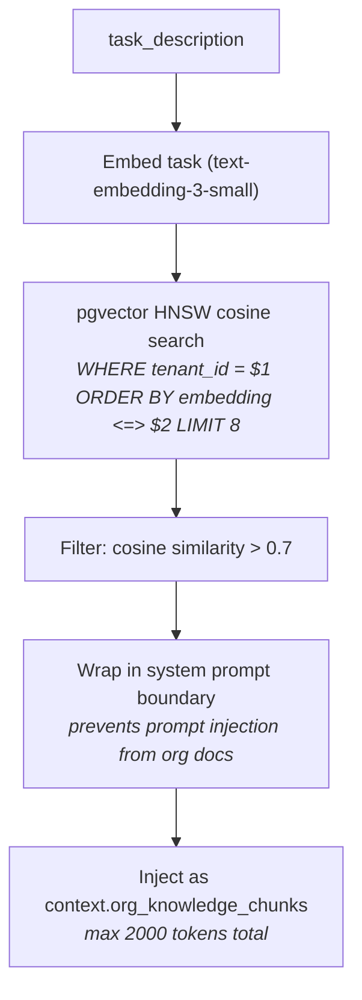
```mermaid
flowchart TD
    TASK["task_description"]
    --> EMBED3["Embed task (text-embedding-3-small)"]
    --> SEARCH["pgvector HNSW cosine search<br/><i>WHERE tenant_id = $1 ORDER BY embedding &lt;=&gt; $2 LIMIT 8</i>"]
    --> FILTER["Filter: cosine similarity > 0.7"]
    --> WRAP["Wrap in system prompt boundary<br/><i>prevents prompt injection from org docs</i>"]
    --> INJECT["Inject as context.org_knowledge_chunks<br/><i>max 2000 tokens total</i>"]
```

#### Async History Summarisation

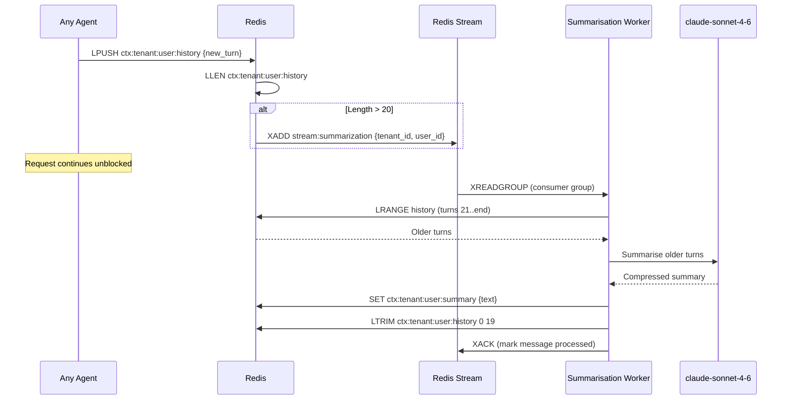
```mermaid
sequenceDiagram
    participant Agent as Any Agent
    participant Redis
    participant Stream as Redis Stream
    participant Worker as Summarisation Worker
    participant LLM as claude-sonnet-4-6

    Agent->>Redis: LPUSH ctx:tenant:user:history {new_turn}
    Redis->>Redis: LLEN ctx:tenant:user:history
    alt Length > 20
        Redis->>Stream: XADD stream:summarization {tenant_id, user_id}
    end

    Note over Agent: Request continues unblocked

    Stream->>Worker: XREADGROUP (consumer group)
    Worker->>Redis: LRANGE history (turns 21..end)
    Redis-->>Worker: Older turns
    Worker->>LLM: Summarise older turns
    LLM-->>Worker: Compressed summary
    Worker->>Redis: SET ctx:tenant:user:summary {text}
    Worker->>Redis: LTRIM ctx:tenant:user:history 0 19
    Worker->>Stream: XACK (mark message processed)
```

### 14.4 Async Task Delivery (Redis Streams)

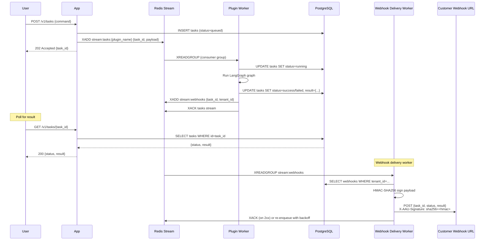
```mermaid
sequenceDiagram
    participant User
    participant App
    participant Stream as Redis Stream
    participant Worker as Plugin Worker
    participant DB as PostgreSQL
    participant Notify as Webhook Delivery Worker
    participant Webhook as Customer Webhook URL

    User->>App: POST /v1/tasks {command}
    App->>DB: INSERT tasks (status=queued)
    App->>Stream: XADD stream:tasks:{plugin_name} {task_id, payload}
    App-->>User: 202 Accepted {task_id}

    Stream->>Worker: XREADGROUP (consumer group)
    Worker->>DB: UPDATE tasks SET status=running
    Worker->>Worker: Run LangGraph graph
    Worker->>DB: UPDATE tasks SET status=success/failed, result={...}
    Worker->>Stream: XADD stream:webhooks {task_id, tenant_id}
    Worker->>Stream: XACK tasks stream

    Note over User: Poll for result
    User->>App: GET /v1/tasks/{task_id}
    App->>DB: SELECT tasks WHERE id=task_id
    DB-->>App: {status, result}
    App-->>User: 200 {status, result}

    Note over Notify: Webhook delivery worker
    Stream->>Notify: XREADGROUP stream:webhooks
    Notify->>DB: SELECT webhooks WHERE tenant_id=...
    Notify->>Notify: HMAC-SHA256 sign payload
    Notify->>Webhook: POST {task_id, status, result}<br/>X-AAU-Signature: sha256=<hmac>
    Notify->>Stream: XACK (on 2xx) or re-enqueue with backoff
```

#### Webhook Security Detail

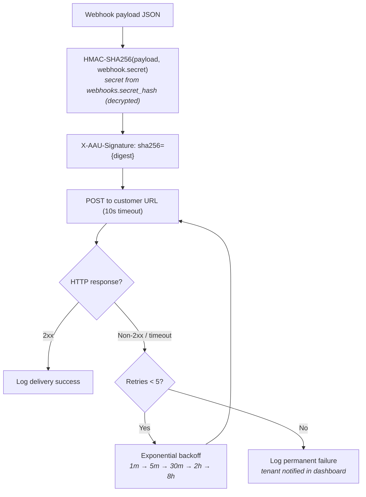
```mermaid
flowchart TD
    PAYLOAD["Webhook payload JSON"]
    --> SIGN["HMAC-SHA256(payload, webhook.secret)<br/><i>secret from webhooks.secret_hash (decrypted)</i>"]
    --> HEADER["X-AAU-Signature: sha256={digest}"]
    --> POST["POST to customer URL (10s timeout)"]
    --> RESP{"HTTP response?"}

    RESP -->|"2xx"| LOG_OK["Log delivery success"]
    RESP -->|"Non-2xx / timeout"| RETRY{"Retries < 5?"}

    RETRY -->|"Yes"| BACKOFF2["Exponential backoff<br/><i>1m → 5m → 30m → 2h → 8h</i>"]
    BACKOFF2 --> POST
    RETRY -->|"No"| LOG_FAIL["Log permanent failure<br/><i>tenant notified in dashboard</i>"]
```

**Task cancellation:** `DELETE /v1/tasks/{task_id}` sets `Redis key cancel:{task_id} EX 3600`. The LangGraph graph checks this flag at each node boundary. Acknowledged within one node cycle.

**Task state machine:** `pending → queued → running → success | partial | failed | cancelled`

---

## 15. Failure Handling & Resilience

### 15.1 Failure Strategy

```mermaid
flowchart TD
    EXEC2["Plugin Execution"] --> OUTCOME{"Outcome?"}

    OUTCOME -->|"Success"| RETURN["OutputEnvelope status: success"]
    OUTCOME -->|"Timeout"| RETRY{"Retries remaining?"}
    OUTCOME -->|"Error"| ERRTYPE{"Error type?"}

    RETRY -->|"Yes"| BACKOFF3["Exponential backoff → retry"]
    RETRY -->|"No"| TIMEOUT["status: failed / PLUGIN_TIMEOUT"]
    BACKOFF3 --> EXEC2

    ERRTYPE -->|"Transient"| RETRY
    ERRTYPE -->|"Token budget exceeded"| WARNBILL["Warn + continue<br/><i>overage tracked + billed</i>"]
    ERRTYPE -->|"Context window overflow"| TRUNCATE["Truncate history → retry once"]
    ERRTYPE -->|"Content policy violation"| POLICY["status: failed / CONTENT_POLICY_VIOLATION<br/><i>not retried, not billed</i>"]
    ERRTYPE -->|"Permanent"| FALLBACK{"Fallback plugin?"}
    ERRTYPE -->|"Partial result"| PARTIAL["status: partial"]

    FALLBACK -->|"Yes"| ALT["Route to fallback plugin"]
    FALLBACK -->|"No"| FAIL["status: failed"]
    ALT --> EXEC2

    TIMEOUT --> CIRCUIT["Update circuit breaker (Redis)"]
    FAIL --> CIRCUIT
    CIRCUIT -->|"3 consecutive failures"| OPEN["Open circuit — 60s cooldown"]
```

### 15.2 Token Budget Enforcement

```mermaid
flowchart TD
    NODE_START["LangGraph node starts"]
    --> SDK_CHECK{"tokens_used / token_budget"}

    SDK_CHECK -->|"< 80%"| RUN["Run node (LLM call)"]
    SDK_CHECK -->|"80–100%"| WARN2["Log warning + emit metric"]
    WARN2 --> RUN

    RUN --> TRACK["SDK reads response.usage<br/><i>input_tokens + output_tokens → running total in GraphState</i>"]
    TRACK --> CHECK2{"Total > token_budget?"}

    CHECK2 -->|"No"| NEXT["Proceed to next node"]
    CHECK2 -->|"Yes"| OVERAGE["Set budget_exceeded=true in ExecutionMeta<br/><i>Overage billed to tenant</i>"]
    OVERAGE --> CONTINUE["Continue execution"]
    CONTINUE --> NEXT
```

### 15.3 Circuit Breaker per Plugin

```mermaid
stateDiagram-v2
    [*] --> Closed
    Closed --> Open : 3 consecutive failures
    Open --> HalfOpen : 60s cooldown elapsed
    HalfOpen --> Closed : Probe request succeeds
    HalfOpen --> Open : Probe request fails
    Open --> Open : Requests rejected immediately (no plugin call)
```

State stored in Redis (`circuit:{plugin_name}:{version}`). Surfaced as `aau_circuit_breaker_state` Gauge in Grafana.

---

## 16. Plugin Sandboxing & Security

### 16.1 Capability Scope Model

| Scope | Grants Access To |
|-------|-----------------|
| `context:read` | Current request's user and tenant context only |
| `secrets:{name}` | A specific named secret resolved from `tenant_secrets` |
| `store:write` | Writing to MinIO at `/{tenant_id}/{plugin_name}/...` |
| `store:read` | Reading artifacts the plugin itself created |
| `plugin:chain` | Calling other plugins as dependencies |
| `knowledge:read` | Reading the tenant's org knowledge base |
| `knowledge:write` | Indexing new content into the tenant's org knowledge base |

**Note on secrets:** Plugin pods never access the database or call a secrets endpoint. The orchestrator resolves and decrypts secrets from `tenant_secrets` before building the `InputEnvelope`, and injects them as `context.secrets`. Secrets leave the orchestrator only inside a request, over an in-cluster encrypted channel to the plugin pod.

### 16.2 Runtime Isolation

```mermaid
flowchart TB
    subgraph App2["Platform App"]
        EXEC3["execute(InputEnvelope)<br/><i>secrets already injected, tenant_id embedded</i>"]
    end

    subgraph PluginPod["Plugin Pod (network-isolated)"]
        PROXY["Scope Enforcement Proxy<br/><i>validates all infra calls against declared scopes</i>"]
        PLUGIN3["Plugin Code (LangGraph)"]
        PROXY --> PLUGIN3
    end

    subgraph SharedInfra["Shared Infrastructure"]
        PG3["PostgreSQL (WHERE tenant_id = $1 enforced)"]
        STORE3["MinIO (path: /{tenant_id}/{plugin_name}/...)"]
    end

    EXEC3 -->|"InputEnvelope"| PROXY
    PROXY -->|"Scope-validated"| STORE3
    PROXY -->|"Read-only, tenant-scoped"| PG3
    PLUGIN3 -->|"OutputEnvelope"| EXEC3
```

**Network policy:** Kubernetes `NetworkPolicy` restricts plugin pod egress to only the endpoints declared in `required_secret_names`. No direct database or secret store access from plugin pods.

**Plugin signing:** All plugins are signed with `cosign` during `aau plugin publish`. The registration endpoint verifies the signature before accepting.

### 16.3 Plugin Signing & Publish Flow

```mermaid
flowchart TD
    CODE["Plugin code (my_plugin.py)"]
    --> SDKBUILD["aau plugin publish<br/><i>Step 1: docker build using aau-base image</i>"]
    --> IMAGE2["Container image built"]
    --> SCAN["Step 2: trivy scan<br/><i>Fail on HIGH/CRITICAL CVEs</i>"]
    --> SIGN2["Step 3: cosign sign image<br/><i>using platform private key</i>"]
    --> PUSH["Step 4: push to Zot OCI registry<br/><i>registry.aau.internal/{name}:{version}</i>"]
    --> MANIFEST["Step 5: generate manifest.json"]
    --> UPLOAD2["Step 6: POST /internal/registry/register<br/><i>platform verifies cosign signature</i>"]
    --> LIVE2["Plugin registered and live"]

    SCAN --> FAIL2["Build fails — developer must fix CVEs"]
```

---

## 17. Subscription Enforcement — Deep Dive

### 17.1 Enforcement Flow

```mermaid
flowchart TD
    REQ["Incoming Request (tenant_id from API key)"]
    --> LOOKUP["Lookup subscription<br/><i>Redis cache → PostgreSQL subscriptions</i>"]
    --> CHECK{"Plugin in subscription?"}

    CHECK -->|"Yes"| QUOTA2{"Within quota?"}
    CHECK -->|"No"| DENY["403 PLUGIN_NOT_SUBSCRIBED + upgrade_url"]

    QUOTA2 -->|"< 80%"| ALLOW["Allow execution"]
    QUOTA2 -->|"80–100%"| WARN3["Allow + emit quota.warning event"]
    QUOTA2 -->|"Exceeded"| OVER{"Overage enabled?"}

    OVER -->|"Yes"| CHARGE["Allow + set overage=true in metering"]
    OVER -->|"No"| BLOCK["429 QUOTA_EXCEEDED"]

    ALLOW --> LOG["INSERT execution_events"]
    WARN3 --> LOG
    CHARGE --> LOG
    LOG --> BILL["Billing worker reads execution_events WHERE billed=false<br/><i>runs on schedule, marks billed=true after invoicing</i>"]
```

### 17.2 Usage Metering Record

| Field | Description |
|-------|-------------|
| `tenant_id` | Who |
| `plugin_name` + `plugin_version` | What |
| `task_id` | Which request |
| `timestamp` | When |
| `tokens_used` | From `ExecutionMeta.tokens_used` (SDK-tracked) |
| `latency_ms` | Execution duration |
| `status` | success / partial / failed |
| `cost_estimate` | `tokens_used × per-token rate` for `model_used` |
| `routing_method` | embedding / llm_fallback / cache / keyword |
| `billed` | False for failed; True once invoiced by billing worker |

---

## 18. Plugin Dependency Management

### 18.1 Dependency Resolution

```python
dependencies = [
    {"name": "code-review", "version": ">=1.2.0,<2.0.0"},
    {"name": "ticket-processor", "version": ">=2.0.0"},
]
```

At plan-build time: resolve versions → check subscriptions → DFS cycle detection → topological sort → execute.

### 18.2 Circular Dependency Detection

```mermaid
flowchart TD
    PLAN["Build Execution Plan"] --> DFS["DFS over dependency graph"]
    DFS --> CYCLE{"Cycle detected?"}
    CYCLE -->|"Yes"| REJECT2["422 CIRCULAR_DEPENDENCY<br/><i>error message includes full cycle path</i>"]
    CYCLE -->|"No"| TOPO["Topological sort → execution order"]
    TOPO --> EXEC4["Execute in order"]
```

---

## 19. Plugin Deprecation Lifecycle

```mermaid
flowchart LR
    ACTIVE["Active"] -->|"Owner initiates"| DEPRECATED["Deprecated<br/><i>90-day warning</i>"]
    DEPRECATED -->|"90 days elapsed"| SUNSET["Sunset<br/><i>No new subscriptions</i>"]
    SUNSET -->|"Zero active subscribers"| RETIRED["Retired<br/><i>Removed from registry</i>"]

    DEPRECATED --> BLOCKED2["New subscriptions blocked"]
    DEPRECATED --> WARN4["deprecation_warning in every OutputEnvelope<br/><i>sunset_at + migration_guide_url</i>"]
```

- `plugin_versions.status` transitions: `active → deprecated → sunset → retired`
- At sunset, plugin accepts no new tasks; in-flight tasks complete before deregistration

---

## 20. Plugin SDK & Developer Experience

### 20.1 SDK Structure

```
aau-sdk/
├── base_plugin.py        # BasePlugin abstract class (LangGraph-aware)
├── decorators.py         # @register_plugin
├── envelopes.py          # InputEnvelope, OutputEnvelope, typed dataclasses
├── graph.py              # AAUStateGraph, standard node helpers
├── budget.py             # Token budget tracker (wraps Anthropic client)
├── validation.py         # OutputEnvelope schema validation (in-process envelope_schemas cache)
├── testing/
│   ├── harness.py        # Local orchestrator stub
│   └── fixtures.py       # Sample InputEnvelopes for testing
└── cli/
    ├── new.py            # aau plugin new <name>
    ├── dev.py            # aau plugin dev (Docker Compose + hot-reload)
    ├── test.py           # aau plugin test
    └── publish.py        # build → trivy scan → cosign sign → Zot push → register
```

### 20.2 Local Development Stack

`aau plugin dev` runs `docker compose up`. All services are local — no external dependencies.

```mermaid
graph TB
    subgraph DockerCompose["Docker Compose — Local Dev Stack"]
        subgraph AppLayer["Application"]
            LAPP["Platform App (FastAPI :8080)<br/><i>auth + orchestrator + registration routes</i>"]
        end

        subgraph Data["Data Services"]
            LPG["PostgreSQL 16 + pgvector :5432<br/><i>Pre-seeded: 2 tenants, subscriptions,<br/>API keys, sample org knowledge</i>"]
            LREDIS["Redis 7 :6379<br/><i>Cache + Streams queues</i>"]
        end

        subgraph Storage["Storage"]
            LMINIO["MinIO :9000 / Console :9001<br/><i>Pre-created tenant buckets</i>"]
            LZOT["Zot OCI Registry :5000<br/><i>Accepts plugin image pushes</i>"]
        end

        subgraph Observability2["Observability"]
            LPROM["Prometheus :9090"]
            LGRAFANA["Grafana :3000<br/><i>Pre-built plugin dashboards</i>"]
            LLOKI["Loki :3100"]
        end

        subgraph Plugin2["Developer Plugin (hot-reload)"]
            LPLUGIN["my_plugin.py<br/><i>Reloads on file save</i>"]
        end
    end

    LAPP --> LPG
    LAPP --> LREDIS
    LAPP --> LMINIO
    LPLUGIN -->|"POST /internal/registry/register"| LAPP
    LPROM --> LGRAFANA
    LLOKI --> LGRAFANA
```

**Test API keys:**
- `<YOUR_STRIPE_TEST_KEY_1>` — `test-tenant-1` (Professional tier)
- `<YOUR_STRIPE_TEST_KEY_2>` — `test-tenant-2` (Starter tier)

### 20.3 Plugin Development Flow

```mermaid
flowchart LR
    SCAFFOLD["aau plugin new my-plugin<br/><i>Scaffolds: my_plugin.py, tests/, Dockerfile, manifest.json</i>"]
    --> CODE["Implement LangGraph nodes<br/><i>extend BasePlugin, define GraphState</i>"]
    --> DEV["aau plugin dev<br/><i>docker compose up + hot-reload</i>"]
    --> TEST["aau plugin test<br/><i>PluginHarness: tokens, scopes, schema</i>"]
    --> PUBLISH["aau plugin publish<br/><i>build → trivy → cosign → Zot → register</i>"]
    --> LIVE2["Plugin live in registry"]
```

### 20.4 Minimal Plugin Implementation

```python
from aau_sdk import BasePlugin, register_plugin
from aau_sdk.envelopes import InputEnvelope, OutputEnvelope
from aau_sdk.graph import AAUStateGraph
from typing import TypedDict
from langchain_anthropic import ChatAnthropic

class GraphState(TypedDict):
    task: str
    result: str

@register_plugin
class MyPlugin(BasePlugin):
    name = "my-plugin"
    version = "1.0.0"
    description = "Summarises documents."
    capabilities = ["summarize documents", "extract key points"]
    required_scopes = ["context:read", "store:write"]
    required_secret_names = []   # declare any tenant secrets needed here
    token_budget = 50_000

    def initialize(self):
        # SDK wraps client with token budget tracker automatically
        self.llm = self.sdk.get_llm(model="claude-sonnet-4-6")
        self.graph = self._build_graph()

    def _build_graph(self):
        graph = AAUStateGraph(GraphState)
        graph.add_node("summarize", self._summarize_node)
        graph.set_entry_point("summarize")
        graph.set_finish_point("summarize")
        return graph.compile()

    def _summarize_node(self, state: GraphState) -> GraphState:
        # plugin_config comes from tenant_plugin_config table
        style = self.plugin_config.get("summary_style", "concise")
        response = self.llm.invoke(f"Summarise in {style} style: {state['task']}")
        return {"result": response.content}

    def execute(self, input: InputEnvelope) -> OutputEnvelope:
        final_state = self.graph.invoke({"task": input.task_description})
        return OutputEnvelope(
            task_id=input.task_id,
            status="success",
            result=final_state["result"],
            confidence=0.9,
        )
        # SDK validates OutputEnvelope against in-process schema cache before returning
```

### 20.5 Local Test Harness

```python
from aau_sdk.testing import PluginHarness
from my_plugin import MyPlugin

harness = PluginHarness(MyPlugin())
result = harness.run(
    task="Summarise this architecture document",
    tenant_id="test-tenant-1",
    plugin_config={"summary_style": "detailed"},
    attachments=["doc.pdf"],
)

assert result.status == "success"
assert result.confidence >= 0.7
harness.assert_tokens_within_budget()
harness.assert_no_cross_tenant_calls()
harness.assert_output_schema_valid()
```

---

## 21. Plugin Example — Code Review Pro (Detailed)

### 21.1 Internal LangGraph Agent Graph

```mermaid
flowchart TD
    INPUT["InputEnvelope<br/><i>PR URL + context.secrets.github_token<br/>+ context.plugin_config.coding_standards</i>"]
    --> FETCH["Diff Fetcher Node<br/><i>GitHub API (token from context.secrets) → parsed diff</i>"]
    --> SPLIT["File Splitter Node<br/><i>Groups files by type/module</i>"]
    --> PARALLEL2["Parallel Branch (LangGraph Send API)"]

    PARALLEL2 --> SEC["Security Node<br/><i>OWASP + dependency vulns + secret detection</i>"]
    PARALLEL2 --> STYLE2["Style Node<br/><i>plugin_config.coding_standards applied</i>"]
    PARALLEL2 --> LOGIC2["Logic Node<br/><i>Bug detection, edge cases, race conditions</i>"]
    PARALLEL2 --> PERF["Performance Node<br/><i>N+1 queries, memory leaks, complexity</i>"]

    SEC --> MERGE3["Result Merger Node"]
    STYLE2 --> MERGE3
    LOGIC2 --> MERGE3
    PERF --> MERGE3

    MERGE3 --> PRIORITY2["Priority Ranker Node<br/><i>Critical → High → Medium → Low</i>"]
    --> SUMMARY2["Summary Node<br/><i>Executive summary + inline comments</i>"]
    --> OUTPUT2["OutputEnvelope<br/><i>Review report (MinIO URL) + confidence</i>"]
```

### 21.2 Agent Node Responsibilities

| Node | Input | Output | Tools |
|------|-------|--------|-------|
| Diff Fetcher | PR URL | Parsed diff | GitHub API (`context.secrets.github_token`) |
| File Splitter | Diff | File batches | Internal logic |
| Security | File batch | Security findings | OWASP rules, Trivy |
| Style | File batch | Style violations | `plugin_config.coding_standards` |
| Logic | File batch | Bug candidates | `claude-sonnet-4-6` |
| Performance | File batch | Perf concerns | Complexity analyser |
| Priority Ranker | All findings | Prioritised list | Scoring model |
| Summary | Prioritised findings | Review report | `claude-sonnet-4-6` |

---

## 22. Data Storage Architecture

```mermaid
graph TB
    subgraph DataStores["Data Layer"]
        subgraph Primary["Primary Stores"]
            PG4["PostgreSQL 16<br/><i>tenants, users, api_keys, tenant_secrets,<br/>plugins, plugin_versions, envelope_schemas,<br/>subscriptions, tenant_plugin_config,<br/>tasks, webhooks, execution_events</i>"]
            PGV2["pgvector (HNSW index)<br/><i>org_knowledge_chunks<br/>scoped by tenant_id</i>"]
            REDIS3["Redis 7<br/><i>Auth cache, plugin registry cache,<br/>circuit breakers, route cache,<br/>rate limit counters, cancellation flags<br/>+ Streams: tasks / summarisation / webhooks</i>"]
        end

        subgraph Storage2["Storage"]
            MINIO3["MinIO<br/><i>/{tenant_id}/{plugin_name}/{task_id}/ — artifacts</i>"]
            ZOT2["Zot OCI Registry<br/><i>Plugin container images</i>"]
        end

        subgraph PlatformSecrets["Platform Credentials"]
            K8SSEC2["Kubernetes Secrets<br/><i>LLM API key, embedding API key,<br/>pgcrypto ENCRYPT_KEY</i>"]
        end
    end

    APP2["Platform App"] --> PG4
    APP2 --> PGV2
    APP2 --> REDIS3
    APP2 --> K8SSEC2
    PLUGINS3["Plugins"] --> MINIO3
    WBILLING2["Billing Worker"] --> PG4
    WDELIVER2["Webhook Worker"] --> REDIS3
    WDELIVER2 --> PG4
    DEPLOY2["Plugin Deployments"] --> ZOT2
```

**Data retention & GDPR:**

| Data | Retention | GDPR erasure |
|------|-----------|--------------|
| `execution_events` | 13 months | Pseudonymise `user_id` within 30 days |
| MinIO artifacts | 90 days (tenant-configurable) | Purge within 30 days |
| `tasks.input` / `tasks.result` | 90 days | Purge within 30 days |
| `users` row | Until account deleted | Hard delete (cascade) |
| Billing aggregates | 7 years (accounting) | Not erasable — no PII in aggregates |

#### GDPR Erasure Flow

```mermaid
flowchart TD
    REQUEST["POST /v1/gdpr/erasure-request {user_id}"]
    --> VALIDATE2["Verify requester is user or tenant admin"]
    --> STREAM2["XADD stream:erasure {user_id, tenant_id}"]
    --> ACK["202 Accepted — SLA: 30 days"]

    STREAM2 --> WORKER2["Erasure Worker (Redis Streams consumer)"]
    WORKER2 --> TASKS_PURGE["Nullify tasks.input, tasks.result WHERE user_id=$1"]
    WORKER2 --> EVENTS_PSEUDO["Pseudonymise execution_events.user_id"]
    WORKER2 --> ARTIFACTS_DEL["DELETE MinIO: /{tenant_id}/.../{user_id}/"]
    WORKER2 --> HISTORY_DEL["DEL Redis ctx:{tenant_id}:{user_id}:*"]
    WORKER2 --> USER_DEL["DELETE users WHERE id=$1 (cascades to api_keys)"]
    WORKER2 --> AUDIT["Immutable erasure audit log (no PII)"]
```

---

## 23. Deployment Architecture

```mermaid
graph TB
    subgraph K8s["Kubernetes Cluster (cloud-agnostic, plain Deployments + PVCs)"]
        subgraph AppLayer2["Application (single replica — v1)"]
            APP3["Platform App<br/><i>FastAPI + Uvicorn :8080<br/>auth, rate limiting, orchestrator,<br/>registration routes</i>"]
            WWEBHOOK["Webhook Delivery Worker<br/><i>Redis Streams consumer</i>"]
            WBILL["Billing Aggregation Worker<br/><i>Scheduled cron</i>"]
        end

        subgraph PluginPods2["Plugin Pods (HPA: 1–10 replicas per plugin)"]
            PP4["Code Review Pro"]
            PP5["Customer Support AI"]
            PPN2["Plugin N"]
        end

        subgraph DataLayer["Data Services (plain Deployments + PVCs)"]
            PG5["PostgreSQL 16<br/><i>Deployment + PVC</i>"]
            REDIS4["Redis 7<br/><i>Deployment + PVC</i>"]
            MINIO4["MinIO<br/><i>Deployment + PVC</i>"]
            ZOT3["Zot OCI Registry<br/><i>Deployment + PVC</i>"]
        end

        subgraph Obs["Observability"]
            PROM2["Prometheus"]
            GRAF2["Grafana (Metrics + Logs)"]
            LOKI3["Loki"]
        end
    end

    subgraph External3["External"]
        LB2["Ingress Controller (nginx)<br/><i>TLS termination</i>"]
        CDN2["CDN — Marketplace UI"]
    end

    LB2 --> APP3
    CDN2 --> APP3
    APP3 --> PluginPods2
    PluginPods2 -->|"POST /internal/registry/register"| APP3
    APP3 -->|"Redis pub/sub"| APP3
    PROM2 --> GRAF2
    LOKI3 --> GRAF2
```

**Key deployment principles:**

- **Cloud-agnostic:** No cloud-provider-specific services. Plain Kubernetes `Deployment` + `PersistentVolumeClaim` for all stateful services. No operators required at single-replica scale.
- **One application, two workers:** `Platform App` handles all HTTP traffic. `Webhook Delivery Worker` and `Billing Aggregation Worker` are separate pods consuming from Redis Streams and the scheduler respectively.
- **Plugins self-register:** Plugin pods call `POST /internal/registry/register` on startup. The app writes to PostgreSQL and Redis. No file system watching.
- **Zero-downtime plugin updates:** Kubernetes rolling deployment + graceful in-flight request draining.
- **v2 HA path:** Add a PostgreSQL streaming replica, Redis Sentinel, and increase replicas on the app. No architectural changes needed — plain Deployments scale horizontally.

---

## 24. Observability

### 24.1 Metrics (Prometheus + Grafana)

| Metric | Type | Labels | Purpose |
|--------|------|--------|---------|
| `aau_router_confidence` | Histogram | `method` | Routing quality over time |
| `aau_router_method_total` | Counter | `method` | LLM fallback rate (alert > 10%) |
| `aau_plugin_execution_duration_seconds` | Histogram | `plugin`, `status` | Latency per plugin |
| `aau_plugin_token_usage_total` | Counter | `plugin`, `model` | Token cost attribution |
| `aau_plugin_budget_exceeded_total` | Counter | `plugin` | Overage events |
| `aau_circuit_breaker_state` | Gauge | `plugin` | 0=closed, 1=half-open, 2=open |
| `aau_task_stream_depth` | Gauge | `plugin` | Redis Stream pending count |
| `aau_rate_limit_hits_total` | Counter | `tenant_id` | Throttling events |
| `aau_webhook_delivery_failures_total` | Counter | `tenant_id` | Delivery health |
| `aau_api_key_auth_latency_seconds` | Histogram | `cache_hit` | Auth path performance |

### 24.2 Alerting Pipeline

```mermaid
flowchart TD
    PROM3["Prometheus (scrapes every 15s)"]
    --> RULES["PrometheusRule alerts"]

    RULES --> A1["circuit_breaker_state == 2 → plugin circuit open"]
    RULES --> A2["router_method{llm} / total > 0.10 → LLM routing rate high"]
    RULES --> A3["task_stream_depth > 500 → queue backing up"]
    RULES --> A4["execution_duration p99 > 30s → latency SLO breach"]
    RULES --> A5["auth_latency p99 > 500ms → auth path slow"]

    A1 --> ALERTMANAGER["Alertmanager"]
    A2 --> ALERTMANAGER
    A3 --> ALERTMANAGER
    A4 --> ALERTMANAGER
    A5 --> ALERTMANAGER

    ALERTMANAGER --> SLACK2["Slack #alerts"]
    ALERTMANAGER --> PAGERDUTY["PagerDuty (P1 only)"]
```

### 24.3 Structured Logging (Loki)

Every log line is JSON with mandatory fields:

```json
{
  "timestamp": "2026-02-28T12:00:00Z",
  "level": "info",
  "service": "platform-app",
  "task_id": "task_abc123",
  "tenant_id": "tenant_xyz",
  "plugin_name": "code-review",
  "node": "security_agent",
  "routing_method": "embedding",
  "duration_ms": 342,
  "tokens_used": 1240,
  "message": "Node completed"
}
```

**PII policy:** Never log email, API key plaintext, raw user input, or `tasks.input` content. `task_id` is the primary correlation key.

### 24.4 SLOs

| SLO | Target | Alert threshold |
|-----|--------|-----------------|
| Router p99 latency (embedding path) | < 200ms | > 400ms |
| Plugin execution success rate | > 99% | < 98% |
| Task delivery (sync) p95 | < 5s | > 10s |
| LLM fallback routing rate | < 5% | > 10% |
| Webhook delivery success rate | > 99.5% | < 99% |
| Auth p99 latency | < 100ms | > 500ms |

---

## 25. Non-Functional Requirements

| Requirement | Target | Approach |
|-------------|--------|----------|
| **Availability** | 99.9% uptime | Circuit breakers per plugin; HA as v2 milestone (plain Deployment scale-out) |
| **Scalability** | 10K concurrent executions | Plugin HPA, Redis Streams for async backpressure |
| **Latency** | p95 < 5s sync tasks | Embedding routing (< 200ms), route cache, async summarisation |
| **Isolation** | Zero cross-tenant impact | `tenant_id` enforced at query layer, Redis namespacing, MinIO path isolation, NetworkPolicy |
| **Security** | SOC2-ready | SHA-256 key hashing, pgcrypto tenant secrets, K8s Secrets platform creds, cosign plugin signing, scope enforcement |
| **Observability** | Full request tracing | `task_id` correlation, Prometheus + Grafana + Loki, 6 SLOs with alert thresholds |
| **Extensibility** | Local dev in < 1 hour | Plugin SDK, Docker Compose full stack, `aau plugin new` scaffolding |
| **Versioning** | No breaking surprises | `envelope_schemas` table + in-process cache, version adapters, 90-day deprecation window |
| **Data compliance** | GDPR-ready | Tenant isolation, 30-day erasure SLA, erasure worker via Redis Streams |
| **Operational simplicity** | Minimal ops burden | 1 app + 2 workers, plain K8s Deployments, Redis Streams reuses existing Redis |
| **Router cost** | LLM calls < 5% | Embedding-first, 5-min route cache, keyword fallback, 2-threshold routing |

---

## 26. Summary

The AI Agents Universe is a platform where:

- **For customers:** Subscribe to the plugins you need. One API key, one interface. Long-running tasks return a `task_id` immediately — poll or receive a signed webhook.
- **For developers:** `aau plugin new` scaffolds a LangGraph plugin. `aau plugin dev` starts a full local Docker Compose stack with hot-reload. `aau plugin publish` builds, scans with Trivy, signs with cosign, and registers automatically. The entire contract is one Python class extending `BasePlugin`.
- **For the business:** Token-level usage billing. Invite-only plugin ecosystem at launch; public marketplace in v2. Enterprise custom builds via direct engagement.
- **For operators:** Self-hosted Kubernetes with no proprietary managed services and no Kubernetes operators — plain Deployments and PVCs throughout. One application pod, two worker pods, and five data services. Redis does double duty as cache and async queue via Streams, eliminating RabbitMQ. PostgreSQL does double duty as operational store and vector store via pgvector, eliminating a separate vector database. Secrets are stored encrypted in PostgreSQL using pgcrypto and in Kubernetes Secrets — HashiCorp Vault is a v2 addition when untrusted third-party plugins arrive.

**The simplification principle:** every infrastructure component must earn its place. When two use cases can be served by one tool already in the stack, that is always preferred over adding a new service.
