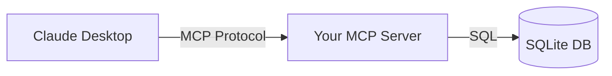

The Model Context Protocol (MCP) is Anthropic's open standard for connecting AI applications to external data sources and tools. Think of it like a USB-C port for AI—a standardized way to plug any data source into Claude or other AI assistants.

In this article, we'll build a practical MCP server that connects Claude to a SQLite database. By the end, you'll be able to ask Claude natural language questions about your data, and it will query the database directly.

## What is MCP?

MCP consists of three main components:

*   **Hosts:** AI applications that initiate connections (like Claude Desktop)
*   **Clients:** Systems within the host that maintain connections to servers
*   **Servers:** Programs that expose tools, resources, and prompts to the AI



The magic happens in the server. You define tools using Python functions, and the MCP SDK automatically makes them available to Claude.

## Setting Up the Project

First, create a new project and install dependencies:

```bash
mkdir mcp-database-server
cd mcp-database-server
python -m venv venv
source venv/bin/activate  # On Windows: venv\Scripts\activate
pip install mcp httpx
```

## Building the Database Server

Let's build an MCP server that exposes three tools:
1. `list_tables` - Show available tables
2. `describe_table` - Get a table's schema
3. `run_query` - Execute read-only SQL queries

### The Complete Server

```python
# database_server.py
from mcp.server.fastmcp import FastMCP
import sqlite3
import json

# Initialize FastMCP server
mcp = FastMCP("database-query")

# Database path
DB_PATH = "data.db"


def init_db():
    """Initialize database with sample data."""
    conn = sqlite3.connect(DB_PATH)
    cursor = conn.cursor()

    cursor.execute("""
        CREATE TABLE IF NOT EXISTS users (
            id INTEGER PRIMARY KEY,
            name TEXT NOT NULL,
            email TEXT NOT NULL,
            created_at TEXT DEFAULT CURRENT_TIMESTAMP
        )
    """)

    cursor.execute("""
        CREATE TABLE IF NOT EXISTS orders (
            id INTEGER PRIMARY KEY,
            user_id INTEGER,
            product TEXT NOT NULL,
            amount REAL NOT NULL,
            created_at TEXT DEFAULT CURRENT_TIMESTAMP,
            FOREIGN KEY (user_id) REFERENCES users (id)
        )
    """)

    # Insert sample data if empty
    cursor.execute("SELECT COUNT(*) FROM users")
    if cursor.fetchone()[0] == 0:
        cursor.executemany(
            "INSERT INTO users (name, email) VALUES (?, ?)",
            [
                ("Alice Johnson", "alice@example.com"),
                ("Bob Smith", "bob@example.com"),
                ("Carol White", "carol@example.com"),
            ]
        )
        cursor.executemany(
            "INSERT INTO orders (user_id, product, amount) VALUES (?, ?, ?)",
            [
                (1, "Widget A", 29.99),
                (1, "Widget B", 49.99),
                (2, "Gadget X", 199.99),
                (3, "Widget A", 29.99),
                (3, "Service Plan", 99.99),
            ]
        )

    conn.commit()
    conn.close()


@mcp.tool()
def list_tables() -> str:
    """List all tables in the database.

    Returns a list of table names available for querying.
    """
    conn = sqlite3.connect(DB_PATH)
    cursor = conn.cursor()

    cursor.execute("SELECT name FROM sqlite_master WHERE type='table'")
    tables = [row[0] for row in cursor.fetchall()]

    conn.close()
    return json.dumps({"tables": tables}, indent=2)


@mcp.tool()
def describe_table(table_name: str) -> str:
    """Get the schema of a specific table.

    Args:
        table_name: Name of the table to describe
    """
    conn = sqlite3.connect(DB_PATH)
    cursor = conn.cursor()

    cursor.execute(f"PRAGMA table_info({table_name})")
    columns = cursor.fetchall()

    if not columns:
        conn.close()
        return f"Table '{table_name}' not found."

    schema = [
        {
            "name": col[1],
            "type": col[2],
            "nullable": not col[3],
            "primary_key": bool(col[5])
        }
        for col in columns
    ]

    conn.close()
    return json.dumps({"table": table_name, "columns": schema}, indent=2)


@mcp.tool()
def run_query(sql: str) -> str:
    """Execute a read-only SQL query on the database.

    Args:
        sql: The SQL query to execute (SELECT statements only)
    """
    # Security: Only allow SELECT statements
    sql_upper = sql.strip().upper()
    if not sql_upper.startswith("SELECT"):
        return "Error: Only SELECT queries are allowed for safety."

    conn = sqlite3.connect(DB_PATH)
    cursor = conn.cursor()

    try:
        cursor.execute(sql)
        columns = [desc[0] for desc in cursor.description]
        rows = cursor.fetchall()

        results = [dict(zip(columns, row)) for row in rows]

        conn.close()
        return json.dumps({
            "columns": columns,
            "rows": results,
            "count": len(results)
        }, indent=2)
    except sqlite3.Error as e:
        conn.close()
        return f"SQL Error: {str(e)}"


# Initialize database on import
init_db()


if __name__ == "__main__":
    mcp.run(transport="stdio")
```

### How It Works

The `@mcp.tool()` decorator is the key. It automatically:
- Converts your function into an MCP tool
- Uses the docstring as the tool description
- Extracts parameter types from type hints
- Generates the JSON schema Claude needs

When Claude receives access to this server, it sees three tools it can call. If a user asks "What tables are in the database?", Claude will call `list_tables()` and return the result.

## Connecting to Claude Desktop

Create a configuration file to tell Claude Desktop about your server:

**macOS:** `~/Library/Application Support/Claude/claude_desktop_config.json`
**Windows:** `%APPDATA%\Claude\claude_desktop_config.json`

```json
{
  "mcpServers": {
    "database": {
      "command": "python",
      "args": ["/full/path/to/database_server.py"],
      "env": {}
    }
  }
}
```

Restart Claude Desktop, and you'll see the tools icon appear in the chat interface.

## Testing the Server Locally

Before connecting to Claude, test your tools directly:

```python
# test_server.py
from database_server import list_tables, describe_table, run_query

print("Tables:", list_tables())
print("\nUsers schema:", describe_table("users"))
print("\nQuery results:", run_query(
    "SELECT u.name, o.product, o.amount "
    "FROM users u JOIN orders o ON u.id = o.user_id"
))
```

Output:

```json
{
  "columns": ["name", "product", "amount"],
  "rows": [
    {"name": "Alice Johnson", "product": "Widget A", "amount": 29.99},
    {"name": "Alice Johnson", "product": "Widget B", "amount": 49.99},
    {"name": "Bob Smith", "product": "Gadget X", "amount": 199.99}
  ],
  "count": 5
}
```

## Example Conversations

Once connected, you can have natural conversations with Claude about your data:

**User:** "Who are the top customers by total spending?"

**Claude:** *Calls `run_query` with:*
```sql
SELECT u.name, SUM(o.amount) as total
FROM users u JOIN orders o ON u.id = o.user_id
GROUP BY u.id ORDER BY total DESC
```

**Claude:** "Based on the data, Bob Smith is your top customer with $199.99 in purchases, followed by Alice Johnson at $79.98."

## Security Considerations

The example above includes a basic security measure—only allowing SELECT queries. For production use, consider:

*   **Query whitelisting:** Only allow specific query patterns
*   **Row limits:** Add `LIMIT` clauses to prevent large result sets
*   **Authentication:** Add API key validation
*   **Logging:** Track all queries for auditing

## What's Next

This basic server can be extended to:

*   Support multiple databases (PostgreSQL, MySQL)
*   Add write operations with confirmation prompts
*   Include data visualization tools
*   Provide natural language to SQL translation

MCP opens up powerful possibilities for connecting AI to your data. The key is starting simple and iterating based on what your users actually need.

---

## Try It Yourself

Copy this prompt into your AI coding agent to build this project:

```
Build an MCP server in Python that connects to a SQLite database. Include:
1. A tool to list all tables in the database
2. A tool to describe a table's schema
3. A tool to run read-only SELECT queries

Use the mcp package with FastMCP (@mcp.tool() decorator). Create a sample
database with users and orders tables containing test data. Add security
to only allow SELECT statements. Provide the Claude Desktop config JSON.
```
