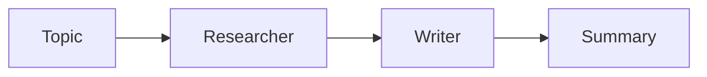
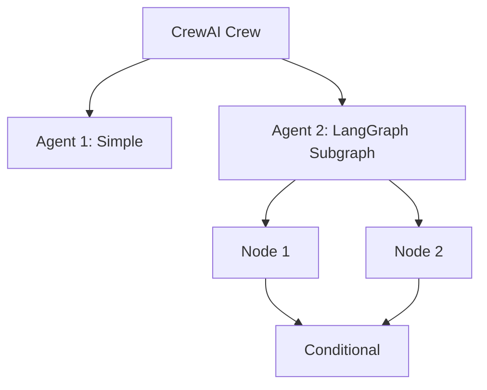

CrewAI and LangGraph are two of the most popular frameworks for building multi-agent AI systems. But they take fundamentally different approaches. CrewAI uses a role-based metaphor where agents are team members with defined roles. LangGraph uses a graph-based approach where you define states and transitions explicitly.

In this article, we'll build the same workflow in both frameworks: a research assistant that finds information and writes a summary. This will reveal the practical differences between the two approaches.

## The Task

We'll build a simple two-agent workflow:

1. **Researcher Agent:** Finds key facts about a topic
2. **Writer Agent:** Summarizes the research into readable content



## CrewAI Implementation

CrewAI models agents as team members with roles, goals, and backstories. The framework handles the orchestration automatically.

```python
from crewai import Agent, Task, Crew

# Define agents with roles
researcher = Agent(
    role="Research Analyst",
    goal="Find accurate information about the given topic",
    backstory="You are an expert researcher who finds reliable sources.",
    verbose=True
)

writer = Agent(
    role="Content Writer",
    goal="Create clear, engaging summaries from research",
    backstory="You transform complex information into readable content.",
    verbose=True
)

# Define tasks
research_task = Task(
    description="Research the topic: {topic}. Find 3 key facts with sources.",
    expected_output="A list of 3 key facts with sources.",
    agent=researcher
)

writing_task = Task(
    description="Write a summary based on the research findings.",
    expected_output="A 100-word summary of the key facts.",
    agent=writer,
    context=[research_task]  # Depends on research_task
)

# Create and run crew
crew = Crew(
    agents=[researcher, writer],
    tasks=[research_task, writing_task],
    verbose=True
)

result = crew.kickoff(inputs={"topic": "quantum computing"})
print(result)
```

### What CrewAI Handles For You

- **Task sequencing:** The `context` parameter automatically passes output from one task to another
- **Prompt engineering:** Role, goal, and backstory are woven into each agent's system prompt
- **Execution:** The crew handles invoking tasks in the right order

## LangGraph Implementation

LangGraph requires you to define the state schema and each transition explicitly. This gives you more control but requires more code.

```python
from typing import TypedDict, Annotated
from langgraph.graph import StateGraph, END
from langchain_openai import ChatOpenAI
import operator

# Define the state schema
class ResearchState(TypedDict):
    topic: str
    research: Annotated[list[str], operator.add]
    summary: str

# Initialize LLM
llm = ChatOpenAI(model="gpt-4o-mini")

def research_node(state: ResearchState) -> dict:
    """Research agent node."""
    topic = state["topic"]

    messages = [
        {"role": "user", "content": f"Research the topic '{topic}'. Provide exactly 3 key facts, each on a new line."}
    ]
    response = llm.invoke(messages)

    facts = response.content.strip().split("\n")
    return {"research": facts}


def writing_node(state: ResearchState) -> dict:
    """Writing agent node."""
    research = "\n".join(state["research"])

    messages = [
        {"role": "user", "content": f"Based on these research findings:\n{research}\n\nWrite a 100-word summary."}
    ]
    response = llm.invoke(messages)

    return {"summary": response.content}


# Build the graph
workflow = StateGraph(ResearchState)

# Add nodes
workflow.add_node("researcher", research_node)
workflow.add_node("writer", writing_node)

# Define edges (the flow)
workflow.set_entry_point("researcher")
workflow.add_edge("researcher", "writer")
workflow.add_edge("writer", END)

# Compile
graph = workflow.compile()

# Run
result = graph.invoke({
    "topic": "quantum computing",
    "research": [],
    "summary": ""
})

print(result["summary"])
```

### What LangGraph Requires You To Define

- **State schema:** Explicitly define what data flows through the graph
- **Node functions:** Write each agent as a function that transforms state
- **Edges:** Manually wire up the execution order

## Side-by-Side Comparison

| Aspect | CrewAI | LangGraph |
|--------|--------|-----------|
| **Abstraction Level** | High (role-based) | Low (graph-based) |
| **Agent Definition** | Role, goal, backstory | Python functions |
| **State Management** | Implicit (via context) | Explicit (TypedDict) |
| **Task Dependencies** | `context` parameter | `add_edge()` calls |
| **Learning Curve** | Lower | Higher |
| **Flexibility** | Moderate | High |
| **Debugging** | Harder (abstracted) | Easier (explicit) |

## When to Choose CrewAI

CrewAI is the better choice when:

*   **You want quick prototypes.** The role-based abstraction lets you spin up agents fast.
*   **Your workflow is linear.** Simple chains of tasks work well with CrewAI.
*   **You prefer high-level APIs.** Less code, more focus on agent behavior.

```python
# CrewAI excels at simple, linear workflows
crew = Crew(
    agents=[researcher, writer, editor],
    tasks=[research_task, writing_task, editing_task],
    verbose=True
)
```

## When to Choose LangGraph

LangGraph is the better choice when:

*   **You need complex control flow.** Conditional branching, loops, and parallel execution.
*   **State management is critical.** You need fine-grained control over what data flows where.
*   **You want debugging visibility.** Explicit state makes it easier to trace issues.

```python
# LangGraph handles complex branching easily
def should_continue(state: ResearchState) -> str:
    if len(state["research"]) < 3:
        return "researcher"  # Loop back for more research
    return "writer"

workflow.add_conditional_edges(
    "researcher",
    should_continue,
    {"researcher": "researcher", "writer": "writer"}
)
```

## A Hybrid Approach

In practice, many teams use both. CrewAI for high-level agent orchestration, LangGraph for complex individual agents that need precise control flow.



## Performance Considerations

Both frameworks add overhead compared to direct LLM calls:

- **CrewAI:** More abstraction layers, slightly higher latency
- **LangGraph:** Minimal overhead, close to raw performance

For most applications, this difference is negligible compared to LLM response times.

---

## Try It Yourself

Copy this prompt into your AI coding agent to build this project:

```
Build the same research assistant workflow in both CrewAI and LangGraph:
1. A Researcher agent that finds 3 key facts about a topic
2. A Writer agent that summarizes the research into 100 words

For CrewAI: Use Agent, Task, and Crew classes with context dependencies.
For LangGraph: Use StateGraph with TypedDict state, node functions, and edges.

Compare the two implementations side by side. Test both with the topic
"quantum computing" and show the output from each framework.
```
