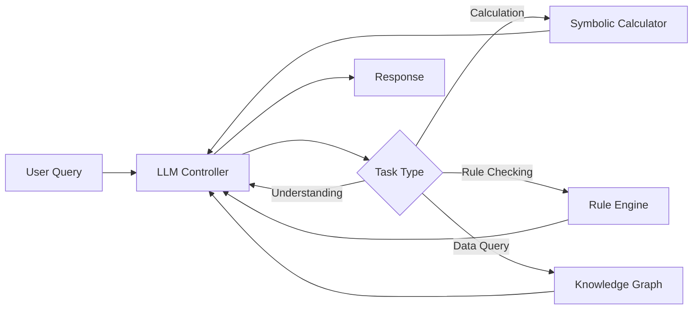

LLMs are remarkably flexible but notoriously unreliable for precise reasoning. They hallucinate, make arithmetic errors, and struggle with complex logic. Symbolic systems—rule engines, constraint solvers, knowledge graphs—are precise but rigid.

The solution? Combine them. Hybrid AI agents use LLMs for natural language understanding and high-level reasoning, while delegating precise tasks to symbolic systems. This is emerging as a key pattern in production AI systems.

## Why Hybrid?

Consider a tax preparation agent. An LLM can:
- Understand user questions in natural language
- Explain tax concepts clearly
- Guide users through forms

But it shouldn't:
- Calculate tax liability (arithmetic errors)
- Apply deduction rules (might miss edge cases)
- Determine filing status (complex boolean logic)

A hybrid approach uses the LLM as the "brain" and symbolic systems as precise "calculators."



## Building a Hybrid Agent

We'll create an agent that helps with loan eligibility decisions. The LLM handles conversation; a rule engine handles eligibility logic.

### Step 1: Define the Rules

First, encode eligibility rules in a structured format:

```python
# rules.py
from dataclasses import dataclass
from enum import Enum
from typing import Callable

class RuleResult(Enum):
    PASS = "pass"
    FAIL = "fail"
    NEEDS_INFO = "needs_info"

@dataclass
class Rule:
    name: str
    description: str
    check: Callable[[dict], RuleResult]
    failure_reason: str

# Loan eligibility rules
LOAN_RULES = [
    Rule(
        name="minimum_age",
        description="Applicant must be at least 18 years old",
        check=lambda data: RuleResult.PASS if data.get("age", 0) >= 18 else RuleResult.FAIL,
        failure_reason="Applicant must be 18 or older"
    ),
    Rule(
        name="minimum_income",
        description="Annual income must be at least $30,000",
        check=lambda data: RuleResult.PASS if data.get("annual_income", 0) >= 30000 else RuleResult.FAIL,
        failure_reason="Annual income below $30,000 minimum"
    ),
    Rule(
        name="debt_to_income",
        description="Debt-to-income ratio must be below 43%",
        check=lambda data: (
            RuleResult.PASS
            if data.get("annual_income", 0) > 0 and
               (data.get("monthly_debt", 0) * 12) / data.get("annual_income", 1) < 0.43
            else RuleResult.FAIL
        ),
        failure_reason="Debt-to-income ratio exceeds 43%"
    ),
    Rule(
        name="credit_score",
        description="Credit score must be at least 620",
        check=lambda data: RuleResult.PASS if data.get("credit_score", 0) >= 620 else RuleResult.FAIL,
        failure_reason="Credit score below 620 minimum"
    ),
    Rule(
        name="employment_status",
        description="Must be employed or have verified income source",
        check=lambda data: (
            RuleResult.PASS
            if data.get("employment_status") in ["employed", "self_employed", "retired"]
            else RuleResult.FAIL
        ),
        failure_reason="No verified employment or income source"
    )
]
```

### Step 2: Build the Rule Engine

```python
# rule_engine.py
from rules import LOAN_RULES, RuleResult

class LoanRuleEngine:
    def __init__(self):
        self.rules = LOAN_RULES

    def evaluate(self, applicant_data: dict) -> dict:
        """Evaluate all rules against applicant data."""
        results = {
            "eligible": True,
            "passed_rules": [],
            "failed_rules": [],
            "missing_data": []
        }

        for rule in self.rules:
            try:
                result = rule.check(applicant_data)

                if result == RuleResult.PASS:
                    results["passed_rules"].append(rule.name)
                elif result == RuleResult.FAIL:
                    results["eligible"] = False
                    results["failed_rules"].append({
                        "rule": rule.name,
                        "reason": rule.failure_reason
                    })
                else:  # NEEDS_INFO
                    results["missing_data"].append(rule.name)

            except KeyError as e:
                results["missing_data"].append(f"{rule.name}: missing {e}")

        return results

    def get_required_fields(self) -> list[str]:
        """Return list of data fields needed for evaluation."""
        return ["age", "annual_income", "monthly_debt", "credit_score", "employment_status"]

    def explain_rules(self) -> str:
        """Generate human-readable rule explanations."""
        explanations = []
        for rule in self.rules:
            explanations.append(f"- {rule.description}")
        return "\n".join(explanations)
```

### Step 3: Create Tool Functions

Expose the rule engine to the LLM as tools:

```python
# tools.py
from rule_engine import LoanRuleEngine

engine = LoanRuleEngine()

def check_loan_eligibility(
    age: int,
    annual_income: float,
    monthly_debt: float,
    credit_score: int,
    employment_status: str
) -> str:
    """Check if an applicant is eligible for a loan based on our criteria.

    Args:
        age: Applicant's age in years
        annual_income: Total annual income in dollars
        monthly_debt: Total monthly debt payments in dollars
        credit_score: Credit score (300-850)
        employment_status: One of 'employed', 'self_employed', 'retired', 'unemployed'
    """
    data = {
        "age": age,
        "annual_income": annual_income,
        "monthly_debt": monthly_debt,
        "credit_score": credit_score,
        "employment_status": employment_status
    }

    result = engine.evaluate(data)

    if result["eligible"]:
        return f"ELIGIBLE: Applicant passes all {len(result['passed_rules'])} eligibility criteria."
    else:
        failures = "\n".join([f"- {f['reason']}" for f in result["failed_rules"]])
        return f"NOT ELIGIBLE:\n{failures}"


def get_eligibility_requirements() -> str:
    """Get the list of loan eligibility requirements."""
    return f"Loan Eligibility Requirements:\n{engine.explain_rules()}"


def calculate_debt_to_income(annual_income: float, monthly_debt: float) -> str:
    """Calculate debt-to-income ratio.

    Args:
        annual_income: Total annual income in dollars
        monthly_debt: Total monthly debt payments in dollars
    """
    if annual_income <= 0:
        return "Error: Annual income must be greater than zero"

    dti = (monthly_debt * 12) / annual_income
    percentage = dti * 100

    status = "acceptable" if dti < 0.43 else "too high"
    return f"Debt-to-income ratio: {percentage:.1f}% ({status}). Maximum allowed: 43%"
```

### Step 4: Wire Up the Agent

```python
# agent.py
from openai import OpenAI
from tools import check_loan_eligibility, get_eligibility_requirements, calculate_debt_to_income
import json

client = OpenAI()

TOOLS = [
    {
        "type": "function",
        "function": {
            "name": "check_loan_eligibility",
            "description": "Check if an applicant is eligible for a loan based on our criteria",
            "parameters": {
                "type": "object",
                "properties": {
                    "age": {"type": "integer", "description": "Applicant's age in years"},
                    "annual_income": {"type": "number", "description": "Total annual income in dollars"},
                    "monthly_debt": {"type": "number", "description": "Total monthly debt payments in dollars"},
                    "credit_score": {"type": "integer", "description": "Credit score (300-850)"},
                    "employment_status": {"type": "string", "enum": ["employed", "self_employed", "retired", "unemployed"]}
                },
                "required": ["age", "annual_income", "monthly_debt", "credit_score", "employment_status"]
            }
        }
    },
    {
        "type": "function",
        "function": {
            "name": "get_eligibility_requirements",
            "description": "Get the list of loan eligibility requirements",
            "parameters": {"type": "object", "properties": {}}
        }
    },
    {
        "type": "function",
        "function": {
            "name": "calculate_debt_to_income",
            "description": "Calculate debt-to-income ratio",
            "parameters": {
                "type": "object",
                "properties": {
                    "annual_income": {"type": "number"},
                    "monthly_debt": {"type": "number"}
                },
                "required": ["annual_income", "monthly_debt"]
            }
        }
    }
]

SYSTEM_PROMPT = """You are a helpful loan eligibility assistant.

Your job is to:
1. Help users understand loan eligibility requirements
2. Collect their information (age, income, debt, credit score, employment)
3. Check their eligibility using the check_loan_eligibility tool
4. Explain the results clearly

Important:
- ALWAYS use the tools for eligibility checks and calculations
- NEVER calculate or guess eligibility yourself
- Ask for information one or two questions at a time
- Be encouraging but honest about results
"""

TOOL_FUNCTIONS = {
    "check_loan_eligibility": check_loan_eligibility,
    "get_eligibility_requirements": get_eligibility_requirements,
    "calculate_debt_to_income": calculate_debt_to_income
}


def run_agent(messages: list) -> str:
    """Run the agent and return response."""

    response = client.chat.completions.create(
        model="gpt-4o-mini",
        messages=[{"role": "system", "content": SYSTEM_PROMPT}] + messages,
        tools=TOOLS
    )

    message = response.choices[0].message

    # Handle tool calls
    if message.tool_calls:
        # Execute each tool
        tool_results = []
        for tool_call in message.tool_calls:
            func_name = tool_call.function.name
            func_args = json.loads(tool_call.function.arguments)

            result = TOOL_FUNCTIONS[func_name](**func_args)

            tool_results.append({
                "role": "tool",
                "tool_call_id": tool_call.id,
                "content": result
            })

        # Get final response with tool results
        messages.append({"role": "assistant", "content": message.content, "tool_calls": message.tool_calls})
        messages.extend(tool_results)

        final_response = client.chat.completions.create(
            model="gpt-4o-mini",
            messages=[{"role": "system", "content": SYSTEM_PROMPT}] + messages
        )

        return final_response.choices[0].message.content

    return message.content
```

### Example Conversation

```
User: Hi, I want to check if I can get a loan

Agent: I'd be happy to help you check your loan eligibility! Let me ask you
a few questions. First, could you tell me your age and employment status?

User: I'm 32 and I work full-time as an engineer

Agent: Great! Now I need some financial information. What's your annual
income, and approximately how much do you pay monthly towards debts
(like car loans, credit cards, student loans)?

User: I make about $95,000 a year. My monthly debts are around $1,800

Agent: Thanks! One last question - what's your credit score? If you don't
know the exact number, an estimate is fine.

User: It's around 720

Agent: Let me check your eligibility...

[Calls check_loan_eligibility tool with collected data]

Great news! Based on the information you provided, you ARE ELIGIBLE
for a loan. Here's the summary:

✓ Age: 32 (minimum 18)
✓ Annual income: $95,000 (minimum $30,000)
✓ Debt-to-income ratio: 22.7% (maximum 43%)
✓ Credit score: 720 (minimum 620)
✓ Employment status: employed ✓

Your debt-to-income ratio is healthy at 22.7%, well below the 43% maximum.
Would you like me to explain any of these criteria in more detail?
```

## Benefits of This Approach

### 1. Deterministic Decisions

The rule engine always applies the same rules the same way. No hallucination.

```python
# This will ALWAYS return the same result for the same input
result = engine.evaluate({"age": 25, "credit_score": 700, ...})
```

### 2. Auditability

You can trace exactly which rules passed or failed:

```python
{
    "eligible": False,
    "failed_rules": [
        {"rule": "credit_score", "reason": "Credit score below 620 minimum"}
    ],
    "passed_rules": ["minimum_age", "minimum_income", "debt_to_income", "employment_status"]
}
```

### 3. Easy Updates

Changing rules doesn't require retraining or prompt engineering:

```python
# Add a new rule
LOAN_RULES.append(Rule(
    name="bankruptcy_check",
    description="No bankruptcy in the last 7 years",
    check=lambda data: RuleResult.PASS if not data.get("recent_bankruptcy") else RuleResult.FAIL,
    failure_reason="Bankruptcy within last 7 years"
))
```

### 4. Explainability

The LLM can explain decisions using the structured rule output:

```python
def explain_decision(result: dict) -> str:
    """Generate human-friendly explanation."""
    if result["eligible"]:
        return "You qualify because you meet all our criteria..."
    else:
        reasons = [f["reason"] for f in result["failed_rules"]]
        return f"Unfortunately, you don't qualify because: {', '.join(reasons)}"
```

## Other Symbolic Components

### Knowledge Graphs

For factual queries, use a knowledge graph instead of relying on LLM memory:

```python
from neo4j import GraphDatabase

def query_product_compatibility(product_a: str, product_b: str) -> str:
    """Check if two products are compatible using the knowledge graph."""
    driver = GraphDatabase.driver(uri, auth=(user, password))

    with driver.session() as session:
        result = session.run("""
            MATCH (a:Product {name: $product_a})-[r:COMPATIBLE_WITH]->(b:Product {name: $product_b})
            RETURN r.notes as notes
        """, product_a=product_a, product_b=product_b)

        record = result.single()
        if record:
            return f"Yes, {product_a} is compatible with {product_b}. {record['notes']}"
        else:
            return f"No verified compatibility between {product_a} and {product_b}."
```

### Constraint Solvers

For optimization problems:

```python
from ortools.linear_solver import pywraplp

def optimize_schedule(tasks: list[dict], constraints: dict) -> str:
    """Find optimal task schedule using constraint programming."""
    solver = pywraplp.Solver.CreateSolver('SCIP')

    # Define variables and constraints...
    # Solve...

    return formatted_schedule
```

### Calculators

Never let the LLM do math:

```python
def calculate_compound_interest(
    principal: float,
    rate: float,
    years: int,
    compounds_per_year: int = 12
) -> str:
    """Calculate compound interest with precision."""
    amount = principal * (1 + rate / compounds_per_year) ** (compounds_per_year * years)
    interest = amount - principal

    return f"After {years} years: ${amount:,.2f} (${interest:,.2f} interest earned)"
```

## Design Patterns

### Pattern 1: LLM as Router

The LLM decides which symbolic system to call:

```python
# LLM sees: "What's 15% of 847?"
# LLM decides: Call calculator tool
# Calculator returns: "127.05"
# LLM responds: "15% of 847 is 127.05"
```

### Pattern 2: Symbolic Pre-processing

Run rules before the LLM sees the query:

```python
def pre_check(user_data):
    """Pre-check eligibility before expensive LLM call."""
    quick_result = engine.quick_check(user_data)
    if quick_result == "definitely_ineligible":
        return "Based on the information provided, you don't meet our minimum requirements."
    else:
        return None  # Proceed to LLM
```

### Pattern 3: Symbolic Post-validation

Validate LLM outputs with rules:

```python
def validate_response(llm_output: str, context: dict) -> str:
    """Ensure LLM didn't hallucinate numbers."""
    extracted_numbers = extract_numbers(llm_output)

    for num in extracted_numbers:
        if not validator.is_valid(num, context):
            return regenerate_with_correction(llm_output, num)

    return llm_output
```
---

## Try It Yourself

Copy this prompt into your AI coding agent to build this project:

```
Build a hybrid AI agent for loan eligibility using LLM + symbolic reasoning:
1. A rule engine with eligibility rules (age, income, debt-to-income, credit)
2. Tool functions that expose the rule engine to the LLM
3. An OpenAI agent that collects user info conversationally
4. The agent must ALWAYS use tools for decisions, never guess

Define rules using dataclasses with name, description, check function, and
failure reason. The rule engine should return structured results showing
which rules passed/failed. Test with a sample conversation collecting
applicant data and checking eligibility.
```
