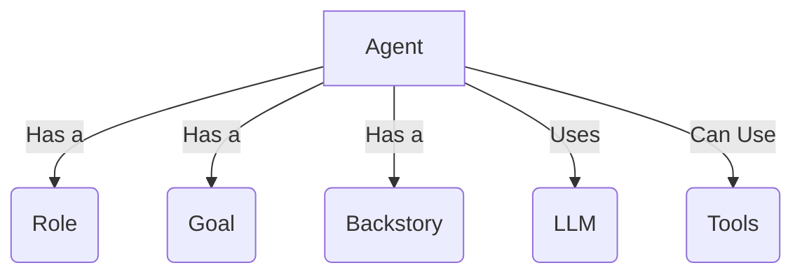
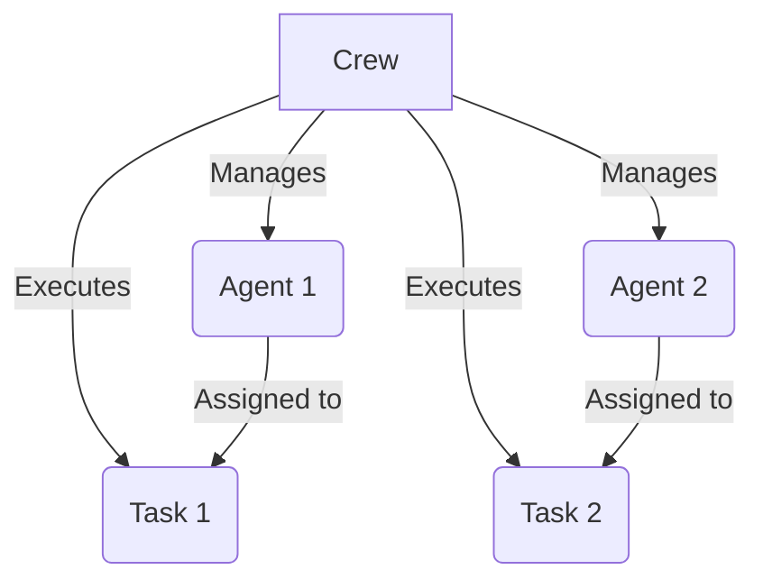
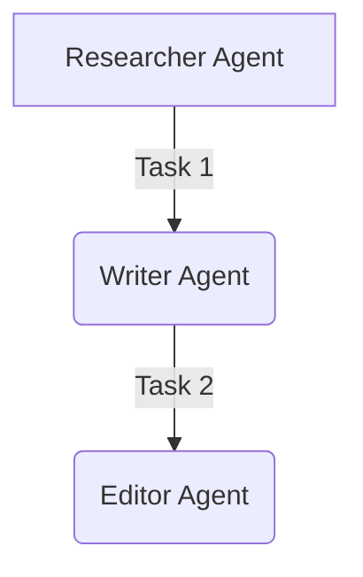
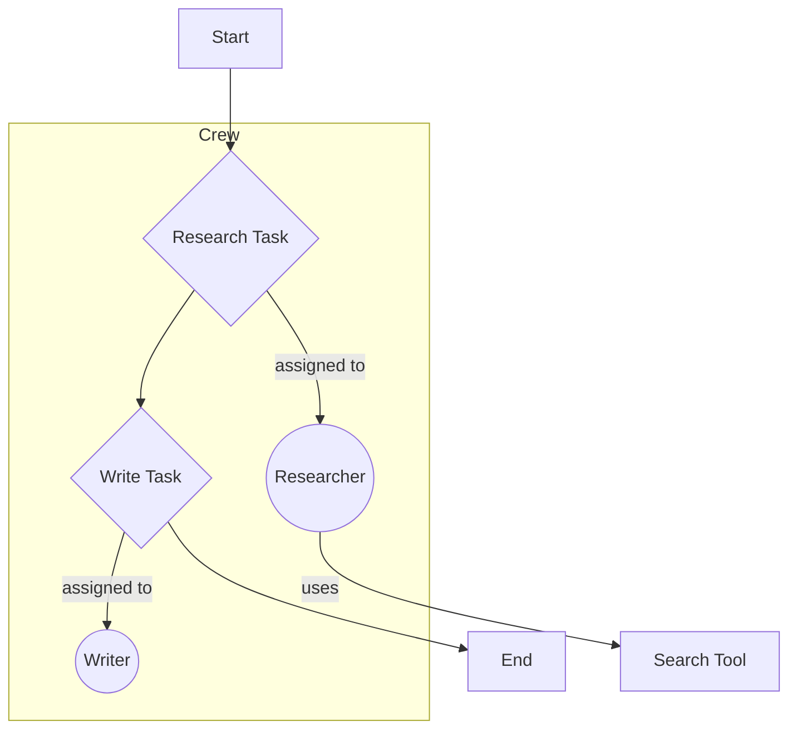

CrewAI is a cutting-edge framework for orchestrating autonomous AI agents. It allows you to build sophisticated multi-agent systems that can collaborate to solve complex problems. This guide breaks down CrewAI into 10 fundamental concepts, taking you from first principles to building a complete, end-to-end agentic workflow.

### **Concept 1: The Agent**

**Fundamental Idea:** An Agent is an autonomous entity designed to perform specific roles, achieve goals, and execute tasks. Think of it as a specialized member of your AI team. Each agent has a unique role, a goal that defines its purpose, and a backstory that provides context and personality. This allows agents to behave in a more specialized and predictable way.

**Real-Life Analogy:** A delivery robot receives a request, calculates the best route, and navigates to the destination. It has a purpose (delivery), tools (GPS, wheels), and acts independently. In CrewAI, an agent is a program with a role, a goal, and tools, powered by an LLM to think and act.



**Code Example:**

```python
from crewai import Agent

# Define an agent
researcher = Agent(
    role="AI Researcher",
    goal="Gather the latest AI trends from 2024",
    backstory="You are an expert AI researcher who writes reports on emerging AI trends.",
    verbose=True  # Shows the agent's thought process
)
```

### **Concept 2: The Task**

**Fundamental Idea:** A Task is a specific, actionable instruction given to an agent. It defines the work to be done, the expected outcome, and the agent responsible for completing it. Tasks are the building blocks of a crew's workflow.

**Real-Life Analogy:** You assign your marketing agent to “write a blog post” or your finance agent to “summarize last month’s revenue.” Each instruction is a task with a clear objective and a responsible agent.

**Code Example:**

```python
from crewai import Task

# Assume 'researcher' agent is already defined
research_task = Task(
    description="Identify the top 3 AI trends in 2024 using online sources.",
    expected_output="A list of the top 3 trends with a short summary of each.",
    agent=researcher,
    verbose=True
)
```

### **Concept 3: The Crew**

**Fundamental Idea:** A Crew is a team of agents working together to execute a set of tasks. The crew defines the overall process, whether it's sequential, parallel, or a more complex hierarchical structure. It's the engine that drives the collaboration between your agents.

**Real-Life Analogy:** A film crew consists of a director, cameraman, and editor. Each agent performs their task, and together they produce a movie. The crew orchestrates who does what and when.



**Code Example:**

```python
from crewai import Crew

# Assume 'researcher' and 'research_task' are defined
ai_crew = Crew(
    agents=[researcher],
    tasks=[research_task],
    verbose=True
)

# Start the crew's work
result = ai_crew.kickoff()
print(result)
```

### **Concept 4: Multi-Agent Workflows**

**Fundamental Idea:** You can connect tasks to create dependencies, allowing agents to pass information and collaborate in a sequence. This is the foundation of building complex, multi-step processes. The `context` parameter in a task is used to specify which other tasks must be completed before this one can begin.

**Real-Life Analogy:** A researcher gathers facts, a writer uses those facts to draft an article, and an editor reviews the draft. Each agent acts only after the previous one has completed their task.



**Code Example:**

```python
from crewai import Agent, Task, Crew

# Define Agents
researcher = Agent(
    role="AI Researcher",
    goal="Find recent breakthroughs in AI.",
    backstory="An expert in AI keeping up with the latest research.",
    verbose=True
)

writer = Agent(
    role="Technical Writer",
    goal="Write a short blog post from research data.",
    backstory="A skilled writer who can turn complex info into engaging posts.",
    verbose=True
)

# Define Tasks with context
research_task = Task(
    description="Find the 3 most important AI research breakthroughs of 2024.",
    expected_output="A list of 3 breakthroughs with a 1-2 line explanation each.",
    agent=researcher
)

write_task = Task(
    description="Write a short blog post based on the AI research findings.",
    expected_output="A 300-word blog post summarizing the breakthroughs.",
    agent=writer,
    context=[research_task]  # The writer uses the output of the research_task
)

# Define and run the Crew
ai_blog_crew = Crew(
    agents=[researcher, writer],
    tasks=[research_task, write_task],
    verbose=True
)

result = ai_blog_crew.kickoff()
print(result)
```

### **Concept 5: Tools**

**Fundamental Idea:** Tools are external functions an agent can use to interact with the world, like browsing the web, searching a PDF, or querying a database. Tools are what give your agents their superpowers, allowing them to go beyond the knowledge of their LLM and access real-time information.

**Code Example:**

```python
from crewai import Agent, Task, Crew
from crewai_tools import tool

# Define a custom tool
@tool("search_google")
def google_search(query: str) -> str:
    """Searches Google and returns a simulated answer."""
    # In a real scenario, this would integrate with an actual search API
    return f"Simulated search result for: {query}"

# Add the tool to an agent
researcher = Agent(
    role="AI Researcher",
    goal="Find the latest trends in generative AI.",
    backstory="You use external tools to get real-time information.",
    tools=[google_search],
    verbose=True
)

# The rest of the setup (Task, Crew) remains similar
```

### **Concept 6: Memory**

**Fundamental Idea:** Memory allows an agent to store and reuse information from past tasks, giving them continuity. This is crucial for building agents that can learn from their experiences and make better decisions over time. In CrewAI, memory can be short-term (for the duration of a single crew execution) or long-term (persisting across multiple executions).

In CrewAI, memory flows implicitly between agents in a sequence. When a task depends on another (via the `context` parameter), the output of the first task is automatically available in the memory of the agent performing the second task.

### **Concept 7: Custom LLMs**

**Fundamental Idea:** You can assign different LLMs (local models via Ollama, or APIs like Claude, Groq, etc.) to different agents. This allows you to choose the best model for each agent's specific role and tasks. For example, you might use a powerful model like GPT-4 for a reasoning-intensive task, and a faster, cheaper model for a simple summarization task.

**Code Example:**

```python
from crewai import Agent
from langchain_community.llms import Ollama

# Use a local model running on Ollama
local_llm = Ollama(model="mistral")

researcher = Agent(
    role="Local AI Researcher",
    goal="Find local AI trends.",
    backstory="A privacy-conscious analyst using local models.",
    llm=local_llm,
    verbose=True
)
```

### **Concept 8: Collaboration Patterns**

**Fundamental Idea:** Agents can collaborate in various patterns: sequentially, in parallel, or in debates. The collaboration pattern you choose will depend on the specific problem you are trying to solve. For example, a sequential process is ideal for a linear workflow, while a parallel process can be used to speed up tasks that can be performed independently.

| Pattern | Description | How to Implement |
| :--- | :--- | :--- |
| **Sequential** | Agent B waits for Agent A. | Use `context=[task_a]` in Task B. |
| **Parallel** | Agents work independently. | Define tasks with no `context`. |
| **Refinement** | Agent B improves Agent A’s output. | A sequential workflow where B’s task is to refine A’s output. |

### **Concept 9: Integrating Built-in Tools**

**Fundamental Idea:** `crewai_tools` provides pre-built tools for common tasks like reading PDFs, scraping websites, and searching the web. These tools are easy to use and can save you a lot of time and effort. They are designed to be plug-and-play, so you can easily add them to your agents and start using them right away.

**Code Example (PDF Tool):**

```python
# pip install crewai_tools
from crewai import Agent, Task, Crew
from crewai_tools import PDFSearchTool

# Initialize the tool for a specific PDF
pdf_tool = PDFSearchTool(pdf_path='path/to/your/report.pdf')

# Create an agent with the tool
analyst = Agent(
    role="Financial Analyst",
    goal="Extract revenue trends from the report.",
    backstory="An expert at analyzing financial documents.",
    tools=[pdf_tool],
    verbose=True
)

# Create a task that prompts the agent to use the tool
task = Task(
    description="Read the attached PDF and summarize the revenue trends.",
    expected_output="A short summary of revenue numbers and patterns.",
    agent=analyst
)

# ... create and kickoff the crew
```

### **Concept 10: Building an End-to-End Workflow**

Let's combine everything to create a multi-agent system that researches AI news, summarizes it, and drafts a LinkedIn post. This example demonstrates how you can chain together multiple agents and tasks to create a complete, automated workflow.



**Code Example:**

```python
from crewai import Agent, Task, Crew
from crewai_tools import SerpAPITool

# Define Tools
search_tool = SerpAPITool() # Requires a SERPAPI_API_KEY environment variable

# Define Agents
researcher = Agent(
    role="AI News Researcher",
    goal="Find 5 important AI news stories from the last 7 days",
    backstory="You are an AI news expert, skilled in finding trending topics.",
    tools=[search_tool],
    verbose=True
)

writer = Agent(
    role="Content Creator",
    goal="Write an engaging LinkedIn post from an AI news summary",
    backstory="You are an expert in writing viral LinkedIn content for engineers.",
    verbose=True
)

# Define Tasks
research_task = Task(
    description="Search for the 5 most interesting AI news stories from the last 7 days.",
    expected_output="A list of 5 headlines and a 1-line description for each.",
    agent=researcher
)

write_post_task = Task(
    description="Using the news items, write a LinkedIn-style post aimed at engineering leaders.",
    expected_output="A 200-word professional and engaging post.",
    agent=writer,
    context=[research_task]
)

# Create and run the Crew
crew = Crew(
    agents=[researcher, writer],
    tasks=[research_task, write_post_task],
    verbose=True
)

result = crew.kickoff()
print("\nFinal LinkedIn Post:\n")
print(result)
```

By mastering these 10 concepts, you have the foundation to build powerful and customized agentic workflows with CrewAI. Happy building!
