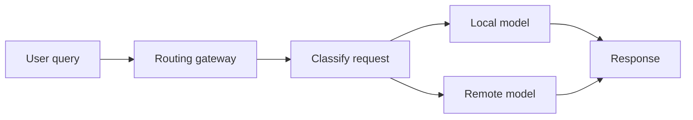
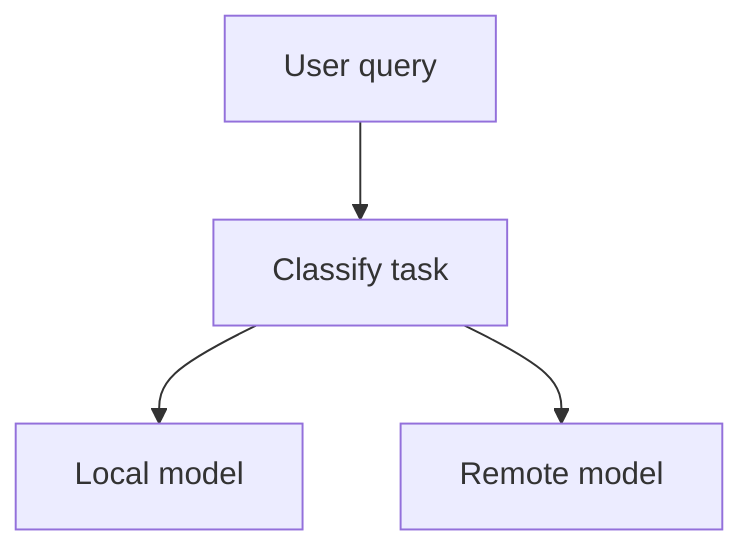
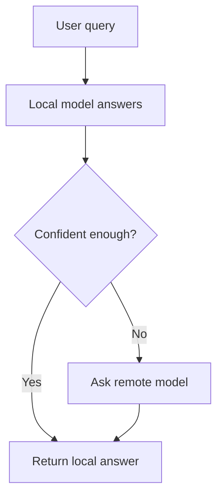
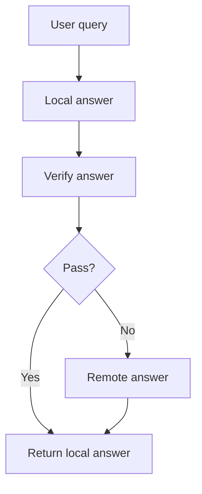
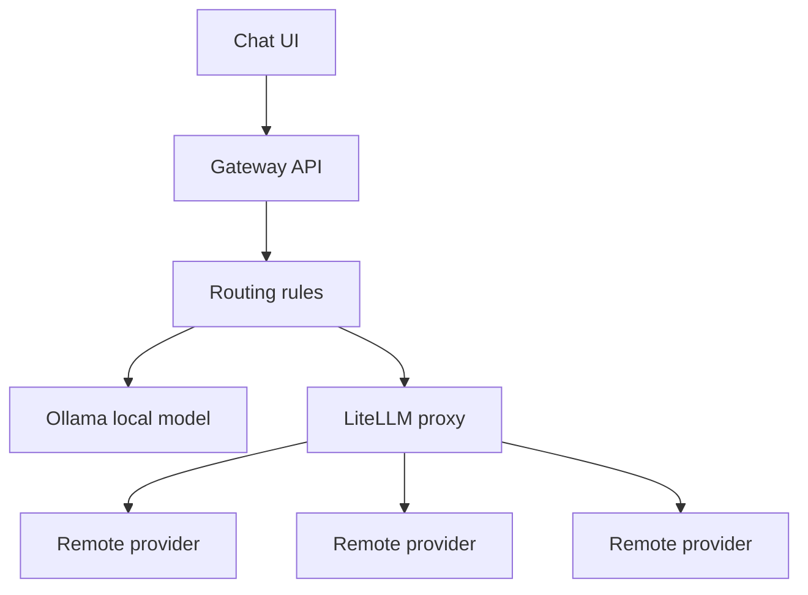

Every LLM call costs something.

Sometimes the cost is money. Sometimes it is latency. Sometimes it is privacy.

If you send every request to a frontier model, you burn budget on tasks a small local model could have handled. If you run everything locally, the easy cases feel great until a harder reasoning task shows up and the answer falls apart.

The better pattern is a **local-first routing gateway**.

Put a thin layer between your chat UI and your models. The gateway looks at each request, sends simple work to a local model, and escalates harder work to a remote model. The user still sees one assistant. The system decides which model should answer.



This is not only about saving money. It is also a way to control where sensitive data goes, keep common interactions fast, and reserve expensive models for the work that actually needs them.

## The core idea

A routing gateway has one job: pick the cheapest model that is likely to answer well.

That sounds simple, but it changes how you think about LLM applications. Instead of choosing one model for the whole app, you create model tiers:

| Tier | Typical model | Good for |
|---|---|---|
| Local small | 3B to 8B model through Ollama or llama.cpp | Classification, rewriting, short answers, simple extraction |
| Local capable | Larger open model on your own hardware | Summaries, internal Q&A, common support flows |
| Remote fast | Hosted small or mid-tier model | General fallback, low-latency cloud path |
| Remote strong | Frontier model | Complex reasoning, code generation, high-risk answers |

Most applications do not need the strongest model for every request. A user asking "make this sentence shorter" should not take the same path as a user asking the assistant to compare two system designs, inspect logs, and propose a migration plan.

The gateway lets you make that distinction explicitly.

## Three routing strategies

There are three common ways to decide where a request should go.

### 1. Classifier-first routing

The gateway classifies the request before generating an answer. The classifier can be a small model, a rules engine, or a local LLM prompted to return a label like `easy`, `medium`, or `hard`.



This is the cleanest approach when you have a known product surface. For example:

- Sentiment classification goes local
- Short text cleanup goes local
- Customer-specific policy questions go remote
- Code generation goes remote

The main risk is misclassification. If a hard request gets labeled as easy, the local model may produce a confident but weak answer. You need logging and review loops to catch those cases.

### 2. Confidence cascading

The local model answers first. If the answer looks weak, the gateway discards it and escalates to a remote model.



This is easy to implement because you do not need a separate classifier on day one. The gateway can inspect the local response for signals such as:

- Very short answers
- Hedging language
- Refusal patterns
- Missing required fields
- Failed JSON parsing
- Low confidence scores, if your inference stack exposes them

The tradeoff is latency. A hard request pays for the local attempt and then waits for the remote answer.

### 3. Two-pass verification

The local model answers, then a verifier checks the result. If the verifier rejects the answer, the gateway escalates to a remote model.



This works well for structured workflows. If the answer must include valid JSON, cite a known document, follow a policy, or pass a schema check, verification gives you a stronger signal than a vague confidence score.

It is also the most expensive path. A hard request may involve three model calls: local answer, verification, and remote fallback.

## What makes a request easy?

This is the part teams usually underestimate.

"Easy" does not mean short. "Hard" does not always mean long. The right label depends on the task, the model, the data, and the cost of being wrong.

Useful routing signals include:

| Signal | How it helps | Watch out for |
|---|---|---|
| Task type | Known safe tasks can go local | Rules drift as product features change |
| Required tools | Tool-heavy tasks often need stronger reasoning | Some tool calls are simple lookups |
| Input length | Tiny requests are often cheap to classify locally | Long input can still be a simple summary |
| Output format | Schema checks make local answers easier to verify | Valid JSON can still contain bad reasoning |
| Domain risk | Sensitive, legal, financial, or customer-impacting answers may need escalation | Blanket escalation can erase savings |
| Local answer quality | Real response gives a useful signal | Failed local attempts add latency |

The most practical starting point is task-type routing plus a fallback. Route obvious low-risk work to local models, route obvious high-risk work to remote models, and use confidence cascading in the middle.

## A simple architecture

You can build the gateway with three pieces:

| Component | Tool |
|---|---|
| Local model server | Ollama, llama.cpp, or vLLM |
| Unified API layer | LiteLLM proxy or a custom FastAPI service |
| Routing logic | Rules, classifier prompt, confidence checks, or a learned router |

The gateway should expose one API to your chat application. Internally, it can call many models.



The application should not know which model answered. It should only care about the response, metadata, latency, and whether the request was escalated.

## Option A: LiteLLM as the model proxy

LiteLLM gives you one OpenAI-compatible endpoint in front of multiple providers. You can register local and remote models in one config file, then choose the model name from your app.

```yaml
model_list:
  - model_name: fast-local
    litellm_params:
      model: ollama/llama3.2:3b
      api_base: http://localhost:11434
      timeout: 30

  - model_name: smart-cloud
    litellm_params:
      model: openai/gpt-4o-mini
      api_key: os.environ/OPENAI_API_KEY

  - model_name: strong-cloud
    litellm_params:
      model: anthropic/claude-sonnet-4
      api_key: os.environ/ANTHROPIC_API_KEY

router_settings:
  routing_strategy: usage-based-routing-v2
  allowed_fails: 3
  cooldown_time: 60
```

Start the proxy:

```bash
litellm --config config.yaml --port 4000
```

Your app can now call `fast-local`, `smart-cloud`, or `strong-cloud` through the same API shape.

LiteLLM does not remove the need for routing policy. It gives you a clean way to call different models. Your gateway still needs to decide which model to use for each request.

## Option B: A small FastAPI gateway

For more control, build a thin FastAPI service. This version uses confidence cascading. It tries the local model first, checks the answer, and escalates when the local response looks weak.

```python
import re

from fastapi import FastAPI
from litellm import completion

app = FastAPI()

LOCAL_MODEL = "ollama/llama3.2:3b"
REMOTE_MODEL = "gpt-4o-mini"

HEDGE_PATTERNS = [
    r"i'?m not sure",
    r"i don'?t know",
    r"it depends",
    r"based on my training",
    r"i cannot",
    r"i'?m (just )?an ai",
]


def is_low_confidence(text: str) -> bool:
    normalized = text.lower()
    return any(re.search(pattern, normalized) for pattern in HEDGE_PATTERNS)


def is_too_short(text: str) -> bool:
    return len(text.strip()) < 40


@app.post("/chat")
async def chat(query: dict):
    user_message = query["message"]

    local_response = completion(
        model=LOCAL_MODEL,
        messages=[{"role": "user", "content": user_message}],
        api_base="http://localhost:11434",
    )
    local_text = local_response.choices[0].message.content

    if not is_low_confidence(local_text) and not is_too_short(local_text):
        return {
            "response": local_text,
            "model": "local",
            "escalated": False,
        }

    remote_response = completion(
        model=REMOTE_MODEL,
        messages=[{"role": "user", "content": user_message}],
    )

    return {
        "response": remote_response.choices[0].message.content,
        "model": "remote",
        "escalated": True,
    }
```

This is intentionally plain. It is not a production router yet, but it gives you the control point you need. Once every request flows through the gateway, you can improve routing without changing the chat UI.

## Production details that matter

**Log every routing decision.** Store the user request type, selected model, latency, token count, estimated cost, escalation reason, and whether the final answer was accepted. Without this data, routing becomes guesswork.

**Add manual review for escalations.** Escalated requests are the best training data for your router. Review a sample each week and ask one question: could the local model have handled this?

**Set latency budgets.** Local does not always mean faster. If your local model takes two seconds and your cloud model takes one second, local routing may be a bad default for interactive chat.

**Fail in both directions.** Cloud APIs go down. Local GPUs saturate. The gateway should know how to route around both failures.

**Treat privacy as policy, not vibes.** Decide which request categories are allowed to leave your environment. Then enforce that rule in code.

**Measure quality, not just cost.** A router that saves 80 percent of spend but quietly lowers answer quality is not a win. Track acceptance rate, retries, thumbs down, support escalations, and task completion.

## What can you save?

The answer depends on your workload.

If most requests are open-ended reasoning tasks, local-first routing will help less. If your product has many repeated, low-risk tasks like rewriting, classification, extraction, short summaries, and internal Q&A, the savings can be large.

A 2026 paper on [RouteNLP](https://arxiv.org/abs/2604.23577) reports a 58 percent cost reduction in an eight-week enterprise pilot while retaining high answer acceptance. That number is not a universal guarantee, but it shows the shape of the opportunity: routing works when the router is trained on real traffic and corrected over time.

For a new app, I would not start with a learned router. I would start with something simpler:

1. Install Ollama and pull a small model.
2. Put LiteLLM or a FastAPI gateway in front of local and remote models.
3. Route obvious low-risk tasks locally.
4. Escalate uncertain answers to a remote model.
5. Log every decision.
6. Review mistakes weekly.

The first version does not need to be clever. It only needs to create the control point.

Once the gateway exists, you can make routing smarter. Add task labels. Add schema checks. Add verification. Train a classifier from real traffic. Move more work local only when the data says it is safe.

That is the real value of local-first routing. It gives you a system that can improve instead of a single model choice you have to live with.
