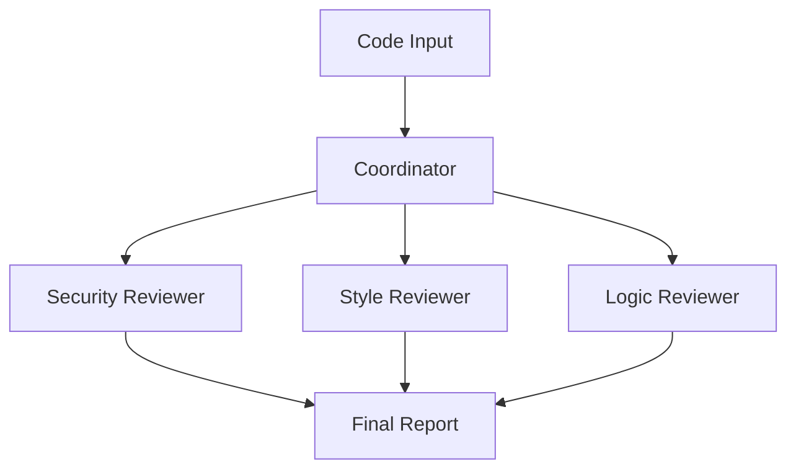

Code review is a perfect use case for multi-agent systems. Different aspects of code quality—security, style, logic, performance—require different expertise. Instead of one generalist reviewer, we can create a team of specialists.

In this article, we'll build a code review system using Microsoft's AutoGen framework. Our team will have three specialized reviewers plus a coordinator that synthesizes their findings.

## The Architecture



Each reviewer focuses on their domain:
- **Security Reviewer:** Checks for vulnerabilities, injection risks, authentication issues
- **Style Reviewer:** Evaluates code formatting, naming conventions, documentation
- **Logic Reviewer:** Analyzes algorithm correctness, edge cases, error handling

## Setting Up AutoGen

Install the required packages:

```bash
pip install -U "autogen-agentchat" "autogen-ext[openai]"
```

## Defining the Agents

AutoGen uses an agent-centric model where each agent has a name, system message, and model configuration.

```python
from autogen_agentchat.agents import AssistantAgent
from autogen_agentchat.teams import RoundRobinGroupChat
from autogen_agentchat.conditions import TextMentionTermination, MaxMessageTermination
from autogen_ext.models.openai import OpenAIChatCompletionClient

# Initialize the model client (uses OPENAI_API_KEY env var by default)
model_client = OpenAIChatCompletionClient(model="gpt-4o-mini")

# Security Reviewer
security_reviewer = AssistantAgent(
    name="SecurityReviewer",
    model_client=model_client,
    system_message="""You are a security-focused code reviewer.
    Analyze code for:
    - SQL injection vulnerabilities
    - XSS risks
    - Authentication/authorization issues
    - Sensitive data exposure
    - Input validation problems

    Format your findings as:
    SECURITY ISSUES:
    - [SEVERITY: HIGH/MEDIUM/LOW] Description

    If no issues found, state: "No security issues identified."
    End your review with "SECURITY REVIEW COMPLETE."
    """
)

# Style Reviewer
style_reviewer = AssistantAgent(
    name="StyleReviewer",
    model_client=model_client,
    system_message="""You are a code style reviewer.
    Analyze code for:
    - Naming conventions (variables, functions, classes)
    - Code formatting and indentation
    - Documentation and comments
    - Function/method length
    - Code organization

    Format your findings as:
    STYLE ISSUES:
    - [PRIORITY: HIGH/MEDIUM/LOW] Description

    If code follows best practices, state: "Code style is acceptable."
    End your review with "STYLE REVIEW COMPLETE."
    """
)

# Logic Reviewer
logic_reviewer = AssistantAgent(
    name="LogicReviewer",
    model_client=model_client,
    system_message="""You are a logic and correctness reviewer.
    Analyze code for:
    - Algorithm correctness
    - Edge case handling
    - Error handling
    - Potential null/undefined issues
    - Race conditions or concurrency issues

    Format your findings as:
    LOGIC ISSUES:
    - [SEVERITY: HIGH/MEDIUM/LOW] Description

    If logic is sound, state: "No logic issues identified."
    End your review with "LOGIC REVIEW COMPLETE."
    """
)

# Coordinator
coordinator = AssistantAgent(
    name="Coordinator",
    model_client=model_client,
    system_message="""You are the code review coordinator.
    Your job is to:
    1. Present the code to the review team
    2. After all reviews are complete, synthesize a final report

    When you see all three "REVIEW COMPLETE" messages, create a summary:

    FINAL CODE REVIEW REPORT
    ========================
    Security: [Summary]
    Style: [Summary]
    Logic: [Summary]

    Overall Assessment: [APPROVE/NEEDS CHANGES/REJECT]
    Priority Fixes: [List top 3 issues if any]

    End with "TERMINATE" to conclude the review.
    """
)
```

## Creating the Review Team

AutoGen provides team patterns for multi-agent collaboration. We'll use `RoundRobinGroupChat` which gives each agent a turn to speak.

```python
# Define termination conditions
text_termination = TextMentionTermination("TERMINATE")
max_termination = MaxMessageTermination(max_messages=15)

# Combine conditions: stop on TERMINATE or after 15 messages
termination = text_termination | max_termination

# Create the team (agents passed as first positional argument)
review_team = RoundRobinGroupChat(
    [coordinator, security_reviewer, style_reviewer, logic_reviewer],
    termination_condition=termination
)
```

## Running a Code Review

```python
import asyncio
from autogen_agentchat.ui import Console

async def review_code(code: str):
    """Run a code review on the provided code."""
    task = f"""Please review the following code:

```python
{code}
```

Each reviewer should analyze the code from their perspective.
Coordinator, please synthesize the final report after all reviews.
"""

    # Run the review with console output
    await Console(review_team.run_stream(task=task))

    # Clean up
    await model_client.close()


# Example usage
code_to_review = '''
def get_user(user_id):
    query = f"SELECT * FROM users WHERE id = {user_id}"
    result = db.execute(query)
    return result[0] if result else None

def process_data(data):
    for i in range(len(data)):
        if data[i] > 100:
            data[i] = 100
    return data
'''

asyncio.run(review_code(code_to_review))
```

## Expected Output

The agents will take turns reviewing the code:

```
SecurityReviewer:
SECURITY ISSUES:
- [SEVERITY: HIGH] SQL injection vulnerability in get_user().
  The user_id is directly interpolated into the query string.
  Use parameterized queries instead.

SECURITY REVIEW COMPLETE.

StyleReviewer:
STYLE ISSUES:
- [PRIORITY: MEDIUM] Missing docstrings for both functions
- [PRIORITY: LOW] Consider using enumerate() instead of range(len())

STYLE REVIEW COMPLETE.

LogicReviewer:
LOGIC ISSUES:
- [SEVERITY: MEDIUM] get_user() may raise IndexError if result is empty list
- [SEVERITY: LOW] process_data() modifies input in place, may cause side effects

LOGIC REVIEW COMPLETE.

Coordinator:
FINAL CODE REVIEW REPORT
========================
Security: Critical SQL injection vulnerability found
Style: Missing documentation, minor style improvements needed
Logic: Potential runtime errors and side effects

Overall Assessment: NEEDS CHANGES
Priority Fixes:
1. Fix SQL injection using parameterized queries
2. Add null check before accessing result[0]
3. Add function docstrings

TERMINATE
```

## Customizing Agent Behavior

### Adding Tools

Agents can use tools to enhance their capabilities. Tools are Python functions (sync or async) with type hints and docstrings:

```python
import subprocess
import tempfile

async def run_bandit(code: str) -> str:
    """Run bandit security scanner on the provided Python code.

    Args:
        code: Python source code to analyze

    Returns:
        JSON output from bandit security scanner
    """
    with tempfile.NamedTemporaryFile(mode='w', suffix='.py', delete=False) as f:
        f.write(code)
        f.flush()

        result = subprocess.run(
            ['bandit', '-f', 'json', f.name],
            capture_output=True,
            text=True
        )

        return result.stdout or "No security issues found by bandit."

# Pass tools as a list to the agent
security_reviewer = AssistantAgent(
    name="SecurityReviewer",
    model_client=model_client,
    tools=[run_bandit],
    system_message="""You are a security-focused code reviewer.
    Use the run_bandit tool to scan code for vulnerabilities.
    Combine tool results with your own analysis."""
)
```

### Different Team Patterns

AutoGen supports multiple collaboration patterns:

```python
from autogen_agentchat.teams import SelectorGroupChat

# Selector pattern: an LLM chooses who speaks next based on conversation
selector_team = SelectorGroupChat(
    [coordinator, security_reviewer, style_reviewer, logic_reviewer],
    model_client=model_client,
    termination_condition=termination
)
```

## Handling Large Code Files

For large files, chunk the code and review incrementally:

```python
def chunk_code(code: str, max_lines: int = 50) -> list[str]:
    """Split code into reviewable chunks."""
    lines = code.split('\n')
    chunks = []

    for i in range(0, len(lines), max_lines):
        chunk = '\n'.join(lines[i:i + max_lines])
        chunks.append(chunk)

    return chunks

async def review_large_file(code: str):
    """Review a large file in chunks."""
    chunks = chunk_code(code)
    all_issues = []

    for i, chunk in enumerate(chunks):
        print(f"Reviewing chunk {i + 1}/{len(chunks)}...")
        result = await review_team.run(
            task=f"Review this code chunk:\n```python\n{chunk}\n```"
        )
        all_issues.append(result)

    return all_issues
```

## Integration with CI/CD

Wrap the review system in an API for CI/CD integration:

```python
from fastapi import FastAPI
from pydantic import BaseModel

app = FastAPI()

class ReviewRequest(BaseModel):
    code: str
    filename: str

@app.post("/review")
async def api_review(request: ReviewRequest):
    result = await review_team.run(
        task=f"Review {request.filename}:\n```\n{request.code}\n```"
    )

    # Parse the result to extract structured issues
    return {
        "filename": request.filename,
        "issues": parse_review_output(result.messages),
        "status": "completed"
    }
```

## Limitations and Considerations

*   **Cost:** Multiple agents means multiple LLM calls per review. Batch reviews when possible.
*   **Speed:** Sequential reviews add latency. Consider parallel execution for independent reviewers.
*   **Consistency:** Agent responses can vary. Use structured output formats for reliable parsing.
*   **False positives:** AI reviewers may flag non-issues. Human oversight is still valuable.

## What's Next

This basic system can be extended with:
*   **Language-specific reviewers:** Specialized agents for Python, JavaScript, Go, etc.
*   **Integration with GitHub:** Automatically review pull requests
*   **Learning from feedback:** Track which suggestions are accepted/rejected
*   **Custom rule enforcement:** Company-specific style guides and security policies

Multi-agent code review demonstrates how specialized agents can collaborate on complex tasks. The key insight is that different perspectives—security, style, logic—are best handled by focused experts rather than a single generalist.

---

## Try It Yourself

Copy this prompt into your AI coding agent to build this project:

```
Build a multi-agent code review system using AutoGen. Create:
1. A SecurityReviewer agent that checks for vulnerabilities (SQL injection, XSS)
2. A StyleReviewer agent that evaluates naming, formatting, documentation
3. A LogicReviewer agent that analyzes correctness and edge cases
4. A Coordinator agent that synthesizes findings into a final report

Use autogen-agentchat with AssistantAgent and RoundRobinGroupChat. Each reviewer
should format findings with severity levels. The coordinator should produce an
overall assessment (APPROVE/NEEDS CHANGES/REJECT). Include termination conditions.
```
