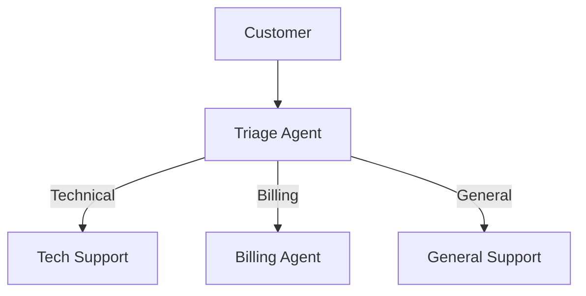

OpenAI's Swarm is an experimental framework for building multi-agent systems. Unlike heavier frameworks, Swarm is intentionally minimal—it adds just two concepts on top of the Chat Completions API: **handoffs** and **routines**. This makes it easy to understand and extend.

In this article, we'll build a customer service system where specialized agents hand off conversations to each other based on customer needs.

## What is Swarm?

Swarm is OpenAI's take on multi-agent orchestration. Key principles:

- **Lightweight:** ~500 lines of code, minimal abstraction
- **Stateless:** Each call is independent, you manage state
- **Handoffs:** Agents can transfer conversations to other agents
- **Routines:** Agents follow defined procedures

Swarm is explicitly experimental and not intended for production. It's meant for learning and prototyping.

## Installation

```bash
pip install git+https://github.com/openai/swarm.git
```

## Core Concepts

### Agents

An agent is defined by its name, instructions, and functions:

```python
from swarm import Agent

support_agent = Agent(
    name="Support Agent",
    instructions="You are a helpful customer support agent. Answer general questions about the product.",
    functions=[get_product_info, get_order_status]
)
```

### Functions

Functions are tools the agent can call:

```python
def get_product_info(product_id: str) -> str:
    """Get information about a product.

    Args:
        product_id: The product identifier
    """
    # Look up product in database
    return f"Product {product_id}: Widget Pro, $49.99"
```

### Handoffs

The key innovation. An agent can return another agent, transferring the conversation:

```python
def transfer_to_billing():
    """Transfer the conversation to the billing department."""
    return billing_agent

support_agent = Agent(
    name="Support Agent",
    instructions="...",
    functions=[transfer_to_billing]
)
```

When the agent decides to call `transfer_to_billing()`, the conversation continues with `billing_agent`.

## Building a Customer Service System

Let's create a system with three specialized agents:



### Step 1: Define the Agents

```python
from swarm import Swarm, Agent

# Initialize Swarm client
client = Swarm()

# Database simulation
ORDERS = {
    "ORD-123": {"status": "shipped", "tracking": "1Z999AA10123"},
    "ORD-456": {"status": "processing", "tracking": None}
}

ACCOUNTS = {
    "ACC-789": {"balance": 49.99, "plan": "Pro Monthly"}
}

# Tool functions
def get_order_status(order_id: str) -> str:
    """Look up the status of an order."""
    order = ORDERS.get(order_id)
    if not order:
        return f"Order {order_id} not found."
    return f"Order {order_id}: {order['status']}, Tracking: {order['tracking'] or 'Not yet available'}"


def get_account_balance(account_id: str) -> str:
    """Get the current account balance."""
    account = ACCOUNTS.get(account_id)
    if not account:
        return f"Account {account_id} not found."
    return f"Account {account_id}: ${account['balance']:.2f}, Plan: {account['plan']}"


def process_refund(order_id: str, reason: str) -> str:
    """Process a refund for an order."""
    if order_id not in ORDERS:
        return f"Cannot refund: Order {order_id} not found."
    return f"Refund initiated for {order_id}. Reason: {reason}. Amount will be credited in 3-5 days."


def create_support_ticket(issue: str, priority: str = "normal") -> str:
    """Create a support ticket for technical issues."""
    ticket_id = "TKT-" + str(hash(issue))[:6]
    return f"Created ticket {ticket_id} with {priority} priority. A technician will respond within 24 hours."


# Agent definitions
def transfer_to_tech_support():
    """Transfer to technical support for product issues."""
    return tech_support_agent


def transfer_to_billing():
    """Transfer to billing for payment and subscription issues."""
    return billing_agent


def transfer_to_triage():
    """Transfer back to triage for re-routing."""
    return triage_agent


# Triage Agent - First point of contact
triage_agent = Agent(
    name="Triage Agent",
    instructions="""You are the first point of contact for customer service.
    Your job is to understand the customer's issue and route them to the right agent.

    - For technical issues (product not working, bugs, how-to questions): transfer to tech support
    - For billing issues (payments, refunds, subscriptions): transfer to billing
    - For general questions: answer directly if possible

    Always be polite and confirm the transfer before making it.
    """,
    functions=[transfer_to_tech_support, transfer_to_billing]
)

# Tech Support Agent
tech_support_agent = Agent(
    name="Tech Support Agent",
    instructions="""You are a technical support specialist.
    Help customers with product issues, troubleshooting, and how-to questions.

    If you can't resolve the issue, create a support ticket.
    If the customer has a billing question, transfer to billing.
    """,
    functions=[create_support_ticket, get_order_status, transfer_to_billing, transfer_to_triage]
)

# Billing Agent
billing_agent = Agent(
    name="Billing Agent",
    instructions="""You are a billing specialist.
    Help customers with payments, refunds, and subscription management.

    You can:
    - Look up account balances
    - Process refunds for valid orders
    - Explain billing policies

    If the customer has a technical issue, transfer to tech support.
    """,
    functions=[get_account_balance, process_refund, get_order_status, transfer_to_tech_support, transfer_to_triage]
)
```

### Step 2: Run the Conversation

```python
def run_customer_service():
    """Run an interactive customer service session."""
    print("Customer Service System")
    print("=" * 40)
    print("Type 'quit' to exit\n")

    messages = []
    agent = triage_agent

    while True:
        user_input = input("Customer: ").strip()
        if user_input.lower() == 'quit':
            break

        messages.append({"role": "user", "content": user_input})

        response = client.run(
            agent=agent,
            messages=messages
        )

        # Update messages with response
        messages = response.messages

        # Check if agent changed (handoff occurred)
        if response.agent != agent:
            print(f"\n[Transferred to {response.agent.name}]\n")
            agent = response.agent

        # Print agent response
        last_message = response.messages[-1]
        print(f"{agent.name}: {last_message['content']}\n")


if __name__ == "__main__":
    run_customer_service()
```

### Example Conversation

```
Customer: Hi, I'm having trouble with my order

Triage Agent: I'd be happy to help you with your order. Could you tell me
more about what kind of trouble you're experiencing? Is it a technical issue
with the product, or is it related to payment or shipping?

Customer: I was charged twice for order ORD-123

Triage Agent: I understand you were charged twice - that's definitely a
billing issue. Let me transfer you to our billing specialist who can help
resolve this.

[Transferred to Billing Agent]

Billing Agent: Hello! I can see you were charged twice for order ORD-123.
Let me look into this. Could you provide your account ID so I can verify
the charges?

Customer: It's ACC-789

Billing Agent: I've found your account. Your current balance shows $49.99.
I can process a refund for the duplicate charge. Would you like me to proceed?

Customer: Yes please

Billing Agent: I've initiated a refund for order ORD-123 due to the duplicate
charge. The amount will be credited to your account within 3-5 business days.
Is there anything else I can help you with?
```

## How Handoffs Work

When an agent calls a function that returns another agent, Swarm:

1. Executes the function, getting the new agent
2. Replaces the current agent with the new one
3. Continues the conversation with the new agent's instructions

The conversation history is preserved, so the new agent has full context.

## Routines: Multi-Step Procedures

Swarm supports "routines" — agents that follow multi-step procedures. This is just convention, not a special feature:

```python
checkout_agent = Agent(
    name="Checkout Agent",
    instructions="""You guide customers through checkout.

    Follow these steps IN ORDER:
    1. Confirm the items in their cart
    2. Collect shipping address
    3. Collect payment information
    4. Confirm the order

    Do not skip steps. If the customer wants to modify their cart,
    start over from step 1.
    """,
    functions=[get_cart, update_shipping, process_payment, confirm_order]
)
```

The "routine" is encoded in the instructions. The agent follows the steps and uses functions as needed.

## Context Variables

Swarm supports passing context between agents:

```python
from swarm import Agent

def get_customer_context(context_variables):
    """Access customer info from context."""
    customer_id = context_variables.get("customer_id")
    return f"Customer ID: {customer_id}"

support_agent = Agent(
    name="Support",
    instructions="You have access to customer context.",
    functions=[get_customer_context]
)

# Run with context
response = client.run(
    agent=support_agent,
    messages=[{"role": "user", "content": "Who am I?"}],
    context_variables={"customer_id": "CUST-12345", "plan": "Premium"}
)
```

## Error Handling

Wrap your functions with error handling:

```python
def safe_get_order(order_id: str) -> str:
    """Get order status with error handling."""
    try:
        order = database.get_order(order_id)
        return format_order(order)
    except OrderNotFoundError:
        return f"Order {order_id} was not found. Please check the order ID."
    except DatabaseError:
        return "I'm having trouble accessing order information right now. Please try again."
```

## Streaming Responses

For real-time output:

```python
response = client.run(
    agent=agent,
    messages=messages,
    stream=True
)

for chunk in response:
    if chunk.get("content"):
        print(chunk["content"], end="", flush=True)
```

## When to Use Swarm

**Good for:**
- Learning multi-agent concepts
- Prototyping agent systems
- Simple handoff-based workflows
- Educational projects

**Not good for:**
- Production systems (it's experimental)
- Complex state management
- Parallel agent execution
- Long-running workflows

## Swarm vs Other Frameworks

| Aspect | Swarm | LangGraph | CrewAI |
|--------|-------|-----------|--------|
| Complexity | Minimal | Medium | Medium |
| State management | Manual | Built-in | Built-in |
| Production ready | No | Yes | Yes |
| Handoffs | Native | Via edges | Via delegation |
| Learning curve | Low | Medium | Low |

## What's Next

Swarm is a teaching tool. Once you understand the concepts, move to:

- **LangGraph** for production stateful agents
- **CrewAI** for role-based collaboration
- **AutoGen** for conversational multi-agent systems

The patterns you learn in Swarm—handoffs, context passing, routines—transfer directly to these more robust frameworks.

Swarm shows that multi-agent orchestration doesn't have to be complicated. Sometimes two primitives are all you need.

---

## Try It Yourself

Copy this prompt into your AI coding agent to build this project:

```
Build a customer service system using OpenAI's Swarm framework:
1. A Triage Agent that routes customers to the right specialist
2. A Tech Support Agent with tools for order status and creating tickets
3. A Billing Agent with tools for account balance and processing refunds

Implement handoff functions that return the target agent. Use the Swarm
client to run conversations and detect when handoffs occur. Include mock
data for orders and accounts. Create an interactive loop that prints
agent responses and announces transfers.
```
