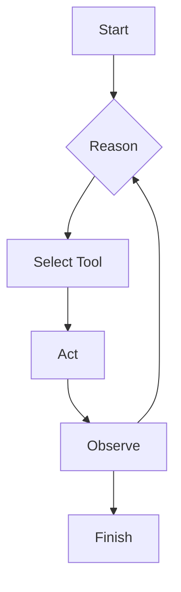
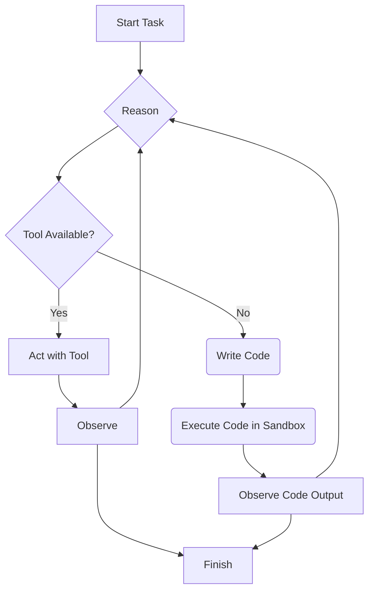

AI agents have moved fast over the last year. We started with simple chatbots, evolved to tool-using agents, and now, a new design pattern called CodeAct is gaining significant attention in both research and engineering circles.

This pattern fundamentally changes how agents solve problems. If you are familiar with tools, you know that you traditionally have to manually code every function you want your LLM to call. This works well until the LLM encounters a new task; at that point, it simply declares that it lacks the necessary capability. CodeAct solves this exact problem. Instead of being limited to a predefined set of tools, a CodeAct agent can create a new tool on the fly by writing and executing its own code.

That single shift makes agents far more adaptive and useful for real-world tasks.

---

## The Foundation: ReAct

To understand CodeAct, we first need to understand its predecessor, **ReAct (Reason and Act)**. The ReAct pattern enables an agent to reason about a task, choose a tool, act, and then observe the outcome before reasoning again.

It works in a simple, powerful loop:
1.  **Reason**: The agent thinks about the task and decides which tool to use.
2.  **Act**: The agent uses the selected tool with the appropriate inputs.
3.  **Observe**: The agent receives the output from the tool.

This loop repeats until the task is complete. It's a reliable pattern but has one major limitation: what happens when the agent doesn't have the right tool for the job?



---

## Introducing CodeAct: The Next Evolution

**CodeAct** extends the ReAct pattern by adding a crucial new capability: if no existing tool fits the current step, the agent can write and execute a piece of code to solve that specific part of the problem. This generated code acts as a temporary, single-use tool.

In simple terms, **the agent can build what it needs, when it needs it.**

This diagram shows how CodeAct creates a new path for the agent when it encounters a roadblock.



This adaptive problem-solving is what makes the pattern so powerful.

---

## A Simple CodeAct Loop in Practice

Let's look at how a CodeAct loop works, this time with a conceptual code example. Imagine an agent tasked with: *"What is the total size of all .csv files in the current directory?"*

The agent has a `list_files` tool but no tool to get file sizes.

Here is a simplified Python-like implementation of how it might solve this:

```python
class CodeActAgent:
    def __init__(self, tools):
        self.tools = {tool.name: tool for tool in tools}
        self.sandbox = CodeSandbox()

    def execute(self, task):
        # Initial thought process based on the task
        thought = f"I need to find the total size of all CSV files. First, I'll list all files."
        
        # Use the 'list_files' tool
        files = self.tools['list_files'].run()
        
        # Next thought: I have the file list, but no tool to get individual file sizes and sum them up.
        thought = f"I have the list: {files}. I need to filter for .csv files, get their sizes, and sum them. I don't have a tool for this. I will write code."

        # The LLM generates Python code to solve the specific sub-problem
        code_to_execute = """
import os
total_size = 0
files = ["data.csv", "report.txt", "archive.csv"] # In a real scenario, this comes from the previous step
for f in files:
    if f.endswith('.csv'):
        total_size += os.path.getsize(f)
print(total_size)
"""
        
        print("No suitable tool found. Writing and executing code.")
        print(f"--- Generated Code ---\n{code_to_execute}\n--------------------")
        
        # The code is run in a secure sandbox
        observation = self.sandbox.run(code_to_execute)
        
        print(f"Observation from code: {observation}")
        # The final result is returned
        return f"The total size is {observation} bytes."

```

This example demonstrates the core flow: the agent uses an existing tool, realizes it's not enough, and seamlessly transitions to writing code to finish the job.

---

## Why This Pattern is Gaining Traction

### It Mirrors Human Problem-Solving
Engineers don't just use fixed tools. When something is missing, they write a script, a query, or a helper function. CodeAct allows agents to work the same way, making them feel more like a true partner.

### It Shatters Rigid Limits
Traditional agents fail when their toolset is incomplete. CodeAct agents adapt. Whether it's cleaning messy data, performing a custom calculation, or combining outputs from multiple APIs, the agent can create a solution instead of giving up.

### It Leverages Modern LLMs
Large Language Models are exceptionally good at writing short, correct, and context-aware code. CodeAct harnesses this strength, turning a text-generating capability into a powerful, real-world action.

---

## Real-World Use Cases Where CodeAct Shines

*   **Data Analysis and Reporting**: An agent can generate a custom transformation script for each unique dataset instead of relying on fixed, brittle pipelines.
*   **Automation and Ops**: Need a one-off log parser or a script to check API health? The agent can write it, run it, and report the results safely.
*   **Developer Assistance**: Instead of just suggesting code, the agent can execute it, test its output, and refine it, providing a much higher level of support.

---

## Risks and Mitigation Strategies

CodeAct is powerful, so it must be used with care.

*   **Code Safety**: All generated code **must** run in a strict sandbox. This means limiting file system access, blocking network calls, and setting tight time and memory caps.
*   **Audit and Traceability**: Log every generated piece of code, along with its inputs and outputs. This is critical for debugging, security reviews, and understanding agent behavior.
*   **Tool Sprawl**: Generated code should be ephemeral. Treat these dynamic tools as disposable helpers, not permanent additions to the agent's toolkit.

Teams that implement these safeguards can achieve strong results without sacrificing control or security.

---

## Why CodeAct is Here to Stay

The trend in AI is clear: agents are moving from being passive assistants to active operators. Fixed toolsets are a bottleneck in that evolution. Dynamic tool creation through code generation removes that bottleneck.

As models get better at reasoning and coding, the CodeAct pattern will only become more reliable and valuable. That is why it is one of the most important and widely discussed agent design patterns today.
