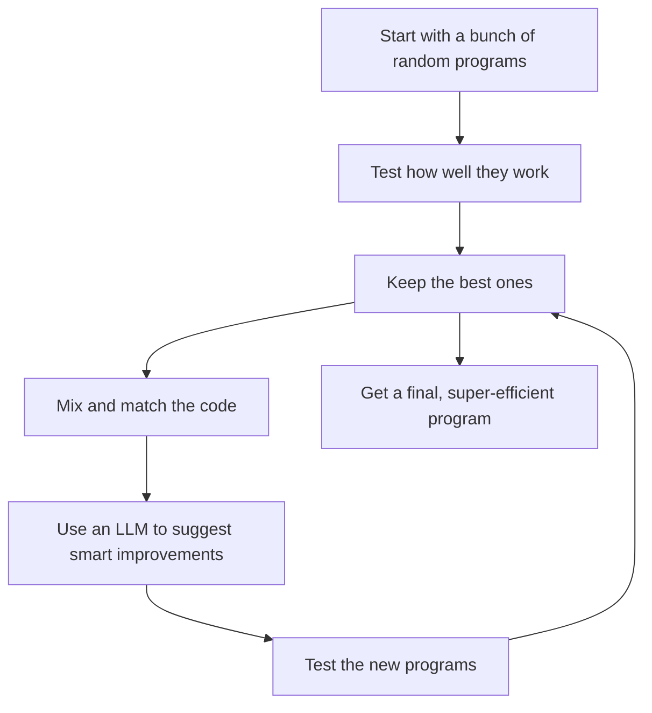

Imagine a coding partner that doesn’t just write software, but **iteratively evolves it**, learns from its mistakes, and even **discovers brand-new algorithms** some better than anything a human has ever designed.

Sounds like science fiction, right? Well, it’s exactly what [**AlphaEvolve**](https://arxiv.org/abs/2506.13131), a new breakthrough from DeepMind, is all about.

---

## So, What Exactly is AlphaEvolve?

At its heart, **AlphaEvolve** is an AI agent that’s been built to do one thing: *discover new and better code through evolution*.

Think of it as a digital scientist with a relentless work ethic. It starts with a whole population of small programs, tests them all to see which ones are any good, and then uses a **language model to intelligently tweak and combine the best ones**. It repeats this process over and over, with each generation of code getting a little bit better than the last.

The ultimate goal? To find amazing solutions to really tough problems in areas like:

* **Scheduling and resource allocation** (the kind of stuff that keeps data centers running smoothly)
* **Simplifying complex circuits**
* **Designing new mathematical algorithms from scratch**
* **Optimizing deep learning models**

---

## How It Works: Where Evolution Meets Modern AI

AlphaEvolve’s magic lies in how it blends old-school **evolutionary algorithms** with the creative power of **large language models**.

Here’s a look at the feedback loop that makes it all happen:

It’s a simple but powerful idea. The evolutionary process provides the structure, while the LLM provides the creative spark to come up with new ideas.

---

## This Isn't Just a Theory—It's Already Winning

AlphaEvolve isn't just a cool research paper. It's already being used to solve real-world problems and beating human-made solutions:

* **Google Data Centers**: It has already outperformed the human-tuned scheduling systems that manage some of Google's most important workloads.
* **Logic Circuits**: It's found new ways to simplify logic expressions, which could lead to more efficient computer chips.
* **Algorithm Discovery**: In a stunning achievement, it rediscovered *Karatsuba’s algorithm* for multiplication on its own. Even more impressive, it found **brand-new algorithms that are even faster**.
* **Deep Learning**: It's optimizing the code for training transformers, making AI development more efficient.

These aren't just small improvements. These are major breakthroughs in fields that have a real economic impact.

---

## Why This Is a Big Deal

### 1. We're Moving from Code Completion to Code *Discovery*

This is a huge leap beyond tools like Copilot. We're now talking about AI that can *invent* completely new ways of solving problems, not just help us write code faster.

### 2. The Gap Between Human and AI is Closing

When an AI can outperform human experts in multiple fields, it’s a sign that the way we think about creativity and problem-solving in software is about to change in a big way.

### 3. The Dawn of the AI Scientist

AlphaEvolve is one of the first examples of an **autonomous research assistant**. It’s a system that can explore, experiment, and learn on its own, paving the way for a future where AI scientists work alongside humans to push the boundaries of knowledge.

---

## Is AlphaEvolve the Beginning of AGI?

Probably not. But it’s a huge step in the right direction. It’s an AI that can:

* Think its way through new problems
* Learn from its own experiments
* Apply what it learns to different areas
* Get smarter as it gets more data and computing power

It’s more independent than a chatbot, and more creative than older AI systems like AlphaGo.

---

## Of Course, It's Not Perfect

* **It's expensive**: Evolutionary search takes a *lot* of computing power.
* **It needs a good teacher**: Its success still depends on humans giving it the right goals and constraints.
* **It's hard to trust**: In critical systems, we still need a way to prove that the code it generates is safe and reliable.

---

## What's Next?

AlphaEvolve gives us a glimpse of a future where AI developers work on their own to improve our software. Imagine:

* Startups using AI to design the most efficient cloud infrastructure
* Scientists collaborating with AI to discover new equations or molecules
* Open-source projects that are constantly improving themselves without human intervention

We’re at the start of a new era in research and development, where AI is no longer just a tool, but a true creative partner.

---

AlphaEvolve is easily one of the most exciting AI systems to come out this year. It’s the perfect blend of **LLM creativity**, **evolutionary exploration**, and **scientific rigor**.

If you're in the AI space, this is an architecture you need to watch. **It’s the blueprint for what’s coming next.**

---

[Read the full AlphaEvolve paper (PDF)](https://arxiv.org/pdf/2506.13131)