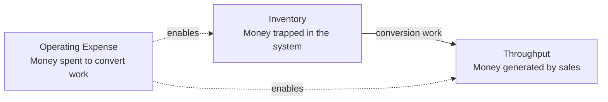

*Cover image source: Open Library.*

Eliyahu Goldratt's *The Race* is a short book, but it lands a pretty hard punch. Most organizations spend their time trying to make every part of the business more efficient. Goldratt's point is that this is often the wrong game.

The goal is not to keep every person busy. The goal is to move value through the system.

That sounds obvious until you look at how companies are actually managed. A team gets measured by output, so it produces more. A manager sees an idle person and treats it as waste. A department improves its own numbers and assumes the company is better off. Then the customer still waits, the release still slips, and everyone wonders why all that productivity did not turn into results.

Goldratt's argument is simple enough to be annoying: a business is a system, and a system is limited by its constraint. If you improve something that is not the constraint, you may get a nicer local metric, but you probably have not improved throughput.

This is why *The Race* still feels useful for software teams and AI transformation work. We now have tools that can make individual functions much faster. That is useful. It also makes it easier to create more work than the rest of the organization can absorb.

## A system has one speed

The fastest way to misunderstand a company is to inspect the departments one by one. Engineering may look fast. Product may look busy. Sales may look full of activity. Support may be closing tickets. None of that tells you whether value is moving smoothly from customer need to customer impact.

The better question is where work waits.

Where do pull requests pile up? Where do decisions sit for a week? Where does QA get flooded? Where do releases pause because one person knows the deployment path? Where does sales struggle to explain what shipped?

That waiting is the signal. It tells you where the system is slower than the work arriving at it.

Think of a highway with one blocked lane. Widening the other lanes does not fix the traffic. It can even make the jam look worse because more cars arrive at the blockage. Organizations behave the same way. If code review is the constraint, more code creates a longer review queue. If product clarity is the constraint, more engineering capacity creates more churn. If sales enablement is the constraint, more shipped features create more confusion.

The system moves at the speed of the constraint, whether the dashboard admits it or not.

## The three measures that matter

Goldratt reduces business performance to three measures: throughput, inventory, and operating expense.

Throughput is money generated through sales. Not effort. Not output. Not a completed ticket. Throughput happens when value reaches the customer and the customer pays for it.

Inventory is money trapped inside the system. In a factory, that means raw materials, work in progress, and finished goods waiting to be sold. In software, it is unfinished work: a half-built feature, an unreviewed pull request, a design waiting for approval, a requirement waiting for clarification, a release waiting for testing, or a roadmap item that keeps getting refined but never reaches users.

Operating expense is the money spent to turn inventory into throughput. Salaries, cloud infrastructure, tools, vendors, meetings, coordination, and management overhead all sit here.

Once you use those three measures, the management conversation changes. "Is everyone busy?" becomes a weak question. Better questions are: did this increase throughput, reduce inventory, or reduce operating expense?

That framing is uncomfortable because it exposes a lot of respectable-looking waste. A product team can produce requirements faster than engineering can absorb them. Developers can produce code faster than reviewers can review it. AI can produce drafts, tickets, tests, summaries, and prototypes faster than the organization can validate them.

All of that is inventory. It is not harmless. It consumes attention, goes stale, hides defects, delays feedback, and makes the system harder to reason about.

## Utilization is a bad master

Cost accounting trains managers to fear idle capacity. An idle person looks wasteful. An idle machine looks expensive. An idle team looks mismanaged. So the organization pushes every part to stay busy.

That habit creates trouble when the busy part is not the constraint.

If a non-constraint produces more work than the constraint can consume, the extra work becomes inventory. The local number improves while the system gets slower. This is one of those ideas that sounds abstract until you have lived through it on a software team.

A team writes code faster than review can happen. Leadership sees velocity. Engineers see a review queue.

A design team produces screens faster than product can make decisions. Leadership sees output. The team sees churn.

A sales team creates leads faster than the company can qualify and serve them. Leadership sees pipeline. Everyone downstream sees noise.

This is the trap. Utilization feels responsible. Sometimes it is just a way to make the queue bigger.

## Find the constraint first

The Theory of Constraints gives a simple loop:

1. Identify the constraint.
2. Exploit the constraint.
3. Subordinate everything else to the constraint.
4. Elevate the constraint.
5. Repeat.

Most organizations are bad at the first step. They buy tools, add process, hire people, automate tasks, reorganize teams, and invent new rituals before asking what is actually limiting throughput.

Once you find the constraint, protect it. If senior engineers are the constraint, stop using their attention for status theater. If QA is the constraint, stop sending poor builds downstream and calling it progress. If product decisions are the constraint, stop hiding ambiguity inside tickets. If deployment is the constraint, stop treating release work as something the team can clean up later.

Subordinating the rest of the system is the hard part. A team with spare capacity may need to slow down, help upstream, reduce batch size, improve quality, or stop producing work that cannot flow. That feels inefficient if you judge the team in isolation. It can be the right move when you judge the system.

Only after that should you elevate the constraint by adding people, tools, automation, or outside help. If you elevate too early, you may just spend money moving the queue somewhere else.

## Batch size quietly controls flow

Large batches look efficient because they reduce visible setup cost. Plan more at once. Build more at once. Review more at once. Release more at once.

The hidden cost is delay.

Large batches create longer waits, slower feedback, more rework, and bigger surprises. Smaller batches can look less efficient locally because they require more frequent handoffs and more frequent decisions. They are often better for the system because they expose problems earlier.

This is why small pull requests are easier to review. Small releases are easier to reason about. Small decisions are easier to reverse. Small experiments are easier to learn from.

Small batches are not an agile ritual. They are a way to keep inventory from piling up where nobody wants to look.

## Projects slip when queues are ignored

Projects are not late only because people estimate badly, although they often do. They are late because systems contain queues, dependencies, uncertainty, and rework.

A task slips, so the next task waits. A decision waits, so the team pauses. A defect appears late, so everyone reloads context. A review queue grows, so finished work is not really finished.

The delays do not neatly cancel out. They accumulate.

This is why measuring each task in isolation can be misleading. A relay race is not won by asking whether each runner tried hard. It is won by moving the baton across the finish line.

In software, the baton moves from customer need to product decision, design, engineering, review, testing, deployment, enablement, support, and adoption. If the baton waits between stages, the system is slow no matter how busy the individual stages look.

## Software teams should be careful with velocity

Developer productivity matters. It is just not always the constraint.

Sometimes engineering capacity really is the bottleneck. In that case, better architecture, stronger tests, better tooling, AI assistance, and platform work can improve throughput.

But many teams are not constrained by typing speed or code generation. They are constrained by unclear work, slow review, brittle tests, fragile releases, overloaded security review, weak sales enablement, or poor adoption after the feature ships.

In those cases, making developers faster creates more inventory. It does not create more value.

Velocity can be a useful local signal. It becomes dangerous when leadership treats it as the goal.

## AI makes inventory cheap

AI changes the cost of output. It can generate code, test cases, documentation, designs, analyses, sales copy, support responses, meeting summaries, and project plans very quickly.

That is genuinely useful. It also creates a new failure mode: cheap output can outrun expensive judgment.

If the organization cannot review, test, decide, deploy, sell, support, or learn faster, AI does not automatically increase throughput. It creates more inventory.

More code waits for review. More campaigns wait for approval. More leads wait for qualification. More reports wait for a decision. More prototypes wait for validation.

The organization feels productive because every function is producing more. The customer may not see value any sooner.

That is not much of a transformation. It is a larger queue with better tooling.

## Aim AI at the constraint

The useful question is not where AI can make people faster. That question is too broad and usually leads to tool sprawl.

Ask where value is stuck, then aim AI there.

If code review is the constraint, use AI to summarize changes, identify risky files, generate focused tests, and reduce reviewer load. If product clarity is the constraint, use AI to synthesize customer feedback and expose contradictions earlier. If QA is the constraint, use AI to generate test cases, classify failures, and prioritize risky paths. If support triage is the constraint, use AI to route tickets and retrieve context. If sales enablement is the constraint, use AI to turn product changes into demos, narratives, battle cards, and objection handling.

The point is not to sprinkle AI across every task because it feels modern. The point is to remove the thing currently limiting flow.

Then the constraint will move, and you do the work again.

## The race is won by flow

Customers do not care how busy the organization is. They do not care how many tickets moved, how many pull requests merged, or how much content AI generated. They care when value reaches them.

That is throughput.

The useful habit from *The Race* is to stop asking whether every part of the organization is efficient. Ask where value is stuck. Reduce inventory. Protect the constraint. Let local efficiency lose when it conflicts with global flow.

That is usually less satisfying than announcing a broad productivity program. It is also more likely to change the result the customer sees.
