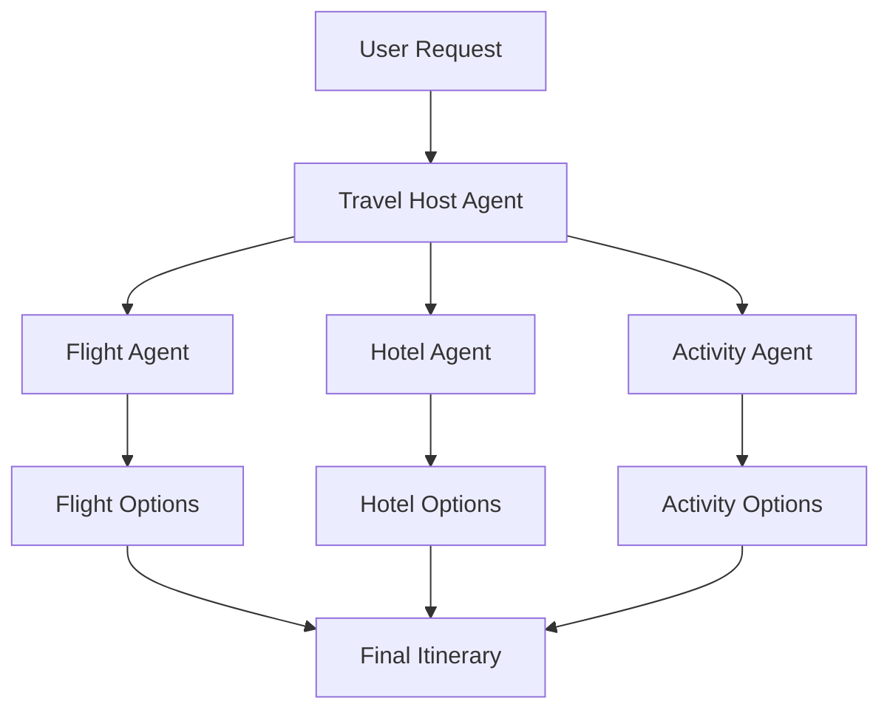

Google's Agent Development Kit (ADK) is a new framework for building AI agents that's optimized for Gemini but works with any LLM. Its standout feature is built-in support for multi-agent orchestration—agents that coordinate and delegate to other agents.

In this article, we'll build a travel planner where a host agent delegates to specialized sub-agents for flights, hotels, and activities.

## Why ADK?

ADK brings several innovations:

*   **Code-first development:** Define agents in Python, not YAML or JSON
*   **Multi-agent by design:** Built-in patterns for parallel, sequential, and hierarchical agents
*   **Model-agnostic:** Works with Gemini, GPT-4, Claude, and others via LiteLLM
*   **Real-time support:** Bidirectional audio/video streaming built-in

## Architecture



The host agent receives the travel request and delegates to specialists:
- **Flight Agent:** Searches for flights based on dates and destination
- **Hotel Agent:** Finds accommodations matching the trip parameters
- **Activity Agent:** Suggests activities and attractions

## Setting Up

Install ADK:

```bash
pip install google-adk
```

Set up your API key in a `.env` file:

```
GOOGLE_API_KEY=your_api_key_here
```

## Project Structure

```
travel_planner/
├── __init__.py
├── agent.py          # Host agent
├── flight_agent.py   # Flight specialist
├── hotel_agent.py    # Hotel specialist
├── activity_agent.py # Activity specialist
└── tools.py          # Shared tool definitions
```

## Defining Tools

First, let's create the tools our agents will use:

```python
# tools.py
from datetime import datetime

def search_flights(
    origin: str,
    destination: str,
    departure_date: str,
    return_date: str
) -> dict:
    """Search for available flights.

    Args:
        origin: Departure airport code (e.g., 'SFO')
        destination: Arrival airport code (e.g., 'NRT')
        departure_date: Departure date (YYYY-MM-DD)
        return_date: Return date (YYYY-MM-DD)

    Returns:
        Dictionary with flight options
    """
    # In production, call a flight API
    return {
        "status": "success",
        "flights": [
            {
                "airline": "United",
                "flight": "UA837",
                "departure": f"{departure_date} 10:30",
                "arrival": f"{departure_date} 14:45+1",
                "price": 1250
            },
            {
                "airline": "JAL",
                "flight": "JL001",
                "departure": f"{departure_date} 13:00",
                "arrival": f"{departure_date} 17:30+1",
                "price": 1480
            }
        ]
    }


def search_hotels(
    city: str,
    check_in: str,
    check_out: str,
    guests: int = 2
) -> dict:
    """Search for available hotels.

    Args:
        city: Destination city
        check_in: Check-in date (YYYY-MM-DD)
        check_out: Check-out date (YYYY-MM-DD)
        guests: Number of guests

    Returns:
        Dictionary with hotel options
    """
    return {
        "status": "success",
        "hotels": [
            {
                "name": "Park Hyatt Tokyo",
                "location": "Shinjuku",
                "price_per_night": 650,
                "rating": 4.8
            },
            {
                "name": "Aman Tokyo",
                "location": "Otemachi",
                "price_per_night": 1200,
                "rating": 4.9
            }
        ]
    }


def search_activities(city: str, interests: list[str]) -> dict:
    """Search for activities and attractions.

    Args:
        city: Destination city
        interests: List of interest categories

    Returns:
        Dictionary with activity suggestions
    """
    return {
        "status": "success",
        "activities": [
            {
                "name": "Senso-ji Temple",
                "category": "cultural",
                "duration": "2 hours",
                "price": 0
            },
            {
                "name": "TeamLab Borderless",
                "category": "art",
                "duration": "3 hours",
                "price": 35
            },
            {
                "name": "Tsukiji Outer Market Food Tour",
                "category": "food",
                "duration": "4 hours",
                "price": 120
            }
        ]
    }
```

## Creating Specialist Agents

Each specialist agent focuses on one domain:

```python
# flight_agent.py
from google.adk.agents import Agent
from tools import search_flights

flight_agent = Agent(
    name="flight_agent",
    model="gemini-2.0-flash",
    description="Specialist agent for finding and comparing flights.",
    instruction="""You are a flight booking specialist.
    When given origin, destination, and dates:
    1. Search for available flights using the search_flights tool
    2. Compare options by price, duration, and convenience
    3. Recommend the best option with clear reasoning

    Always present prices in USD and include total travel time.
    """,
    tools=[search_flights]
)
```

```python
# hotel_agent.py
from google.adk.agents import Agent
from tools import search_hotels

hotel_agent = Agent(
    name="hotel_agent",
    model="gemini-2.0-flash",
    description="Specialist agent for finding accommodations.",
    instruction="""You are a hotel booking specialist.
    When given a city and dates:
    1. Search for available hotels using the search_hotels tool
    2. Consider location, price, and ratings
    3. Recommend options for different budgets

    Highlight proximity to major attractions and transport.
    """,
    tools=[search_hotels]
)
```

```python
# activity_agent.py
from google.adk.agents import Agent
from tools import search_activities

activity_agent = Agent(
    name="activity_agent",
    model="gemini-2.0-flash",
    description="Specialist agent for finding activities and attractions.",
    instruction="""You are a local activities expert.
    When given a destination and interests:
    1. Search for activities using the search_activities tool
    2. Group suggestions by category
    3. Create a day-by-day suggested itinerary

    Consider timing, logistics, and traveler energy levels.
    """,
    tools=[search_activities]
)
```

## The Host Agent

The host agent orchestrates the specialists. ADK supports hierarchical agent structures where a parent agent can delegate to sub-agents:

```python
# agent.py
from google.adk.agents import Agent
from flight_agent import flight_agent
from hotel_agent import hotel_agent
from activity_agent import activity_agent

root_agent = Agent(
    name="travel_planner",
    model="gemini-2.0-flash",
    description="A comprehensive travel planning assistant.",
    instruction="""You are a travel planning coordinator.

    When a user requests a trip:
    1. Extract key details: destination, dates, interests, budget
    2. Delegate to flight_agent for transportation options
    3. Delegate to hotel_agent for accommodation options
    4. Delegate to activity_agent for things to do
    5. Synthesize everything into a cohesive itinerary

    Present the final plan with:
    - Flight details and cost
    - Hotel recommendation and cost
    - Day-by-day activity schedule
    - Total estimated budget

    Ask clarifying questions if needed.
    """,
    sub_agents=[flight_agent, hotel_agent, activity_agent]
)
```

## Running the Planner

ADK provides multiple ways to run your agent:

### Command Line

```bash
adk run travel_planner
```

This starts an interactive chat where you can type requests like:
> "Plan a 5-day trip to Tokyo from San Francisco, departing March 15th. I'm interested in food, temples, and modern art."

### Web Interface

```bash
adk web --port 8000
```

This launches a browser-based UI with conversation history and debugging tools.

### Programmatic Usage

For programmatic usage, ADK provides a Runner class. Here's a basic example:

```python
import asyncio
from google.adk.runners import Runner
from google.adk.sessions import InMemorySessionService
from agent import root_agent

async def plan_trip(request: str) -> str:
    """Run the travel planner agent programmatically."""
    # Create session service and runner
    session_service = InMemorySessionService()
    runner = Runner(
        agent=root_agent,
        app_name="travel_planner",
        session_service=session_service
    )

    # Create a session
    session = await session_service.create_session(
        app_name="travel_planner",
        user_id="user1"
    )

    # Run the agent and collect response
    response_text = ""
    async for event in runner.run_async(
        user_id="user1",
        session_id=session.id,
        new_message=request
    ):
        if hasattr(event, 'text'):
            response_text += event.text

    return response_text

# Example
request = """
Plan a 5-day trip to Tokyo from San Francisco.
Dates: March 15-20, 2026
Budget: $5000
Interests: Japanese cuisine, temples, anime culture
"""

response = asyncio.run(plan_trip(request))
print(response)
```

For most use cases, the CLI is simpler:

```bash
adk run travel_planner
```

## Agent Communication

ADK handles agent-to-agent communication automatically. When the host agent decides to consult the flight agent, it:

1. Formats the delegation request
2. Passes relevant context (dates, origin, destination)
3. Receives the flight agent's response
4. Incorporates it into the overall plan

You can observe this in the web UI, which shows the full message flow between agents.

## Parallel vs Sequential Execution

By default, ADK can run sub-agents in parallel when they don't depend on each other. In our travel planner:

- Flight, hotel, and activity searches can run in parallel
- The final itinerary synthesis happens after all searches complete

```mermaid
gantt
    title Agent Execution Timeline
    dateFormat X
    axisFormat %s

    section Parallel
    Flight Search    :0, 2
    Hotel Search     :0, 2
    Activity Search  :0, 3

    section Sequential
    Synthesize Plan  :3, 4
```



## Error Handling

ADK tools should include error handling in the function implementation. Return structured error responses so the agent can inform the user:

```python
from google.adk.agents import Agent

def search_flights_safe(
    origin: str,
    destination: str,
    departure_date: str,
    return_date: str
) -> dict:
    """Search for flights with error handling.

    Args:
        origin: Departure airport code
        destination: Arrival airport code
        departure_date: Departure date (YYYY-MM-DD)
        return_date: Return date (YYYY-MM-DD)

    Returns:
        Dictionary with flight options or error message
    """
    try:
        # Call the actual flight search
        return search_flights(origin, destination, departure_date, return_date)
    except Exception as e:
        return {
            "status": "error",
            "message": f"Could not search flights: {str(e)}. Please try different dates."
        }

flight_agent = Agent(
    name="flight_agent",
    model="gemini-2.0-flash",
    tools=[search_flights_safe],
    instruction="You are a flight specialist. If a search fails, explain the error to the user."
)
```

## Adding Memory

ADK manages session state through the Runner. For persistent memory across sessions, use a session service:

```python
from google.adk.runners import Runner
from google.adk.sessions import InMemorySessionService

# Create a session service for persistence
session_service = InMemorySessionService()

runner = Runner(
    agent=root_agent,
    app_name="travel_planner",
    session_service=session_service
)

# Sessions persist across runs with the same user_id/session_id
```

For production, use a database-backed session service to persist conversations.

## Deployment

ADK agents can be deployed to Google Cloud's Vertex AI Agent Engine:

```bash
adk deploy --project my-project --region us-central1
```

This gives you:
- Managed scaling
- Built-in monitoring
- API endpoints for integration

## What's Next

This travel planner can be extended with:
*   **Real API integrations:** Connect to Amadeus, Booking.com, Viator
*   **Budget optimization:** Agent that finds the best value combinations
*   **Calendar integration:** Sync with Google Calendar
*   **Real-time updates:** Flight delay notifications

Google ADK simplifies multi-agent development by handling the orchestration complexity. You focus on defining what each agent does; ADK handles how they work together.

---

## Try It Yourself

Copy this prompt into your AI coding agent to build this project:

```
Build a multi-agent travel planner using Google ADK. Create:
1. A FlightAgent that searches for flights given origin, destination, and dates
2. A HotelAgent that finds accommodations matching trip parameters
3. An ActivityAgent that suggests activities based on interests
4. A root TravelPlanner agent that coordinates the specialists

Use google-adk with the Agent class. Define tools for each specialist agent.
The host agent should delegate to sub-agents and synthesize a complete itinerary
with flights, hotel, activities, and total budget. Include mock data for testing.
```
