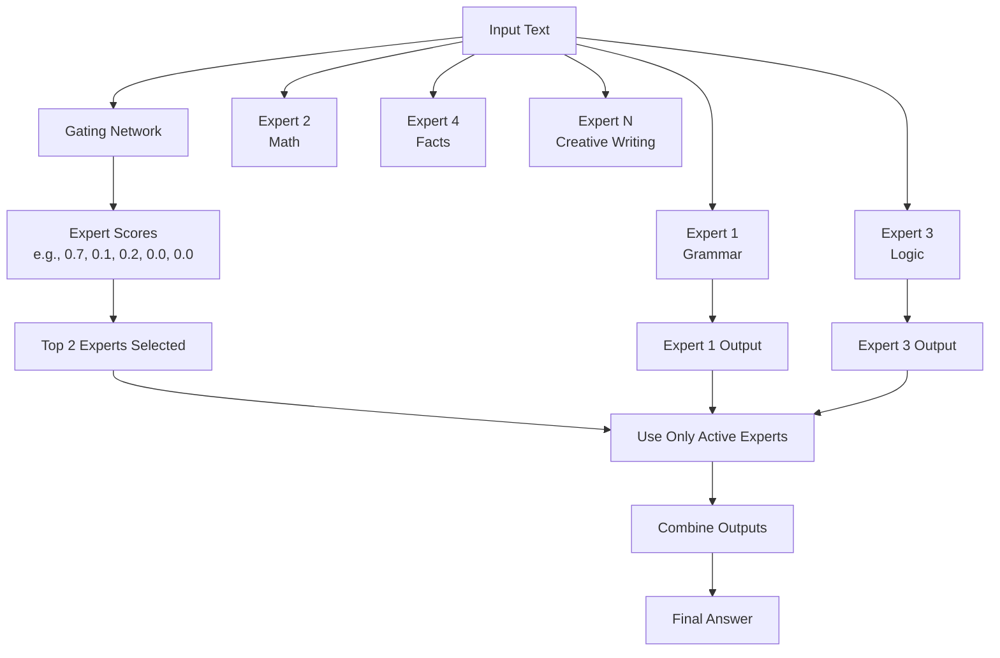

One of the most exciting architectural innovations in recent years is the **Mixture of Experts (MoE)**. It's a key reason why models like Mistral's Mixtral and (reportedly) OpenAI's GPT-4 are so powerful.

To really understand MoE, let’s go back to first principles.
Here’s a rewritten version of your article with a **Flesch Reading Ease score above 70**. The language is simpler and more direct, while keeping the core ideas intact.

---

**What Makes Mixture of Experts (MoE) Models So Powerful?**

One of the most interesting changes in AI design in recent years is the **Mixture of Experts**, or MoE. Models like Mistral’s Mixtral and OpenAI’s GPT-4 (reportedly) use this idea to boost their power and speed.

But what is an MoE model? Let’s break it down in simple terms.

### Think of a Team of Specialists

Imagine you have a problem that needs knowledge in law, medicine, and finance. You could ask one person who knows a little bit about all three. But they may not be very strong in any one topic.

Instead, you could bring in a lawyer, a doctor, and a financial expert. You also have a manager who looks at the problem and sends it to the right person.

This is the idea behind MoE. It uses small expert models that each know one thing very well. A "manager" model decides which experts to use for each task.

### Dense vs. Sparse Models

Most AI models are **dense**. Every part of the model is used for every question. That’s like asking your lawyer, doctor, and financial expert to give answers to every question—even if it’s only about law.

Dense models are powerful but wasteful. They use a lot of computing power, even for simple tasks.

MoE models are **sparse**. They only use the parts of the model that are needed. This is called **conditional computation**.

Here's how it works:

1. **Experts** – These are smaller models trained to handle one kind of task, like grammar or math.

2. **Gating Network** – This is the "manager." It looks at the input and chooses which experts to activate.

3. **Selective Activation** – Only a few experts are used for each input. The rest stay off, which saves time and computing power.

### How It All Works (with an Example)

In this example, the model chooses only Expert 1 and Expert 3 for the task. It then blends their outputs to create the final answer.

### Why This Approach Is So Useful

Sparse models let us build much larger systems without needing more resources. For example, the Mixtral 8x7B model has about 47 billion total parameters. But for each task, it only uses about 13 billion. That means it runs as fast as a smaller model but still learns from a much bigger brain.

This makes MoE models both **powerful and efficient**.

### What Are the Challenges?

MoE models are harder to train than dense models. The gating network needs to make smart choices. It must use all experts fairly and avoid always picking the same ones. This is known as the **load balancing** problem.

Also, fine-tuning these models (making them better after initial training) takes more care. But researchers are getting better at this, and MoE is now becoming a go-to design for cutting-edge AI.

---

MoE is inspired by how humans solve problems. Instead of using one general system, it uses specialists guided by a smart controller. This makes AI faster, cheaper to run, and better at handling a wide range of tasks.

It’s a big shift in how we build large AI models—and it’s helping shape the next wave of smarter, more capable systems.